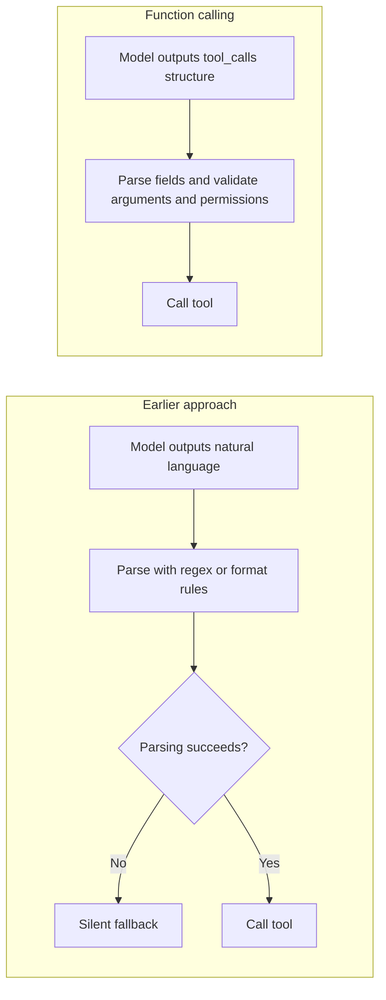
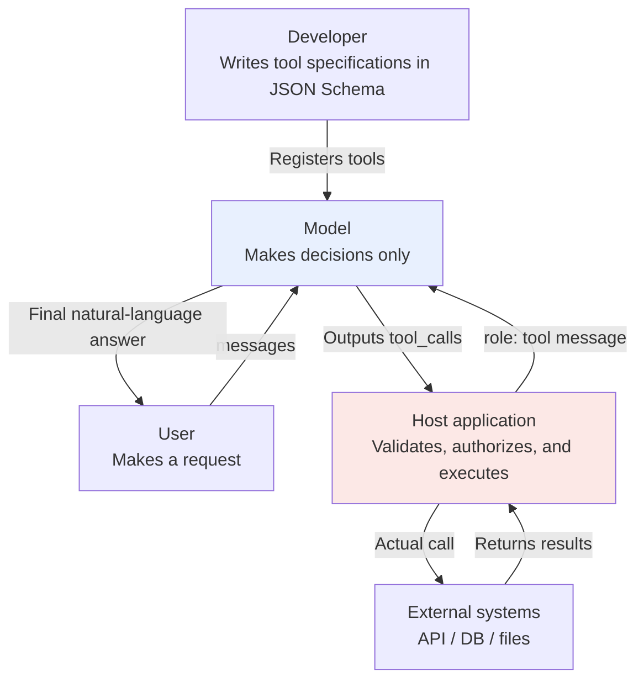
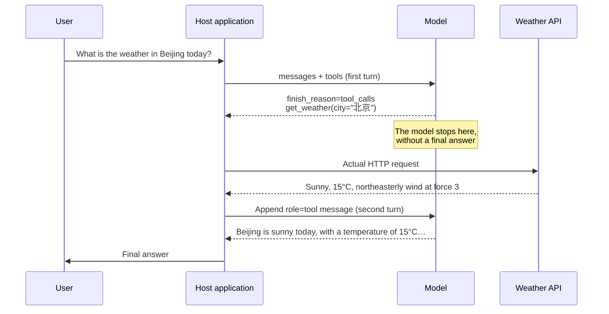
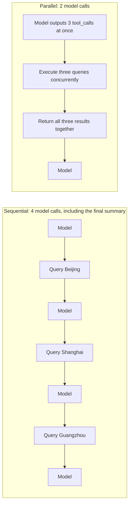

# Chapter 1: What Function Calling Is and How It Works

## 1.1 The model proposes a call. Who executes it?

Function calling is **an interface convention that lets a model express, through a structured call item, which function it wants to call and with what arguments**. This chapter uses function tools with JSON arguments as its example. Tool calling is broader: it also includes custom text tools and platform-hosted tools.

Three qualifications matter here. Leaving out any one of them leads to a common misunderstanding:

- **Expression, not execution.** The model expresses its intent to call a tool. The application or platform's tool runtime executes the function, sends the HTTP request, or connects to the database. With hosted tools, your application does not necessarily execute the operation itself.
- **Structured JSON, not natural language.** This is the central improvement over ad hoc integration.
- **An output convention.** It defines an interface between the model and the application, not tool discovery, distribution, or interprocess communication. [MCP](../02-mcp/04-what-is-mcp.md) is one protocol for those integration concerns.

The application should record the model's proposal, authorization, and actual execution separately. None of these events proves that the others have happened.

## 1.2 Before function calling

OpenAI released its Function Calling API in June 2023; research on tool-augmented models predates that release. This section reviews two common text-based integration approaches, not the complete history.

### 1.2.1 Approach one: regular expressions and keyword matching

The model produces ordinary natural language, and the host uses rules to infer its intent:

```python
# A typical approach before 2023
if "天气" in reply and ("查" in reply or "看" in reply):
    city = re.search(r"([\u4e00-\u9fa5]{2,4})(?:的)?天气", reply)
    if city:
        call_weather_api(city.group(1))
```

The Chinese keywords mean "weather," "look up," and "look at"; the regular expression extracts a Chinese city name before "weather." A paraphrase can break the match. Without explicit handling for parse failures, the application may return an unrecognized call request as ordinary text, producing a silent failure.

### 1.2.2 Approach two: specify an output format in the prompt

A more explicit approach puts an instruction in the system prompt: "If you need a tool, output `ACTION: tool_name(arguments)`." ReAct also uses explicit action text, but this particular syntax is not a universal format prescribed by the paper. It is clearer than inferring intent from arbitrary language, yet three problems remain:

| Problem | What it looks like |
|---|---|
| Format drift | The model writes `ACTION：` with a full-width Chinese colon, wraps it in a code block, or adds an explanation first |
| Mixed output | One response contains both natural language and commands, requiring additional splitting |
| Ambiguous intent | Merely mentioning a tool and deciding to call it can look identical in text |

For example, when asked "Can you check the weather?", the model may simply describe `get_weather`. Mentioning the name should not trigger execution. An explicit action syntax can distinguish the two, but it requires a deliberately designed parser and stopping conditions.

### 1.2.3 What function calling solves

It turns a **text-parsing problem** into a **protocol problem**:



In OpenAI **Chat Completions**, `tool_calls` and `finish_reason: "tool_calls"` explicitly mark a call; the application no longer has to infer intent from ordinary text. Responses instead uses `function_call` items in `output`, with results linked through `function_call_output.call_id`; `finish_reason` does not apply there. These fields are API design choices, not evidence that the model internally generates the entire response object.

## 1.3 Three roles and their responsibilities

Think of the process as delegating a task. The responsibilities then become clear.



| Role | Responsibility | What it does not do |
|---|---|---|
| Developer | Defines tools, selection policies, and evaluation examples | Cannot ensure correct selection through descriptions alone |
| Model | Decides whether to call, which tool to call, and which arguments to supply | **Does not execute code or access the network** |
| Host application | Validates calls, executes or rejects them, and returns results | Does not treat a model proposal as authorization |

Model inference and the tool runtime are separate components. The host must check the tool allowlist, arguments, user permissions, and approvals. The model saying "I found it" is not execution evidence; use tool results and their provenance.

## 1.4 Tool definitions: every schema field guides the model

```python
tools = [{
    "type": "function",
    "function": {
        "name": "get_weather",
        "description": (
            "Get current weather for cities in mainland China, including temperature, "
            "weather conditions, wind direction, and wind speed. "
            "Supports the current time only, not forecasts or historical queries."
        ),
        "parameters": {
            "type": "object",
            "properties": {
                "city": {
                    "type": "string",
                    "description": "Chinese city name, such as 北京 (Beijing) or 杭州 (Hangzhou). Omit the province and the 市 (city) suffix"
                },
                "unit": {
                    "type": "string",
                    "enum": ["celsius", "fahrenheit"],
                    "description": "Temperature unit; defaults to celsius"
                }
            },
            "required": ["city"]
        }
    }
}]
```

### 1.4.1 The description is important interface information

Unless explicitly provided, the model cannot see the function implementation. It selects tools using the name, description, parameter schema, system instructions, and conversation history together. The description is neither the only signal nor an enforcement mechanism.

Compare the behavior these two descriptions are intended to encourage:

| Description | Typical misuse or intended behavior |
|---|---|
| `"Get weather"` | Calls it for "Will it rain in Beijing next week?", receives current data, and **invents** a forecast |
| `"Get current weather for cities in mainland China… Does not support forecasts or historical queries"` | Recognizes the boundary and replies, "I can only check the current weather" |

A description should state both capabilities and limits. These are expected behaviors, not guaranteed outcomes. Test whether misuse actually decreases with requests for future weather, past weather, and unsupported locations.

### 1.4.2 Parameter descriptions affect argument quality

The instruction to omit the province and the `市` suffix is not redundant. Without it, a request such as `浙江省杭州市今天天气如何` ("What is the weather today in Hangzhou, Zhejiang Province?") may produce `"浙江省杭州市"`, while the API accepts only `"杭州"`.

Parameter descriptions should include formats, examples, and ranges. If the interface accepts only canonical city names, the server should also normalize aliases and check for ambiguity.

### 1.4.3 Use enums to restrict valid values

```python
# Poor: the model might supply "高" (high), "HIGH", "P0", or "urgent"
{"priority": {"type": "string", "description": "Priority"}}

# Better: restrict valid values; their business meaning still needs validation
{"priority": {"type": "string", "enum": ["low", "medium", "high"]}}
```

An `enum` supports server-side validation and can let a runtime with constrained decoding mask invalid tokens. That constraint applies only when a supported strict/structured-output path is actually enabled. Registering a schema alone does not guarantee valid values, much less a sensible priority choice. The Chat Completions example above does not enable strict mode; see [Chapter 3](03-tool-schema-design.md).

## 1.5 The complete flow: two model turns with execution in between



The following is a teaching fragment for a single query, not a standalone client. `registry` is the application's tool allowlist. The application must implement `validate_and_authorize` to check the schema, business arguments, and current user's permissions, raising a clear error on failure. The example uses a model compatible with Chat Completions; it does not imply that all newer models support that interface. The Chinese input `北京今天天气怎么样？` asks for today's weather in Beijing. The diagram preserves the actual Chinese city argument `city="北京"`; its explanatory labels are in English.

```python
import json
from openai import OpenAI

client = OpenAI()
messages = [{"role": "user", "content": "北京今天天气怎么样？"}]

# First turn: the model makes its decision
resp = client.chat.completions.create(
    model="gpt-4o",
    messages=messages,
    tools=tools,
    tool_choice="auto",
)
choice = resp.choices[0]

if choice.finish_reason == "tool_calls":
    messages.append(choice.message)          # Append this model message first

    for call in choice.message.tool_calls:
        args = json.loads(call.function.arguments)
        validate_and_authorize(call.function.name, args)
        result = registry[call.function.name](**args)   # The host executes the call

        messages.append({
            "role": "tool",
            "tool_call_id": call.id,          # Must match this particular call's id
            "content": json.dumps(result, ensure_ascii=False),
        })

    # This example allows one query batch only; the second turn closes the flow
    final = client.chat.completions.create(
        model="gpt-4o", messages=messages, tools=tools, tool_choice="none"
    )
    final_choice = final.choices[0]
    if final_choice.finish_reason != "stop" or final_choice.message.refusal:
        raise RuntimeError("The final answer did not complete normally or was refused")
    print(final_choice.message.content)
elif choice.finish_reason == "stop":
    if choice.message.refusal:
        raise RuntimeError("The model refused the request")
    print(choice.message.content)
else:
    raise RuntimeError(f"The response did not complete normally: {choice.finish_reason}")
```

### 1.5.1 Two necessary steps that are easy to miss

**Append the model's `tool_calls` message to `messages`.** Jumping straight to `role: "tool"` can produce the API error `messages with role 'tool' must be a response to a preceding message with 'tool_calls'`. Conversation history must be internally consistent: a request must precede its response.

**Each `tool_call_id` must match its call.** Swapping the results associated with two valid IDs may pass protocol validation while making the model treat Hangzhou's weather as Beijing's. Missing or unknown IDs may be rejected by the API outright.

### 1.5.2 Common Chat Completions tool_choice values

| Value | Behavior | Use |
|---|---|---|
| `"auto"` (default) | The model decides whether to call a tool | General conversation |
| `"required"` | Requires at least one tool call | A workflow step that must retrieve data |
| `{"type":"function","function":{"name":"x"}}` | Forces the specified tool | Structured extraction: use the tool as an output format |
| `"none"` | Disables calls | A closing turn that produces a text summary |

When `tool_choice` is locked to a particular tool, function calling effectively becomes a **structured-output** interface. This was common before Structured Outputs / JSON Mode and remains in extensive use in existing code.

### 1.5.3 The equivalent flow with the Responses API

Responses follows the same sequence: the model proposes a call, the host executes it, results are returned, and the model answers. However, **tool definitions, call items, and result submission all have different shapes; changing the endpoint alone is not enough**. Chat Completions puts calls in an assistant message's `tool_calls`; Responses represents messages, function calls, and other outputs as distinct item types in `response.output`.

The key fields correspond as follows:

| Meaning | Chat Completions | Responses API |
|---|---|---|
| Python SDK entry point | `client.chat.completions.create(...)` | `client.responses.create(...)` |
| Conversation input in this example | `messages` | `input`, containing messages, tool results, and other items |
| Function tool definition | `{"type": "function", "function": {...}}` | `{"type": "function", "name": ..., "description": ..., "parameters": ...}` |
| Finding function calls | `choices[0].message.tool_calls` | Iterate over `response.output` and select `type == "function_call"` |
| Function name and JSON argument string | `call.function.name`, `call.function.arguments` | `call.name`, `call.arguments` |
| Linking a call to its result | Call's `id` → result's `tool_call_id` | Call's `call_id` → result's `call_id` |
| Returning tool results | `role: "tool"` message with the result in `content` | `type: "function_call_output"` item with the result in `output` |
| Reading the text answer | `choices[0].message.content` | `response.output_text` (an SDK convenience property aggregating text) |

The Responses function tool schema has a **flat outer structure**: `name`, `description`, `parameters`, and `strict` are siblings of `type`, with no wrapping `function` object. This does not prevent nested objects inside `parameters`.

The following reuses the `tools` definition from Section 1.4 and the application-provided `registry` and `validate_and_authorize` from above. It is still a teaching fragment for one batch of queries. Setting `strict=False` explicitly preserves the original optional `unit` field. Enabling strict mode requires changing the schema too, not just flipping this switch.

```python
import json
from openai import OpenAI

client = OpenAI()
weather = tools[0]["function"]  # Read the earlier Chat Completions tool definition
responses_tools = [{
    "type": "function",
    "name": weather["name"],
    "description": weather["description"],
    "parameters": weather["parameters"],
    "strict": False,
}]
input_items = [{"role": "user", "content": "北京今天天气怎么样？"}]


def check_response(response):
    if response.status != "completed":
        raise RuntimeError(f"The response did not complete normally: {response.status}")
    for item in response.output:
        if item.type == "message":
            if any(part.type == "refusal" for part in item.content):
                raise RuntimeError("The model refused the request")


# First turn: collect every function call; the first output item need not be a call
response = client.responses.create(
    model="gpt-4o", input=input_items, tools=responses_tools, tool_choice="auto"
)
check_response(response)
calls = [item for item in response.output if item.type == "function_call"]

if calls:
    input_items.extend(response.output)  # Preserve all output before adding tool results
    for call in calls:
        args = json.loads(call.arguments)
        validate_and_authorize(call.name, args)
        result = registry[call.name](**args)
        input_items.append({
            "type": "function_call_output",
            "call_id": call.call_id,  # Match the call_id, not the item's id
            "output": json.dumps(result, ensure_ascii=False),
        })

    # As above, disable further tool calls on the second turn and produce the answer
    response = client.responses.create(
        model="gpt-4o", input=input_items,
        tools=responses_tools, tool_choice="none",
    )
    check_response(response)

print(response.output_text)
```

Because this example manages `input_items` manually, it must pass the first turn's complete `response.output` into the next turn. With a reasoning model, preserve any `reasoning` items returned alongside calls; do not extract only `function_call` items. Alternatively, link to the previous turn with `previous_response_id=response.id` and submit the current tool results in `input`. This example uses manual history management.

**`call_id` associates each result with a particular call.** Even when the same function is called twice, each call needs its own result; matching by function name is insufficient. Check for `function_call` items to decide whether a function needs execution. `status == "completed"` means only that this response has completed, not that the whole task has finished, and it does not replace Chat Completions' `finish_reason`. The example handles zero or multiple calls but executes only one batch. Multi-step tool coordination still requires a loop with turn and time budgets.

## 1.6 Parallel tool calls

`tool_calls` is an array rather than a single object by design.

If the user asks for the weather in Beijing, Shanghai, and Guangzhou, the model can return three call requests in **one response**:



In a teaching model where the queries are independent, each model invocation takes approximately `T`, and queueing and scheduling overhead are ignored, sequential queries plus a summary take about `4T + IO₁ + IO₂ + IO₃`. A concurrent batch plus a summary takes about `2T + max(IO₁, IO₂, IO₃)`. Actual gains depend on generation length, concurrency limits, and API latency.

The following shows scheduling only. Inputs must already have been parsed, validated, and authorized. Each entry in `validated_calls` contains `name` and `arguments`; the application separately retains its mapping to the original call ID.

```python
import asyncio

async def run_all(validated_calls):
    tasks = [
        asyncio.to_thread(registry[c["name"]], **c["arguments"])
        for c in validated_calls
    ]
    return await asyncio.gather(*tasks, return_exceptions=True)
```

`gather` returns results in input order, including exceptions as list entries. The application must examine every entry rather than serialize exception objects as successful results. This is only a scheduling sketch; concurrency limits and timeouts are still needed. Canceling a wait on `to_thread` does not forcibly stop a running synchronous function, so the underlying I/O also needs timeouts.

### 1.6.1 Parallel calls must be independent

"Find the order number, then use it to track shipping" has a data dependency and cannot run in parallel. The model may guess an intermediate result; the host should verify that prerequisites are complete and that the object belongs to the authorized party. Even write operations with independent arguments may compete for the same business resource. JSON structure alone cannot determine whether concurrency is safe.

### 1.6.2 Handling partial failure

If two parallel calls succeed and one fails, **do not discard the entire batch**. Return the failed call as a `role: "tool"` message too, with a structured error:

```python
{"role": "tool", "tool_call_id": call.id,
 "content": '{"error": "city_not_found", "message": "未找到城市「广洲」，请确认拼写"}'}
```

The original Chinese result says, "City ‘广洲’ was not found; please check the spelling." Here `广洲` is a misspelling of Guangzhou (`广州`). The model may correct the arguments based on the error, but set a maximum turn count, an overall deadline, and repeated-error detection. Authentication failures and policy denials must not become opportunities to bypass controls. A timed-out write has an unknown outcome: check business state or deduplicate with a persistent idempotency key before retrying. `tool_call_id` is only a message-correlation ID; it does not provide idempotency automatically.

## 1.7 From function calling to the tool ecosystem

Function calling solves only how a model expresses its intent to call a tool. Many questions remain:

| Unresolved question | Mechanism that addresses it |
|---|---|
| How are tools **discovered** without hardcoding them? | [MCP](../02-mcp/04-what-is-mcp.md) |
| How are tools exposed **across processes or machines**? | [MCP transports](../02-mcp/12-mcp-transport.md) |
| How can **procedures for complex tasks** be reused? | [Skills](../03-skills/08-what-is-skill.md) |
| How do multiple agents **call one another**? | [A2A](../04-agent-communication/11-a2a-protocol.md) |
| How can multiple models and providers share **centralized governance**? | [LLM gateways](../05-transport-gateway/14-llm-gateway.md) |

This boundary matters. Many LLM hosts translate MCP tools into model-readable schemas and use function calling to drive execution. However, neither MCP nor A2A requires function calling as a protocol prerequisite. A host can also initiate calls through rules, structured outputs, or human-driven workflows.

## 1.8 Common mistakes

### 1.8.1 Assuming the model executed the tool

A call item is not proof of execution. The application and tool server should independently check authorization; platform-hosted tools also have their own execution boundaries. Users or tool-returned content can influence model-generated arguments.

### 1.8.2 Treating the description as a code comment

`"description": "Get weather"` says nothing about supported geography, time, or returned information. Tool definitions are part of the model's input and should be maintained alongside system instructions and regression examples.

### 1.8.3 Registering dozens of tools and expecting the model to choose correctly

More tools can increase confusion and context cost, especially when their capabilities overlap. Filter them dynamically by permissions and use case, or use deferred loading if the interface supports it. Evaluate candidate counts through retrieval recall, call accuracy, and end-to-end cost rather than imposing a universal threshold.

### 1.8.4 Forgetting to append the model's tool_calls message

Appending only `role: "tool"` without the model's preceding message triggers an API error. Conversation history must keep requests and responses paired.

### 1.8.5 Interrupting execution instead of returning a useful error

For correctable errors such as city-name misspellings, the adapter can return a sanitized, structured result so the model can retry within its attempt budget. Authorization denials and unexpected failures should stop the flow or be escalated. Using exceptions internally is not itself wrong; losing the failure reason or presenting failure as success is.

### 1.8.6 Assuming all models behave identically

Models differ more than one might expect: support for parallel calls, `tool_choice` semantics, whether empty arguments become `{}` or `null`, and reliability with deeply nested schemas can all vary. Rerun tool-calling regression tests whenever you switch models.

## 1.9 Chapter summary

1. **Function calling is a model-facing output convention**, turning tool invocation from a text-parsing problem into a protocol problem.
2. **Call markers depend on the API**; Chat Completions and Responses use different result-submission structures.
3. **The model proposes, the host authorizes, and the tool executes**; the server must also recheck permissions.
4. **Names, descriptions, schemas, and context jointly influence selection**; strict mode constrains format, not business correctness.
5. **Two turns are only the minimal example**; a complete agent needs a call-handling loop with exit conditions.
6. **Independent queries can run concurrently**; writes also require conflict checks, idempotency, and partial-failure handling.
7. **Function calling solves expression, not every integration concern**; mechanisms such as MCP can provide discovery and cross-process access without forming a mandatory protocol stack.


## References

- [OpenAI: Function Calling guide (checked 2026-09-08)](https://developers.openai.com/api/docs/guides/function-calling)
- [OpenAI: Responses API migration guide (this section's fields and examples were checked against this page and the Function Calling guide on 2026-09-16)](https://developers.openai.com/api/docs/guides/migrate-to-responses)
- [OpenAI: The 2023 Function Calling announcement](https://openai.com/index/function-calling-and-other-api-updates/)
- [Anthropic: Tool Use with Claude](https://docs.claude.com/en/docs/agents-and-tools/tool-use/overview)
- [Anthropic: Writing Effective Tools for Agents](https://www.anthropic.com/engineering/writing-tools-for-agents)
- [Toolformer: Language Models Can Teach Themselves to Use Tools](https://arxiv.org/abs/2302.04761)
- [ReAct: Synergizing Reasoning and Acting in Language Models](https://arxiv.org/abs/2210.03629)
- [JSON Schema specification](https://json-schema.org/)
