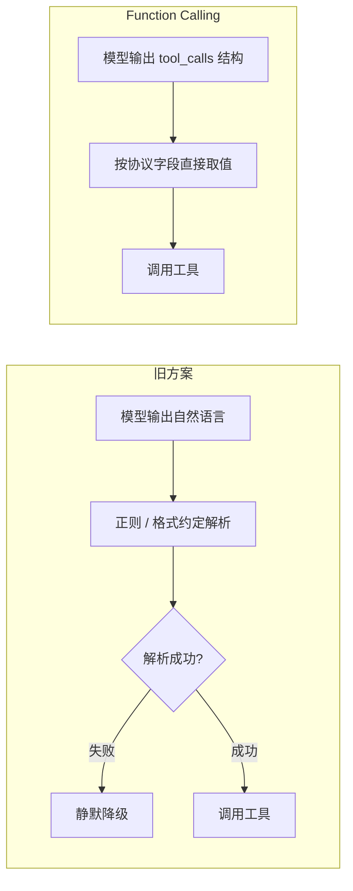
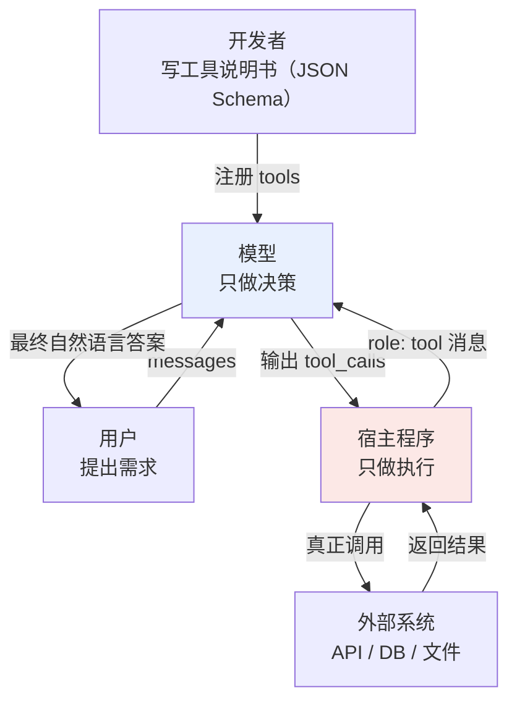
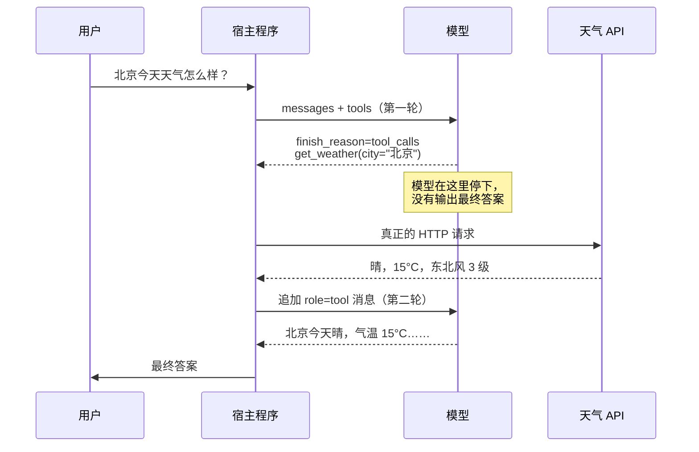
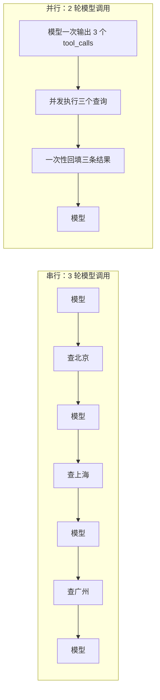

# 第一章：Function Calling 是什么，原理是什么

## 1.1 一句话定位

Function Calling 是**让模型用结构化 JSON 表达「我想调用哪个工具、参数是什么」的一种输出约定**。

这句话里有三个关键限定，缺一个就会掉进最常见的误区：

- **表达，不是执行**。模型输出的是一个调用意图，不是调用结果。真正跑函数、发 HTTP 请求、连数据库的，永远是宿主程序；
- **结构化 JSON，不是自然语言**。这是 Function Calling 相对于「土办法」的核心改进；
- **一种输出约定**。它是模型层的接口协议，不涉及工具怎么被发现、怎么被分发、怎么跨进程通信——那是 [MCP](../02-mcp/04-what-is-mcp.md) 的事。

> **模型只负责决策，代码负责执行。** 这一条职责边界是整章的地基，后面所有的设计取舍都从它推导出来。

## 1.2 没有 Function Calling 的时代

在 2023 年 6 月 OpenAI 正式推出 Function Calling 之前，想让模型触发外部动作，只有两条路，两条都不好走。

### 1.2.1 路线一：正则与关键词匹配

让模型正常输出自然语言，宿主程序用规则去猜它的意图：

```python
# 2023 年之前的典型写法
if "天气" in reply and ("查" in reply or "看" in reply):
    city = re.search(r"([\u4e00-\u9fa5]{2,4})(?:的)?天气", reply)
    if city:
        call_weather_api(city.group(1))
```

这套东西的脆弱程度超乎想象。模型今天说「我需要查一下北京的天气」，明天说「让我看看北京现在什么情况」，正则立刻失配。更糟的是它**静默失败**：匹配不上不会报错，只会当作普通回复直接返回给用户，你连问题发生了都不知道。

### 1.2.2 路线二：Prompt 里约定输出格式

进阶一点的做法是在 System Prompt 里写「如果需要调工具，请输出 `ACTION: 工具名(参数)`」。ReAct 论文当年就是这个思路。它比正则好，但有三个绕不过去的问题：

| 问题 | 表现 |
|---|---|
| 格式漂移 | 模型会输出 `ACTION：`（中文冒号）、加代码块包裹、在前面加一段解释 |
| 混合输出 | 一段回复里既有自然语言又有指令，需要额外切分 |
| 无法区分意图 | 模型「提到」某个工具名和「决定调用」它，在文本层面长得一样 |

第三条最要命。用户问「你能查天气吗」，模型回答「我可以调用 get_weather 来查」——这是在**介绍能力**，不是在**发起调用**，但解析器分不出来。

### 1.2.3 Function Calling 解决了什么

它把这件事从**文本解析问题**变成了**协议问题**：



差别在于：模型输出 `tool_calls` 时，响应里有一个明确的 `finish_reason: "tool_calls"` 信号。这是一个**带外信号**，不依赖对文本内容的理解，宿主程序拿到它就知道「模型现在要的是工具结果，而不是在跟用户说话」。介绍能力和发起调用，在协议层面被彻底分开了。

## 1.3 三个角色与职责边界

把整个流程理解成一次任务委托，三个角色的分工就很清楚了。



| 角色 | 职责 | 明确不做的事 |
|---|---|---|
| 开发者 | 定义工具的名称、描述、参数 Schema | 不预判模型会怎么选 |
| 模型 | 判断要不要调、调哪个、参数填什么 | **不执行任何代码，不访问网络** |
| 宿主程序 | 解析 `tool_calls`、执行函数、回填结果 | 不替模型做「该不该调」的判断 |

面试里最高频的失分点，就是把模型说成「自己去查了天气」。模型没有网络栈，没有执行环境，它产出的自始至终只是一段文本——只不过这段文本恰好是合法 JSON。

## 1.4 工具定义：Schema 的每个字段都在给模型提示

```python
tools = [{
    "type": "function",
    "function": {
        "name": "get_weather",
        "description": (
            "查询中国大陆城市的实时天气，返回气温、天气状况、风向风速。"
            "仅支持当前时刻，不支持未来预报和历史查询。"
        ),
        "parameters": {
            "type": "object",
            "properties": {
                "city": {
                    "type": "string",
                    "description": "城市名，如「北京」「杭州」。不要带省份或「市」后缀"
                },
                "unit": {
                    "type": "string",
                    "enum": ["celsius", "fahrenheit"],
                    "description": "温度单位，默认 celsius"
                }
            },
            "required": ["city"]
        }
    }
}]
```

### 1.4.1 description 是模型唯一的判断依据

模型看不到你的函数实现，看不到你的数据库，看不到任何注释。它决定「要不要调这个工具」时，能读的只有这段 `description`。

对比一下两种写法造成的行为差异：

| description | 模型的典型误用 |
|---|---|
| `"获取天气"` | 用户问「北京下周会下雨吗」也照调，拿回实时数据后**编造**一个未来预报 |
| `"查询中国大陆城市的实时天气……不支持未来预报和历史查询"` | 模型识别出能力边界，直接回复「我只能查当前天气」 |

关键技巧是**把「不能做什么」写进去**。人写文档习惯只写能力，但对模型来说，负向边界的信息量往往比正向描述更大——它决定了模型什么时候该**放弃**调用。

### 1.4.2 参数描述决定填参质量

`city` 的描述里那句「不要带省份或『市』后缀」不是废话。没有它，模型面对「浙江省杭州市今天天气如何」会老老实实填 `"浙江省杭州市"`，而你的 API 只认 `"杭州"`。

参数描述里值得写的三类信息：**格式约定**（日期用 `YYYY-MM-DD`）、**取值示例**、**取值范围**（能用 `enum` 就别用自由文本）。

### 1.4.3 用 enum 把选择题变成判断题

```python
# 差：模型可能填 "高"、"HIGH"、"P0"、"urgent"
"priority": {"type": "string", "description": "优先级"}

# 好：只有三个合法值，模型不可能填错
"priority": {"type": "string", "enum": ["low", "medium", "high"]}
```

`enum` 的价值不只是校验。主流推理框架（vLLM、SGLang 等）会把 Schema 编译成约束解码的语法，在**采样阶段**就屏蔽掉非法 token。这意味着违规值不是「生成后被拒绝」，而是根本生成不出来。

## 1.5 完整调用流程：两轮对话加中间执行



```python
import json
from openai import OpenAI

client = OpenAI()
messages = [{"role": "user", "content": "北京今天天气怎么样？"}]

# 第一轮：模型决策
resp = client.chat.completions.create(
    model="gpt-4o",
    messages=messages,
    tools=tools,
    tool_choice="auto",
)
choice = resp.choices[0]

if choice.finish_reason == "tool_calls":
    messages.append(choice.message)          # 必须先追加模型的这条消息

    for call in choice.message.tool_calls:
        args = json.loads(call.function.arguments)
        result = registry[call.function.name](**args)   # 宿主程序执行

        messages.append({
            "role": "tool",
            "tool_call_id": call.id,          # 必须与请求的 id 一一对应
            "content": json.dumps(result, ensure_ascii=False),
        })

    # 第二轮：模型基于工具结果生成答案
    final = client.chat.completions.create(
        model="gpt-4o", messages=messages, tools=tools
    )
    print(final.choices[0].message.content)
```

### 1.5.1 两个容易漏掉的必要步骤

**必须把模型那条 `tool_calls` 消息追加回 messages**。很多人直接跳到追加 `role: "tool"`，结果 API 报 `messages with role 'tool' must be a response to a preceding message with 'tool_calls'`。原因是对话历史必须自洽：先有请求，才能有响应。

**`tool_call_id` 必须一一对应**。并行调用时如果 id 错配，模型会把杭州的天气当成北京的用，而且不会报任何错。

### 1.5.2 tool_choice 的三种取值

| 取值 | 行为 | 用途 |
|---|---|---|
| `"auto"`（默认） | 模型自己判断调不调 | 通用对话 |
| `"required"` | 强制至少调一个工具 | 已确定必须查数据的流程节点 |
| `{"type":"function","function":{"name":"x"}}` | 强制调指定工具 | 结构化抽取：把工具当输出格式用 |
| `"none"` | 禁止调用 | 需要模型纯文本总结的收尾轮 |

把 `tool_choice` 锁定到某个工具时，Function Calling 实际上就在充当**结构化输出**接口。这是 Structured Output / JSON Mode 出现之前的通行做法，现在仍然被大量代码沿用。

## 1.6 并行工具调用

`tool_calls` 是数组而不是单个对象，这是一个刻意的设计。

用户问「帮我查北京、上海、广州的天气」，模型可以在**一次响应**里返回三个调用请求：



省下的不只是模型推理次数。三个 HTTP 请求可以用 `asyncio.gather` 并发跑，墙钟时间从 `3×(推理+IO)` 压到 `2×推理 + max(IO)`。

```python
import asyncio

async def run_all(tool_calls):
    tasks = [
        asyncio.to_thread(registry[c.function.name],
                          **json.loads(c.function.arguments))
        for c in tool_calls
    ]
    return await asyncio.gather(*tasks, return_exceptions=True)
```

### 1.6.1 并行的前提是无依赖

「先查订单号，再用订单号查物流」这种链式依赖没法并行——模型也知道，它会正确地分两轮输出。但有一个例外要小心：**模型偶尔会「猜」出中间结果并强行并行**。比如它假想一个订单号直接去查物流。防御手段是在工具描述里写清前置条件，并在宿主侧校验参数合法性。

### 1.6.2 部分失败怎么处理

并行执行时如果两个成功一个失败，**不要整批丢弃**。把失败的那个也以 `role: "tool"` 回填，内容写成结构化错误：

```python
{"role": "tool", "tool_call_id": call.id,
 "content": '{"error": "city_not_found", "message": "未找到城市「广洲」，请确认拼写"}'}
```

模型看到这条会自己纠正城市名重试。如果你直接抛异常中断整个流程，就浪费了模型的自我修复能力。这一点在 [Agent 的反思机制](../../agent/02-reasoning-planning/12-agent-reflection.md) 里会展开。

## 1.7 从 Function Calling 到工具调用生态

Function Calling 只解决了「模型怎么表达调用意图」。它没有解决的问题清单很长：

| 未解决的问题 | 由谁解决 |
|---|---|
| 工具怎么被**发现**（不用硬编码在代码里） | [MCP](../02-mcp/04-what-is-mcp.md) |
| 工具怎么**跨进程 / 跨机器**提供 | [MCP 传输层](../02-mcp/12-mcp-transport.md) |
| 复杂任务的**操作方法**怎么复用 | [Skill](../03-skills/08-what-is-skill.md) |
| 多个 Agent 之间怎么**互相调用** | [A2A](../04-agent-communication/11-a2a-protocol.md) |
| 多模型、多供应商怎么**统一治理** | [LLM 网关](../05-transport-gateway/14-llm-gateway.md) |

理解这个边界很重要：许多 LLM Host 会将 MCP Tool 转为模型能理解的 schema 并用 Function Calling 驱动调用；但 MCP 与 A2A 不以 Function Calling 为协议前提，Host 也可通过规则、结构化输出或人工流程发起调用。

## 1.8 常见错误

### 1.8.1 认为模型自己执行了工具

最典型的失分点。模型没有执行环境，`tool_calls` 只是一段 JSON 文本，所有副作用都发生在你的代码里。这个边界也直接决定了安全模型：**权限校验必须做在宿主侧**，因为模型输出的参数完全可能被用户的输入操纵。

### 1.8.2 把 description 当注释写

`"description": "获取天气"` 这种写法等于没写。模型的选择准确率、参数填充质量、能力边界判断，全部依赖这段文本。它是 Prompt 的一部分，应该按 Prompt 的标准来打磨和迭代。

### 1.8.3 注册几十个工具指望模型选对

工具数量上去之后，模型的选择准确率会明显下降，尤其是功能相近的工具（`search_docs` 和 `search_wiki`）。工具很多时的解法是**按场景动态筛选**：先用一次轻量分类或向量检索，从工具库里挑出 5–10 个相关的再传给模型。

### 1.8.4 忘记回填模型的 tool_calls 消息

只追加 `role: "tool"` 而漏掉模型那条消息，会直接触发 API 报错。对话历史必须保持请求与响应成对。

### 1.8.5 用异常中断替代错误回填

工具执行失败时直接抛异常，等于放弃了模型自我纠错的机会。把错误结构化地告诉模型，它经常能自己修好参数重试。

### 1.8.6 假设所有模型的 Function Calling 行为一致

不同模型的差异比想象中大：并行调用的支持程度不同，`tool_choice` 的取值语义不同，参数为空时有的填 `{}` 有的填 `null`，Schema 复杂嵌套时的稳定性也不同。换模型必须重跑工具调用的回归测试。

## 1.9 本章总结

1. **Function Calling 是模型层的输出约定**，把工具调用从文本解析问题变成协议问题；
2. **`finish_reason: "tool_calls"` 是带外信号**，让「介绍能力」和「发起调用」在协议层被区分开；
3. **模型只做决策，宿主程序只做执行**，这条边界同时是架构原则和安全边界；
4. **`description` 是模型唯一的判断依据**，写清能力边界比写清能力本身更重要；
5. **运行时是「两轮对话 + 中间执行」**，必须回填模型消息并保持 `tool_call_id` 对应；
6. **并行调用把 N 轮压缩成 2 轮**，前提是工具之间无依赖，且要正确处理部分失败；
7. **它只解决了表达问题**，工具发现、跨进程、生态标准化由 MCP 等上层协议补齐。


## 参考资料

- [OpenAI: Function Calling 指南](https://platform.openai.com/docs/guides/function-calling)
- [Anthropic: Tool Use with Claude](https://docs.claude.com/en/docs/agents-and-tools/tool-use/overview)
- [Anthropic: Writing Effective Tools for Agents](https://www.anthropic.com/engineering/writing-tools-for-agents)
- [Toolformer: Language Models Can Teach Themselves to Use Tools](https://arxiv.org/abs/2302.04761)
- [ReAct: Synergizing Reasoning and Acting in Language Models](https://arxiv.org/abs/2210.03629)
- [JSON Schema 规范](https://json-schema.org/)
