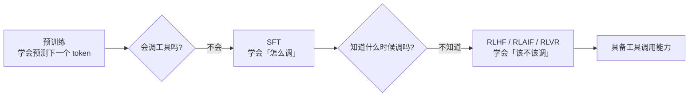
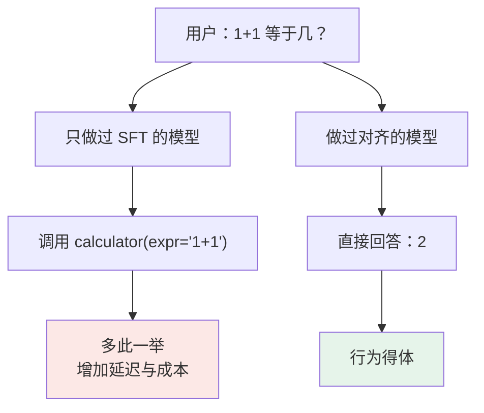
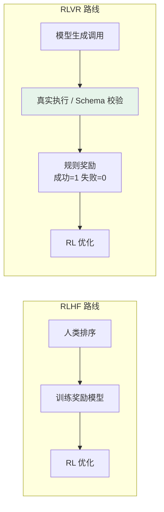
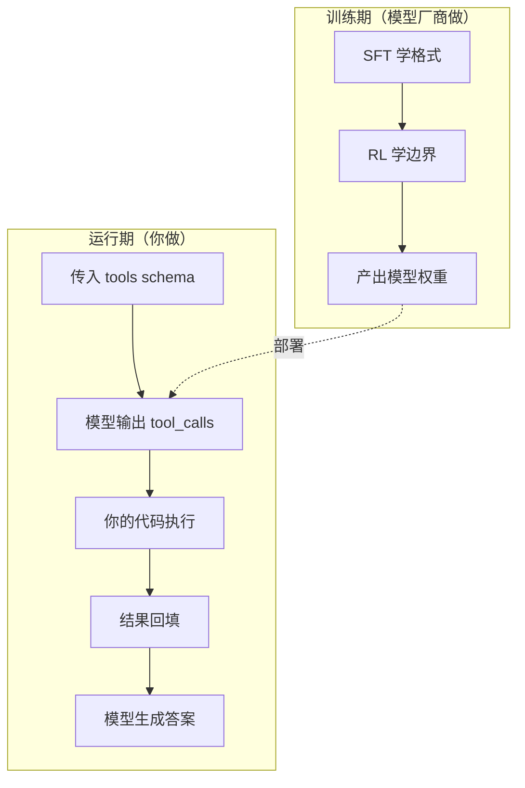

# 第二章：LLM 如何学会调用工具

## 2.1 一个反直觉的前提：工具调用不是涌现出来的

先破一个常见误解：**参数量变大不会自动带来工具调用能力**。

涌现（Emergence）说的是模型规模跨过某个阈值后，突然具备了小模型没有的推理与理解能力。但工具调用要的是另一件事——在恰当的时机输出一段**可被机器解析的结构化 JSON**，并且格式严格到能直接进 `json.loads`。

这个模式在预训练语料里基本不存在。互联网上有大量 API 文档、有大量代码，但几乎没有「对话进行到一半，助手突然吐出一段 `tool_calls` JSON，然后等待外部结果，再接着往下说」这种数据分布。

所以一个纯预训练模型面对「北京今天天气怎么样」，最好的表现也只是说：

> 我需要查询天气 API 才能回答这个问题。

它**描述**了意图，但没有**执行**协议。从描述到协议，中间隔着一整套后训练。

## 2.2 第一阶段：SFT 教会「怎么调」

### 2.2.1 训练样本长什么样

工具调用的 SFT 样本，特殊之处在于它是一条**完整的多角色对话轨迹**，而不是简单的问答对：

| 角色 | 内容 | 训练时是否计算 loss |
|---|---|---|
| `system` | 工具定义（JSON Schema） | 否 |
| `user` | 北京今天天气怎么样？ | 否 |
| `assistant` | `{"tool_calls":[{"name":"get_weather","arguments":{"city":"北京"}}]}` | **是** |
| `tool` | 晴，15°C，东北风 3 级 | 否 |
| `assistant` | 北京今天天气晴朗，气温 15°C…… | **是** |

注意最右边这一列。训练时只在 assistant 的两条消息上计算损失——因为只有这两处是模型需要**生成**的内容。`tool` 消息是外部世界给的，模型不需要学会预测它，否则模型会学出「自己编造工具返回值」的坏习惯。

这是工具调用 SFT 里一个实打实的工程细节：**loss mask 打错了，模型就会幻觉出工具结果**。

### 2.2.2 训练数据必须覆盖的五类场景

数据的场景覆盖度，直接决定了能力的上限。缺哪一类，就在哪一类翻车：

| 场景 | 不覆盖的后果 |
|---|---|
| 单工具调用 | 最基础，一般不会缺 |
| **多工具并行调用** | 模型只会一个一个串行调，延迟成倍增加 |
| **工具调用失败后的处理** | 遇到 API 报错就崩，或者原样重复同一个错误调用 |
| **不需要工具，直接回答** | 形成「见问题就调工具」的惯性，简单算术也去调计算器 |
| **多轮对话中引用历史工具结果** | 无视上下文里已有的结果，重复调用同一个工具 |

第四类最容易被忽略，也最反直觉：**为了教会模型调工具，你必须给它看大量「不该调工具」的样本**。否则数据分布本身就在诱导它过度调用。

### 2.2.3 训练数据从哪来

| 来源 | 成本 | 质量 | 典型用途 |
|---|---|---|---|
| 人工标注 | 极高 | 高 | 种子数据、评测集 |
| 强模型蒸馏（Self-Instruct / Distillation） | 低 | 中，需抽检 | 规模化扩充 |
| **真实 API 执行反馈** | 中 | 高（有 ground truth） | 高价值样本 |

第三种值得单独说。ToolLLM 提出的做法是拿真实的 RapidAPI 接口去跑，用**实际执行成功与否**作为样本正确性的判据，而不是靠另一个模型说了算。这绕开了纯蒸馏最大的隐患——**幻觉传递**：上游模型生成了一个参数写错的调用样本，下游模型会把这个错误当作正确答案学进去，而且没有任何信号能发现。

只要工具是可执行的，就应该用执行结果做校验。这条原则在整个工具调用训练里都成立。

## 2.3 第二阶段：为什么 SFT 不够

SFT 之后的模型有个很典型的毛病：**过度调用**。

原因不难理解。SFT 数据里绝大多数样本都是「该调工具」的正例——毕竟目的就是教它调工具。模型在模仿的过程中过拟合了这种倾向，学到的其实是「看到工具定义就用起来」，而不是「判断需不需要」。

更本质的问题在于监督信号的形式：SFT 只告诉模型「这是正确答案」，从不告诉它「为什么另一个答案不对」。它没有比较，就没有边界感。

## 2.4 第三阶段：用反馈建立边界感

### 2.4.1 RLHF 的四步

1. **采样多样回答**：对同一问题让模型生成若干种处理方式——有的调工具、有的直接答、有的参数填错；
2. **人类偏好排序**：标注员对这些回答排序。「北京天气」题里调工具的排第一，「1+1」题里直接回答的排第一；
3. **训练奖励模型**：用排序数据训练一个只负责打分的模型，它学的是「预测人类会给这个回答打多少分」；
4. **强化学习优化主模型**：用奖励模型的打分作为信号，通过 PPO 等算法调整主模型参数。

### 2.4.2 奖励模型是人类偏好的蒸馏体

第三步有个容易被忽略的推论：**奖励模型的天花板就是标注员的水平**。

人类的判断被蒸馏进了这个「裁判」。如果标注标准不一致——比如有的标注员认为查百科该调搜索，有的认为模型自己知道就行——奖励模型学到的就是一个自相矛盾的标准，后面主模型再怎么优化，也是往一个模糊的方向走。

这就是为什么大厂在 RLHF 上花的力气，很大一部分是在**标注规范和标注员一致性校验**上，而不是算法本身。

### 2.4.3 为什么偏偏是 PPO

强化学习算法很多，选 PPO 有两个务实的理由：

- **稳定**：传统策略梯度容易因单步更新过大把模型训崩；
- **内置 KL 约束**：强制新旧策略的输出分布不要偏离太远。

第二点在工具调用场景尤其关键。没有 KL 约束，模型为了刷高奖励分数，会退化成某种「套话机器」——比如发现只要调工具就容易得高分，于是无脚本地对所有问题都调工具。RLHF 本质上是在「追求高奖励」和「保持语言能力」之间走钢丝，KL 项就是那根平衡杆。

关于 PPO、DPO、GRPO 的完整对比，见 LLM 主题的 Post-Training 与 DPO/PPO 章节。

### 2.4.4 RLAIF：用 AI 代替人工打分

RLHF 最大的瓶颈是标注成本。RLAIF 换成用更强的模型来打分，成本可以低一到两个数量级，速度也快得多。

代价是**偏见传递**：如果 AI 评委自己认为「所有数学题都该调计算器」，被它训练出来的模型也会继承这个倾向。

现在业界的主流是混用——关键数据和评测集用人工保质量，大规模训练数据用 AI 提效率。

## 2.5 2025 年之后的新范式：可验证奖励

前面三个阶段是 2023–2024 年的经典配方。工具调用领域最近两年最重要的变化，是从「靠偏好打分」转向了**靠执行结果打分**。

### 2.5.1 为什么可以这么做

工具调用有一个别的对齐任务没有的优势：**它的正确与否在很多时候是可以客观判定的**。

- 调用的函数名在工具列表里吗？→ 可判定；
- 参数能通过 JSON Schema 校验吗？→ 可判定；
- 工具实际执行成功了吗？→ 可判定；
- 最终答案和标准答案一致吗？→ 多数情况可判定。

这些判定完全不需要人类，也不需要奖励模型。这就是 RLVR（Reinforcement Learning with Verifiable Rewards）的思路。

### 2.5.2 带来的变化

| 维度 | 偏好奖励 | 可验证奖励 |
|---|---|---|
| 奖励来源 | 奖励模型（可被 hack） | 执行结果（客观） |
| 标注成本 | 高 | 接近零 |
| 能训练的能力 | 「像不像人类喜欢的」 | 「对不对」 |
| 局限 | 奖励模型漂移 | 只适用于可判定任务 |

奖励模型有一个已知的老问题叫 **reward hacking**：模型学会讨好裁判而不是真正做对。执行反馈没有这个问题——你没法通过讨好一个 HTTP 状态码来伪造成功。

这也是 2025 年之后一批工具调用与 Agent 训练工作（ToolRL、ReTool 等）的共同思路：把工具执行放进强化学习的循环里，让模型在真实的成功与失败中学会**多步工具调用的规划**，而不只是单次调用的格式。

### 2.5.3 与推理模型的合流

同一时期另一条主线是推理模型（o 系列、DeepSeek-R1 一类）。这两条线在 2025 年后逐渐合流：模型在长思维链的中途插入工具调用，用工具结果继续推理，而整个轨迹用可验证奖励来训练。

这带来一个新的技术难点——推理过程中断与恢复的状态管理，这正是 [第七章](07-reasoning-models-and-tools.md) 要讲的内容。

## 2.6 训练好之后，运行时发生了什么

训练与运行时是两件事，面试里经常被混着问。运行时的完整流程在 [第一章](01-function-calling.md) 已经讲过，这里只强调分界：

一个关键推论：**你在运行时能做的事，被训练期决定了上限**。如果一个模型的训练数据里没有并行调用样本，你在 `tools` 里怎么写描述都换不来并行输出。选模型时看它的工具调用 benchmark 成绩，看的就是这个上限。

## 2.7 怎么衡量一个模型的工具调用能力

常见的公开评测：

| 评测 | 侧重 |
|---|---|
| **BFCL**（Berkeley Function Calling Leaderboard） | 多语言、多场景的函数调用准确率，含「不该调用」的相关性检测 |
| **ToolBench / API-Bank** | 真实 API 上的多步调用成功率 |
| **τ-bench** | 与用户和工具双向交互的完整任务完成率 |

BFCL 里有一项专门测「**该不该调**」——给一个明显不需要工具的问题，看模型会不会硬调。这一项的分数往往比格式正确率更能区分模型的成熟度，因为格式是 SFT 就能刷上去的，边界感必须靠对齐阶段。

自建评测集时也应该照抄这个思路：**测试集里必须有一批不该调工具的问题**，否则你测不出过度调用。

## 2.8 常见错误

### 2.8.1 认为预训练就能学会工具调用

预训练学的是「预测下一个 token」，语料里没有工具调用的对话模式。模型最多能描述意图，输出不了协议。这必须靠专项后训练。

### 2.8.2 训练数据只有正例

只喂「该调工具」的样本，模型必然过度调用。「不该调」的负例、调用失败后的恢复轨迹、多轮里引用历史结果的样本，都得覆盖。

### 2.8.3 loss mask 打到 tool 消息上

工具返回的内容不是模型该生成的东西。把它算进损失，等于在教模型编造工具结果。

### 2.8.4 纯蒸馏不做执行校验

上游模型生成的错误样本会被完整继承，且无声无息。只要工具可执行，就应该拿执行结果做过滤。

### 2.8.5 把 SFT 和 RL 的分工说反

面试里的标准答法是：**SFT 解决「会不会」，RL 解决「该不该」**。只有 SFT 会过度调用；只有 RL 而没有 SFT，模型连合法格式都输不出来，奖励信号完全没有着力点。

### 2.8.6 忽略训练期决定运行期上限

发现模型不会并行调用、不会从工具错误里恢复，第一反应是改 Prompt。但如果这是训练数据的缺口，Prompt 补不回来，只能换模型或自己微调。

## 2.9 本章总结

1. **工具调用不是涌现能力**，预训练语料里没有这种模式，必须靠后训练专门教；
2. **SFT 教「怎么调」**，样本是完整的多角色对话轨迹，loss 只算 assistant 部分；
3. **训练数据要覆盖五类场景**，其中「不该调工具」的负例最容易被忽略也最重要；
4. **蒸馏数据必须做执行校验**，否则会发生幻觉传递；
5. **RL 教「该不该调」**，奖励模型是人类偏好的蒸馏体，标注一致性决定它的天花板；
6. **PPO 的 KL 约束防止行为退化**，RLAIF 用成本换偏见风险；
7. **2025 年后转向可验证奖励**，用真实执行结果代替偏好打分，规避 reward hacking；
8. **训练期决定运行期上限**，Prompt 补不回训练数据的缺口。

> **一句话概括：SFT 教会模型怎么调工具，强化学习教会它什么时候不该调，而 2025 年之后，「调对了没有」这件事越来越多地交给真实执行结果来判定。**

## 参考资料

- [Toolformer: Language Models Can Teach Themselves to Use Tools](https://arxiv.org/abs/2302.04761)
- [ToolLLM: Facilitating Large Language Models to Master 16000+ Real-world APIs](https://arxiv.org/abs/2307.16789)
- [Training language models to follow instructions with human feedback（InstructGPT）](https://arxiv.org/abs/2203.02155)
- [Constitutional AI: Harmlessness from AI Feedback](https://arxiv.org/abs/2212.08073)
- [ToolRL: Reward is All Tool Learning Needs](https://arxiv.org/abs/2504.13958)
- [ReTool: Reinforcement Learning for Strategic Tool Use in LLMs](https://arxiv.org/abs/2504.11536)
- [Berkeley Function Calling Leaderboard](https://gorilla.cs.berkeley.edu/leaderboard.html)
- [τ-bench: A Benchmark for Tool-Agent-User Interaction in Real-World Domains](https://arxiv.org/abs/2406.12045)
