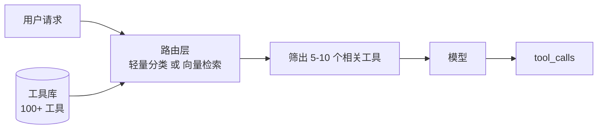

# 第三章：工具定义与 Schema 工程

## 3.1 为什么值得单独开一章

[第一章](01-function-calling.md) 说过，`description` 是模型判断的唯一依据。但在实际项目里，工具定义的影响远不止「模型选得准不准」这一件事——它同时决定了：

- 模型选错工具的概率；
- 参数填错的概率；
- 每次请求固定消耗多少 token；
- 出错时模型能不能自己恢复；
- 上下文被工具结果撑爆的速度。

一个反直觉的经验是：**很多被归因为「模型不行」的问题，根源是工具定义写得不行**。换更强的模型能盖住一部分，但成本高得多，而且盖不住全部。

> **工具定义是 Prompt 的一部分，应该按 Prompt 的标准去设计、评测和迭代。**

## 3.2 工具描述的写法

### 3.2.1 写清楚能力边界，而不只是能力

人写 API 文档的习惯是描述「能做什么」。但对模型来说，**「不能做什么」的信息量更大**——它决定了模型什么时候该放弃调用。

| 写法 | 模型行为 |
|---|---|
| `"查询订单信息"` | 用户问「我上个月的订单」也调，拿回单条数据后编造月度汇总 |
| `"根据订单号查询单个订单的详情。不支持按时间范围、用户 ID 或状态批量查询。"` | 模型识别边界，转而去找批量查询工具或向用户要订单号 |

描述通常可以按这个顺序写：

```
<这个工具做什么>。<返回什么内容>。<明确不支持什么>。<什么情况下应该改用其他工具>。
```

最后一句尤其有用。当工具库里有多个相近工具时，在描述里直接写「如果需要模糊搜索，请改用 `search_orders`」，比指望模型自己悟出区别可靠得多。

### 3.2.2 用工具名承载语义

模型看到的第一个信号是工具名。命名混乱时，再好的描述也救不回来：

```python
# 差：名字看不出区别，模型只能靠 description 猜
query_1, query_2, do_search

# 好：动词 + 对象 + 限定，名字本身就在分流
get_order_by_id
search_orders_by_date_range
cancel_order
```

命名约定尽量在整个工具库里保持一致：`get_*` 是按主键精确取，`search_*` 是模糊查多条，`list_*` 是无条件枚举，`create_/update_/delete_*` 是有副作用的写操作。这套一致性本身就是给模型的隐式提示。

### 3.2.3 在描述里给出使用示例

对语义复杂的工具，直接在 `description` 里塞一两个调用示例，效果往往比反复措辞更好：

```python
"description": (
    "执行 SQL 查询并返回结果。只支持 SELECT，不支持写操作。\n"
    "示例：查询昨天订单数 -> "
    "SELECT COUNT(*) FROM orders WHERE created_at >= CURRENT_DATE - 1"
)
```

它相当于把 few-shot 示例塞进了工具定义里。代价是 token，收益是参数准确率，值不值得取决于这个工具被调用的频率和出错的成本。

## 3.3 参数设计

### 3.3.1 扁平优于嵌套

模型填深层嵌套结构的错误率明显更高，而且错误往往是「结构对了但层级放错了」这种难排查的类型：

```python
# 差：三层嵌套
{"filter": {"conditions": {"date": {"gte": "2026-01-01"}}}}

# 好：扁平
{"start_date": "2026-01-01", "end_date": "2026-01-31"}
```

如果内部接口确实需要复杂结构，正确做法是**在宿主侧做转换**，而不是把复杂度暴露给模型。工具 Schema 是给模型看的接口，不是内部数据结构的镜像。

### 3.3.2 能用 enum 就不用自由文本

```python
# 差：模型可能填 "已完成"、"completed"、"DONE"、"finish"
"status": {"type": "string", "description": "订单状态"}

# 好
"status": {"type": "string", "enum": ["pending", "paid", "shipped", "completed", "cancelled"]}
```

除了减少错误，`enum` 还有个机制上的好处：主流推理框架会把 Schema 编译成约束解码的语法，在**采样阶段**就屏蔽非法 token。非法值不是「生成后被拒」，而是根本生成不出来。

### 3.3.3 required 要诚实

把所有参数都标成 `required`，模型遇到信息不全时会**编造**一个值填进去。把该必填的标成可选，模型又会漏填导致查询范围失控。

正确做法是让 `required` 反映真实约束，并在描述里写清缺省行为：

```python
"limit": {"type": "integer", "description": "返回条数，默认 20，最大 100"}
```

### 3.3.4 日期与时间是重灾区

模型没有可靠的「今天是几号」的概念。两种解法：

- **在 System Prompt 里注入当前时间**，让模型自己算；
- **提供相对时间参数**，如 `{"period": {"enum": ["today", "last_7_days", "this_month"]}}`，把日期计算收回到代码里。

第二种更稳，尤其是涉及时区和月末边界的场景。

## 3.4 工具返回值的设计

工具的**输出**同样重要，但经常被忽略——它直接决定了上下文消耗和模型的下一步判断。

### 3.4.1 返回值也是给模型看的

```python
# 差：把 ORM 对象整个序列化，30 个字段模型只用得到 3 个
{"id": 1, "uuid": "...", "created_at": "...", "updated_at": "...",
 "deleted_at": null, "tenant_id": 7, "shard_key": "...", ...}

# 好：只返回模型需要的
{"order_id": "A1001", "status": "shipped", "total": 299.0,
 "eta": "2026-09-02"}
```

工具返回值会**原样进入上下文**，并在后续每一轮里被重复计费。一个返回 5KB 冗余 JSON 的工具，在十轮对话里就吃掉了 50KB 的上下文预算。

### 3.4.2 大结果要截断并告知

返回 500 条记录不如返回前 20 条加一句提示：

```python
{"items": [...20 条...],
 "total": 517,
 "note": "结果过多，仅返回前 20 条。请缩小时间范围或增加筛选条件后重试。"}
```

关键是那句 `note`。它不只是截断，而是**告诉模型该怎么办**。没有它，模型会以为总共就 20 条，直接基于不完整数据下结论。

### 3.4.3 错误必须结构化

```python
# 差：抛异常中断整个流程
raise ValueError("city not found")

# 好：以工具结果的形式回填
{"error": "city_not_found",
 "message": "未找到城市「广洲」",
 "hint": "可能的正确拼写：广州。请确认后重试。"}
```

结构化错误让模型有机会自己纠正重试。直接抛异常等于放弃了模型的自我修复能力。`hint` 字段是关键——它把「出错了」变成了「出错了，这样改」。

不过要设**重试上限**。模型有时会陷入「同样的错误参数反复重试」的循环，宿主侧应该记录同一工具的连续失败次数，超过两三次就中断并向上抛。

## 3.5 工具数量与上下文成本

### 3.5.1 工具定义每次请求都要全量传

这里经常被低估的，是工具 Schema 的固定开销。工具 Schema 不会被「记住」，每一轮请求都要完整传一遍：

| 工具数 | 平均每个 Schema | 每次请求的固定开销 |
|---|---|---|
| 5 | 150 token | 750 token |
| 30 | 150 token | 4,500 token |
| 100 | 150 token | 15,000 token |

一个挂了 100 个工具的 Agent，在还没开始干活时就烧掉了 15K token，而且**每一轮都烧一次**。十轮对话就是 150K。

### 3.5.2 工具变多，准确率会下降

除了成本，选择准确率也会掉。功能相近的工具（`search_docs` vs `search_wiki` vs `search_kb`）尤其容易混淆。

主流解法是**动态工具筛选**：



路由层可以是向量检索（把工具描述做成 Embedding，用 query 去召回）、规则分类，或者一次廉价小模型调用。相比直接把 100 个工具全塞进去，这一次额外调用几乎总是划算的。

### 3.5.3 把工具定义放在 Prompt 最前面

工具 Schema 常是多轮对话中较稳定的部分。将稳定内容放在前面可提高支持前缀缓存的提供方/运行时的命中机会，但是否命中、计费和 TTL 以具体服务为准。

顺序上的通行原则是：**固定内容在前，动态内容在后**。工具定义 → System Prompt → 历史对话 → 当前问题。详见 LLM 主题的 [KV Cache 与 Prompt Caching](../../llm/03-inference-serving/14-kv-cache.md) 章节。

## 3.6 工具粒度：粗一点还是细一点

这是设计工具库时的核心取舍。

| | 细粒度 | 粗粒度 |
|---|---|---|
| 例子 | `get_user`、`get_orders`、`get_address` 三个工具 | `get_user_profile` 一个工具返回全部 |
| 灵活性 | 高，模型可自由组合 | 低 |
| 调用轮次 | 多，延迟高 | 少 |
| 出错概率 | 高（每一步都可能选错） | 低 |
| 上下文消耗 | 高（多轮累积） | 低 |

实践中的判断标准是：**看这几个操作是不是几乎总是一起出现**。如果模型每次查用户都要接着查订单和地址，那就该合并成一个工具；如果三者独立使用的场景各占三分之一，就该拆开。

一个常见的错误是把内部微服务的接口边界直接照搬成工具边界。内部服务的拆分依据是团队职责和数据归属，跟「模型该怎么用」没有关系。

## 3.7 一个完整的工具定义模板

```python
{
    "type": "function",
    "function": {
        "name": "search_orders",                      # 动词_对象，语义自解释
        "description": (
            "按时间范围和状态搜索订单，返回订单摘要列表。"      # 做什么
            "每条包含订单号、状态、金额、下单时间。"            # 返回什么
            "最多返回 50 条，超出时需要缩小范围。"              # 限制
            "不支持按商品名搜索；若需按订单号精确查询，"        # 边界
            "请改用 get_order_by_id。"                       # 替代方案
        ),
        "parameters": {
            "type": "object",
            "properties": {
                "start_date": {
                    "type": "string",
                    "description": "起始日期，格式 YYYY-MM-DD，如 2026-08-01"
                },
                "end_date": {
                    "type": "string",
                    "description": "结束日期，格式 YYYY-MM-DD，含当天"
                },
                "status": {
                    "type": "string",
                    "enum": ["pending", "paid", "shipped", "completed", "cancelled"],
                    "description": "订单状态筛选，不传则返回所有状态"
                },
                "limit": {
                    "type": "integer",
                    "description": "返回条数，默认 20，最大 50"
                }
            },
            "required": ["start_date", "end_date"]     # 只标真正必需的
        }
    }
}
```

## 3.8 工具定义要做回归测试

工具描述改一个字，模型行为就可能变。这意味着它需要和代码一样被测试。

最简单的落地方式，是维护一套用例集：

| 用例 | 期望行为 |
|---|---|
| 「查一下 A1001 这个订单」 | 调 `get_order_by_id`，不调 `search_orders` |
| 「我这个月的订单有哪些」 | 调 `search_orders`，日期范围正确 |
| 「1+1 等于几」 | **不调任何工具** |
| 「帮我把订单 A1001 取消」 | 调 `cancel_order`，且触发人工确认 |

第三行是必须有的。没有「不该调工具」的用例，你测不出过度调用。

改工具描述、加新工具、换模型这三种情况下都应该重跑这套用例。尤其是**加新工具**——一个新工具的描述可能意外地和已有工具重叠，导致原本正确的路由开始出错，而你不会在任何地方看到报错。

## 3.9 常见错误

### 3.9.1 把内部 API 文档直接当 description

内部文档面向的是知道上下文的工程师，模型没有这些上下文。术语、缩写、隐含约定都要展开写。

### 3.9.2 只写能力不写边界

不写「不支持什么」，模型会在能力边界外硬调，然后基于错误数据编造答案。

### 3.9.3 把 ORM 对象整个返回给模型

冗余字段会持续占用上下文并被重复计费。返回值应该按「模型需要什么」裁剪，而不是按「数据库里有什么」。

### 3.9.4 大结果只截断不提示

模型会把前 20 条当成全部，得出错误结论。截断必须伴随 `total` 和处理建议。

### 3.9.5 用异常代替结构化错误

抛异常中断流程，等于放弃模型的自我纠错能力。但也要记得设重试上限，防止死循环。

### 3.9.6 注册几十个工具不做筛选

既烧 token 又降准确率。超过 15–20 个工具就该考虑动态筛选。

### 3.9.7 改了工具描述不回归

这是最隐蔽的一类。工具描述的改动不会触发任何编译错误或类型检查，问题只会在线上以「模型偶尔选错工具」的形式出现。

## 3.10 本章总结

1. **工具定义是 Prompt 的一部分**，很多「模型不行」的问题实际是工具定义不行；
2. **描述要写清边界和替代方案**，「不支持什么」比「支持什么」信息量更大；
3. **参数扁平化、多用 enum、required 要诚实**，日期时间尽量用相对枚举收进代码；
4. **返回值按模型需求裁剪**，大结果要截断并给出处理建议；
5. **错误必须结构化并带 hint**，同时设重试上限防死循环；
6. **工具定义每轮全量传，成本随数量线性增长**，超过 15–20 个应做动态筛选；
7. **工具粒度按「是否总是一起用」判断**，不要照搬内部微服务边界；
8. **工具定义需要回归测试**，用例集里必须包含「不该调工具」的场景。


## 参考资料

- [Anthropic: Writing Effective Tools for Agents](https://www.anthropic.com/engineering/writing-tools-for-agents)
- [Anthropic: Building Effective Agents](https://www.anthropic.com/engineering/building-effective-agents)
- [OpenAI: Function Calling 指南](https://platform.openai.com/docs/guides/function-calling)
- [JSON Schema 规范](https://json-schema.org/)
- [Berkeley Function Calling Leaderboard](https://gorilla.cs.berkeley.edu/leaderboard.html)
