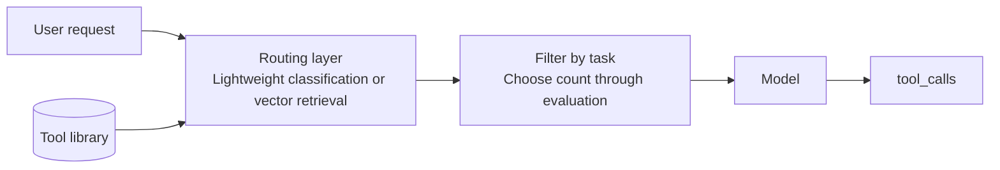

# Chapter 3: Tool Definitions and Schema Engineering

## 3.1 Why does this deserve a chapter?

[Chapter 1](01-function-calling.md) explained how tool names, descriptions, schemas, and context jointly affect the model's selection. Tool definitions also affect:

- How often the model chooses the wrong tool.
- How often it supplies incorrect arguments.
- The fixed token overhead of each request.
- Whether the model can recover from an error.
- How quickly tool results fill the context window.

A counterintuitive lesson is that **many problems blamed on the model actually begin with poor tool definitions**. A stronger model may compensate for some of them, but at greater cost—and not for all of them.

> **Tool definitions are part of the prompt. Design, evaluate, and iterate on them accordingly.**

## 3.2 Writing tool descriptions

### 3.2.1 Explain limits, not just capabilities

A description should state what the tool does, what it returns, its input prerequisites, and what it does not support. The examples below illustrate intended routing differences, not guaranteed model behavior.

| Description | Model behavior |
|---|---|
| `"Look up order information"` | Calls it for "My orders from last month," receives one record, and invents a monthly summary |
| `"Look up details of a single order by order number. Does not support batch queries by time range, user ID, or status."` | Recognizes the boundary, looks for a batch-query tool, or asks for the order number |

A useful order for the description is:

```
<What this tool does>. <What it returns>. <What it explicitly does not support>. <When to use another tool instead>.
```

The final sentence is especially useful. If several tools have similar capabilities, explicitly saying "For fuzzy search, use `search_orders` instead" is more reliable than expecting the model to infer the distinction.

### 3.2.2 Make the tool name meaningful

Names are an important selection signal. Tools are harder to distinguish when their names are too similar or carry no business meaning:

```python
# Poor: the names reveal no distinction; the model must rely on descriptions
query_1, query_2, do_search

# Better: verb + object + qualifier; the name itself guides selection
get_order_by_id
search_orders_by_date_range
cancel_order
```

Keep naming conventions consistent across the tool library. For example, `get_*` retrieves an exact object by identifier; `search_*` finds objects by search criteria; `list_*` enumerates a collection, possibly with filtering and pagination; and `create_/update_/delete_*` indicates writes. These are team conventions, not protocol requirements. Names cannot replace side-effect or permission checks.

### 3.2.3 Include usage examples in the description

For semantically complex tools, add one or two representative examples to `description` and compare against a version without them:

```python
{"description": (
    "Execute a SQL query and return its results. Supports SELECT only, not writes.\n"
    "Example: count yesterday's orders -> "
    "SELECT COUNT(*) FROM orders WHERE created_at >= CURRENT_DATE - 1 "
    "AND created_at < CURRENT_DATE"
)}
```

This embeds few-shot examples in the tool definition. The cost is tokens; the potential benefit is argument accuracy. Whether it is worthwhile depends on how often the tool is used and how costly mistakes are.

The example uses PostgreSQL date syntax, follows the database session's time zone, and assumes queries are already scoped to the current tenant. "Supports SELECT only" is not a security control. Read-only credentials, query limits, and object-level permissions are still necessary; keyword filtering alone is insufficient.

## 3.3 Designing parameters

### 3.3.1 Prefer flat structures to unnecessary nesting

Unnecessary nesting makes arguments harder to fill and validate. Prefer flat fields when they express the meaning clearly, but evaluate whether they actually reduce errors for the target model:

```python
# Poor: three levels of nesting
{"filter": {"conditions": {"date": {"gte": "2026-01-01"}}}}

# Better: flat fields
{"start_date": "2026-01-01", "end_date": "2026-01-31"}
```

The host can translate away unnecessary internal wrappers. Preserve nesting when it expresses real relationships, such as a shipping address or multiple line items; flattening them may make associations harder to maintain. A tool schema need not mirror internal data structures.

### 3.3.2 Use enums instead of free text for finite choices

```python
# Poor: the model might supply "已完成" (completed), "completed", "DONE", or "finish"
{"status": {"type": "string", "description": "Order status"}}

# Better
{"status": {"type": "string", "enum": ["pending", "paid", "shipped", "completed", "cancelled"]}}
```

A runtime supporting strict mode or structured outputs can use the schema for constrained decoding. Merely supplying an `enum` does not enable that path. Even a well-formed value can be wrong—for example, `cancelled` instead of `completed`—so business state needs separate validation.

### 3.3.3 Be precise about required fields

General JSON Schema uses `required` to distinguish mandatory fields. OpenAI strict mode requires every field in `properties` to appear in `required`; business-optional values are expressed through nullable types. If information is missing, ask for clarification rather than letting a formatting requirement force the model to guess a business value.

In non-strict examples, descriptions can explain default behavior, but the server implements the actual defaults and limits:

```python
{"limit": {"type": "integer", "description": "Number of results; defaults to 20, maximum 100"}}
```

#### Specific strict-mode constraints

The following are constraints of OpenAI Function Calling strict mode, not universal JSON Schema requirements across model APIs:

- Explicitly set `strict: true`. Set `additionalProperties: false` on every object, and include every property in `required`.
- An optional value can use `{"type":["string","null"],"enum":["paid","shipped",null]}`. The `enum` must also permit `null`. A present field with a null value is not the same as an absent field.
- Only a subset of JSON Schema is supported. Refusals, truncated output, and API errors still need handling. Schema validation cannot replace authorization or checks on date ordering, balances, or object ownership.
- If `strict` is omitted, Chat Completions defaults to non-strict behavior. Responses attempts to normalize the schema into strict mode and may fall back to best effort when incompatible. Specify it explicitly when behavior must be stable rather than relying on defaults.
- Aggregate streamed arguments by call ID until complete, then parse, validate, and execute. Receiving a partial stream that happens to form valid JSON is not permission to trigger a write early.

### 3.3.4 Dates and times are a frequent source of errors

A model does not have a reliable built-in notion of today's date. Two approaches are:

- **Inject the current time into the system prompt** and let the model calculate.
- **Provide relative-time parameters**, such as `{"period": {"enum": ["today", "last_7_days", "this_month"]}}`, and perform date calculations in code.

The second is more robust, particularly around time zones and month-end boundaries.

## 3.4 Designing tool results

Tool **output** is just as important, yet often overlooked. It directly determines context consumption and the model's next decision.

### 3.4.1 Results are also an interface for the model

```python
# Poor: serialize the entire ORM object when the model needs only 3 of its 30 fields
{"id": 1, "uuid": "...", "created_at": "...", "updated_at": "...",
 "deleted_at": None, "tenant_id": 7, "shard_key": "..."}

# Better: return only what the model needs
{"order_id": "A1001", "status": "shipped", "total": 299.0,
 "eta": "2026-09-02"}
```

The host decides which results enter the model's context. If history is sent repeatedly, redundant content is repeatedly supplied as input. However, a single turn's context length is not the same as cumulative input billing across turns, and bytes are not tokens. Pagination, summaries, resource references, and caching can reduce overhead while preserving a traceable location for the complete result.

### 3.4.2 Truncate large results and say so

Large results can be paginated, with a clear indication of how much remains unseen. Here, `page_items` contains the first 20 order summaries already retrieved, and the query has confirmed a total of 517:

```python
{"items": page_items,
 "total": 517,
 "returned_count": 20,
 "has_more": True,
 "note": "结果过多，仅返回前 20 条。请缩小时间范围或增加筛选条件后重试。"}
```

The original Chinese `note` says, "Too many results; only the first 20 are returned. Narrow the time range or add filters and try again." `has_more`, the returned count, and `note` tell downstream consumers that the result is incomplete and how to continue. If the total is unknown, say so; do not substitute the returned count for the total. Summing amounts or counting orders across the entire result set should generally be delegated to a database aggregate, not calculated from this page alone.

### 3.4.3 Make errors structured

```python
# An expected business error can interrupt the whole flow if the adapter does not handle it
raise ValueError("city not found")

# A correctable business error can become a structured tool result
{"error": "city_not_found",
 "message": "未找到城市「广洲」",
 "hint": "可能的正确拼写：广州。请确认后重试。"}
```

The original Chinese `message` says, "City ‘广洲’ was not found," and the `hint` says, "Possible correct spelling: 广州. Confirm and try again." The example preserves `广洲`, a misspelling of `广州` (Guangzhou). Structured errors give the model a chance to correct arguments; they do not require underlying functions to stop using exceptions. The adapter can translate known business exceptions into bounded, sanitized error codes and hints. Unexpected exceptions should be reported explicitly, not caught indiscriminately and disguised as successful results that allow the flow to continue. A `hint` suggests a next step; it grants no additional permission.

Set **retry limits and an overall time budget**, and detect repeated argument errors. Authentication or policy denials should normally stop the flow. Network timeouts must be distinguished by whether the operation was not submitted, was submitted, or has an unknown outcome. Automatic retries for writes require idempotency or a way to inspect the resulting state.

## 3.5 Tool count and context cost

### 3.5.1 Account separately for discovery, model visibility, and billing

In implementations that send every tool definition on every turn, schemas occupy context and count as input. The following arithmetic example assumes an average of 150 tokens per definition; it is not a measurement or a requirement imposed by every API:

| Tool count | Average schema size | Fixed overhead per request |
|---|---|---|
| 5 | 150 tokens | 750 tokens |
| 30 | 150 tokens | 4,500 tokens |
| 100 | 150 tokens | 15,000 tokens |

Under this assumption, 100 tools add 15,000 input tokens per turn, totaling 150,000 over ten turns. That does not make any single turn's context window 150,000 tokens. Prefix caching may reduce input charges or prefill work, while tool search or deferred loading changes how many definitions are actually injected.

### 3.5.2 Reducing selection confusion as the tool library grows

Evaluate selection accuracy as well as cost. A new tool can improve success if it fills a missing capability, while similar tools such as `search_docs`, `search_wiki`, and `search_kb` can increase confusion.

A common solution is **dynamic tool filtering**:



Routing can use rules, retrieval, or a model. First exclude tools the user is not authorized to use, then evaluate missed candidates and added latency. If retrieval omits a necessary tool, the main model cannot call it from the current candidate set.

### 3.5.3 Put stable tool definitions at the front of the prompt

Tool schemas are often a stable part of multi-turn conversations. Placing stable content first can improve cache-hit opportunities with providers or runtimes that support prefix caching. Actual hits, billing, and TTL depend on the service.

The principle is to keep cacheable prefixes stable. The provider controls how tools and messages are serialized internally; rearranging request fields does not control that order. See [KV Cache and Prompt Caching](../../llm/03-inference-serving/14-kv-cache.md).

## 3.6 Tool granularity: fine or coarse?

This is a central tradeoff in tool-library design.

| | Fine-grained | Coarse-grained |
|---|---|---|
| Example | Three tools: `get_user`, `get_orders`, and `get_address` | One `get_user_profile` tool returns everything |
| Flexibility | High; the model can combine tools freely | Low |
| Call rounds | More, with higher latency | Fewer |
| Error risk | Multi-step selection and composition can fail | Fewer rounds, but arguments, results, or business transactions may be more complex |
| Context consumption | Accumulates over multiple turns | May require fewer turns, but may return much irrelevant data |

Start by examining whether the operations frequently occur together, then check permissions, failure recovery, and transaction boundaries. Read-only queries that are always used together may be worth combining. If orders and addresses have different access permissions, or callers frequently need only one, keeping tools separate is usually clearer.

A common mistake is copying internal microservice boundaries directly into the tool library. Internal services are divided by team responsibilities and data ownership, not by how a model should use them.

## 3.7 A complete tool-definition template

The following uses the Chat Completions function wrapper and explicitly disables strict mode to demonstrate omittable fields. Migrating to Responses requires changing the outer fields; enabling strict mode requires rewriting optional parameters as nullable, as explained in Section 3.3.3.

```python
{
    "type": "function",
    "function": {
        "name": "search_orders",                      # verb_object; meaningful on its own
        "strict": False,
        "description": (
            "Search orders by date range and status; return a list of order summaries. "  # Purpose
            "Each includes order number, status, amount, and creation time. "             # Result
            "Returns at most 50 orders; narrow the range if there are more. "              # Limit
            "Does not support search by product name; for an exact order-number lookup, " # Boundary
            "use get_order_by_id instead."                                                # Alternative
        ),
        "parameters": {
            "type": "object",
            "properties": {
                "start_date": {
                    "type": "string",
                    "description": "Start date in YYYY-MM-DD format, such as 2026-08-01"
                },
                "end_date": {
                    "type": "string",
                    "description": "End date in YYYY-MM-DD format, inclusive"
                },
                "status": {
                    "type": "string",
                    "enum": ["pending", "paid", "shipped", "completed", "cancelled"],
                    "description": "Filter by order status; omit to return all statuses"
                },
                "limit": {
                    "type": "integer",
                    "minimum": 1,
                    "maximum": 50,
                    "description": "Number of results; defaults to 20, maximum 50"
                }
            },
            "required": ["start_date", "end_date"],
            "additionalProperties": False
        }
    }
}
```

## 3.8 Tool definitions need regression tests

Changing a single word in a tool description can change model behavior. Tool definitions therefore need tests just as code does.

The simplest starting point is a maintained set of cases:

| Test case | Expected behavior |
|---|---|
| `查一下 A1001 这个订单` ("Look up order A1001") | Call `get_order_by_id`, not `search_orders` |
| `我这个月的订单有哪些` ("What are my orders this month?") | Call `search_orders` with the correct date range |
| `1+1 等于几` ("What is 1+1?") | **Do not call any tool** |
| `帮我把订单 A1001 取消` ("Cancel order A1001 for me") | Call `cancel_order` and trigger human confirmation |

The third row is essential. Without cases where no tool should be called, you cannot measure overcalling.

Rerun these cases whenever you change a description, add a tool, or switch models. **Adding a tool** deserves particular attention: its description may unexpectedly overlap with an existing one, breaking previously correct routing without producing an explicit error anywhere.

## 3.9 Common mistakes

### 3.9.1 Using internal API documentation directly as the description

Internal documentation assumes an engineer who already knows the surrounding context. The model does not have that context. Expand jargon, abbreviations, and implicit conventions.

### 3.9.2 Describing capabilities without their limits

Without a statement of what is unsupported, the model may invoke the tool outside its capabilities and fabricate an answer from unsuitable data.

### 3.9.3 Returning the entire ORM object

Redundant fields keep occupying context and incur repeated input charges. Tailor results to what the model needs, not everything the database contains.

### 3.9.4 Truncating large results without saying so

The model may mistake the first 20 records for the complete set. Return `has_more`, a pagination cursor, or an explicit truncation notice. Include `total` only when it can actually be computed; do not invent counts.

### 3.9.5 Using exceptions instead of structured errors

The adapter can convert known, correctable business exceptions into structured results with bounded retries. Unexpected failures should be reported, and permission denials should not invite the model to try again with different wording. Not every exception should be left for the model to repair.

### 3.9.6 Registering dozens of tools without filtering

Evaluate dynamic filtering or deferred loading for large tool sets. OpenAI's documentation suggests starting with fewer than 20 available tools, explicitly as a soft recommendation—not a protocol limit or performance threshold.

### 3.9.7 Changing descriptions without regression tests

This is especially hard to notice. A description change triggers neither compiler errors nor type-check failures; the problem appears in production as occasional incorrect tool selection.

## 3.10 Chapter summary

1. **Tool definitions are part of the prompt**; many apparent model limitations begin with poor definitions.
2. **Descriptions should state capabilities, boundaries, and alternatives**; use positive and negative cases to test whether selection improves.
3. **Remove meaningless nesting and use enums for finite choices.** OpenAI strict mode requires every property in `required`; business-optional values should be nullable.
4. **Return what the model needs**, truncating large results with guidance on what to do next.
5. **Explain correctable errors in structured form with useful hints**; stop or report other failures explicitly and bound retries.
6. **Distinguish tool discovery from schema injection**, and evaluate cost using actual tokens, caching, and routing recall.
7. **Choose granularity using usage patterns, permissions, and transaction boundaries**, not a direct copy of internal microservices.
8. **Regression-test tool definitions**, including scenarios where no tool should be called.


## References

- [Anthropic: Writing Effective Tools for Agents](https://www.anthropic.com/engineering/writing-tools-for-agents)
- [Anthropic: Building Effective Agents](https://www.anthropic.com/engineering/building-effective-agents)
- [OpenAI: Function Calling guide](https://developers.openai.com/api/docs/guides/function-calling)
- [OpenAI: Schemas supported by Structured Outputs](https://developers.openai.com/api/docs/guides/structured-outputs)
- [JSON Schema specification](https://json-schema.org/)
- [Berkeley Function Calling Leaderboard](https://gorilla.cs.berkeley.edu/leaderboard.html)
