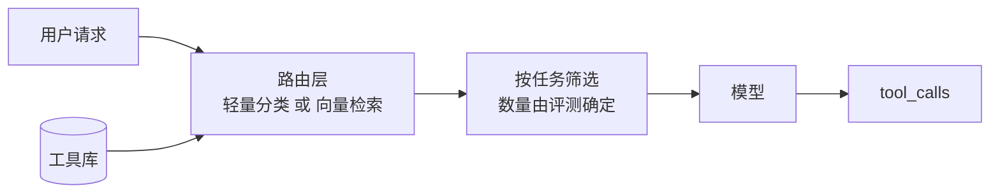

# 第三章：工具定义与 Schema 工程

## 3.1 为什么值得单独开一章

[第一章](01-function-calling.md) 说明了工具名、描述、Schema 与上下文共同影响模型选择。工具定义还影响：

- 模型选错工具的概率；
- 参数填错的概率；
- 每次请求固定消耗多少 token；
- 出错时模型能不能自己恢复；
- 上下文被工具结果撑爆的速度。

一个反直觉的经验是：**很多被归因为「模型不行」的问题，根源是工具定义写得不行**。换更强的模型能盖住一部分，但成本高得多，而且盖不住全部。

> **工具定义是 Prompt 的一部分，应该按 Prompt 的标准去设计、评测和迭代。**

## 3.2 工具描述的写法

### 3.2.1 写清楚能力边界，而不只是能力

描述应同时说明能力、返回内容、输入前提和不支持的范围。下面展示预期的路由差异，不是对模型行为的保证。

| 写法 | 模型行为 |
|---|---|
| `"查询订单信息"` | 用户问「我上个月的订单」也调，拿回单条数据后编造月度汇总 |
| `"根据订单号查询单个订单的详情。不支持按时间范围、用户 ID 或状态批量查询。"` | 模型识别边界，转而去找批量查询工具或向用户要订单号 |

描述通常可以按这个顺序写：

```
<这个工具做什么>。<返回什么内容>。<明确不支持什么>。<什么情况下应该改用其他工具>。
```

最后一句尤其有用。当工具库里有多个相近工具时，在描述里直接写「如果需要模糊搜索，请改用 `search_orders`」，比指望模型自己悟出区别可靠得多。

### 3.2.2 用工具名承载语义

模型看到的第一个信号是工具名。命名混乱时，再好的描述也救不回来：

```python
# 差：名字看不出区别，模型只能靠 description 猜
query_1, query_2, do_search

# 好：动词 + 对象 + 限定，名字本身就在分流
get_order_by_id
search_orders_by_date_range
cancel_order
```

命名约定尽量在整个工具库里保持一致：`get_*` 是按主键精确取，`search_*` 是模糊查多条，`list_*` 是无条件枚举，`create_/update_/delete_*` 是有副作用的写操作。这套一致性本身就是给模型的隐式提示。

### 3.2.3 在描述里给出使用示例

对语义复杂的工具，直接在 `description` 里塞一两个调用示例，效果往往比反复措辞更好：

```python
"description": (
    "执行 SQL 查询并返回结果。只支持 SELECT，不支持写操作。\n"
    "示例：查询昨天订单数 -> "
    "SELECT COUNT(*) FROM orders WHERE created_at >= CURRENT_DATE - 1 "
    "AND created_at < CURRENT_DATE"
)
```

它相当于把 few-shot 示例塞进了工具定义里。代价是 token，收益是参数准确率，值不值得取决于这个工具被调用的频率和出错的成本。

上例采用 PostgreSQL 日期语法，以数据库会话时区为准，并假定已限制为当前租户。描述中的“只支持 SELECT”不是安全措施：还需只读凭据、查询限制和对象级权限，不能只靠关键字过滤 SQL。

## 3.3 参数设计

### 3.3.1 扁平优于嵌套

不必要的深层嵌套会增加填写与验证复杂度。若扁平字段能清楚表达语义，可优先采用；错误率是否更低仍需目标模型评测：

```python
# 差：三层嵌套
{"filter": {"conditions": {"date": {"gte": "2026-01-01"}}}}

# 好：扁平
{"start_date": "2026-01-01", "end_date": "2026-01-31"}
```

如果内部接口确实需要复杂结构，正确做法是**在宿主侧做转换**，而不是把复杂度暴露给模型。工具 Schema 是给模型看的接口，不是内部数据结构的镜像。

### 3.3.2 能用 enum 就不用自由文本

```python
# 差：模型可能填 "已完成"、"completed"、"DONE"、"finish"
"status": {"type": "string", "description": "订单状态"}

# 好
"status": {"type": "string", "enum": ["pending", "paid", "shipped", "completed", "cancelled"]}
```

支持 strict 或结构化输出的运行时可利用 Schema 做约束解码；仅提供 `enum` 不代表该路径已启用。即使格式有效，`cancelled` 与 `completed` 仍可能被选错，业务状态需单独校验。

### 3.3.3 required 要诚实

一般 JSON Schema 用 `required` 区分必需字段；OpenAI strict 模式则要求所有 `properties` 都列入 `required`，业务可选字段用可空类型表达。信息不足时应先澄清，不能用“格式必填”迫使模型猜测业务值。

非 strict 示例可在描述中说明缺省行为，但实际默认值和范围由服务端实现：

```python
"limit": {"type": "integer", "description": "返回条数，默认 20，最大 100"}
```

#### strict 的具体约束

以 [OpenAI Function Calling 指南](https://developers.openai.com/api/docs/guides/function-calling)为准（2026-09-08 核查）：

- 显式设 `strict: true`；每层 object 都设置 `additionalProperties: false`，每个属性都在 `required` 中。
- 可选值可写成 `{"type":["string","null"],"enum":["paid","shipped",null]}`；`enum` 也必须允许 `null`。字段出现但值为空，与字段缺失不是一回事。
- 只支持 JSON Schema 子集，拒绝、输出截断和 API 错误也必须处理。Schema 校验不能替代授权、日期先后关系、余额或对象归属检查。
- 省略 `strict` 时，Chat Completions 默认非严格；Responses 尝试归一化为严格模式，不兼容时可能回退为 best effort。依赖稳定行为应显式指定，而不是赌默认值。
- 流式参数需要按调用 ID 聚合至完成后再解析、校验和执行；收到半段合法 JSON 也不能提前触发写操作。

### 3.3.4 日期与时间是重灾区

模型没有可靠的「今天是几号」的概念。两种解法：

- **在 System Prompt 里注入当前时间**，让模型自己算；
- **提供相对时间参数**，如 `{"period": {"enum": ["today", "last_7_days", "this_month"]}}`，把日期计算收回到代码里。

第二种更稳，尤其是涉及时区和月末边界的场景。

## 3.4 工具返回值的设计

工具的**输出**同样重要，但经常被忽略——它直接决定了上下文消耗和模型的下一步判断。

### 3.4.1 返回值也是给模型看的

```python
# 差：把 ORM 对象整个序列化，30 个字段模型只用得到 3 个
{"id": 1, "uuid": "...", "created_at": "...", "updated_at": "...",
 "deleted_at": None, "tenant_id": 7, "shard_key": "..."}

# 好：只返回模型需要的
{"order_id": "A1001", "status": "shipped", "total": 299.0,
 "eta": "2026-09-02"}
```

宿主决定哪些返回值进入模型上下文。若持续回传历史，冗余内容会反复作为输入；但单轮上下文长度与多轮累计输入计费不是同一件事，字节数也不是 token 数。可用分页、摘要、资源引用和缓存降低开销，同时保留完整结果的可追溯位置。

### 3.4.2 大结果要截断并告知

返回 500 条记录不如返回前 20 条加一句提示：

```python
{"items": [...20 条...],
 "total": 517,
 "note": "结果过多，仅返回前 20 条。请缩小时间范围或增加筛选条件后重试。"}
```

关键是那句 `note`。它不只是截断，而是**告诉模型该怎么办**。没有它，模型会以为总共就 20 条，直接基于不完整数据下结论。

### 3.4.3 错误必须结构化

```python
# 差：抛异常中断整个流程
raise ValueError("city not found")

# 好：以工具结果的形式回填
{"error": "city_not_found",
 "message": "未找到城市「广洲」",
 "hint": "可能的正确拼写：广州。请确认后重试。"}
```

结构化错误让模型有机会自己纠正重试。直接抛异常等于放弃了模型的自我修复能力。`hint` 字段是关键——它把「出错了」变成了「出错了，这样改」。

设定**重试次数与总时间预算**，检测重复参数错误。鉴权或策略拒绝通常应停止，网络超时需区分未提交、已提交和结果未知；写操作只有具备幂等或可核对状态时才可自动重试。

## 3.5 工具数量与上下文成本

### 3.5.1 工具发现、模型可见性与计费分开算

在每轮全量传入工具定义的实现里，Schema 会占用上下文并计入输入。下面是假设每个定义平均 150 token 的算术例子，不是实测，也不代表所有 API 必须如此：

| 工具数 | 平均每个 Schema | 每次请求的固定开销 |
|---|---|---|
| 5 | 150 token | 750 token |
| 30 | 150 token | 4,500 token |
| 100 | 150 token | 15,000 token |

此假设下 100 个工具每轮增加 15,000 输入 token，十轮累计 150,000；单轮窗口并未因此变成 150,000。前缀缓存可能降低输入费用或预填充开销，工具搜索/延迟加载则改变实际注入数量。

### 3.5.2 工具变多，准确率会下降

除了成本，选择准确率也会掉。功能相近的工具（`search_docs` vs `search_wiki` vs `search_kb`）尤其容易混淆。

主流解法是**动态工具筛选**：



路由可用规则、检索或模型。图中候选数只是示意；先做权限过滤，再评测召回漏失与额外时延。检索把必要工具漏掉时，再强的主模型也无法调用它。

### 3.5.3 把工具定义放在 Prompt 最前面

工具 Schema 常是多轮对话中较稳定的部分。将稳定内容放在前面可提高支持前缀缓存的提供方/运行时的命中机会，但是否命中、计费和 TTL 以具体服务为准。

原则是尽量稳定可缓存前缀；工具与消息的底层序列化顺序由提供方控制，不是手动调整字段顺序即可改变。详见 [KV Cache 与 Prompt Caching](../../llm/03-inference-serving/14-kv-cache.md)。

## 3.6 工具粒度：粗一点还是细一点

这是设计工具库时的核心取舍。

| | 细粒度 | 粗粒度 |
|---|---|---|
| 例子 | `get_user`、`get_orders`、`get_address` 三个工具 | `get_user_profile` 一个工具返回全部 |
| 灵活性 | 高，模型可自由组合 | 低 |
| 调用轮次 | 多，延迟高 | 少 |
| 出错风险 | 多步选择与组合可能出错 | 少轮次，但参数、结果或业务事务可能更复杂 |
| 上下文消耗 | 多轮累积 | 可能少轮次，也可能返回大量无关数据 |

实践中的判断标准是：**看这几个操作是不是几乎总是一起出现**。如果模型每次查用户都要接着查订单和地址，那就该合并成一个工具；如果三者独立使用的场景各占三分之一，就该拆开。

一个常见的错误是把内部微服务的接口边界直接照搬成工具边界。内部服务的拆分依据是团队职责和数据归属，跟「模型该怎么用」没有关系。

## 3.7 一个完整的工具定义模板

下面使用 Chat Completions 的函数包装格式，显式关闭 strict 以演示可省略字段。迁移到 Responses 需调整外层字段；启用 strict 需按 3.3.3 改写可空参数。

```python
{
    "type": "function",
    "function": {
        "name": "search_orders",                      # 动词_对象，语义自解释
        "strict": False,
        "description": (
            "按时间范围和状态搜索订单，返回订单摘要列表。"      # 做什么
            "每条包含订单号、状态、金额、下单时间。"            # 返回什么
            "最多返回 50 条，超出时需要缩小范围。"              # 限制
            "不支持按商品名搜索；若需按订单号精确查询，"        # 边界
            "请改用 get_order_by_id。"                       # 替代方案
        ),
        "parameters": {
            "type": "object",
            "properties": {
                "start_date": {
                    "type": "string",
                    "description": "起始日期，格式 YYYY-MM-DD，如 2026-08-01"
                },
                "end_date": {
                    "type": "string",
                    "description": "结束日期，格式 YYYY-MM-DD，含当天"
                },
                "status": {
                    "type": "string",
                    "enum": ["pending", "paid", "shipped", "completed", "cancelled"],
                    "description": "订单状态筛选，不传则返回所有状态"
                },
                "limit": {
                    "type": "integer",
                    "minimum": 1,
                    "maximum": 50,
                    "description": "返回条数，默认 20，最大 50"
                }
            },
            "required": ["start_date", "end_date"],
            "additionalProperties": False
        }
    }
}
```

## 3.8 工具定义要做回归测试

工具描述改一个字，模型行为就可能变。这意味着它需要和代码一样被测试。

最简单的落地方式，是维护一套用例集：

| 用例 | 期望行为 |
|---|---|
| 「查一下 A1001 这个订单」 | 调 `get_order_by_id`，不调 `search_orders` |
| 「我这个月的订单有哪些」 | 调 `search_orders`，日期范围正确 |
| 「1+1 等于几」 | **不调任何工具** |
| 「帮我把订单 A1001 取消」 | 调 `cancel_order`，且触发人工确认 |

第三行是必须有的。没有「不该调工具」的用例，你测不出过度调用。

改工具描述、加新工具、换模型这三种情况下都应该重跑这套用例。尤其是**加新工具**——一个新工具的描述可能意外地和已有工具重叠，导致原本正确的路由开始出错，而你不会在任何地方看到报错。

## 3.9 常见错误

### 3.9.1 把内部 API 文档直接当 description

内部文档面向的是知道上下文的工程师，模型没有这些上下文。术语、缩写、隐含约定都要展开写。

### 3.9.2 只写能力不写边界

不写「不支持什么」，模型会在能力边界外硬调，然后基于错误数据编造答案。

### 3.9.3 把 ORM 对象整个返回给模型

冗余字段会持续占用上下文并被重复计费。返回值应该按「模型需要什么」裁剪，而不是按「数据库里有什么」。

### 3.9.4 大结果只截断不提示

模型可能误把前 20 条当全部。返回 `has_more`、分页游标或明确截断说明；只有实际可计算总数时才返回 `total`，不要编造计数。

### 3.9.5 用异常代替结构化错误

抛异常中断流程，等于放弃模型的自我纠错能力。但也要记得设重试上限，防止死循环。

### 3.9.6 注册几十个工具不做筛选

工具多时评估动态筛选或延迟加载。OpenAI 文档建议初始可用工具少于 20 个，但明确是软建议，不是协议上限或性能拐点。

### 3.9.7 改了工具描述不回归

这是最隐蔽的一类。工具描述的改动不会触发任何编译错误或类型检查，问题只会在线上以「模型偶尔选错工具」的形式出现。

## 3.10 本章总结

1. **工具定义是 Prompt 的一部分**，很多「模型不行」的问题实际是工具定义不行；
2. **描述要写清能力、边界和替代方案**，通过正反例检验是否改善选择；
3. **减少无意义嵌套，有限取值用 enum**；strict 要求属性全部 required，业务可选项用 nullable；
4. **返回值按模型需求裁剪**，大结果要截断并给出处理建议；
5. **错误必须结构化并带 hint**，同时设重试上限防死循环；
6. **区分工具发现与注入**，按实际 token、缓存和路由召回评估成本；
7. **工具粒度按「是否总是一起用」判断**，不要照搬内部微服务边界；
8. **工具定义需要回归测试**，用例集里必须包含「不该调工具」的场景。


## 参考资料

- [Anthropic: Writing Effective Tools for Agents](https://www.anthropic.com/engineering/writing-tools-for-agents)
- [Anthropic: Building Effective Agents](https://www.anthropic.com/engineering/building-effective-agents)
- [OpenAI: Function Calling 指南](https://developers.openai.com/api/docs/guides/function-calling)
- [OpenAI: Structured Outputs 支持的 Schema](https://developers.openai.com/api/docs/guides/structured-outputs)
- [JSON Schema 规范](https://json-schema.org/)
- [Berkeley Function Calling Leaderboard](https://gorilla.cs.berkeley.edu/leaderboard.html)
