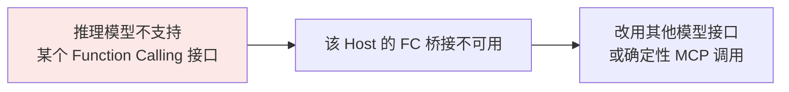
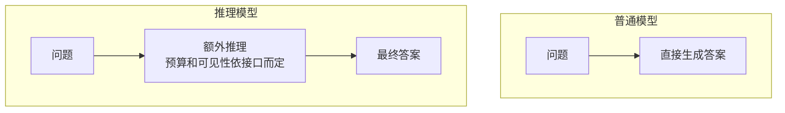

# 第七章：为什么有些推理模型不支持 MCP

## 7.1 问题的传导链

先把这条传导链拆开看：

[第六章](../02-mcp/06-mcp-vs-function-calling.md) 讲过，很多 Host 会把 Server 的工具定义转换成模型原生的 Function Calling 格式。这条**模型驱动**的桥接路径依赖模型接口；若该接口不可用，Host 可以改用结构化输出、规则工作流或人工触发 `tools/call`。MCP 本身并未要求模型具备 Function Calling。

需要核查的是：**哪个模型快照、哪个 API、哪个 Host 适配器不支持什么能力**。厂商未公开的实现原因，不能用“推理架构冲突”自行补全。

## 7.2 推理模型特殊在哪

部分模型提供显式的 reasoning/thinking 模式，在最终输出前或工具调用之间进行额外推理。内部推理、公开思考文本和 API 返回的摘要不是同一物；也不能据此认为普通模型“完全没有推理”。

工具返回值是后续输入的一部分。关键工程问题是如何保留模型 API 要求的历史项和关联标识，而非保证某块 GPU 显存一直不释放。

## 7.3 工具往返中的状态保存

工具调用天然是多轮的：

1. 模型生成调用请求；
2. **停下来**，等宿主程序执行；
3. 拿到结果；
4. 继续生成。

第二步意味着一次推理请求可能结束，待工具执行后再发下一次请求。普通模型和推理模型都需要正确回填历史；推理模型还可能要求保留 reasoning 项、签名块或不透明状态。

OpenAI Responses 指南要求将工具调用响应中的 reasoning 项与调用输出一起传回。可以使用服务端响应链，或按接口要求完整管理 `response.output`；不能只拷贝最终文本或自行改写不透明项。

### 7.3.1 对话状态不等于 KV Cache

KV Cache 是已处理 token 的 key/value 张量缓存，是推理优化，不是完整的业务会话记录。

运行时可选择保留、卸载或淘汰缓存，也可从历史重新预填充：

| 代价 | 说明 |
|---|---|
| 保留缓存 | 减少后续预填充，但占内存，需考虑并发和工具等待时间 |
| 卸载或淘汰 | 释放显存，但有搬运或重新计算开销 |
| API 状态管理 | 保存完整调用链及提供方要求的 reasoning 项，不应依赖请求命中同一 GPU |

追加工具结果不会自动使历史前缀的 KV 失效；修改前缀才会影响相应缓存。模型能否修正早先假设是训练与上下文使用问题。不能无条件断言“必须占住显存”或“吞吐减半”。

## 7.4 训练与接口支持并非必然冲突

推理与工具调用可在同一任务轨迹里训练。要解决的是调用格式、工具选择、恢复和奖励设计，而不是两个目标天生相反。

| 问题 | 可以检查什么 |
|---|---|
| 调用格式错误 | 模板、解析器、Schema 支持和训练轨迹 |
| 过早猜测工具结果 | 是否覆盖先调用后推理的轨迹，是否奖励真实执行结果 |
| 工具返回后重复调用 | 历史项是否完整、关联 ID 是否正确、结果是否被截断 |

ReTool 等论文研究将执行反馈纳入推理训练，但论文的特定实验不能用来解释所有闭源模型的上线顺序。早期产品缺少工具 API 是可核查的能力限制；厂商为什么当时未发布，则需要独立证据。

## 7.5 历史事实：哪些模型确实不支持

| 模型 | 时间 | 工具调用支持 |
|---|---|---|
| OpenAI o1-preview 初期 API | 2024 年 9 月 | 早期工具/结构化接口能力有限；官方早期 Cookbook 明确当时不支持 Structured Outputs |
| OpenAI o1 正式版 API | 快照 `o1-2024-12-17` | 当前模型页明确列出 Function Calling 支持 |
| DeepSeek-R1 | 2025 年 1 月 | 开源权重论文不等于所有托管接口的支持声明，应查具体 API 版本 |
| 后续推理模型/思考模式 | 按模型与接口 | 已有工具调用实现；并行、strict、思考回传要求不同 |

应区分预览期、正式模型与今天的 API 页面。当前 o1-preview 模型页和早期教程的能力表述并不完全一致，本章不据动态页面倒推 2024 年的全部限制；历史例子只用来说明“模型名相似不代表接口相同”。Structured Outputs 的历史缺失也不能单独证明 Function Calling 缺失。

## 7.6 后来是怎么解决的

### 7.6.1 方案一：思考结束后再调工具

一种常见折中是：**让工具调用发生在思考阶段完全结束之后**。

这是一个应用流程选择，不是保证推理质量的通用方案。

调用前的推理当然看不到尚未取得的结果，但结果返回后可以再次推理；只有应用主动禁止后续推理时，才退化成简单总结。

需要外部数据的任务应先获取证据，再做依赖该证据的推理，避免把查询前的假设直接当成最终结论。

### 7.6.2 方案二：交错思考

Anthropic 的 [Claude 4 发布说明](https://www.anthropic.com/news/claude-4)明确描述了思考与工具交替的能力，当时以 beta 发布。相较之下，早期 Claude 3.7 官方 Cookbook 的工具示例注明同一工具结果轮次不再输出新的 thinking 块；不能把旧示例当作当前所有模型的行为。

这在很大程度上缓解了「思考阶段感知不到工具结果」的局限——模型可以边查边想。

代价包括多轮推理、外部 I/O 和状态保存，但总成本不一定更高：更合理的规划也可能减少无用调用。具体 thinking 块的保留、签名与 token 计费规则以模型 API 为准。

### 7.6.3 方案三：把工具调用训进推理链

2025 年之后更彻底的做法，是在训练阶段就把工具调用作为推理链的**一部分**来训。

思路是：让模型在长思维链的中途插入工具调用，用工具结果继续推理，整条轨迹用**可验证奖励**（最终答案对不对、工具调用成不成功）来做强化学习。ReTool、ToolRL 这类工作走的就是这条路。

这把工具调用作为策略可选动作，用任务奖励优化何时调用、用多少次、如何利用结果；奖励是否充分仍须验证，见[第二章](02-tool-learning.md)。

公开研究说明两类能力可以结合，不构成对各家训练流程的统一结论。

## 7.7 现在还需要关心这个问题吗

仍需核查实际接口。例如本次查到的 OpenAI 指南明确 GPT-6 Astra 的工具调用要求 Responses，不能因为模型能调工具就假定 Chat Completions 路径也可用。更持久的检查项有三类：

**第一，分解成本**。测量推理 token、工具等待、缓存命中、总轮数和最终任务成功率；不要只比较单次调用价格或给出没有工作负载的倍数。

**第二，支持程度有差异**。「支持工具调用」是个粗粒度的描述。实际要看：

| 能力 | 说明 |
|---|---|
| 是否支持并行调用 | 有些推理模型只能串行 |
| 是否支持交错思考 | 决定了能不能「边查边想」 |
| 思考内容是否可见 | 有些厂商只返回摘要，影响调试和审计 |
| 多轮工具调用后思考是否连贯 | 长任务里差异明显 |

**第三，选型判断**。不是所有 Agent 任务都该用推理模型。判断标准是：

- 任务的难点在**规划和推理**（复杂问题分解、多步逻辑）→ 推理模型收益大；
- 任务的难点在**执行和调度**（调很多工具、流程清晰）→ 普通模型加显式的 Agent 框架更划算。

这两类都需要实测，不能只按模型名称推定性价比。

## 7.8 常见错误

### 7.8.1 把模型接口限制说成「不支持 MCP」

要说清楚：某些 Host 的模型驱动桥接依赖 FC；模型不支持该接口时，这条桥接不可用。直接说「模型不支持 MCP」混淆了模型 API 与 MCP Host—Server 协议。

### 7.8.2 用未证实的架构原因解释产品限制

“必须保留 GPU KV Cache”“推理目标与工具目标相反”都不是工具调用缺失的必然原因。先给出模型快照、接口文档和可复现请求，再分析适配器与运行时。

### 7.8.3 混淆 o1-preview 和 o1 正式版

应标注具体快照、接口和资料日期。当前 o1 正式版支持工具调用，不能从预览期教程推导整个 o1 系列“不支持”。

### 7.8.4 认为现在还普遍不支持

不能把 o1-preview 的历史限制推广到当前模型，也不能把某个接口支持推广到同模型的全部端点。

### 7.8.5 不知道折中方案的代价

工具返回后只做文字总结、还是继续推理，是流程与模型能力共同决定的。核查结果回填、reasoning 项保留、最大轮数以及用户取消如何传到实际执行层。

### 7.8.6 不评测就启用推理模式

流程明确的任务可先比较普通模型加确定性调度，复杂规划任务再比较推理模式；用成功率、费用和尾延迟共同决策。

## 7.9 本章总结

1. **传导链只适用于 FC 桥接**：模型接口不可用会影响该 Host 的模型驱动调用，不会使 MCP 协议本身失效；
2. **保留 API 要求的推理状态**，不要只回填最终文本；
3. **KV Cache 是可重建的推理缓存**，不等于业务会话或必须常驻显存的思考；
4. **历史限制按模型快照和端点陈述**，不臆测未公开的产品实现原因；
5. **工具结果返回后可以继续推理**，单次思考后调用只是流程选择；
6. **交错思考支持多次取证与推理**，保留要求由具体 API 定义；
7. **联合训练是一条公开研究路线**，不能推广成所有模型的配方；
8. **现在的实际关注点**是成本、支持粒度和选型，而不是「支不支持」。

## 参考资料

- [OpenAI: Reasoning Models 指南](https://developers.openai.com/api/docs/guides/reasoning)
- [OpenAI: Function Calling 与 reasoning 项回传](https://developers.openai.com/api/docs/guides/function-calling)
- [OpenAI: o1-preview 模型页](https://developers.openai.com/api/docs/models/o1-preview)
- [OpenAI: o1 模型与快照](https://developers.openai.com/api/docs/models/o1)
- [OpenAI Cookbook：o1-preview 初期结构化输出限制](https://github.com/openai/openai-cookbook/blob/main/examples/o1/Using_chained_calls_for_o1_structured_outputs.ipynb)
- [Anthropic：Claude 4 交错工具使用发布说明](https://www.anthropic.com/news/claude-4)
- [Anthropic Cookbook：早期 Claude 3.7 thinking 块保留示例](https://github.com/anthropics/anthropic-cookbook/blob/main/extended_thinking/extended_thinking_with_tool_use.ipynb)
- [Anthropic: Extended Thinking](https://docs.claude.com/en/docs/build-with-claude/extended-thinking)
- [DeepSeek-R1: Incentivizing Reasoning Capability in LLMs via Reinforcement Learning](https://arxiv.org/abs/2501.12948)
- [ReTool: Reinforcement Learning for Strategic Tool Use in LLMs](https://arxiv.org/abs/2504.11536)
- [ToolRL: Reward is All Tool Learning Needs](https://arxiv.org/abs/2504.13958)
- [Efficient Memory Management for Large Language Model Serving with PagedAttention](https://arxiv.org/abs/2309.06180)
