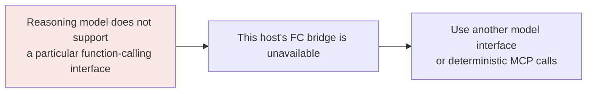
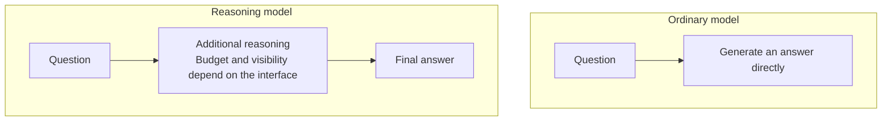

# Chapter 7: Why Some Reasoning Models Seem Not to Support MCP

## 7.1 Tracing the dependency

First, separate the links in the chain:

As [Chapter 6](../02-mcp/06-mcp-vs-function-calling.md) explains, many hosts convert a server's tool definitions into the model's native function-calling format. This **model-driven** bridge depends on the model interface. If that interface is unavailable, the host can instead use structured output, a rule-based workflow, or a human-triggered `tools/call`. MCP itself does not require a model with function calling.

Ask precisely **which model snapshot, API, and host adapter lack which capability**. Do not fill gaps in a provider's unpublished implementation details with an assumed "conflict in the reasoning architecture."

## 7.2 What is different about reasoning models?

Some models offer an explicit reasoning/thinking mode that performs additional reasoning before a final answer or between tool calls. Internal reasoning, publicly visible thinking text, and API-returned summaries are different things. Their existence does not imply that ordinary models do no reasoning at all.

Tool results become part of subsequent input. The central engineering issue is preserving the history items and correlation identifiers required by the model API, not keeping a particular allocation of GPU memory alive indefinitely.

## 7.3 Preserving state across tool round trips

Tool calling naturally spans multiple turns:

1. The model generates a call request.
2. It **pauses** while the host executes the call.
3. It receives the result.
4. It continues generating.

At the second step, one inference request may finish, with another submitted after tool execution. Both ordinary and reasoning models need correctly reconstructed history. Reasoning models may additionally require reasoning items, signed blocks, or opaque state.

OpenAI's Responses guidance requires reasoning items from tool-calling responses to be carried forward along with tool outputs. Use a server-side response chain or manage the complete `response.output` as required by the interface. Do not copy only the final text or rewrite opaque items yourself.

### 7.3.1 Conversation state is not a KV cache

A KV cache stores key/value tensors for tokens already processed. It is an inference optimization, not a complete business-session record.

A runtime may retain, offload, or evict the cache, or rebuild it by prefilling from history:

| Choice | Implication |
|---|---|
| Retain the cache | Reduces later prefill work but occupies memory; account for concurrency and time spent waiting for tools |
| Offload or evict | Frees GPU memory but incurs transfer or recomputation overhead |
| Manage API state | Preserve the complete call chain and required reasoning items; do not depend on the next request reaching the same GPU |

Appending a tool result does not automatically invalidate the historical prefix's KV cache. Modifying that prefix affects the corresponding cached entries. Whether the model can revise an earlier assumption is a question of training and context use. Claims that tool calls "must hold GPU memory" or "halve throughput" are not universally valid.

## 7.4 Training and interface support are not inherently in conflict

Reasoning and tool use can be trained within the same task trajectory. The challenges are call formatting, tool selection, recovery, and reward design—not intrinsically opposing objectives.

| Problem | What to inspect |
|---|---|
| Incorrect call format | Templates, parsers, schema support, and training trajectories |
| Guessing a tool result before execution | Coverage of call-then-reason trajectories and whether rewards depend on actual execution results |
| Repeating a call after its result arrives | Complete history, correct correlation IDs, and whether the result was truncated |

Work such as ReTool studies how execution feedback can be incorporated into reasoning training. Its particular experiments do not explain every closed model's release sequence. A missing tool API in an early product is a verifiable capability limitation; why the provider had not released it at that time requires separate evidence.

## 7.5 How should historical interface limits be described?

| Model | Time | Tool-calling support |
|---|---|---|
| Early OpenAI o1-preview API | September 2024 | Early tool/structured interfaces were limited; the early official Cookbook explicitly said Structured Outputs was unsupported at that time |
| Released OpenAI o1 API | Snapshot `o1-2024-12-17` | The current model page explicitly lists function-calling support |
| DeepSeek-R1 | January 2025 | The open-weights paper is not a support statement for every hosted interface; check the specific API version |
| Later reasoning models / thinking modes | Model- and interface-specific | Tool-calling implementations exist; parallelism, strict mode, and thinking-state round-trip requirements differ |

Distinguish preview releases, released models, and today's API pages. The current o1-preview page and early tutorials do not describe capabilities in exactly the same way. This chapter does not infer every 2024 limitation from a changing page. The historical examples illustrate only that similar model names do not imply identical interfaces. Historical absence of Structured Outputs alone also does not prove absence of function calling.

## 7.6 How have systems addressed this?

### 7.6.1 Approach one: call tools after thinking finishes

One common compromise is to **issue tool calls only after the thinking phase has finished**.

This is an application-flow choice, not a general guarantee of reasoning quality.

Reasoning before a call cannot see results that have not yet been retrieved, but reasoning can resume after those results arrive. The process becomes a simple summary only if the application actively prevents further reasoning.

Tasks requiring external data should obtain evidence before performing reasoning that depends on it, rather than treating assumptions made before the query as final conclusions.

### 7.6.2 Approach two: interleaved thinking

Anthropic's [Claude 4 announcement](https://www.anthropic.com/news/claude-4) explicitly describes alternating thinking and tool use, introduced in beta at the time. By contrast, the early official Claude 3.7 Cookbook tool example states that no new thinking block appears in the same tool-result round. That old example must not be treated as the behavior of every current model.

This substantially reduces the limitation of a thinking phase that cannot access tool results: the model can retrieve evidence and reason about it in alternation.

Costs include repeated reasoning, external I/O, and state preservation, but total cost need not increase. Better planning may eliminate unnecessary calls. Rules for retaining thinking blocks, signatures, and token billing depend on the specific model API.

### 7.6.3 Approach three: train tool use into reasoning trajectories

Another approach makes tool interaction part of the reasoning trajectory during training, rather than arranging calls only at the application layer.

For example, ReTool lets a model execute code during reasoning and use the results to continue reasoning and learning. ToolRL investigates fine-grained rewards for tool selection, arguments, and related aspects. They should not be described as the same training environment. Final-answer rewards, call-format rewards, and validation of actual business state are also distinct.

Tool invocation becomes an action available to the policy. Task rewards can optimize when to call, how often to call, and how to use results. Whether the reward is sufficient still needs validation; see [Chapter 2](02-tool-learning.md).

Public research shows that these capabilities can be combined, not that every provider follows the same training process.

## 7.7 Does this issue still matter?

You still need to verify the actual interface. For example, OpenAI's guidance specifies Responses for GPT-6 Astra tool calling. A model's ability to use tools does not imply that its Chat Completions path supports them. Three longer-lived concerns remain:

**First, break down the cost.** Measure reasoning tokens, tool wait time, cache hits, total turns, and final task success. Do not compare only per-call prices or quote cost multipliers without a defined workload.

**Second, support varies in detail.** "Supports tool calling" is a coarse description. Examine:

| Capability | Why it matters |
|---|---|
| Parallel calls | Some reasoning models support only sequential calls |
| Interleaved thinking | Determines whether the model can alternate retrieval and reasoning |
| Visibility of thinking | Some providers return only summaries, affecting debugging and auditing |
| Reasoning continuity after multiple tool rounds | Differences become pronounced on long tasks |

**Third, choose the model for the task.** Not every agent task needs a reasoning model:

- If the difficulty lies in **planning and reasoning**—complex decomposition or multi-step logic—a reasoning model can provide substantial benefit.
- If the difficulty lies in **execution and scheduling**—many tools but a clear workflow—an ordinary model with an explicit agent framework can be more economical.

Measure both options. A model name alone does not establish cost-effectiveness.

## 7.8 Common mistakes

### 7.8.1 Calling a model-interface limitation "no MCP support"

Be precise: some hosts' model-driven bridges depend on function calling, and that bridge is unavailable if the model lacks the required interface. Saying simply that "the model does not support MCP" confuses the model API with the MCP host–server protocol.

### 7.8.2 Explaining product limits with unverified architectural claims

Neither "GPU KV cache must be retained" nor "reasoning and tool objectives oppose each other" is a necessary explanation for missing tool support. Establish the model snapshot, interface documentation, and a reproducible request before analyzing adapters and runtimes.

### 7.8.3 Confusing o1-preview with the released o1 model

State the exact snapshot, interface, and source date. The released o1 model supports tool calling; preview-era tutorials cannot establish that the whole o1 family does not.

### 7.8.4 Assuming tool use is still generally unsupported

Do not generalize o1-preview's historical limitations to current models, or support on one interface to every endpoint for the same model.

### 7.8.5 Ignoring the cost of a compromise

Whether the model merely summarizes after a tool returns or continues reasoning depends on both the flow and model capabilities. Check result submission, preservation of reasoning items, maximum turns, and how user cancellation reaches the actual execution layer.

### 7.8.6 Enabling reasoning mode without evaluation

For clearly defined workflows, first compare an ordinary model with deterministic scheduling; for complex planning, compare reasoning mode. Decide using success rate, cost, and tail latency together.

## 7.9 Chapter summary

1. **The dependency chain applies only to an FC bridge.** An unavailable model interface can break that host's model-driven calls without invalidating MCP itself.
2. **Preserve the reasoning state required by the API**, not just the final text.
3. **A KV cache is a reconstructible inference cache**, not a business session or reasoning that must stay in GPU memory.
4. **State historical limits by model snapshot and endpoint**, without inventing unpublished implementation reasons.
5. **Reasoning can continue after tool results arrive**; thinking once before calling is only a workflow choice.
6. **Interleaved thinking supports repeated evidence gathering and reasoning**, with preservation rules defined by each API.
7. **Joint training is a public research direction**, not a universal model-training recipe.
8. **Today's practical concerns** are cost, the details of support, and model selection—not a single yes-or-no label.

## References

- [OpenAI: Reasoning Models guide](https://developers.openai.com/api/docs/guides/reasoning)
- [OpenAI: Function Calling and returning reasoning items](https://developers.openai.com/api/docs/guides/function-calling)
- [OpenAI: o1-preview model page](https://developers.openai.com/api/docs/models/o1-preview)
- [OpenAI: o1 model and snapshots](https://developers.openai.com/api/docs/models/o1)
- [OpenAI Cookbook: Early o1-preview limitations on structured outputs](https://github.com/openai/openai-cookbook/blob/main/examples/o1/Using_chained_calls_for_o1_structured_outputs.ipynb)
- [Anthropic: Claude 4 announcement of interleaved tool use](https://www.anthropic.com/news/claude-4)
- [Anthropic Cookbook: Early Claude 3.7 example of thinking-block preservation](https://github.com/anthropics/anthropic-cookbook/blob/main/extended_thinking/extended_thinking_with_tool_use.ipynb)
- [Anthropic: Extended Thinking](https://docs.claude.com/en/docs/build-with-claude/extended-thinking)
- [DeepSeek-R1: Incentivizing Reasoning Capability in LLMs via Reinforcement Learning](https://arxiv.org/abs/2501.12948)
- [ReTool: Reinforcement Learning for Strategic Tool Use in LLMs](https://arxiv.org/abs/2504.11536)
- [ToolRL: Reward is All Tool Learning Needs](https://arxiv.org/abs/2504.13958)
- [Efficient Memory Management for Large Language Model Serving with PagedAttention](https://arxiv.org/abs/2309.06180)
