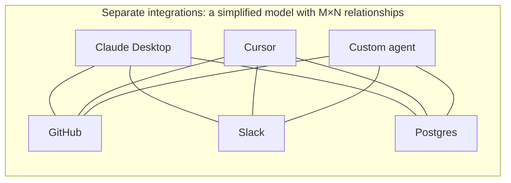
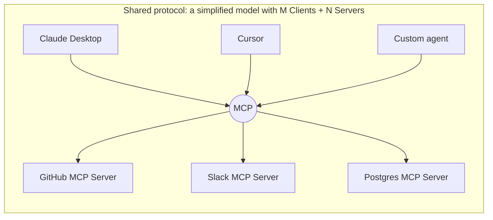
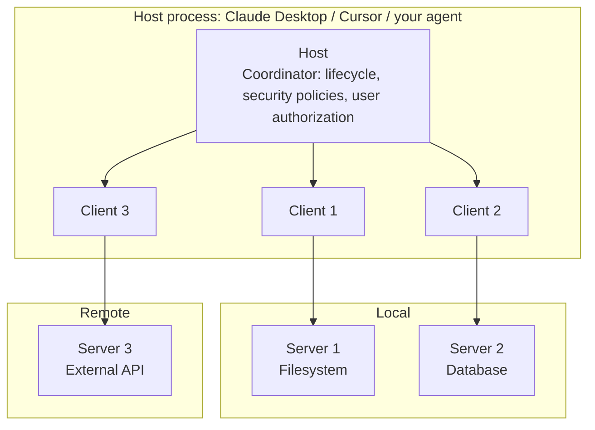

# Chapter 4: The Core of the Model Context Protocol

## 4.1 MCP does not solve the same problem as function calling

Start by separating MCP from function calling.

[Function calling](../01-function-calling/01-function-calling.md) answers **how a model expresses its intent to call a tool**. It is a model-level output-format convention.

MCP addresses a different set of questions:

- **Where are the tools?** How can an application discover them rather than hard-code them?
- **How are tools provided across processes?** Can they run on another machine?
- Can **different AI applications reuse the same tool**?
- When a tool changes, **must every consuming application change its code**?

The boundary is:

> **Function calling is a common model–application interface; MCP is an open Host/Client–Server protocol. They can work together in one application, but MCP neither specifies nor necessarily depends on a particular model provider's function-calling interface.**

## 4.2 The M×N cost model of repeated integration

Suppose you want to connect GitHub to an AI application. You write the GitHub API calls, handle OAuth authentication, map response formats into schemas the model can understand, and implement error handling. Once that works, three things happen:

1. **The same application needs a second tool.** Slack has different authentication, response formats, and error codes, so you implement another integration.
2. **A second application needs the same tool.** Cursor's integration differs from that of your original application, so you do the work again.
3. **The tool provider upgrades its API.** Every consuming application updates its own code.



If every application independently integrates every tool, there are M×N interface combinations. This is a simplified model of duplicated work, not a historical measurement. Shared SDKs, internal APIs, and adapter layers can also reduce duplication.

## 4.3 MCP's central idea: turn M×N into M+N

Think of MCP as a **common interface such as USB**: shared conventions reduce the need for bespoke adapters. USB still has drivers, versions, and differences in device capabilities; MCP has comparable limitations.

MCP gives AI applications and tool providers a common standard:



Once a provider implements a Server, applications supporting compatible versions, transports, and capabilities can reuse that integration. Authentication, data mapping, permissions, and deployment still need configuration. This is not a promise of “zero-code integration with any client.”

`tools/list` discovers tools on a **known Server**; it does not find Servers on the internet. Results may be paginated. Tool updates also require cache refreshes, review of descriptions and permissions, and new model-routing tests—not automatic trust in newly added tools.

## 4.4 The three roles: Host, Client, and Server

MCP uses a client-host-server architecture. There are three roles, not two—an easy distinction to miss.



| Role | Responsibilities | Typical count |
|---|---|---|
| **Host** | The AI application itself. Manages Client lifecycles, enforces security policies, handles user authorization, coordinates LLM calls, and aggregates context from multiple Servers | 1 |
| **Client** | A protocol connector inside the Host, usually corresponding to one Server connection | N |
| **Server** | The tool provider. Runs independently with a focused responsibility and exposes Tools / Resources / Prompts | N |

A Host typically maintains a separate Client/connection for each Server to manage lifecycles and isolate failures. This is not a security sandbox supplied by the protocol. What a Server can see still depends on the arguments the Host sends and on process and network permissions. Isolation requires the Host, operating system, and network policies to work together.

**Both Host and Server must enforce authorization.** The Host controls tool visibility, user confirmation, and data sharing. The Server must still validate tokens, tenants, and object-level permissions; it cannot assume that the Client already checked them.

## 4.5 Three core capabilities: Tools, Resources, and Prompts

An MCP Server can expose three kinds of capabilities. The specification distinguishes their **default initiator or control path**, not their side effects. Actual invocations remain subject to Host permission, execution, and auditing.

| Capability | Side effects | Who initiates it | Analogy |
|---|---|---|---|
| **Tools** | May read, write, or cause external side effects, depending on implementation | A model or Host workflow may propose a call; the Host makes the final decision | Hands |
| **Resources** | Readable context for applications; normally designed for safe reads | The Host/Client decides when to list, read, or inject them | Reference room |
| **Prompts** | Return prompt templates or messages | The user or Host selects and retrieves them | Template library |

### 4.5.1 Tools: model-controlled

Tools are executable capabilities that a model or workflow can select. A Tool may perform a read-only search, or write by creating files, committing code, or sending messages. You **cannot** infer side effects from the `tools/call` method alone.

For high-risk Tools such as transfers, deletion, or publishing, the Host should require explicit authorization or approval before execution. The Server must then revalidate the actual arguments and permissions. Even low-risk reads need least-privilege access.

### 4.5.2 Resources: application-controlled

Resources are URI-identified context data that a Server exposes to a Client. They commonly provide documents, logs, or records. “Resource” is not a security guarantee that the underlying implementation has no side effects; the Host must not skip trust and access checks just because of the category.

The Client performs the protocol read, and the Host decides whether the content enters the model's context. A Host may accept a model's suggestion to read a resource. “Application-controlled” describes the default interaction model; it does not prohibit model involvement in selection.

### 4.5.3 Prompts: user-controlled

Prompts are predefined prompt templates with parameter placeholders. For example, a team's standard code-review prompt may take “programming language” and “code” as arguments. Supplying those arguments expands it into a complete prompt.

Prompts are often exposed as slash commands or menu items that the **user** selects, rather than something the model chooses on its own. Packaging a company's useful prompts as MCP Prompts lets the whole team reuse the same standards—a practical benefit that is easy to overlook.

## 4.6 The message format: JSON-RPC 2.0

MCP messages use JSON-RPC 2.0, a lightweight protocol for expressing remote procedure calls in JSON.

The following example shows only the relationship between methods and data. It omits the `_meta`, `resultType`, and list-cache fields required by the current version, so these are not complete wire messages. See [Chapter 12](12-mcp-transport.md) for a complete request.

```jsonc
// Request: the Client lists all tools
{"jsonrpc": "2.0", "id": 1, "method": "tools/list"}

// Response
{"jsonrpc": "2.0", "id": 1, "result": {"tools": [
  {"name": "create_issue", "inputSchema": {
    "type": "object",
    "properties": {"title": {"type": "string"}, "body": {"type": "string"}},
    "required": ["title"]
  }}
]}}

// Request: call a tool
{"jsonrpc": "2.0", "id": 2, "method": "tools/call",
 "params": {"name": "create_issue", "arguments": {"title": "Bug", "body": "..."}}}
```

JSON-RPC combines readable JSON with consistent request, result, and error structures, making cross-language debugging easier. Parsing a few JSON messages is only the start: a complete Client must also handle versions, capabilities, authorization, cancellation, and recovery. A teaching example's line count is not a measure of implementation cost.

For the details of stdio and Streamable HTTP, see [Chapter 12](12-mcp-transport.md).

## 4.7 Lifecycle and version compatibility

This chapter is pinned to specification **2026-07-28**. This version is stateless, with self-contained requests: every request carries the protocol version and Client capabilities. Servers must implement `server/discover`, which Clients may optionally call. The old `initialize` method belongs to a compatibility path, not the core handshake for this version.

The official status **Current** means “ready for use” and still allows backward-compatible changes. **Draft** denotes an in-progress revision not yet ready for use; **Final** denotes a historical version that will no longer change. Current therefore means neither draft nor frozen.

### 4.7.1 Version timeline

| Version | Key changes |
|---|---|
| 2024-11-05 | Initial version, with a two-endpoint HTTP + SSE transport |
| 2025-03-26 | Streamable HTTP replaces the two-endpoint HTTP + SSE transport |
| 2025-06-18 | Authorization improvements and structured tool output |
| 2025-11-25 | Introduces capabilities such as experimental Tasks; still uses initialization and sessions |
| 2026-07-28 | Becomes stateless, with versions and capabilities on each request; introduces `server/discover` and subscription streams; moves the old initialization model to a compatibility path |

### 4.7.2 Per-request negotiation and legacy compatibility

In the new specification, requests carry the protocol version and Client capabilities through `_meta.io.modelcontextprotocol/*`. A Client may first call `server/discover` to learn the Server's supported versions and capabilities, or send an application request with that metadata directly. For ongoing notifications, the Client explicitly establishes a subscription. When the Server needs model or user input, it returns an `InputRequiredResult`; the Client supplies the missing input and resubmits the original request.

Interoperating with legacy Servers requires a **dual-era** implementation that explicitly supports both generations. Only such implementations can follow the compatibility matrix to fall back to `initialize`, `notifications/initialized`, and legacy session semantics. A modern-only SDK may have no such path. Do not describe the old handshake as a mandatory step in every MCP interaction.

In 2026-07-28, all results also require `resultType`; read and list results carry `ttlMs` and `cacheScope`. Sampling, Roots, and Logging are **Deprecated**: retained for compatibility, but not recommended for new implementations. Tasks have moved to the official optional extension `io.modelcontextprotocol/tasks`. Extensions, draft SEPs, and the core protocol are different release categories; see the [changelog](https://modelcontextprotocol.io/specification/2026-07-28/changelog).

### 4.7.3 Engineering implications

**Multiple versions routinely coexist.** For features such as transports, authorization, sampling, or tasks, check the Client, Server, and target protocol revision together. A tutorial is not evidence that a feature is either present or absent.

## 4.8 Why the MCP ecosystem grew quickly

Anthropic introduced MCP in November 2024. SDKs and reusable Servers lowered integration costs, but adoption is no substitute for version and security checks.

**SDKs simplify protocol code.** This FastMCP-style example is for teaching. Pin the SDK release when running it and verify its supported protocol versions. A working function does not establish complete authorization or governance:

```python
from mcp.server.fastmcp import FastMCP

mcp = FastMCP("demo")

@mcp.tool()
def add(a: int, b: int) -> int:
    """Add two integers."""
    return a + b

if __name__ == "__main__":
    mcp.run()
```

The parameter types generate the input JSON Schema, and the docstring supplies the tool description. The SDK saves some message-construction work, but does not replace business permission checks or deployment configuration.

**Tool integrations can be reused.** Distinguish officially maintained Servers, community implementations, and archived examples. The old `@modelcontextprotocol/server-github` is archived; GitHub's official implementation is [github/github-mcp-server](https://github.com/github/github-mcp-server). The following Host configuration uses a locally owned Server rather than installing an archived package:

```json
{
  "mcpServers": {
    "demo": {
      "command": "/absolute/path/to/venv/bin/python",
      "args": ["/absolute/path/to/demo_server.py"]
    }
  }
}
```

`mcpServers` is a configuration convention used by some Hosts, not an MCP wire message. Consult the Host's documentation for installation paths, hot reload, credential injection, and the model-side bridge.

## 4.9 Common mistakes

### 4.9.1 Assuming MCP replaces function calling

Many LLM Hosts convert MCP Tools into a model's function-calling schema, then route the model's output to `tools/call`. This is just one common adaptation. A Host can also invoke MCP through structured output, rule-based workflows, or human selection. **Function calling is not a prerequisite of MCP.**

### 4.9.2 Confusing Host and Client

A Client is a protocol connector within the Host, not a security sandbox. The Host controls user consent and data sharing; the Server verifies the caller and resource permissions. Neither responsibility replaces the other.

### 4.9.3 Assuming a read-only query cannot be a Tool

Read-only data often fits Resources, but a query that the model selects and executes can also be a Tool. Do not infer “no side effects” or “no authorization needed” from the category. Apply least privilege and approval according to data sensitivity, caller identity, and the actual action.

### 4.9.4 Assuming the model reads Resources directly

The Client initiates the protocol call. The Host may let a user, fixed workflow, or model decision trigger `resources/read`, then decide what enters context. MCP does not mandate a particular UI, nor does the Resource category establish trust or remove authorization requirements.

### 4.9.5 Applying an old state model to current MCP

The 2026-07-28 specification uses stateless, self-contained requests. `initialize` and connection-level sessions are legacy compatibility semantics. Pin the target protocol version and implement the official compatibility matrix rather than combining message flows from different eras.

### 4.9.6 Ignoring the MCP Server trust boundary

Starting a local Server executes third-party code; connecting to a remote Server sends data to another party. These are different risks. Tool descriptions can also be poisoned; see [tool protocol security](15-tool-protocol-security.md).

## 4.10 Chapter summary

1. **MCP and function calling can cooperate without depending on each other.** MCP defines Host/Client–Server interoperability; function calling is a common model interface.
2. **M×N to M+N is an integration-cost model.** It does not eliminate authentication, business mapping, or interoperability tests.
3. **Tool discovery targets known Servers.** Handle pagination, cache updates, and review of new tools.
4. **There are three roles.** The Host manages policies and lifecycles; Clients connect to Servers; Servers provide capabilities and recheck invocation permissions. Separate connections do not replace runtime isolation.
5. **The three capabilities differ by default control path.** Models/workflows may select Tools, Clients load Resources, and users/Hosts retrieve Prompts. Declare and govern side effects individually.
6. **The message format is JSON-RPC 2.0.** The standard transports are stdio and Streamable HTTP.
7. **Version semantics have changed structurally.** The current version carries versions and capabilities on each request; the old initialization/session model appears only in compatibility paths.
8. **Check the specification, SDK, and Host separately.** Archived examples are not substitutes for maintained implementations.


## References

- Version-status review: the original manuscript rechecked the following pinned-version changes and compatibility notes on 2026-09-15. It uses a fixed protocol baseline; a dynamic page saying “latest” is not evidence of SDK support.
- [MCP version status](https://modelcontextprotocol.io/specification/versioning)
- [MCP 2026-07-28 changelog](https://modelcontextprotocol.io/specification/2026-07-28/changelog)
- [Model Context Protocol documentation](https://modelcontextprotocol.io/docs/getting-started/intro)
- [MCP specification 2026-07-28](https://modelcontextprotocol.io/specification/2026-07-28)
- [MCP version compatibility](https://modelcontextprotocol.io/specification/2026-07-28/basic/versioning)
- [MCP architecture](https://modelcontextprotocol.io/specification/2026-07-28/architecture)
- [Anthropic: Introducing the Model Context Protocol](https://www.anthropic.com/news/model-context-protocol)
- [JSON-RPC 2.0 specification](https://www.jsonrpc.org/specification)
