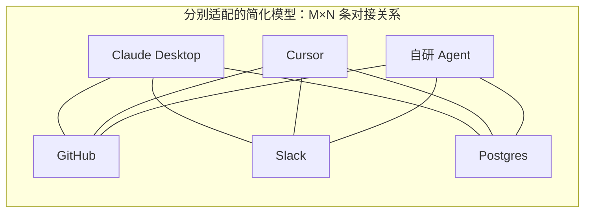
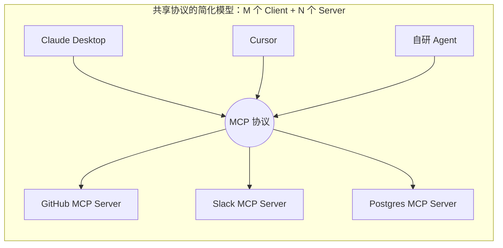
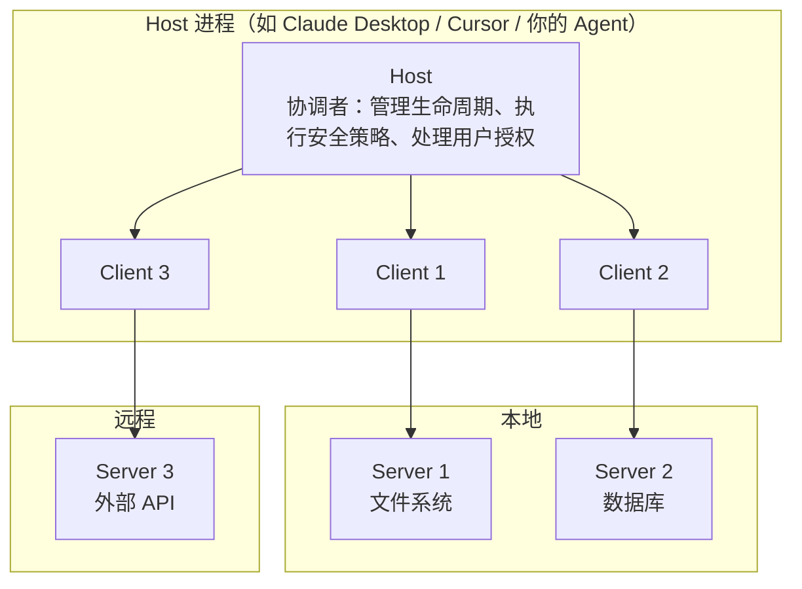

# 第四章：MCP 模型上下文协议的核心内容

## 4.1 MCP 解决的不是 Function Calling 解决的问题

MCP 要先和 Function Calling 分开看。

[Function Calling](../01-function-calling/01-function-calling.zh.md) 解决的是「**模型怎么表达调用意图**」——一个模型层的输出格式约定。

MCP 解决的是完全不同的一组问题：

- 工具**在哪里**？怎么被发现，而不是硬编码在应用代码里；
- 工具**怎么跨进程提供**？能不能装在另一台机器上；
- 同一个工具，**能不能被不同的 AI 应用复用**？
- 工具变更了，**接入方要不要改代码**？

边界可以概括成：

> **Function Calling 是一种常见的模型—应用接口；MCP 是 Host/Client—Server 的开放协议。二者可在同一应用中配合，但 MCP 本身不规定、更不必然依赖某家模型的 Function Calling。**

## 4.2 重复适配的 M×N 成本模型

假设你要把 GitHub 接进一个 AI 应用。你得自己写 GitHub API 的调用代码、处理 OAuth 认证、把各种返回格式转成模型能理解的 Schema、写错误处理。好不容易接完了，接下来会发生三件事：

1. **同一个应用接第二个工具**：Slack 的认证方式、返回格式、错误码跟 GitHub 完全不同，整套逻辑重写一遍；
2. **同一个工具给第二个应用用**：Cursor 的接入方式和你原来那个应用完全不同，再重写一遍；
3. **工具方升级 API**：所有接入方各自改代码。



如果每个应用都独立适配每个工具，接口组合数为 M×N。这是说明重复劳动的简化模型，不是历史统计；共享 SDK、内部 API 和适配层本来也能减少重复实现。

## 4.3 MCP 的核心思路：把 M×N 变成 M+N

可以把 MCP 类比为 **USB 这样的通用接口**：参与方遵守共同约定，就能减少专用适配。不过 USB 仍有驱动、版本和设备能力差异，MCP 也一样。

MCP 为「AI 接工具」定了同一种标准：



工具方实现 Server 后，支持相同版本、传输和能力的应用可复用接入。认证、数据映射、权限和部署仍要配置，不能承诺“任意客户端零代码接入”。

`tools/list` 用于发现**已知 Server** 的工具，不负责在互联网寻找 Server。结果可能分页；工具更新后还需刷新缓存、审阅描述及权限、重新测试模型路由，而不是自动信任新增工具。

## 4.4 Host、Client、Server 三个角色

MCP 采用 client-host-server 架构，注意是三个角色而不是两个——这里最容易被讲错。



| 角色 | 职责 | 数量关系 |
|---|---|---|
| **Host** | AI 应用本身。管理 Client 生命周期、执行安全策略、处理用户授权、协调 LLM 调用、聚合多个 Server 的上下文 | 1 |
| **Client** | Host 内的协议连接器，通常对应一个 Server 连接 | N |
| **Server** | 工具实现方。独立运行，职责聚焦，暴露 Tools / Resources / Prompts | N |

Host 通常为每个 Server 维护独立 Client/连接，便于生命周期和错误隔离；但这不是协议自动提供的安全沙箱。Server 能看到什么仍取决于 Host 传入的参数、进程与网络权限，隔离必须由 Host、操作系统和网络策略共同实现。

**Host 与 Server 都要授权**。Host 决定工具可见性、用户确认和数据分享；Server 仍必须校验令牌、租户和对象级权限，不能相信 Client 已经检查过。

## 4.5 三类核心能力：Tools、Resources、Prompts

MCP Server 可以暴露三类能力。规范强调的是**默认发起方/控制路径**，而不是以副作用给能力定性；实际调用始终由 Host 许可、执行与审计。

| 能力 | 有副作用吗 | 谁来触发 | 类比 |
|---|---|---|---|
| **Tools** | 可读、可写或有外部副作用，取决于实现 | 模型或 Host 工作流可建议调用，Host 最终决定 | 手 |
| **Resources** | 面向应用提供可读取的上下文；通常应设计为安全读取 | Host/Client 决定何时列出、读取或注入 | 资料室 |
| **Prompts** | 返回提示模板或消息 | 用户或 Host 选择并取得 | 模板库 |

### 4.5.1 Tools：模型控制

Tools 是可由模型或工作流选择的可执行能力：可以是只读搜索，也可以是创建文件、提交代码、发消息等写操作。是否有副作用**不能**从 `tools/call` 这一类型本身推断。

对转账、删除、发布等高风险 Tool，Host 应在执行前要求明确授权或审批；Server 执行前再次验证实际参数与权限。低风险读取也要遵循最小权限。

### 4.5.2 Resources：应用控制

Resources 是 Server 暴露给 Client 的、由 URI 标识的上下文数据。它们通常用于读取文档、日志或记录；“Resource”不是对底层实现绝无副作用的安全保证，Host 不应仅凭类别跳过信任与访问控制。

Resource 的协议读取由 Client 执行，内容是否进入上下文由 Host 决定。Host 可以接受模型建议去读资源；“应用控制”是默认交互模型，不是禁止模型参与选择。

### 4.5.3 Prompts：用户控制

带参数占位符的预定义提示词模板。团队有一套固定的代码审查标准 Prompt，接受「编程语言」和「代码内容」两个参数，调用时传参就能展开成完整提示词。

Prompts 通常以「斜杠命令」或菜单项的形式暴露给用户，由**用户**主动选择触发，而不是模型自己决定用哪个。把公司积累的优质 Prompt 封装成 MCP Prompts，全团队复用同一套标准，这在实际工程里比想象中有用。

## 4.6 底层通信：JSON-RPC 2.0

MCP 的消息格式是 JSON-RPC 2.0——一种用 JSON 表达「远程函数调用」的轻量协议。

以下仅展示方法与数据关系，省略当前版本必需的 `_meta`、`resultType` 及列表缓存字段，不是完整报文；完整请求见[第十二章](12-mcp-transport.zh.md)。

```jsonc
// 请求：客户端列出所有工具
{"jsonrpc": "2.0", "id": 1, "method": "tools/list"}

// 响应
{"jsonrpc": "2.0", "id": 1, "result": {"tools": [
  {"name": "create_issue", "inputSchema": {
    "type": "object",
    "properties": {"title": {"type": "string"}, "body": {"type": "string"}},
    "required": ["title"]
  }}
]}}

// 请求：调用某个工具
{"jsonrpc": "2.0", "id": 2, "method": "tools/call",
 "params": {"name": "create_issue", "arguments": {"title": "Bug", "body": "..."}}}
```

JSON-RPC 使用可读的 JSON 和统一的请求、结果、错误结构，便于跨语言调试。但解析几条 JSON 只是起点，完整 Client 还要处理版本、能力、授权、取消和故障恢复；不能用教学代码行数衡量实现成本。

传输方式（stdio / Streamable HTTP）的细节见 [第十二章](12-mcp-transport.zh.md)。

## 4.7 生命周期与版本兼容

本章固定采用 **2026-07-28** 规范。此版改为无状态、请求自包含：每个请求携带协议版本与 Client capabilities；Server 必须实现 `server/discover`，Client 可选调用。旧版 `initialize` 属于兼容路径，不是本版核心握手。

官方将 Current 定义为“ready for use”，仍可接收向后兼容修改；Draft 是尚未可供使用的修订，Final 则指不再修改的历史版本。因此这里的 Current 既不是草案，也不意味着规范已冻结。

### 4.7.1 版本时间线

| 版本 | 关键变化 |
|---|---|
| 2024-11-05 | 初版。HTTP + SSE 双端点传输 |
| 2025-03-26 | Streamable HTTP 取代 HTTP+SSE 双端点 |
| 2025-06-18 | 授权规范完善，结构化工具输出 |
| 2025-11-25 | 引入实验性 Tasks 等能力，仍采用初始化和会话模型 |
| 2026-07-28 | 改为无状态、每请求携带版本与能力；引入 `server/discover` 和订阅流，旧初始化模型进入兼容路径 |

### 4.7.2 每请求协商与旧版兼容

新规范中，请求通过 `_meta.io.modelcontextprotocol/*` 携带协议版本和 Client capabilities。Client 可先调用 `server/discover` 获取 Server 支持的版本与能力，也可直接发起带元数据的业务请求。需要持续通知时，Client 显式建立 subscription；需要模型或用户补充输入时，Server 在响应中返回 `InputRequiredResult`，Client 补齐输入后重发原请求。

与旧版 Server 互操作时，只有明确支持新旧两代协议的实现（dual-era）才能按兼容矩阵回退到 `initialize`、`notifications/initialized` 和旧版会话语义。现代协议专用 SDK 不一定具备这条路径，不能把旧握手继续写成所有 MCP 调用的必经步骤。

2026-07-28 所有结果还要求 `resultType`；读取与列表结果有 `ttlMs`、`cacheScope`。Sampling、Roots、Logging 已 **Deprecated**，仍保留兼容但新实现不应再采用；Tasks 已移到 `io.modelcontextprotocol/tasks` 官方可选扩展。扩展、草案 SEP 和核心协议不是同一发布层级，详见[变更记录](https://modelcontextprotocol.io/specification/2026-07-28/changelog)。

### 4.7.3 工程上要注意什么

**多版本共存是常态**。涉及 transports、authorization、sampling 或任务等特性时，应核对 Client、Server 与目标发布版本的兼容性，不能凭教程假定其存在或不存在。

## 4.8 MCP 生态为什么起得这么快

MCP 由 Anthropic 在 2024 年 11 月发布。SDK 与可复用 Server 降低了适配门槛，但生态采用度不能替代版本和安全核查。

**SDK 简化协议代码**。下面保留 FastMCP 风格的教学示例；运行时应固定 SDK 发布版并核对它支持的协议版本，函数可运行不代表已实现完整授权和治理：

```python
from mcp.server.fastmcp import FastMCP

mcp = FastMCP("demo")

@mcp.tool()
def add(a: int, b: int) -> int:
    """将两个整数相加"""
    return a + b

if __name__ == "__main__":
    mcp.run()
```

这里的工具参数类型用于生成输入 JSON Schema，docstring 用于工具描述。SDK 省去了部分报文构造，但不代替业务权限检查和部署配置。

**工具接入可复用**。要区分官方维护、社区实现和归档示例。旧 `@modelcontextprotocol/server-github` 已归档，GitHub 官方实现是 [github/github-mcp-server](https://github.com/github/github-mcp-server)。下面用本地自有 Server 示意宿主配置，而不是安装归档包：

```json
{
  "mcpServers": {
    "demo": {
      "command": "/absolute/path/to/venv/bin/python",
      "args": ["/absolute/path/to/demo_server.py"]
    }
  }
}
```

`mcpServers` 是一些宿主使用的配置约定，不是 MCP 线上报文。安装目录、热加载、密钥注入和模型端桥接方式均须查宿主文档。

## 4.9 常见错误

### 4.9.1 认为 MCP 取代了 Function Calling

许多 LLM Host 会把 MCP Tool 转为该模型的 Function Calling schema，再将模型输出路由为 `tools/call`。但这只是常见适配方式：Host 也可用结构化输出、规则工作流或人工选择调用 MCP。**MCP 不把 Function Calling 作为协议前提。**

### 4.9.2 把 Host 和 Client 混为一谈

Client 是 Host 内的协议连接器，不是安全沙箱。Host 控制用户同意与数据共享；Server 验证调用者和资源访问权限，二者不可相互替代。

### 4.9.3 认为只读查询不能是 Tool

只读数据常适合用 Resources 提供，而需要模型选择并执行的查询也可以是 Tool。不要从类别推导「无副作用」或「无需授权」：按数据敏感度、调用者身份与实际动作做最小授权和审批。

### 4.9.4 以为 Resources 是模型主动读的

协议调用由 Client 发起；Host 可以让用户、固定工作流或模型决策触发 `resources/read`，再决定哪些内容进入上下文。MCP 不规定某种 UI，也不能据此假定 Resource 天然可信或无需授权。

### 4.9.5 按旧规范理解 MCP 的状态模型

2026-07-28 规范是每请求自包含的无状态模型；`initialize` 和连接级 session 属于旧版兼容语义。应固定目标协议版本并按官方兼容矩阵实现，不能混用不同年代的消息流。

### 4.9.6 忽视 MCP Server 的信任边界

启动本地 Server 会运行第三方代码；连接远程 Server 则会向对端传递数据，两者风险不同。工具描述可能被投毒，详见[工具协议安全](15-tool-protocol-security.zh.md)。

## 4.10 本章总结

1. **MCP 与 Function Calling 可以配合但并非依赖关系**：前者定义 Host/Client 与 Server 的互操作，后者是常见的模型调用接口；
2. **M×N 到 M+N 是适配成本模型**，不消除认证、业务映射与互操作测试；
3. **工具发现面向已知 Server**，要处理分页、缓存更新和新增工具审查；
4. **三个角色**：Host 管策略与生命周期，Client 连接 Server，Server 提供能力并复核调用权限；独立连接不替代运行时隔离；
5. **三类能力按默认控制路径区分**：Tools 可由模型/工作流选择，Resources 由 Client 加载，Prompts 由用户/Host 取得；副作用须逐项声明和治理；
6. **消息格式是 JSON-RPC 2.0**，标准传输为 stdio 与 Streamable HTTP；
7. **版本语义发生过结构性变化**：当前版本按请求携带版本与能力，旧初始化/会话模型只在兼容路径出现；
8. **核查规范、SDK 和宿主三个层面**，不要用归档示例代替维护中的实现。


## 参考资料

- 版本状态核对：2026-09-15 复核下列固定版变更与兼容说明；采用固定协议基准，不将动态页面的“最新”当作 SDK 已支持的证明。
- [MCP 版本状态](https://modelcontextprotocol.io/specification/versioning)
- [MCP 2026-07-28 变更记录](https://modelcontextprotocol.io/specification/2026-07-28/changelog)
- [Model Context Protocol 官方文档](https://modelcontextprotocol.io/docs/getting-started/intro)
- [MCP 规范 2026-07-28](https://modelcontextprotocol.io/specification/2026-07-28)
- [MCP 版本兼容说明](https://modelcontextprotocol.io/specification/2026-07-28/basic/versioning)
- [MCP 架构说明](https://modelcontextprotocol.io/specification/2026-07-28/architecture)
- [Anthropic: Introducing the Model Context Protocol](https://www.anthropic.com/news/model-context-protocol)
- [JSON-RPC 2.0 规范](https://www.jsonrpc.org/specification)
