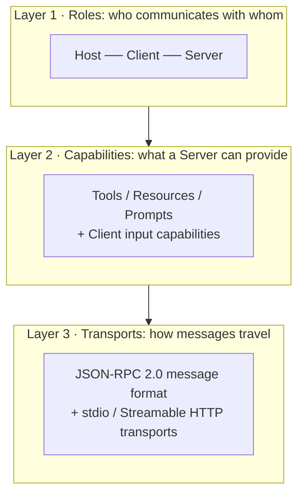
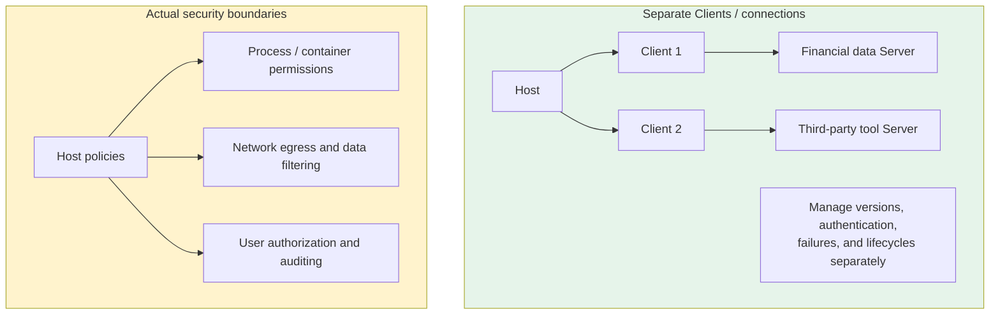
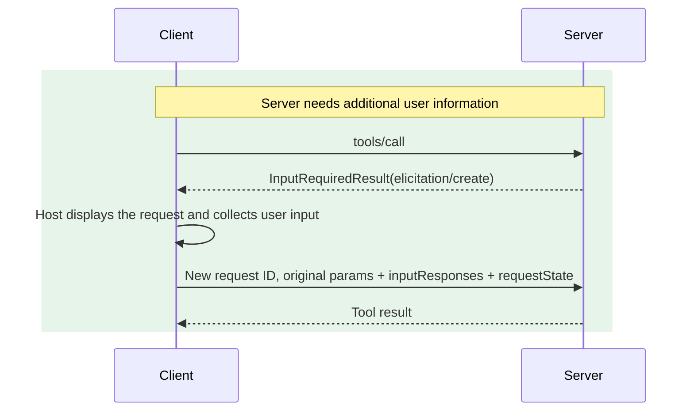
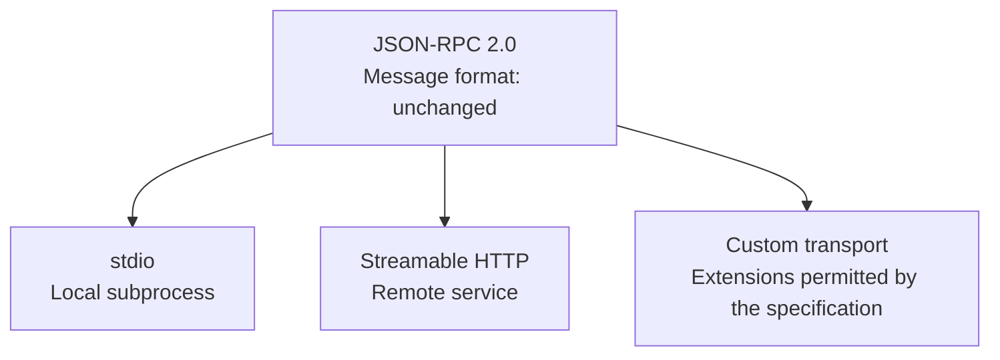
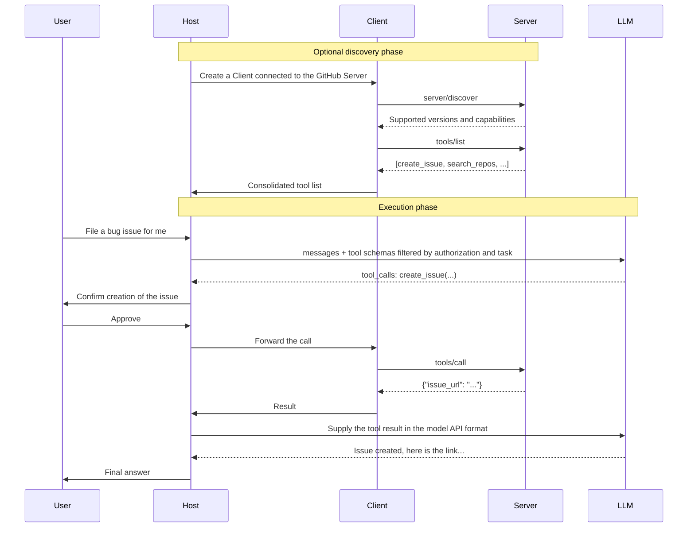

# Chapter 5: The Three Layers of MCP

## 5.1 Use three layers to organize the concepts

For a newcomer, MCP's vocabulary can be overwhelming: Host, Client, Server, Tools, Resources, Prompts, JSON-RPC, stdio, Streamable HTTP, sampling, elicitation, roots…

This chapter organizes those concepts into three perspectives: roles, capabilities, and transports. These are teaching categories, not three separate processes or a mandatory dependency hierarchy.



Decoupling means that a transport can change without changing core capability semantics, and capabilities can expand without rewriting the role model.

## 5.2 Layer 1: roles

### 5.2.1 What each role does

| Role | What it is | Core responsibilities |
|---|---|---|
| **Host** | The AI application itself: Claude Desktop, Cursor, or your agent | Starts and manages Clients, selects Servers, enforces security policies, handles user authorization, and coordinates LLM calls |
| **Client** | A connection module inside the Host | Communicates, discovers capabilities, and forwards requests/results; usually corresponds to one Server connection |
| **Server** | The tool provider's independent process or service | Exposes capabilities and verifies callers and resource permissions |

The Host chooses providers, the Client encapsulates protocol interactions, and the Server supplies capabilities. The Server must care about authenticated identity and tenancy, but does not need to know which model or orchestration framework the caller uses internally.

### 5.2.2 One-to-one connections help isolation but do not guarantee security

A Host often creates a separate Client/connection for each Server to manage lifecycle, authentication, and failures independently. The specification does not thereby isolate the Server's filesystem, network, or process permissions.



For third-party Servers, the Host should also apply least privilege, process/container isolation, network egress controls, and argument filtering. These runtime policies are what restrict what a Server can read and execute.

### 5.2.3 Host and Server enforce authorization separately

People often conflate Host and Client. The Client handles communication and forwarding; the Host retains authorization and policy decisions.

In particular, the Host decides:

- Whether the user has authorized a tool call.
- Which Servers' tools may be exposed to the model.
- Whether a sensitive operation needs another confirmation.
- How context from multiple Servers is assembled into the prompt.

Host confirmation cannot replace Server permission checks. The Server should verify identity, scopes, tenant, and object ownership for each operation. Likewise, a Client must not skip local policy merely because a Server describes an operation as “read-only.”

## 5.3 Layer 2: capabilities

### 5.3.1 Three capabilities provided by Servers

The key distinction is the **default control path**, not “read versus write” or the presence of side effects:

| Capability | Control | Side effects | Typical uses |
|---|---|---|---|
| **Tools** | A model or Host workflow may select them; the Host gives final permission | May read, write, or cause side effects | Search, create issues, send messages, write files |
| **Resources** | The Client/Host decides when to read or inject them | Usually readable context; not a security promise | Read logs, documents, or database records |
| **Prompts** | Retrieved by the user or Host | Return templates/messages | Code-review or weekly-report templates |

Tools, Resources, and Prompts are not security levels. The Host controls exposure and sharing; the Server controls actual resource access.

Their corresponding JSON-RPC methods are:

```jsonc
{"method": "tools/list"}          // Discover available tools
{"method": "tools/call"}          // Call a tool
{"method": "resources/list"}      // List available resources
{"method": "resources/read"}      // Read a resource
{"method": "prompts/list"}        // List prompt templates
{"method": "prompts/get"}         // Expand a template
```

These are method names, not complete requests. `*/list` operations may be paginated. Cacheable results in 2026-07-28 carry `ttlMs` and `cacheScope`; Clients can subscribe to list changes through `subscriptions/listen`. Caches must be isolated by authorization context: one tenant's tool list cannot be reused for another tenant.

The [Tools specification](https://modelcontextprotocol.io/specification/2026-07-28/server/tools) distinguishes requirements of different strengths:

- The tool set **MUST NOT** vary with connection state or the side effects of other requests on that connection. It **MAY** change over time or according to the authorization supplied with the current request.
- If the set has not changed, the Server **SHOULD** return tools in deterministic order to support list caching and model-prefix caching. Alphabetical order is not required.
- The `tools.listChanged` capability still exists. A Server declaring it **SHOULD** send `notifications/tools/list_changed` to Clients that requested `notifications.toolsListChanged: true` through `subscriptions/listen`, not broadcast to every connection.

The [subscription specification](https://modelcontextprotocol.io/specification/2026-07-28/basic/patterns/subscriptions) requires `notifications/subscriptions/acknowledged` first. Its filter describes the subset the Server actually accepted. The Client should check it rather than equate submitting a subscription with success. Notifications on the stream carry `_meta.io.modelcontextprotocol/subscriptionId` for correlation. Change notifications do not contain the complete new list: call `tools/list` again and review new or changed definitions.

### 5.3.2 An easily missed fourth category: the Server needs Client input

The three capabilities above are what the Server **provides** to the Client. During execution, however, a Server may need model inference or additional information from the user. In 2026-07-28, the Server no longer initiates a reverse JSON-RPC request. Instead, it returns `InputRequiredResult` in the current response; the Client handles it and resends the original request with the input.

| Capability | What the Server needs | Use |
|---|---|---|
| **Sampling (deprecated)** | Controlled model inference on the Host side | Described for compatibility only; new implementations should consider direct model-API integration |
| **Elicitation** | Structured additional information from the user | Fills missing parameters; does not replace separate approval for high-risk actions |
| **Roots (deprecated)** | Context hints such as working directories | Not a filesystem sandbox; migrate to parameters, resource URIs, or Server configuration |

These statuses follow the [2026-07-28 changelog](https://modelcontextprotocol.io/specification/2026-07-28/changelog): Sampling, Roots, and Logging are deprecated, not removed. A Host supporting Sampling for compatibility must still constrain models, budgets, visible context, and returned data.

### 5.3.3 The InputRequiredResult round-trip pattern

This pattern is called **MRTR: Multi Round-Trip Requests**. The direction remains Client request → Server response. When Client input is needed, the Server returns the input requirements and ends that response. The Client then supplies the input in a new request; the Server need not keep the original call stack suspended:



Not every Server uses these capabilities. The Host should declare permitted Client capabilities on each request and include user interaction, model access, budgets, and data boundaries in its authorization policy.

`InputRequiredResult.resultType` is `input_required`. The Client supplies `inputResponses` matching the keys in `inputRequests` and echoes `requestState` unchanged. That state is not trusted authorization: bind it to the caller, arguments, and expiry, and prevent repeated side effects when an input flow is replayed. An ordinary completed result has `resultType: complete`.

## 5.4 Layer 3: transports

### 5.4.1 Message format and transport are decoupled

The design separates how a message is represented from how it travels:



Tool semantics can be reused across transports. Moving to a remote service still changes authentication, deployment, cancellation, isolation, and connection-failure handling; it is not necessarily a configuration-only change. The current HTTP and stdio cancellation mechanisms also differ.

### 5.4.2 The two main transports

| | stdio | Streamable HTTP |
|---|---|---|
| Server form | Local subprocess | Independent HTTP service |
| Communication channel | Operating-system pipes: stdin/stdout | HTTP POST |
| Latency | No network round trip, but serialization and scheduling remain | Depends on deployment, network, and service processing |
| Sharing across Clients | Standard subprocess pipes are normally exclusive to one Client; backend services can still be shared | An independent service can accept multiple Clients |
| Authentication | Credentials generally come from the environment or controlled configuration; process isolation is separate | Protocol authorization is optional; protected HTTP services use the relevant OAuth specification |
| Typical uses | Filesystem, local Git, local databases | Shared team services and SaaS tools |

One practical detail: in stdio mode, **stdout is reserved for protocol messages**. Any debug `print` can contaminate the stream and cause parsing failures. Write logs to stderr—this is one of the most common mistakes when writing a first MCP Server.

For full transport details, including the transition from HTTP + SSE to Streamable HTTP, see [Chapter 12](12-mcp-transport.md).

## 5.5 Putting the three layers together: a complete call



Three points matter in this complete call:

1. **If the Host uses model function calling**, it can convert MCP Tools to the model's schema. Rules, structured output, or human actions can also invoke MCP; MCP does not mandate a model interface.
2. **User authorization happens at the Host layer**, before the actual call is sent.
3. **Capabilities may be discovered in advance, but negotiation is per request.** Every request still carries its version and Client capabilities; startup caches alone are insufficient.

## 5.6 Common mistakes

### 5.6.1 Mixing all three layers together

An interview answer that mixes Host/Client/Server, Tools/Resources/Prompts, and stdio/HTTP sounds like a list of memorized terms. Three layers make the structure clearer, with one question per layer: who communicates, what is provided, and how messages travel.

### 5.6.2 Mistaking connection mappings for a security sandbox

Separate Clients/connections help management. Security boundaries still depend on Host authorization, runtime isolation, and network policy—not object relationships alone.

### 5.6.3 Assigning the Host's responsibilities to the Client

The Host makes application-level policy and lifecycle decisions. The Client implements protocol connections, version and capability handling, and possibly OAuth flows. Treating a Client as a byte pipe with no validation duties overlooks protocol and authentication checks.

### 5.6.4 Knowing only the three Server capabilities and missing input requirements

Sampling and Elicitation let a Server request model or user input from the Host during execution. The current specification handles those round trips with `InputRequiredResult`; do not copy the legacy Server→Client request flow.

### 5.6.5 Ignoring stdout contamination

Writing logs to stdout in stdio mode directly breaks the protocol stream. The resulting error is often an obscure JSON parsing failure. All logs go to stderr.

### 5.6.6 Ignoring per-request capability negotiation

Every request must carry its version and Client capabilities. Do not discover once at startup and trust that cache forever, or assume every Host permits sampling or elicitation.

## 5.7 Chapter summary

1. **Three layers organize the concepts.** Roles answer “who communicates,” capabilities answer “what is provided,” and transports answer “how messages travel.”
2. **Keep the layers as decoupled as possible**, so transports and capabilities can evolve separately.
3. **The Host decides, the Client connects, and the Server provides.** Separate connections do not replace runtime security isolation.
4. **The three Server capabilities differ by default control path.** Models/workflows can select Tools, Clients load Resources, and users/Hosts retrieve Prompts.
5. **Input requirements use MRTR round trips.** Elicitation obtains user information; Sampling and Roots are retained as deprecated compatibility features.
6. **The current specification uses `InputRequiredResult`, not reverse Server requests.** Client capabilities accompany each request and remain subject to Host policy.
7. **Switching transports still requires engineering work.** Authentication, cancellation, and deployment constraints do not disappear.
8. **With stdio, stdout is exclusively for protocol messages.** Logs must use stderr.


## References

- [MCP architecture](https://modelcontextprotocol.io/specification/2026-07-28/architecture)
- [MCP specification 2026-07-28](https://modelcontextprotocol.io/specification/2026-07-28)
- [MCP Server capabilities: Tools](https://modelcontextprotocol.io/specification/2026-07-28/server/tools)
- [MCP Multi Round-Trip Requests](https://modelcontextprotocol.io/specification/2026-07-28/basic/patterns/mrtr)
- [MCP deprecated features](https://modelcontextprotocol.io/specification/2026-07-28/deprecated)
- [MCP transport specification](https://modelcontextprotocol.io/specification/2026-07-28/basic/transports)
- [JSON-RPC 2.0 specification](https://www.jsonrpc.org/specification)
