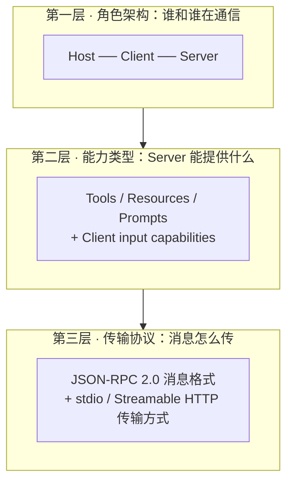
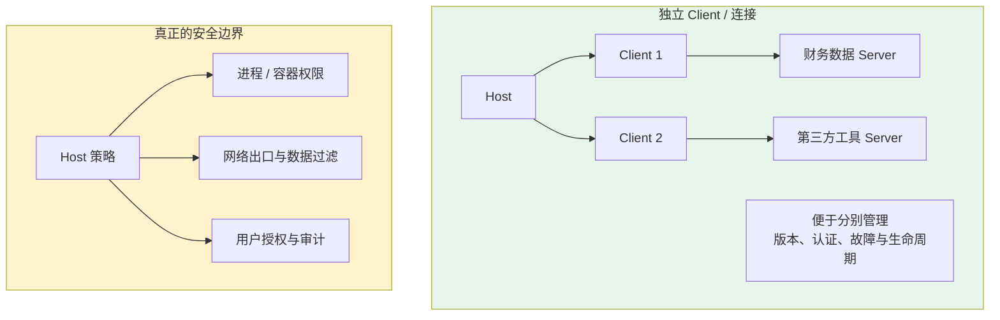
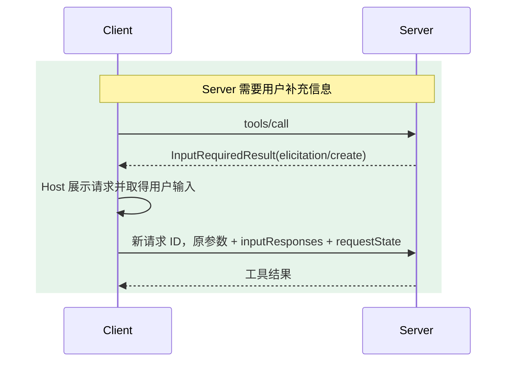
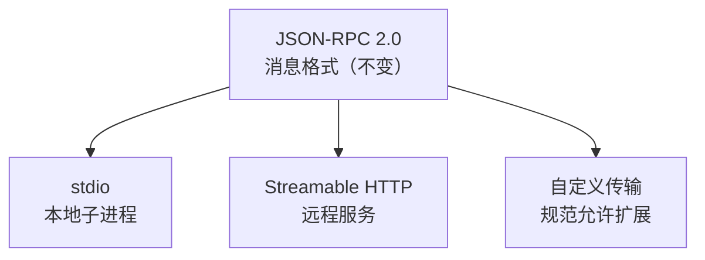
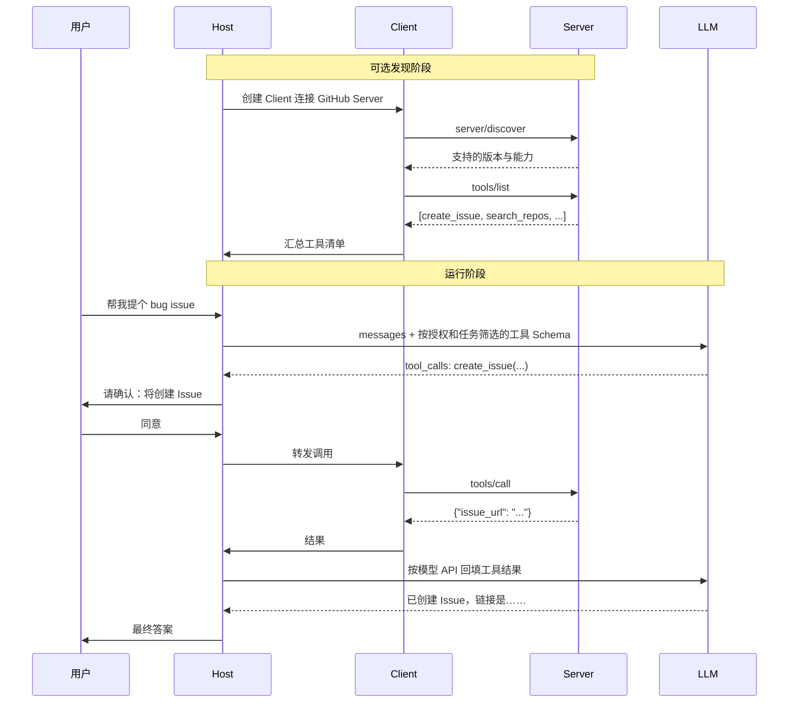

# 第五章：MCP 的三层组成

## 5.1 用三层把概念理清

第一次接触 MCP，最劝退的是名词密度：Host、Client、Server、Tools、Resources、Prompts、JSON-RPC、stdio、Streamable HTTP、sampling、elicitation、roots……

本章按角色、能力、传输三个视角组织概念；这是教学拆分，不是三个独立进程或强制依赖层级。



解耦的意思是：传输可替换而不改变核心能力语义；能力扩展也不必重写角色模型。

## 5.2 第一层：角色架构

### 5.2.1 三个角色各自做什么

| 角色 | 是什么 | 核心职责 |
|---|---|---|
| **Host** | AI 应用本身（Claude Desktop、Cursor、你的 Agent） | 启动和管理所有 Client、决定连哪些 Server、执行安全策略、处理用户授权、协调 LLM 调用 |
| **Client** | Host 内部的连接模块 | 通信、能力发现和转发请求/结果；通常对应一个 Server 连接 |
| **Server** | 工具提供方的独立进程或服务 | 暴露能力，并验证调用者及资源权限 |

Host 选择接入方，Client 封装协议交互，Server 提供能力。服务端必须关心认证身份和租户，但不必知道调用方内部采用哪个模型或编排框架。

### 5.2.2 一对一连接便于隔离，但不是安全保证

Host 常为每个 Server 建立独立 Client/连接，便于管理生命周期、认证与故障；规范不会因此自动隔离 Server 的文件、网络或进程权限。



面对第三方 Server，Host 还应使用最小权限、进程/容器隔离、网络出口控制和参数过滤。只有这些运行时策略才能限制一个 Server 能读取和执行的范围。

### 5.2.3 Host 与 Server 分别执行授权

Host 和 Client 经常被混在一起。Client 负责通信和转发，授权与策略决定仍在 Host。

具体来说，这些决策全在 Host：

- 用户是否授权某次工具调用；
- 哪些 Server 的工具可以暴露给模型；
- 敏感操作是否需要二次确认；
- 多个 Server 的上下文怎么聚合进 Prompt。

Host 的确认不能替代 Server 的权限检查。Server 应在每次操作上验证身份、scope、租户及对象归属；Client 也不能因 Server 声称某操作“只读”就跳过本地策略。

## 5.3 第二层：能力类型

### 5.3.1 Server 提供的三类能力

区分它们的关键是**默认控制路径**，而不是「读还是写」或是否有副作用：

| 能力 | 控制权 | 有副作用 | 典型场景 |
|---|---|---|---|
| **Tools** | 模型或 Host 工作流可选择，Host 最终放行 | 可读、可写或有副作用 | 搜索、创建 Issue、发消息、写文件 |
| **Resources** | Client/Host 决定何时读取/注入 | 通常是可读取上下文；不构成安全承诺 | 读日志、读文档、读数据库记录 |
| **Prompts** | 用户或 Host 取得 | 返回模板/消息 | 代码审查模板、周报生成模板 |

Tools、Resources、Prompts 的分类不是安全等级。Host 控制暴露与共享，Server 控制实际资源访问。

对应的 JSON-RPC 方法：

```jsonc
{"method": "tools/list"}          // 发现有哪些工具
{"method": "tools/call"}          // 调用某个工具
{"method": "resources/list"}      // 列出可用资源
{"method": "resources/read"}      // 读取某个资源
{"method": "prompts/list"}        // 列出提示模板
{"method": "prompts/get"}         // 展开某个模板
```

上例只列方法名，不是完整请求。`*/list` 可能分页；2026-07-28 的缓存结果带 `ttlMs` 和 `cacheScope`，列表变化可通过 `subscriptions/listen` 订阅。缓存必须按授权上下文隔离，不能把某租户的工具清单复用给另一租户。

[Tools 规范](https://modelcontextprotocol.io/specification/2026-07-28/server/tools)还区分了几个强度不同的要求：

- 工具集合 **MUST NOT** 按连接状态或同连接其他请求的副作用变化；**MAY** 随时间、当前请求携带的授权变化。
- 集合未变化时，Server **SHOULD** 保持确定性返回顺序，以利于列表缓存和模型前缀缓存；不是必须按字母排序。
- `tools.listChanged` 能力仍存在。声明它的 Server **SHOULD** 向已通过 `subscriptions/listen` 请求 `notifications.toolsListChanged: true` 的 Client 发送 `notifications/tools/list_changed`，而不是向所有连接广播。

[订阅规范](https://modelcontextprotocol.io/specification/2026-07-28/basic/patterns/subscriptions)要求先发送 `notifications/subscriptions/acknowledged`，其 filter 表示服务端实际接受的订阅子集；Client 应核对，不能把提交订阅当成功。流中的通知携带 `_meta.io.modelcontextprotocol/subscriptionId` 用于关联。变化通知不携带完整新清单，收到后重新 `tools/list`，并审查新增或改动定义。

### 5.3.2 容易被漏掉的第四类：Server 需要 Client 输入

上面三类是 Server **提供**给 Client 的。执行过程中，Server 有时还需要模型推理或用户补充信息。2026-07-28 规范不再让 Server 反向发起 JSON-RPC request，而是在当前响应中返回 `InputRequiredResult`；Client 处理后带输入重发原请求。

| 能力 | Server 想要什么 | 用途 |
|---|---|---|
| **Sampling（已弃用）** | 让 Host 一侧的模型完成受控推理 | 仅为兼容说明；新实现应考虑直接集成模型 API |
| **Elicitation** | 向用户索取结构化补充信息 | 参数不全时补充；不能替代高风险动作的独立审批 |
| **Roots（已弃用）** | 获取工作目录等上下文提示 | 不是文件沙箱；迁移到参数、资源 URI 或服务端配置 |

这些状态依据 [2026-07-28 changelog](https://modelcontextprotocol.io/specification/2026-07-28/changelog)：Sampling、Roots、Logging 已弃用但未移除。兼容 Sampling 时，Host 仍需限制模型、预算、可见上下文和返回范围。

### 5.3.3 InputRequiredResult 的往返模式

这种模式称为 **MRTR（Multi Round-Trip Requests，多轮往返请求）**。消息方向仍是 Client request → Server response；需要 Client 输入时，Server 返回输入需求，结束这一轮响应，Client 随后补齐输入再发起新请求，不要求服务端一直挂起原来的调用栈：



并非每个 Server 都使用这些能力。Host 应逐请求声明允许的 Client capabilities，并把用户交互、模型访问、预算和数据边界纳入授权策略。

`InputRequiredResult.resultType` 为 `input_required`。客户端按 `inputRequests` 的键提供对应 `inputResponses`，原样携回 `requestState`；该状态不能当作可信授权。需绑定调用者、参数与有效期，并避免重放输入过程造成重复副作用。普通完成结果的 `resultType` 为 `complete`。

## 5.4 第三层：传输协议

### 5.4.1 消息格式与传输方式是解耦的

这一层的设计点，就是把消息格式和传输方式分开：



工具语义可在不同传输上复用，但改成远程服务还涉及认证、部署、取消、隔离和连接故障，不能保证只改配置。当前 HTTP 与 stdio 的取消机制也不同。

### 5.4.2 两种主要传输方式

| | stdio | Streamable HTTP |
|---|---|---|
| Server 形态 | 本地子进程 | 独立 HTTP 服务 |
| 通信通道 | 操作系统管道（stdin/stdout） | HTTP POST |
| 延迟 | 无网络往返，但仍有序列化与调度 | 取决于部署、网络及服务处理 |
| 多 Client 共享 | 标准子进程管道通常由一个 Client 独占；后端服务仍可共享 | 独立服务可接受多个 Client |
| 认证 | 凭据一般由环境或受控配置提供；进程隔离另行落实 | 协议授权为可选；受保护 HTTP 服务采用相应 OAuth 规范 |
| 典型用途 | 文件系统、本地 Git、本地数据库 | 团队共享服务、SaaS 工具 |

一个实用细节：stdio 模式下 **stdout 只能走协议消息**，任何 `print` 调试输出都会污染消息流导致解析失败。日志必须写 stderr——这是新手写 MCP Server 最常踩的坑。

传输层的完整细节，包括 HTTP+SSE 到 Streamable HTTP 的演进，见 [第十二章](12-mcp-transport.md)。

## 5.5 三层拼起来：一次完整调用



这次完整调用里，有三点最值得注意：

1. **若 Host 使用模型 Function Calling**，可将 MCP Tool 转为该模型的 schema；也可由规则、结构化输出或人工操作调用 MCP。MCP 对模型接口没有强制要求；
2. **用户授权发生在 Host 层**，在调用真正发出去之前；
3. **能力可提前发现，但协商是逐请求的**；每个请求仍携带版本与 Client capabilities，不能只信启动时缓存。

## 5.6 常见错误

### 5.6.1 把三层混在一起讲

面试时把 Host/Client/Server 和 Tools/Resources/Prompts 和 stdio/HTTP 混着说，听起来像在背名词。分成三层，每层回答一个问题（谁在通信、提供什么、怎么传），结构立刻清晰。

### 5.6.2 把连接映射误作安全沙箱

独立 Client/连接有助于管理；但安全边界要靠 Host 的授权、运行时隔离和网络策略，不能只靠对象关系。

### 5.6.3 把 Host 的职责安到 Client 上

Host 负责应用级策略与生命周期决策；Client 负责落实协议连接、版本与能力处理，也可能实现 OAuth 流程。把 Client 看成没有校验职责的字节管道，会漏掉协议和认证检查。

### 5.6.4 只知道三类 Server 能力，不知道输入需求

Sampling 与 Elicitation 让 Server 在执行中请求 Host 提供模型或用户输入。当前规范通过 `InputRequiredResult` 完成往返，不应继续照抄旧版 Server→Client request 流程。

### 5.6.5 忽略 stdout 污染问题

stdio 模式下往 stdout 打日志会直接破坏协议消息流，而且报错信息通常是难懂的 JSON 解析失败。日志一律写 stderr。

### 5.6.6 忽略逐请求能力协商

每个请求都要携带版本与 Client capabilities；不要只在启动时发现一次后永久相信缓存，也不要假定任意 Host 都允许 sampling 或 elicitation。

## 5.7 本章总结

1. **三层拆解**：角色架构解决「谁和谁通信」，能力类型解决「提供什么」，传输协议解决「怎么传」；
2. **三层尽量解耦**，传输和能力可分别演进；
3. **Host 是决策者，Client 是连接器，Server 是提供者**；独立连接不替代运行时安全隔离；
4. **三类正向能力按默认控制路径区分**：Tools 可由模型/工作流选择，Resources 由 Client 加载，Prompts 由用户/Host 取得；
5. **输入需求通过 MRTR 往返**：Elicitation 补充用户信息，Sampling/Roots 仅作弃用兼容；
6. **当前规范用 `InputRequiredResult` 而非 Server 反向 request**，Client capabilities 随每个请求声明并由 Host 策略控制；
7. **传输切换仍需工程适配**，认证、取消和部署约束不会自动消失；
8. **stdio 下 stdout 是协议专用通道**，日志必须走 stderr。


## 参考资料

- [MCP 架构说明](https://modelcontextprotocol.io/specification/2026-07-28/architecture)
- [MCP 规范 2026-07-28](https://modelcontextprotocol.io/specification/2026-07-28)
- [MCP Server 能力：Tools](https://modelcontextprotocol.io/specification/2026-07-28/server/tools)
- [MCP Multi Round-Trip Requests](https://modelcontextprotocol.io/specification/2026-07-28/basic/patterns/mrtr)
- [MCP 弃用特性](https://modelcontextprotocol.io/specification/2026-07-28/deprecated)
- [MCP 传输层规范](https://modelcontextprotocol.io/specification/2026-07-28/basic/transports)
- [JSON-RPC 2.0 规范](https://www.jsonrpc.org/specification)
