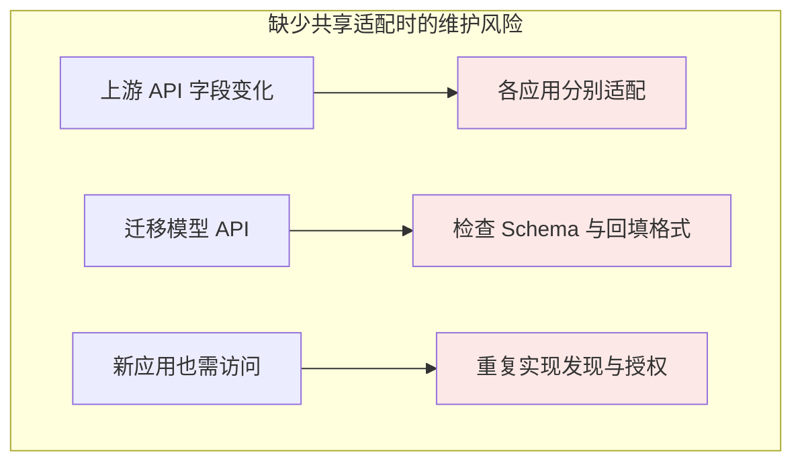
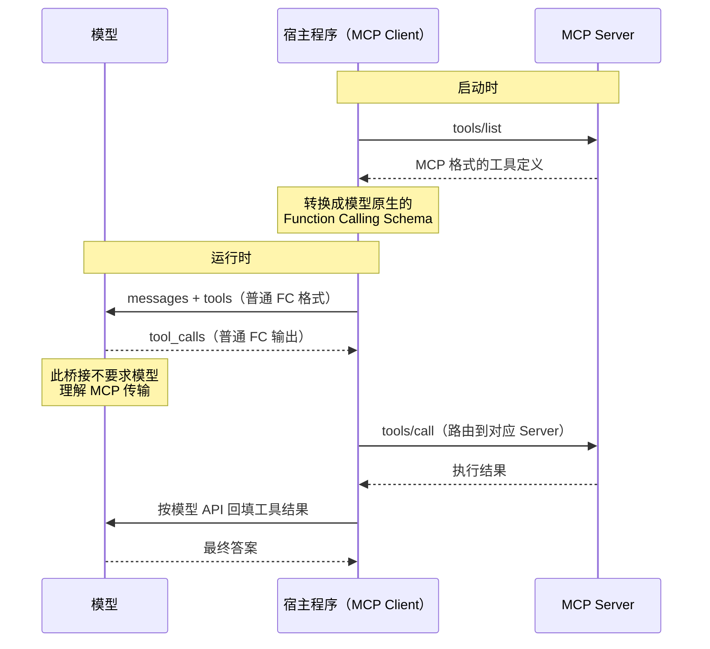
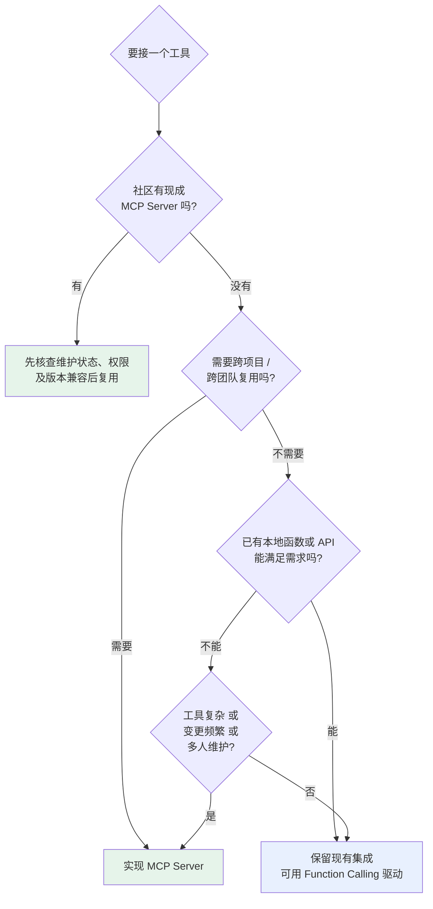

# 第六章：MCP 与 Function Calling 的区别与选型

## 6.1 这个问题容易问偏

「MCP 和 Function Calling 有什么区别」这个问题本身有点误导性，因为它暗示两者是并列的竞品。实际上：

> **MCP 和 Function Calling 解决不同接口边界，常被同一个 Host 组合使用；MCP 并不规定或要求模型必须支持 Function Calling。**

准确的区分是：

| | Function Calling | MCP |
|---|---|---|
| 解决的问题 | 模型**怎么表达**调用意图 | 工具**怎么被提供和发现** |
| 协议双方 | 模型 ↔ 应用 | 应用 ↔ 工具提供方 |
| 工具实现位置 | 不规定：可本地函数，也可远程 API | Server 暴露能力，可为本地进程或远程服务 |
| 层次 | 模型输出格式约定 | 工具生态标准 |

区别是接口边界，不是部署位置。Function Calling 本来就能触发远程服务；MCP 提供统一的发现、消息与能力协商。

## 6.2 Function Calling 的真实痛点

复制一份 Schema 看起来不算什么工作量，但把账算到团队规模就不一样了。

若 **5 个应用**分别独立适配 **8 个工具**，就有 **40 个适配组合**；共享 SDK 或内部服务可减少重复代码，MCP 是标准化这类适配的一种方式。



核心问题不是「写起来麻烦」，而是**同一个工具，换个应用就要重新对接一遍，每次都是一次性的手工活**。工具的管理、复用和跨平台兼容，Function Calling 一个都没解决——因为它压根不负责这些。

## 6.3 常见集成：Host 用 Function Calling 路由 MCP Tool

项目里最常见的接法，就是 Host 用 Function Calling 路由 MCP Tool。



在这种集成中，模型的视角确实是普通 Function Calling，能力发现、schema 转换、调用路由和结果回传都在 Host 层完成。这种桥接很常见，但不是 MCP 的规范要求。

沿着这条集成链路往下看，会得到两个结论：

1. **模型不支持某厂商的 Function Calling 时，只有这条桥接路径不可用**。Host 仍可通过结构化输出、确定性工作流或人工界面调用 MCP Tool；
2. **若由模型选择 Tool，工具 schema 工程仍然适用**。MCP 规定互操作格式，不保证模型会正确选择或填写参数。

桥接不一定是逐字段复制。MCP 2026-07-28 使用 JSON Schema 2020-12，允许的关键词范围可能超出模型 strict 子集；Host 应拒绝不支持的定义，或做明确记录、可测试的转换，而不是静默删约束。工具结果的 `content`、`structuredContent`、`outputSchema` 也需按模型可接收的内容类型映射，不能一律当字符串而丢失图片、资源引用或错误标志。

## 6.4 选型：什么时候用哪个

### 6.4.1 Function Calling 够用的场景

**快速原型和 Demo**。目标是跑通想法，直接在代码里定义 Schema 最快。搭 MCP Server 的时间可能超过原型本身的价值。

**工具只服务这一个应用**。查本公司某张私有表的接口，绝不会被其他地方用到，写在项目里反而更清晰。为它单独维护一个进程是过度设计。

**需要对执行逻辑做精细控制**。权限校验、参数二次处理、特殊错误处理、调用链路追踪，直接嵌在调用代码里最方便。MCP Server 是独立进程，这类定制要额外约定。

**部署环境受限**。不能启动子进程时无法使用本地 stdio Server，但仍可连接远程 Streamable HTTP Server。比较现有 API 与 MCP 的运维成本，而不是因此断言 MCP 不可用。

### 6.4.2 MCP 更合适的场景

**已有维护中的 Server**。先核查发布者、许可证、更新状态、协议版本及权限范围。旧官方示例可能已归档，社区存在实现不等于已经安全测试或适合当前业务。

**工具需要跨项目或跨团队复用**。这是 MCP 的核心价值。维护责任收敛到 Server 一侧，所有客户端自动受益。

**工具规模上来了**。这里不给绝对数字门槛（「超过 3 个就上 MCP」这种说法没意义），要看三个维度综合：

| 维度 | 倾向 Function Calling | 倾向 MCP |
|---|---|---|
| 单个工具复杂度 | 几行就写完 | 几十行，有认证和错误处理 |
| 团队规模 | 一个人维护 | 多人协作 |
| 变更频率 | 基本不动 | 接口时常调整 |

三个维度都偏右，就算只有 5 个工具也会很快陷入维护泥潭；三个都偏左，两个工具也没必要引入独立 Server。

**在构建 Agent 系统**。Agent 的工具需求往往多样：代码执行、文件系统、数据库、外部 API。全靠 Function Calling 的话，工具 Schema 会成为 Agent 代码里最难维护的部分。MCP 让工具来源模块化，Agent 核心逻辑和工具管理解耦。

### 6.4.3 判断流程



### 6.4.4 混用是常态

实际项目里最常见的形态不是二选一，而是**混用**：

```python
# 通用能力走 MCP：文件系统、GitHub、数据库，用社区现成的
mcp_tools = await load_mcp_tools(["filesystem", "github", "postgres"])

# 业务专属能力走 Function Calling：内嵌，方便加权限和审计
local_tools = [check_user_quota_schema, internal_billing_schema]

tools = mcp_tools + local_tools
```

示例中的函数为应用伪代码。业务专属能力也可以供多个应用共享 MCP Server；真正的依据是复用边界、权限、部署和维护责任，而非“通用/专属”的二分。

## 6.5 实际跑一遍 MCP

可在本地只读目录做一次实验，记录版本、配置、发现结果和故障现象。没有实际运行过，不应把教程中的问题写成自己的生产经验。

### 6.5.1 最简接入

```json
{
  "mcpServers": {
    "filesystem": {
      "command": "/absolute/path/to/reviewed-filesystem-server",
      "args": ["/Users/me/projects"]
    }
  }
}
```

这是示意配置，需替换成已安装、已审阅并固定版本的实际启动入口；宿主是否要重启由产品决定。目录参数是 filesystem Server 的实现配置，**不是 Roots 协议本身**。Roots 只是上下文提示而非强制沙箱，且在 2026-07-28 已弃用；文件访问还要靠服务端路径校验和 OS 隔离。

旧 `@modelcontextprotocol/server-github` 已归档；GitHub 官方实现见 [github/github-mcp-server](https://github.com/github/github-mcp-server)。令牌应由凭据管理器或受控环境注入，不应提交到配置仓库。

### 6.5.2 自己写一个 Server

```python
from mcp.server.fastmcp import FastMCP

mcp = FastMCP("order-service")

@mcp.tool()
def get_order(order_id: str) -> dict:
    """根据订单号查询订单详情。不支持模糊搜索。"""
    return db.query_order(order_id)

@mcp.resource("orders://recent")
def recent_orders() -> str:
    """最近 24 小时的订单摘要（只读）"""
    return format_orders(db.recent(hours=24))

if __name__ == "__main__":
    mcp.run()
```

函数签名和 docstring 会被自动转成 JSON Schema。docstring 就是模型看到的 `description`——[第三章](../01-function-calling/03-tool-schema-design.md) 那套写法在这里同样适用。

这里的 `db` 和 `format_orders` 需应用实现，并加入认证与对象级过滤。SDK 示例不声明支持所有协议版本，需固定依赖后按目标版本验证。

### 6.5.3 实际会踩的坑

| 坑 | 现象 | 原因 |
|---|---|---|
| **stdout 污染** | Server 连不上，报 JSON 解析错误 | stdio 模式下 `print` 调试信息混进了协议流。日志必须走 stderr |
| **环境变量丢失** | shell 能跑，GUI 客户端启动失败 | 子进程通常继承父进程环境，但 GUI 宿主未必加载 shell 配置，宿主也可能过滤变量 |
| **工具名冲突** | 模型调错 Server 的工具 | 多个 Server 有同名工具，需要加前缀区分 |
| **上下文膨胀** | 响应变慢、成本飙升 | 接了太多 Server，几十个工具定义每轮全量传 |
| **版本不匹配** | 部分功能不可用 | Server 实现的是旧规范版本，新特性用不了 |

如果 Host 全量注入工具，就会产生上下文开销；可用[第三章](../01-function-calling/03-tool-schema-design.md)的筛选方法。版本不兼容则应按协议矩阵解决，不能靠减少工具数量掩盖。

## 6.6 常见错误

### 6.6.1 说 MCP 必然建立在 Function Calling 之上

二者并非替代品，也不是必然上下游。Function Calling 是常见的模型适配层；MCP 定义 Host/Client 与 Server 的协议。Host 可采用其他机制发起 `tools/call`。

### 6.6.2 只说「MCP 更标准化」

这个回答太空。要能具体说出解决的是什么：**工具的跨应用复用**、**自动发现免去硬编码**、**维护责任从 N 个接入方收敛到 1 个提供方**。

### 6.6.3 不比较维护成本就引入 MCP

一个只有自己用、逻辑十行的内部工具，包成独立进程只是增加了部署和运维负担。选型要看复用需求，不是看技术新旧。

### 6.6.4 以为用了 MCP 就不用管工具描述

协议标准化了传输格式，没有标准化描述质量。Server 的 docstring 写得烂，模型照样选错工具。

### 6.6.5 忽略 MCP 的上下文成本

MCP 工具发现不强制模型全量注入。Host 可先分页发现、缓存，再按权限检索相关工具；评估实际注入 token 与工具召回率，不能按 Server 数直接算固定成本。

### 6.6.6 忽略第三方 Server 的信任问题

本地 Server 涉及代码执行，远程 Server 涉及数据外传，两者都需信任审查。工具描述本身也可能被投毒，见[工具协议安全](15-tool-protocol-security.md)。

## 6.7 本章总结

1. **MCP 与 Function Calling 可以配合，但不存在强制依赖**；
2. **本质区别是接口双方和职责**，不是本地与远程；
3. **MCP 减少重复适配**，但共享 SDK 等方案也能复用，仍须比较维护成本；
4. **在 Function Calling 桥接中，模型无需感知 MCP**；模型不支持 FC 时，Host 可选择其他 MCP 调用路径；
5. **FC 适合轻量、专属、需精细控制、部署受限的场景**；
6. **MCP 适合有现成实现、需跨项目复用、工具规模大、构建 Agent 系统的场景**；
7. **判断顺序**：先看社区有没有现成的 → 再看要不要复用 → 再看环境和维护成本；
8. **可以混用**：MCP、现有 API 和本地函数都可由同一 Host 路由。


## 参考资料

- [Model Context Protocol 官方文档](https://modelcontextprotocol.io/docs/getting-started/intro)
- [MCP 服务端开发快速上手](https://modelcontextprotocol.io/docs/develop/build-server)
- [MCP Servers 官方示例仓库](https://github.com/modelcontextprotocol/servers)
- [已归档 MCP 示例](https://github.com/modelcontextprotocol/servers-archived)
- [MCP Roots：弃用状态与非安全边界](https://modelcontextprotocol.io/specification/2026-07-28/client/roots)
- [OpenAI: Function Calling 指南](https://platform.openai.com/docs/guides/function-calling)
- [Anthropic: Introducing the Model Context Protocol](https://www.anthropic.com/news/model-context-protocol)
