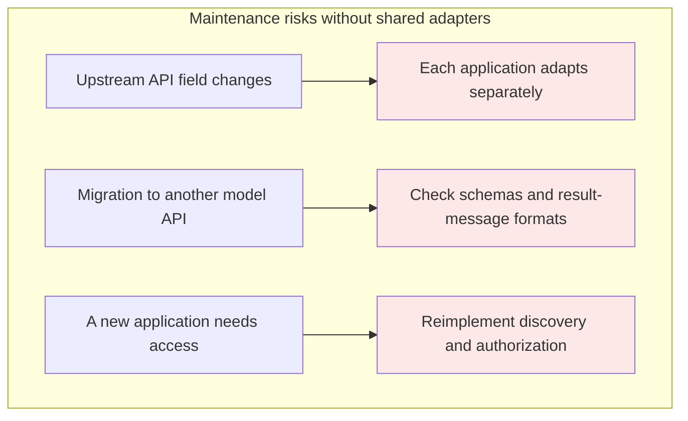
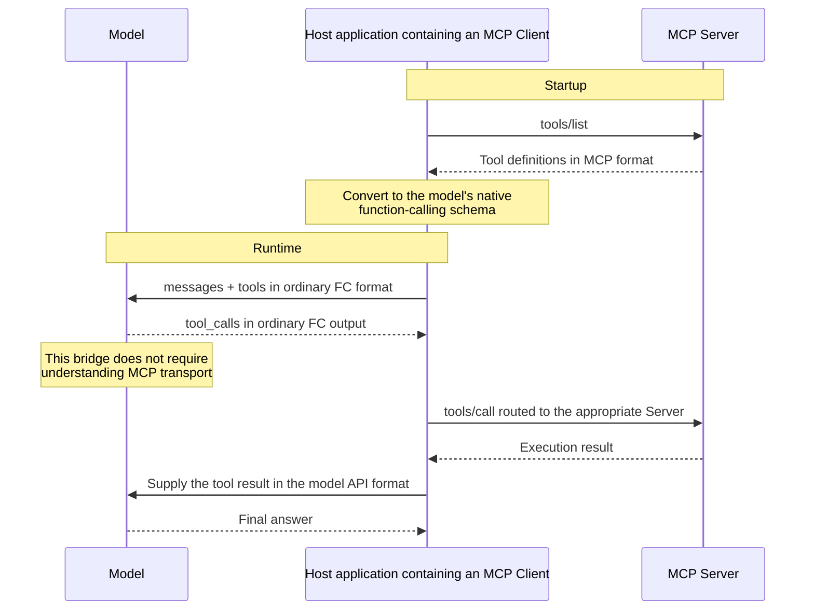
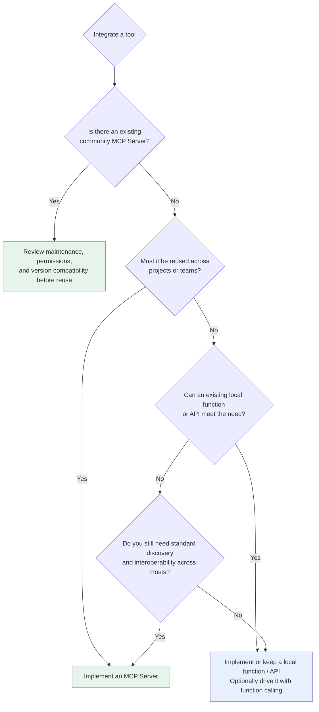

# Chapter 6: MCP and Function Calling—Differences and Tradeoffs

## 6.1 The question can start from the wrong premise

“What is the difference between MCP and function calling?” can be misleading because it suggests they are competing alternatives at the same level. In fact:

> **MCP and function calling address different interface boundaries and are often combined by the same Host. MCP does not specify or require a model to support function calling.**

The precise distinction is:

| | Function calling | MCP |
|---|---|---|
| Problem addressed | **How the model expresses** an intent to call | **How tools are provided and discovered** |
| Interface participants | Model ↔ application | Application ↔ tool provider |
| Tool implementation location | Unspecified: local function or remote API | A Server exposes capabilities as a local process or remote service |
| Layer | Model output-format convention | Tool ecosystem standard |

The difference is the interface boundary, not deployment location. Function calling can already trigger remote services; MCP supplies common discovery, messaging, and capability negotiation.

## 6.2 The real integration pain around function calling

Copying one schema looks cheap. The calculation changes at team scale.

If **5 applications** independently integrate **8 tools**, there are **40 integration combinations**. Shared SDKs or internal services can reduce duplicated code; MCP is one way to standardize these integrations.



The core risk is maintaining the same tool integration in multiple applications because no shared adapter exists. Function calling itself does not manage tools or interoperability across applications. MCP can fill that role, but so can an existing shared SDK or internal service.

## 6.3 A common integration: the Host routes MCP Tools through function calling

A common project architecture uses function calling in the Host to route MCP Tools.



From the model's perspective, this is ordinary function calling. Capability discovery, schema conversion, call routing, and result delivery happen in the Host. The bridge is common, but not required by the MCP specification.

Following this integration path gives two conclusions:

1. **If a model does not support a provider's function-calling interface, only that bridge becomes unavailable.** The Host can still invoke MCP Tools using structured output, deterministic workflows, or a human interface.
2. **If a model selects the Tool, tool-schema engineering still matters.** MCP specifies an interoperability format; it does not guarantee correct tool selection or arguments.

The bridge is not necessarily a field-by-field copy. MCP 2026-07-28 uses JSON Schema 2020-12, whose allowed keywords may exceed a model's strict subset. The Host should reject unsupported definitions or apply documented, testable conversions—not silently delete constraints. Tool-result `content`, `structuredContent`, and `outputSchema` also need mapping to content types accepted by the model. Treating everything as a string can lose images, resource references, or error flags.

## 6.4 Choosing an approach

### 6.4.1 When function calling is enough

**Quick prototypes and demos.** If the goal is to test an idea, defining schemas directly in code is fastest. Building an MCP Server may cost more time than the prototype warrants.

**Tools used by only one application.** An interface querying a particular private company table, with no use elsewhere, may be clearer inside the project. Maintaining a separate process for it can be overengineering.

**Fine-grained execution control.** Permission checks, argument preprocessing, special error handling, and call tracing are easiest to place directly in the invocation code. An independent MCP Server process needs additional agreements for such customization.

**Restricted deployment environments.** An environment that cannot launch subprocesses cannot use a local stdio Server, but it can still connect to a remote Streamable HTTP Server. Compare the operational costs of an existing API and MCP rather than concluding that MCP is impossible.

### 6.4.2 When MCP is a better fit

**A maintained Server already exists.** First check the publisher, license, maintenance status, protocol version, and permission scope. Old official examples may be archived. The existence of a community implementation does not mean it has been security-tested or suits the business.

**Tools need reuse across projects or teams.** MCP can concentrate upstream business integration on the Server side. Clients still need model bridges, permissions, and version compatibility; not every change benefits every consumer automatically.

**The tool set has grown.** There is no universal numerical threshold—“use MCP above 3 tools” is not meaningful. Consider three dimensions together:

| Dimension | Favors function calling | Favors MCP |
|---|---|---|
| Reuse boundary | One consuming application with maintainable existing adapters | Multiple Hosts need a shared capability contract |
| Operational ownership | The application team maintains the existing call chain | The provider can own Server versions, authentication, and availability |
| Impact of changes | Changes affect one caller | Multiple callers repeatedly adapt to upstream API changes |

These dimensions matter more than tool code size. A function of a few dozen lines need not become a separate service; one valuable tool reused by multiple Hosts may justify standardization.

**An agent needs several independent tool sources.** MCP can integrate code execution, filesystems, databases, and external APIs as modules. “We are building an agent” is not itself a selection criterion. Keep existing interfaces if they already meet reuse and governance needs.

### 6.4.3 A decision flow



### 6.4.4 Combining them is normal

Real projects commonly **combine** the approaches rather than choose just one:

```python
# Shared capabilities via MCP: reuse community filesystem, GitHub, and database tools
mcp_tools = await load_mcp_tools(["filesystem", "github", "postgres"])

# Business-specific capabilities via function calling: embedded for permissions and auditing
local_tools = [check_user_quota_schema, internal_billing_schema]

tools = mcp_tools + local_tools
```

The functions here are application pseudocode. Business-specific capabilities can also be shared through an MCP Server used by several applications. The real criteria are reuse boundaries, permissions, deployment, and maintenance ownership—not a binary split between “general-purpose” and “business-specific.”

## 6.5 Try an MCP integration

Run a local experiment against a read-only directory and record versions, configuration, discovery results, and failure symptoms. If you have not actually run it, do not present a tutorial's problems as your own production experience.

### 6.5.1 Minimal integration

```json
{
  "mcpServers": {
    "filesystem": {
      "command": "/absolute/path/to/reviewed-filesystem-server",
      "args": ["/Users/me/projects"]
    }
  }
}
```

This is illustrative configuration. Replace the entry point with an installed, reviewed, version-pinned program. Whether the Host needs a restart depends on the product. The directory argument configures the filesystem Server implementation; it is **not the Roots protocol itself**. Roots are context hints, not an enforced sandbox, and are deprecated in 2026-07-28. Filesystem access still needs Server-side path validation and OS isolation.

The old `@modelcontextprotocol/server-github` is archived; see [github/github-mcp-server](https://github.com/github/github-mcp-server) for GitHub's official implementation. Inject tokens through a credential manager or controlled environment; do not commit them to a configuration repository.

### 6.5.2 Write a Server

```python
from mcp.server.fastmcp import FastMCP

mcp = FastMCP("order-service")

@mcp.tool()
def get_order(order_id: str) -> dict:
    """Look up order details by order ID. Fuzzy search is not supported."""
    return db.query_order(order_id)

@mcp.resource("orders://recent")
def recent_orders() -> str:
    """Read-only summary of orders from the last 24 hours."""
    return format_orders(db.recent(hours=24))

if __name__ == "__main__":
    mcp.run()
```

For `@mcp.tool()`, the SDK generates the input schema from parameter types and the description from the docstring. The Host then decides how to expose it to the model. The description-writing guidance in [Chapter 3](../01-function-calling/03-tool-schema-design.md) still applies. By contrast, `@mcp.resource()` registers a readable resource; the function's existence alone does not make it a model tool.

The application must implement `db` and `format_orders` and add authentication and object-level filtering. This SDK example does not claim support for every protocol version. Pin dependencies and validate against the intended version.

### 6.5.3 Practical pitfalls

| Pitfall | Symptom | Cause |
|---|---|---|
| **stdout contamination** | The Server fails to connect with a JSON parsing error | Debug `print` output enters the stdio protocol stream. Logs must go to stderr |
| **Missing environment variables** | Works in a shell but fails when launched by a GUI Client | Subprocesses usually inherit the parent environment, but GUI Hosts may not load shell configuration and may filter variables |
| **Tool-name collisions** | The model calls a tool on the wrong Server | Several Servers expose the same name; use prefixes to distinguish them |
| **Context growth** | Slower responses and sharply higher cost | Too many Servers, with dozens of full tool definitions sent on every turn |
| **Version mismatch** | Some features are unavailable | The Server implements an older specification without the new feature |

If the Host injects all tools, it incurs context overhead; apply the filtering methods in [Chapter 3](../01-function-calling/03-tool-schema-design.md). Resolve version incompatibility through the protocol compatibility matrix, not by reducing tool counts to hide it.

## 6.6 Common mistakes

### 6.6.1 Saying MCP necessarily builds on function calling

They are neither replacements nor necessarily upstream and downstream of each other. Function calling is a common model adapter; MCP defines the Host/Client–Server protocol. A Host can use other mechanisms to initiate `tools/call`.

### 6.6.2 Saying only “MCP is more standardized”

Explain what work it reduces: tool reuse across applications, capability discovery on known Servers, and centralized upstream adaptation. Someone must still own Server addresses, authentication configuration, model bridges, and compatibility tests.

### 6.6.3 Adopting MCP without comparing maintenance costs

Wrapping a ten-line internal tool used by one person in a separate process only adds deployment and operational work. Choose according to reuse requirements, not the age of the technology.

### 6.6.4 Assuming MCP makes tool descriptions unimportant

The protocol standardizes the transport format, not description quality. A poor Server docstring can still cause the model to select the wrong tool.

### 6.6.5 Ignoring MCP's context costs

MCP discovery does not force every tool into model context. A Host can discover tools with pagination, cache them, and retrieve relevant tools under the caller's permissions. Measure actual injected tokens and tool-retrieval recall; do not assign a fixed cost from Server count alone.

### 6.6.6 Ignoring trust in third-party Servers

Local Servers involve code execution; remote Servers involve sending data outside the application. Both require trust review. Tool descriptions can also be poisoned; see [tool protocol security](15-tool-protocol-security.md).

## 6.7 Chapter summary

1. **MCP and function calling can cooperate without a mandatory dependency.**
2. **The essential difference is interface participants and responsibilities**, not local versus remote deployment.
3. **MCP reduces repeated adaptation**, but shared SDKs and other approaches also enable reuse. Compare maintenance costs.
4. **In a function-calling bridge, the model need not know about MCP.** If the model lacks FC support, the Host can choose another MCP invocation path.
5. **FC fits lightweight, application-specific, finely controlled, or deployment-constrained uses.**
6. **MCP is a better fit for shared capability contracts and independent tool sources**, provided there are trusted implementations and clear operational owners.
7. **Decision order:** check for an existing community implementation → assess reuse needs → compare environment constraints and maintenance costs.
8. **Combining approaches is valid.** One Host can route MCP Tools, existing APIs, and local functions.


## References

- [Model Context Protocol documentation](https://modelcontextprotocol.io/docs/getting-started/intro)
- [MCP Server development quickstart](https://modelcontextprotocol.io/docs/develop/build-server)
- [MCP Servers official examples](https://github.com/modelcontextprotocol/servers)
- [Archived MCP examples](https://github.com/modelcontextprotocol/servers-archived)
- [MCP Roots: deprecation and the absence of a security boundary](https://modelcontextprotocol.io/specification/2026-07-28/client/roots)
- [OpenAI: Function calling guide](https://platform.openai.com/docs/guides/function-calling)
- [Anthropic: Introducing the Model Context Protocol](https://www.anthropic.com/news/model-context-protocol)
