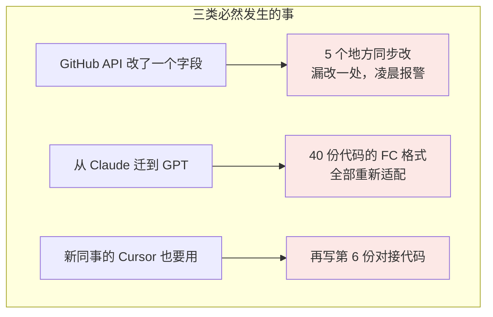
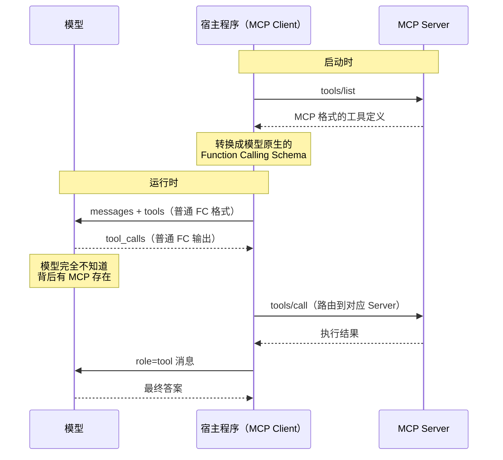
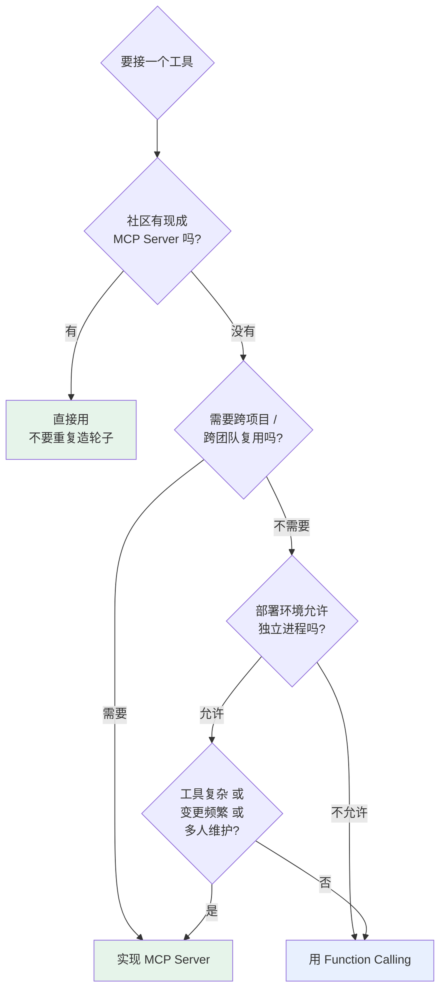

# 第六章：MCP 与 Function Calling 的区别与选型

## 6.1 先纠正一个提法

「MCP 和 Function Calling 有什么区别」这个问题本身有点误导性，因为它暗示两者是并列的竞品。实际上：

> **MCP 和 Function Calling 解决不同接口边界，常被同一个 Host 组合使用；MCP 并不规定或要求模型必须支持 Function Calling。**

准确的区分是：

| | Function Calling | MCP |
|---|---|---|
| 解决的问题 | 模型**怎么表达**调用意图 | 工具**怎么被提供和发现** |
| 协议双方 | 模型 ↔ 应用 | 应用 ↔ 工具提供方 |
| 工具的存在形式 | **内嵌**在应用代码里 | **独立**进程 / 服务 |
| 层次 | 模型输出格式约定 | 工具生态标准 |

「内嵌 vs 独立」这个直觉，能推导出后面所有的选型结论。

## 6.2 Function Calling 的真实痛点

复制一份 Schema 看起来不算什么工作量，但把账算到团队规模就不一样了。

假设团队有 **5 个应用**，每个接 **8 个工具**——这就是 **40 份工具对接代码**在同时维护。



核心问题不是「写起来麻烦」，而是**同一个工具，换个应用就要重新对接一遍，每次都是一次性的手工活**。工具的管理、复用和跨平台兼容，Function Calling 一个都没解决——因为它压根不负责这些。

## 6.3 常见集成：Host 用 Function Calling 路由 MCP Tool

这是最关键、也最能体现理解深度的一点。



在这种集成中，模型的视角确实是普通 Function Calling，能力发现、schema 转换、调用路由和结果回传都在 Host 层完成。这种桥接很常见，但不是 MCP 的规范要求。

这个事实有两个直接推论：

1. **模型不支持某厂商的 Function Calling 时，只有这条桥接路径不可用**。Host 仍可通过结构化输出、确定性工作流或人工界面调用 MCP Tool；
2. **若由模型选择 Tool，工具 schema 工程仍然适用**。MCP 规定互操作格式，不保证模型会正确选择或填写参数。

## 6.4 选型：什么时候用哪个

### 6.4.1 Function Calling 够用的场景

**快速原型和 Demo**。目标是跑通想法，直接在代码里定义 Schema 最快。搭 MCP Server 的时间可能超过原型本身的价值。

**工具只服务这一个应用**。查本公司某张私有表的接口，绝不会被其他地方用到，写在项目里反而更清晰。为它单独维护一个进程是过度设计。

**需要对执行逻辑做精细控制**。权限校验、参数二次处理、特殊错误处理、调用链路追踪，直接嵌在调用代码里最方便。MCP Server 是独立进程，这类定制要额外约定。

**部署环境受限**。某些云环境或 Serverless 平台不允许启动子进程，stdio 模式的 MCP Server 就没法用。这时退回 Function Calling 是最稳妥的。

### 6.4.2 MCP 更合适的场景

**社区已有现成 Server**。GitHub、Slack、PostgreSQL、Puppeteer 这类高频工具都有经过测试、文档完整的官方或社区实现。这种情况下手写对接代码就是重复造轮子。

**工具需要跨项目或跨团队复用**。这是 MCP 的核心价值。维护责任收敛到 Server 一侧，所有客户端自动受益。

**工具规模上来了**。这里不给绝对数字门槛（「超过 3 个就上 MCP」这种说法没意义），要看三个维度综合：

| 维度 | 倾向 Function Calling | 倾向 MCP |
|---|---|---|
| 单个工具复杂度 | 几行就写完 | 几十行，有认证和错误处理 |
| 团队规模 | 一个人维护 | 多人协作 |
| 变更频率 | 基本不动 | 接口时常调整 |

三个维度都偏右，就算只有 5 个工具也会很快陷入维护泥潭；三个都偏左，两个工具也没必要引入独立 Server。

**在构建 Agent 系统**。Agent 的工具需求往往多样：代码执行、文件系统、数据库、外部 API。全靠 Function Calling 的话，工具 Schema 会成为 Agent 代码里最难维护的部分。MCP 让工具来源模块化，Agent 核心逻辑和工具管理解耦。

### 6.4.3 判断流程



### 6.4.4 混用是常态

实际项目里最常见的形态不是二选一，而是**混用**：

```python
# 通用能力走 MCP：文件系统、GitHub、数据库，用社区现成的
mcp_tools = await load_mcp_tools(["filesystem", "github", "postgres"])

# 业务专属能力走 Function Calling：内嵌，方便加权限和审计
local_tools = [check_user_quota_schema, internal_billing_schema]

tools = mcp_tools + local_tools
```

判断依据很简单：**这个能力是通用的还是业务专属的**。通用能力社区大概率已经做好了，业务专属能力反正只有你自己用，内嵌更方便。

## 6.5 实际跑一遍 MCP

面试里问「有没有实际跑过 MCP」，说得出配置细节和踩过的坑，可信度立刻不一样。

### 6.5.1 最简接入

```json
{
  "mcpServers": {
    "github": {
      "command": "npx",
      "args": ["-y", "@modelcontextprotocol/server-github"],
      "env": {"GITHUB_PERSONAL_ACCESS_TOKEN": "ghp_..."}
    },
    "filesystem": {
      "command": "npx",
      "args": ["-y", "@modelcontextprotocol/server-filesystem", "/Users/me/projects"]
    }
  }
}
```

改完重启客户端，工具就自动出现了，一行代码都不用写。注意 `filesystem` 那个路径参数——它限定了 Server 能操作的目录范围，这是 Roots 机制的体现。

### 6.5.2 自己写一个 Server

```python
from mcp.server.fastmcp import FastMCP

mcp = FastMCP("order-service")

@mcp.tool()
def get_order(order_id: str) -> dict:
    """根据订单号查询订单详情。不支持模糊搜索。"""
    return db.query_order(order_id)

@mcp.resource("orders://recent")
def recent_orders() -> str:
    """最近 24 小时的订单摘要（只读）"""
    return format_orders(db.recent(hours=24))

if __name__ == "__main__":
    mcp.run()
```

函数签名和 docstring 会被自动转成 JSON Schema。docstring 就是模型看到的 `description`——[第三章](../01-function-calling/03-tool-schema-design.md) 那套写法在这里同样适用。

### 6.5.3 实际会踩的坑

| 坑 | 现象 | 原因 |
|---|---|---|
| **stdout 污染** | Server 连不上，报 JSON 解析错误 | stdio 模式下 `print` 调试信息混进了协议流。日志必须走 stderr |
| **环境变量丢失** | 本地能跑，客户端启动就报认证失败 | 子进程不继承 shell 的环境变量，必须在配置的 `env` 里显式声明 |
| **工具名冲突** | 模型调错 Server 的工具 | 多个 Server 有同名工具，需要加前缀区分 |
| **上下文膨胀** | 响应变慢、成本飙升 | 接了太多 Server，几十个工具定义每轮全量传 |
| **版本不匹配** | 部分功能不可用 | Server 实现的是旧规范版本，新特性用不了 |

最后两个在生产环境影响最大。上下文膨胀的解法是 [第三章](../01-function-calling/03-tool-schema-design.md) 讲的动态工具筛选——不要把所有 Server 的工具无脑全量注入。

## 6.6 常见错误

### 6.6.1 说 MCP 必然建立在 Function Calling 之上

二者并非替代品，也不是必然上下游。Function Calling 是常见的模型适配层；MCP 定义 Host/Client 与 Server 的协议。Host 可采用其他机制发起 `tools/call`。

### 6.6.2 只说「MCP 更标准化」

这个回答太空。要能具体说出解决的是什么：**工具的跨应用复用**、**自动发现免去硬编码**、**维护责任从 N 个接入方收敛到 1 个提供方**。

### 6.6.3 无脑上 MCP

一个只有自己用、逻辑十行的内部工具，包成独立进程只是增加了部署和运维负担。选型要看复用需求，不是看技术新旧。

### 6.6.4 以为用了 MCP 就不用管工具描述

协议标准化了传输格式，没有标准化描述质量。Server 的 docstring 写得烂，模型照样选错工具。

### 6.6.5 忽略 MCP 的上下文成本

每接一个 Server，它的全部工具定义都会进上下文，而且每轮都传。接五个 Server 可能就是上万 token 的固定开销。

### 6.6.6 忽略第三方 Server 的信任问题

装一个第三方 MCP Server 等于在应用里跑第三方代码，它能看到所有传给它的参数。工具描述本身也可能被投毒。见 [Agent 安全章节](../../agent/05-production/15-agent-security.md)。

## 6.7 本章总结

1. **MCP 与 Function Calling 可以配合，但不存在强制依赖**；
2. **本质区别是「内嵌 vs 独立」**，这个直觉能推导出所有选型结论；
3. **FC 的痛点是工具管理与复用**，M 个应用 × N 个工具的维护成本会线性爆炸；
4. **在 Function Calling 桥接中，模型无需感知 MCP**；模型不支持 FC 时，Host 可选择其他 MCP 调用路径；
5. **FC 适合轻量、专属、需精细控制、部署受限的场景**；
6. **MCP 适合有现成实现、需跨项目复用、工具规模大、构建 Agent 系统的场景**；
7. **判断顺序**：先看社区有没有现成的 → 再看要不要复用 → 再看环境和维护成本；
8. **混用是常态**：通用能力走 MCP，业务专属能力走 FC。

> **一句话概括：Function Calling 让模型会调工具，MCP 让工具不用被重复接入，前者是模型的能力，后者是生态的基础设施。**

## 参考资料

- [Model Context Protocol 官方文档](https://modelcontextprotocol.io/docs/getting-started/intro)
- [MCP 服务端开发快速上手](https://modelcontextprotocol.io/docs/develop/build-server)
- [MCP Servers 官方示例仓库](https://github.com/modelcontextprotocol/servers)
- [OpenAI: Function Calling 指南](https://platform.openai.com/docs/guides/function-calling)
- [Anthropic: Introducing the Model Context Protocol](https://www.anthropic.com/news/model-context-protocol)
