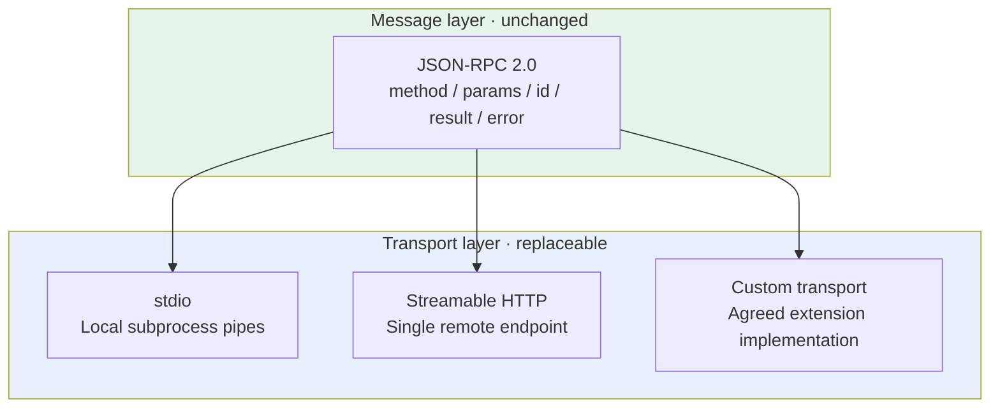
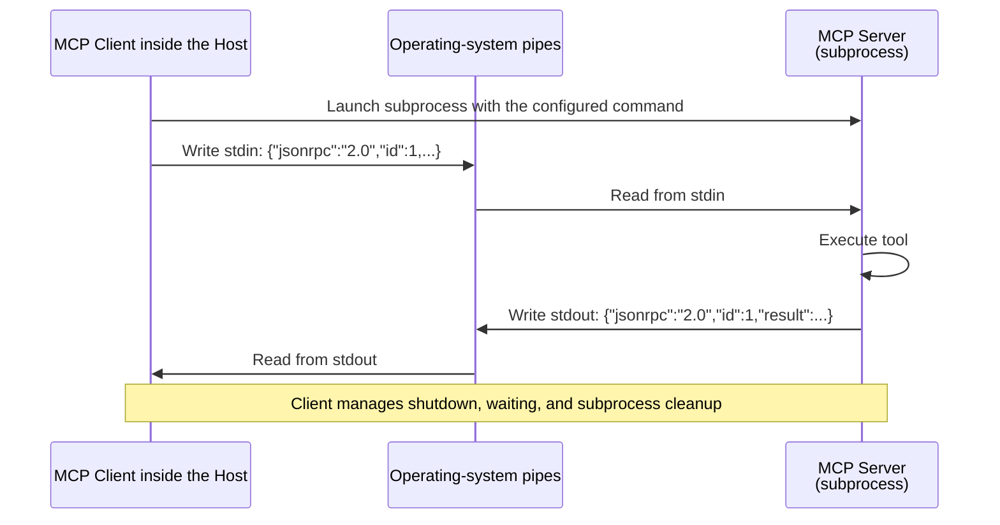
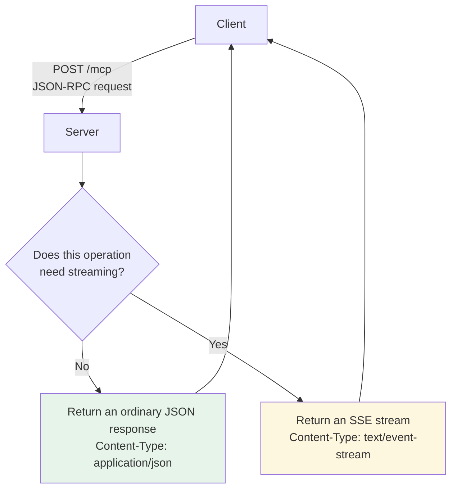
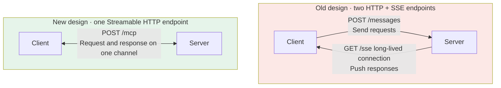

# Chapter 12: MCP Transports

## 12.1 Message format and transport are decoupled

First, separate the message format from the transport:



Transports reuse JSON-RPC method semantics, but their bindings differ in request metadata, cancellation, recovery, and authentication. Switching transports requires more than verifying that “JSON arrives.”

MCP's current standard transports are stdio and Streamable HTTP. **WebSocket is not a standard transport**, though the specification permits pluggable custom transports. A Client and Server can choose WebSocket if they explicitly agree and correctly carry UTF-8 JSON-RPC. Do not call it a standard MCP transport or assume all Clients support it.

## 12.2 Message format: JSON-RPC 2.0

### 12.2.1 Why use it?

The reason is straightforward: MCP needs **remote procedure calls (RPC)** in which a Client invokes a Server method and receives a result.

JSON-RPC 2.0 is lightweight, readable, easy to debug, and implementable across languages. Unlike a typical gRPC/Protobuf code-generation workflow, it does not require generated code. That does not remove schema validation, nor mean that gRPC supports only statically generated clients.

### 12.2.2 What messages look like

The following shows a 2026-07-28 request and completion result, with a placeholder for image data. The request and response are two separate messages.

```jsonc
// Request (Client → Server)
{
  "jsonrpc": "2.0",
  "id": 1,
  "method": "tools/call",
  "params": {
    "name": "take_screenshot",
    "arguments": { "url": "https://example.com" },
    "_meta": {
      "io.modelcontextprotocol/protocolVersion": "2026-07-28",
      "io.modelcontextprotocol/clientCapabilities": {},
      "io.modelcontextprotocol/clientInfo": {"name": "example", "version": "1.0.0"}
    }
  }
}

// Response (Server → Client)
{
  "jsonrpc": "2.0",
  "id": 1,
  "result": {
    "resultType": "complete",
    "content": [{"type": "image", "data": "...base64...", "mimeType": "image/png"}]
  }
}
```

Three points matter:

- **`id` matches a response to its request.** This enables concurrent requests: several can be in flight at once, and their IDs distinguish them.
- **A request message without `id` is a notification.** Not every JSON object lacking `id` is a notification.
- **Protocol errors use `error`**, with required `code` and `message` and optional `data`. A tool-execution error can instead appear inside an ordinary `result` with `isError: true`. Do not confuse the two layers.

## 12.3 Transport 1: stdio

### 12.3.1 How it works

The Client **launches the Server as a subprocess**, writes requests to the process's standard input (`stdin`), and reads responses from its standard output (`stdout`).



A pipe can be understood as **a first-in, first-out buffer that the operating system allocates in memory for two processes**. The Client writes one line of JSON; the Server reads it from the other end, processes it, and writes back through another pipe.

This communication **does not traverse a network interface or the TCP/IP stack**. The data travels through RAM.

### 12.3.2 Three advantages of stdio

| Advantage | Explanation |
|---|---|
| **No network round trip** | JSON serialization, pipe copying, and scheduling still cost time; no fixed speedup is guaranteed |
| **The protocol channel opens no port** | The Server itself may still access the network or open ports; isolate it separately |
| **Straightforward lifecycle management** | The Client starts the process, closes pipes, waits for exit, and cleans up; do not assume parent exit automatically kills the child |

The configuration needs to tell the Client which command launches the Server:

```json
{
  "mcpServers": {
    "filesystem": {
      "command": "/absolute/path/to/reviewed-filesystem-server",
      "args": ["/Users/me/projects"],
      "env": {}
    }
  }
}
```

This is illustrative Host configuration; replace the entry point with an installed, version-pinned program. stdio messages are UTF-8 and newline-delimited. Escape newlines inside strings; do not emit pretty-printed, multiline JSON.

### 12.3.3 The biggest stdio pitfall: stdout is only for protocol messages

[Chapter 5](05-mcp-components.md) mentioned this, but it deserves emphasis because it is so common in custom Servers:

**JSON-RPC has exclusive use of stdout. Any non-protocol content contaminates the channel and can make the Client fail to parse it.**

The Chinese strings below are example log data: the first says “querying the database,” and the second says “executing an authorized database query.”

```python
# Fatal mistake: print writes to stdout
print(f"正在查询数据库: {sql}")

# Send logs to stderr, and avoid logging complete SQL directly
import sys
print("正在执行已授权的数据库查询", file=sys.stderr)
```

A single debugging `print` can break the entire Server, often producing only a “JSON parsing failed” message that hides the root cause.

## 12.4 Transport 2: Streamable HTTP

### 12.4.1 Core design: one endpoint

For remote access, the Server runs as an independent HTTP service. The currently recommended transport is **Streamable HTTP**.

Its central design uses **one HTTP endpoint, typically `/mcp`, for requests and responses**:



**Choosing per operation is the point.** Simple synchronous operations return JSON directly; operations that need streaming return SSE. A long-lived connection is not mandatory.

### 12.4.2 Benefits and costs

| Benefit | Cost |
|---|---|
| A cloud-deployed Server can be shared by multiple Clients | Adds a network path; end-to-end latency still depends on backend data location and processing time |
| Cross-machine access with centrally managed team tools | Authentication and authorization must be handled |
| No separate local instance for every person | Network interruptions and reconnection must be handled |

A typical example is a team sharing one database MCP Server deployed on a server, with centralized permissions and auditing.

### 12.4.3 Required HTTP headers and response boundaries in the current version

Under [2026-07-28 Streamable HTTP](https://modelcontextprotocol.io/specification/2026-07-28/basic/transports/streamable-http):

- Send each JSON-RPC request in a separate POST. The Client declares `Accept: application/json, text/event-stream` and must handle both response types; the request body uses `Content-Type: application/json`. The transport also defines notification POST mechanics, but this core revision uses no HTTP Client notifications. Do not send a JSON-RPC response to answer MRTR.
- Requests carry `MCP-Protocol-Version` and `Mcp-Method`. `tools/call`, `prompts/get`, and `resources/read` also require `Mcp-Name`. Version, method, and name must agree with the body; checking only one copy is insufficient.
- A Server may use `x-mcp-header` in `inputSchema` to mirror designated arguments into `Mcp-Param-*` headers. Clients must validate and encode them as specified. These headers may enter proxy logs, so minimize sensitive information. Headers are not an independent source of authorization.
- The current version removes the GET receive stream, `Mcp-Session-Id`, and SSE `Last-Event-ID` replay. List changes use the POST response stream of `subscriptions/listen`; call progress stays on the originating request's response stream, not the subscription stream.
- If the final response has not arrived, an HTTP SSE response-stream disconnect is treated as request cancellation. A normal close after the final response is not a failure. stdio uses `notifications/cancelled` correlated with the original request. Cancellation asks the Server to stop further work as soon as practical; it does not undo committed business side effects.

After a disconnect, do not assume reconnection resumes the same call. Resubmission uses a new request ID, but for writes, first reconcile the result or use a business idempotency key. A stateless protocol does not imply stateless business logic: represent cross-call state with explicit handles bound to the caller, tenant, and expiry.

## 12.5 Why the early two-endpoint SSE design was deprecated

Some early tutorials still describe “HTTP + SSE.” This was the remote transport in the original MCP specification, 2024-11-05. It was **deprecated in 2025-03-26**: retained for backward compatibility, but not for new projects.

### 12.5.1 The problem was the two channels



Splitting one exchange across two channels complicates **state management**.

Suppose the network fails just after the Client POSTs a message. **Was the message processed? Will the SSE stream deliver its result?** The Client has no simple answer, and debugging requires tracing a longer path.

The two channels require correlated routing. Combining endpoints reduces that coordination, but does not solve the unknown-outcome problem when a connection drops after submission, nor automatically provide exactly-once execution.

### 12.5.2 SSE remains; the endpoints were combined

**Streamable HTTP did not abandon SSE.**

Streaming still uses SSE (`Content-Type: text/event-stream`); the two endpoints became one. The architecture changed, not the underlying technology.

## 12.6 Standard and custom transports

The **HTTP binding** in 2026-07-28 uses POST, with JSON or request-scoped SSE responses. Do not extend HTTP rules to stdio. Standard request-header mirroring is required, not an optional optimization. Server→Client input requirements come back as MRTR results, no longer as independent reverse JSON-RPC requests.

For legacy interoperability, identify the protocol era using the [version compatibility page](https://modelcontextprotocol.io/specification/2026-07-28/basic/versioning). A recognized `UnsupportedProtocolVersionError` calls for choosing a mutually supported modern version, not immediately downgrading. Legacy initialization fallback must be explicitly supported by a dual-era implementation. Authorization failure must not trigger an unauthenticated retry.

A custom transport should meet MCP's message-encoding and security requirements and define connection setup, message framing, authentication, shutdown, and error handling. WebSocket can be such a **nonstandard extension**, but does not automatically gain stdio/Streamable HTTP interoperability. For remote HTTP services, also validate `Origin`, enforce authentication, and avoid exposing local services to untrusted networks.

## 12.7 Common mistakes

### 12.7.1 Calling WebSocket a standard MCP transport

MCP's standard transports are stdio and Streamable HTTP. Both parties can implement WebSocket as a custom transport, but that provides no general interoperability guarantee.

### 12.7.2 Assuming a local connection means HTTP

An exclusively used local tool often uses stdio. A local service shared by several processes can use HTTP. Even localhost HTTP needs `Origin` validation, authentication, and an appropriate bind address.

### 12.7.3 Confusing message format with transport

JSON-RPC 2.0 is the message format; stdio and Streamable HTTP are transports. Core tool semantics are reusable, but a transport change still requires authentication, headers, cancellation, connection-failure handling, and retry policies to be adapted.

### 12.7.4 Assuming Streamable HTTP abandoned SSE

Its streaming still uses SSE. What changed was the endpoint count—from two to one—not the underlying technology.

### 12.7.5 Logging to stdout with stdio

One `print` can make the Server unusable. Logs must go to stderr.

### 12.7.6 Treating a serverless implementation strategy as a protocol requirement

The current specification makes every request self-contained. Legacy sessions, GET SSE, and Server→Client requests exist only for compatibility. Pin the protocol version and detect compatibility using the matrix; do not splice together transport semantics from two eras.

## 12.8 Chapter summary

1. **Message format and transport are decoupled.** This is fundamental to understanding MCP communication.
2. **The message format is JSON-RPC 2.0.** Serialization, validation, and request correlation still matter.
3. **stdio suits local subprocesses.** Separate logs from protocol traffic and let the Client manage process lifecycles.
4. **stdout is reserved for the protocol; logs go to stderr.** This is an especially common pitfall in custom Servers.
5. **Use Streamable HTTP for remote access:** one endpoint, returning ordinary JSON or an SSE stream as needed.
6. **The early two-endpoint HTTP + SSE transport is Deprecated**, which does not mean it has disappeared from all compatibility implementations.
7. **Current Streamable HTTP can return SSE**, but does not retain legacy sessions, GET receive streams, or Last-Event-ID replay. List changes require explicit subscriptions.
8. **Custom transports are permitted beyond the standard ones.** WebSocket, for example, requires explicit support at both ends and must not be presented as a universal standard.


## References

- [MCP specification 2026-07-28: Transports](https://modelcontextprotocol.io/specification/2026-07-28/basic/transports)
- [MCP 2026-07-28 Streamable HTTP](https://modelcontextprotocol.io/specification/2026-07-28/basic/transports/streamable-http)
- [MCP 2026-07-28 stdio](https://modelcontextprotocol.io/specification/2026-07-28/basic/transports/stdio)
- [MCP 2026-07-28 version compatibility](https://modelcontextprotocol.io/specification/2026-07-28/basic/versioning)
- [MCP specification 2025-03-26: the introduction of Streamable HTTP](https://modelcontextprotocol.io/specification/2025-03-26/basic/transports)
- [JSON-RPC 2.0 specification](https://www.jsonrpc.org/specification)
- [Official MCP Server collection](https://github.com/modelcontextprotocol/servers)
- [MDN: Server-Sent Events](https://developer.mozilla.org/en-US/docs/Web/API/Server-sent_events/Using_server-sent_events)
