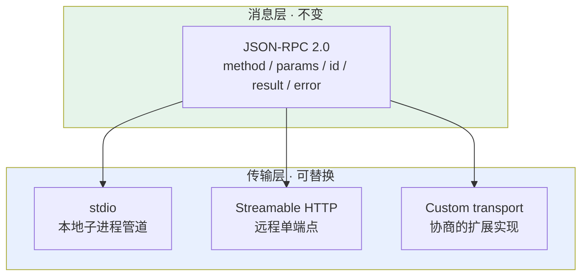
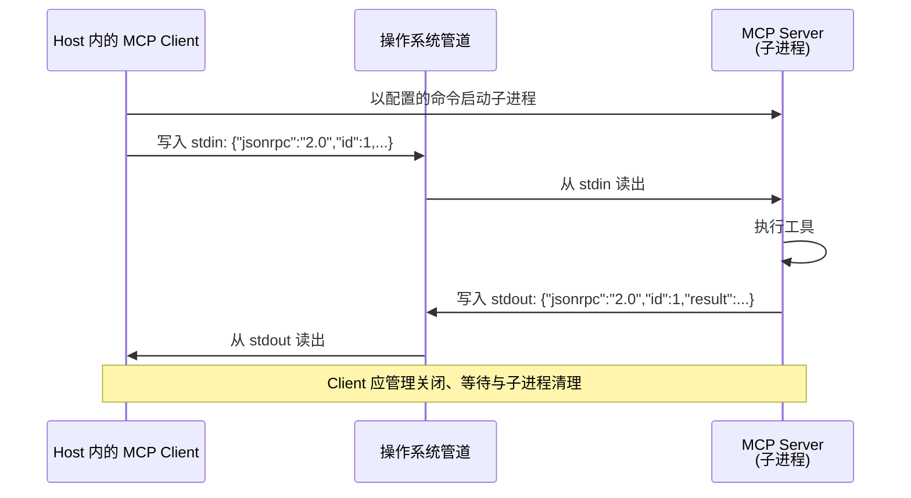
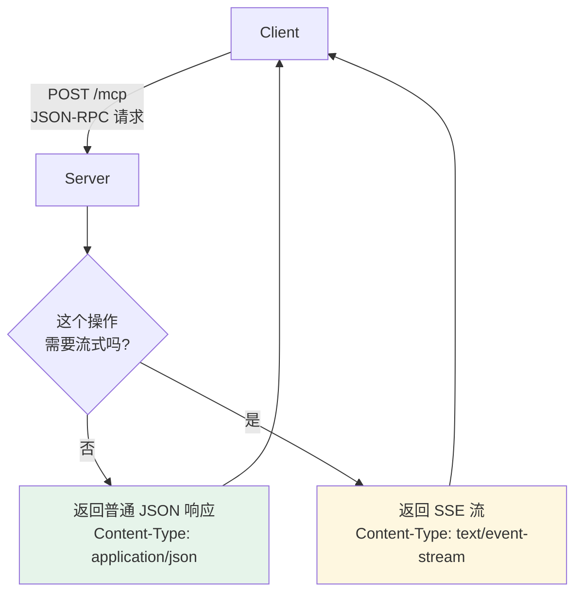
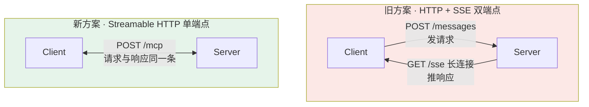

# 第十二章：MCP 的传输层

## 12.1 传输方式与消息格式是解耦的

先把消息格式和传输方式分开看：



传输复用 JSON-RPC 方法语义，但请求元数据、取消、故障恢复和认证有绑定差异。切换传输不能只验证“能收到 JSON”。

当前 MCP 标准传输是 stdio 与 Streamable HTTP。**WebSocket 不是标准传输**，但规范允许 Client 与 Server 以可插拔方式实现自定义传输；双方明确协商并正确承载 UTF-8 JSON-RPC 时，可以选择 WebSocket。不能把它误称为标准 MCP transport 或假定所有客户端兼容。

## 12.2 消息格式：JSON-RPC 2.0

### 12.2.1 为什么选它

原因很朴素：MCP 需要的就是「Client 调用 Server 的方法，Server 返回结果」这类**远程过程调用（RPC）**。

JSON-RPC 2.0 是轻量 RPC 规范，JSON 易读易调试，可跨语言实现。相较常见的 gRPC/Protobuf 生成代码流程，它不强制代码生成；这不代表没有 Schema 校验，也不代表 gRPC 只能使用静态生成的客户端。

### 12.2.2 消息长什么样

下面为 2026-07-28 请求与完成结果，图片数据用占位符；请求和响应是两条独立消息。

```jsonc
// 请求（Client → Server）
{
  "jsonrpc": "2.0",
  "id": 1,
  "method": "tools/call",
  "params": {
    "name": "take_screenshot",
    "arguments": { "url": "https://example.com" },
    "_meta": {
      "io.modelcontextprotocol/protocolVersion": "2026-07-28",
      "io.modelcontextprotocol/clientCapabilities": {},
      "io.modelcontextprotocol/clientInfo": {"name": "example", "version": "1.0.0"}
    }
  }
}

// 响应（Server → Client）
{
  "jsonrpc": "2.0",
  "id": 1,
  "result": {
    "resultType": "complete",
    "content": [{"type": "image", "data": "...base64...", "mimeType": "image/png"}]
  }
}
```

三个要点：

- **`id` 用于匹配请求与响应**，这是支持并发请求的基础——多个请求可以同时在途，靠 `id` 对上号；
- **没有 `id` 的请求消息是通知**，不能把所有无 `id` JSON 都当通知；
- **协议错误用 `error`**，其中 `code`、`message` 必需，`data` 可选；工具执行错误可在正常 `result` 中以 `isError: true` 表达，两层不能混淆。

## 12.3 传输方式一：stdio

### 12.3.1 工作原理

Client 启动时把 Server **当作子进程拉起来**，通过进程的标准输入（stdin）发请求、从标准输出（stdout）读响应。



这里的「管道」可以理解成**操作系统在内存里给两个进程分配的一段先进先出缓冲区**。Client 往里塞一行 JSON，Server 从另一头读出来处理，处理完往另一条管道塞回去。

整个过程**不经过网卡、不经过 TCP/IP 协议栈**，数据在 RAM 里走了一趟就到了。

### 12.3.2 stdio 的三个优点

| 优点 | 说明 |
|---|---|
| **省去网络往返** | 仍有 JSON 序列化、管道复制和调度开销，不能保证固定倍数提速 |
| **协议通道不开端口** | Server 自身仍可访问网络或打开端口，要另做隔离 |
| **便于管理生命周期** | Client 负责启动、关闭管道、等待退出及清理；不能假定父进程退出自动杀掉子进程 |

配置只需要告诉 Client「用什么命令启动 Server」：

```json
{
  "mcpServers": {
    "filesystem": {
      "command": "/absolute/path/to/reviewed-filesystem-server",
      "args": ["/Users/me/projects"],
      "env": {}
    }
  }
}
```

这是宿主配置示意，启动入口需替换为已安装且固定版本的程序。stdio 消息使用 UTF-8、按换行分隔；消息内部的字符串换行应转义，不能输出多行漂亮打印的 JSON。

### 12.3.3 stdio 最大的坑：stdout 是协议专用通道

[第五章](05-mcp-components.zh.md) 提过，这里再强调一次，因为它是自写 Server 时踩得最多的坑：

**stdout 被 JSON-RPC 独占，任何非协议内容写进去都会污染通道，导致 Client 解析失败。**

```python
# 致命错误：print 写的是 stdout
print(f"正在查询数据库: {sql}")

# 日志走 stderr，也避免直接记录完整 SQL
import sys
print("正在执行已授权的数据库查询", file=sys.stderr)
```

一个 `print` 调试语句就能让整个 Server 挂掉，而且报错信息通常是「JSON 解析失败」，看不出根因。

## 12.4 传输方式二：Streamable HTTP

### 12.4.1 核心设计：单端点

远程场景下 Server 作为独立 HTTP 服务运行。当前推荐的传输方式是 **Streamable HTTP**。

核心设计是**用单个 HTTP 端点（通常是 `/mcp`）同时处理请求和响应**：



**「按需选择」是关键**：简单同步操作直接返回 JSON，需要流式输出时才返回 SSE 流。不强制建立长连接。

### 12.4.2 优缺点

| 优点 | 代价 |
|---|---|
| Server 部署在云端，多 Client 共享同一份 | 增加网络路径，端到端延迟仍取决于后端数据位置与处理时间 |
| 跨机器访问，团队统一管理工具服务 | 需要处理认证、鉴权 |
| 不需要每个人本地跑一份 | 需要处理网络中断与重连 |

典型场景：团队共用一个部署在服务器上的数据库 MCP Server，所有人连同一个服务，权限和审计集中管理。

### 12.4.3 当前版 HTTP 的必需头与响应边界

以 [2026-07-28 Streamable HTTP](https://modelcontextprotocol.io/specification/2026-07-28/basic/transports/streamable-http)为准：

- 每条 JSON-RPC 请求通过独立 POST 发送，客户端声明 `Accept: application/json, text/event-stream`，两种响应都必须处理；请求体使用 `Content-Type: application/json`。传输还定义通知 POST，但本版核心不使用 HTTP 客户端通知，不能发送 JSON-RPC response 来回答 MRTR。
- 请求带 `MCP-Protocol-Version` 和 `Mcp-Method`；`tools/call`、`prompts/get`、`resources/read` 还必须带 `Mcp-Name`。版本、方法和名称须与消息体一致，不能只检查其中一份。
- Server 可通过 `inputSchema` 中的 `x-mcp-header` 将指定参数镜像为 `Mcp-Param-*`。客户端需按规范校验与编码；这些头可能进入代理日志，应做敏感信息最小化。头不是独立授权来源。
- 当前版已移除 GET 接收流、`Mcp-Session-Id` 和 SSE `Last-Event-ID` 重放。列表变化使用 `subscriptions/listen` 的 POST 响应流；调用进度在原请求响应流，不混发到订阅流。
- 若最终响应尚未收到，HTTP SSE 响应流断开按请求取消处理；最终响应后的正常关闭不是一次失败。stdio 使用关联原请求的 `notifications/cancelled`。取消只要求尽快停止后续工作，不是撤销已提交的业务副作用。

断线后不能假定“重连继续原调用”。重新提交使用新的请求 ID，但写操作要先核对结果或使用业务幂等键。无状态协议也不等于无状态业务：跨调用状态应通过显式 handle 表达，并绑定调用者、租户和有效期。

## 12.5 为什么早期的 SSE 双端点方案被弃用

一些早期教程还在讲「HTTP + SSE」传输方式。这是 MCP 最初版本（2024-11-05 规范）的远程方案，**在 2025-03-26 规范里被标记为 deprecated**——保留向后兼容，但新项目不应再用。

### 12.5.1 问题出在两条通道



同一个对话被拆成了两条通道，具体问题是**状态管理复杂**：

Client POST 了一条消息后网络突然断了——**那条消息到底被处理了没？SSE 流会不会推回结果？** Client 没有简单办法判断，排查链路很长。

两条通道需要关联路由；合并端点减少了这类协调，但并未解决“请求提交后连接断开”的结果未知问题，也不自动提供 exactly-once。

### 12.5.2 SSE 还在，只是端点合并了

**Streamable HTTP 并没有抛弃 SSE。**

流式推送的部分底层依然是 SSE（`Content-Type: text/event-stream`），只是把端点从两个合并成了一个。变的是架构，不是底层技术。

## 12.6 标准传输与自定义传输

2026-07-28 的 **HTTP 绑定**使用 POST，响应为 JSON 或请求专属 SSE；不要把 HTTP 规则推广到 stdio。标准请求头镜像是必需项，不是任选优化。Server→Client 输入需求用 MRTR 结果返回，不再以独立反向 JSON-RPC 请求发送。

兼容旧服务时按[版本兼容页](https://modelcontextprotocol.io/specification/2026-07-28/basic/versioning)识别协议时代。识别到 `UnsupportedProtocolVersionError` 应选共同支持的现代版本，而不是直接降级；旧版初始化回退需由 dual-era 实现明确支持。鉴权失败不应触发无授权重试。

自定义 transport 应满足 MCP 的消息编码和安全要求，并明确规定连接建立、消息边界、认证、关闭与错误处理。WebSocket 可以成为这样的**非标准扩展**，但不会自动获得 stdio/Streamable HTTP 的互操作性。对远程 HTTP 服务，还应校验 `Origin`、实施认证并避免将本地服务暴露到不受信任网络。

## 12.7 常见错误

### 12.7.1 把 WebSocket 说成标准 MCP transport

MCP 的标准 transport 是 stdio 和 Streamable HTTP。WebSocket 可由双方实现为 custom transport，但不是通用互操作保证。

### 12.7.2 本地场景想成 HTTP

本地独享工具常选 stdio；本地多进程共享服务也可用 HTTP。若使用 localhost HTTP，仍需校验 `Origin`、认证及绑定地址。

### 12.7.3 把消息格式和传输方式混为一谈

JSON-RPC 2.0 是消息格式，stdio / Streamable HTTP 是传输方式。核心工具语义可以复用，切换传输仍需适配认证、请求头、取消、连接故障与重试策略。

### 12.7.4 认为 Streamable HTTP 抛弃了 SSE

它内部流式推送仍然用 SSE，变的是端点数量（两个合成一个），不是底层技术。

### 12.7.5 stdio 场景里往 stdout 打日志

一个 `print` 就能让 Server 彻底不可用。日志必须走 stderr。

### 12.7.6 把 Serverless 实现策略当成协议要求

当前规范按请求自包含；旧版会话、GET SSE 和 Server→Client request 仅用于兼容。实现时要固定协议版本并按兼容矩阵检测，不能把两代传输语义拼在一起。

## 12.8 本章总结

1. **传输方式与消息格式解耦**，这是理解 MCP 通信的核心；
2. **消息格式是 JSON-RPC 2.0**，仍需序列化、校验与请求关联；
3. **stdio 适合本地子进程**，日志与协议流分离，进程生命周期由 Client 落实；
4. **stdout 被协议独占**，日志必须走 stderr，这是自写 Server 最容易踩的坑；
5. **远程场景用 Streamable HTTP**：单端点，Server 按需返回普通 JSON 或 SSE 流；
6. **早期 HTTP + SSE 双端点已 Deprecated**，不等于从兼容实现中全部移除；
7. **当前 Streamable HTTP 可返回 SSE**，但不保留旧版 session、GET 接收流或 Last-Event-ID 重放；列表变化需显式订阅；
8. **标准 transport 之外可使用 custom transport**；例如 WebSocket 需由双方显式支持，不能冒充通用标准。


## 参考资料

- [MCP 规范 2026-07-28：Transports](https://modelcontextprotocol.io/specification/2026-07-28/basic/transports)
- [MCP 2026-07-28 Streamable HTTP](https://modelcontextprotocol.io/specification/2026-07-28/basic/transports/streamable-http)
- [MCP 2026-07-28 stdio](https://modelcontextprotocol.io/specification/2026-07-28/basic/transports/stdio)
- [MCP 2026-07-28 版本兼容](https://modelcontextprotocol.io/specification/2026-07-28/basic/versioning)
- [MCP 规范 2025-03-26（Streamable HTTP 引入版本）](https://modelcontextprotocol.io/specification/2025-03-26/basic/transports)
- [JSON-RPC 2.0 规范](https://www.jsonrpc.org/specification)
- [MCP 官方 Server 集合](https://github.com/modelcontextprotocol/servers)
- [MDN: Server-Sent Events](https://developer.mozilla.org/en-US/docs/Web/API/Server-sent_events/Using_server-sent_events)
