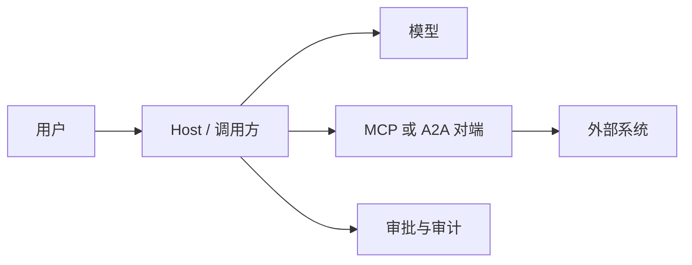

# 第十五章：Tool Protocol 安全

## 15.1 先划信任边界

MCP 和 A2A 都让不受模型控制的数据、描述和动作进入 Agent 链路。协议可互操作，不等于对端、工具描述或参数可信。

Host/调用方应是策略执行点：验证身份和来源、限制工具与数据、审批高风险动作、记录可追溯证据。不要让模型文本、Agent Card 或工具 description 自行决定权限。

## 15.2 OAuth 2.1、PKCE 与 audience

远程 MCP Server 是 OAuth 2.1 的 Resource Server；Client 是 OAuth Client。A2A 的 Agent Card 也可以声明 OAuth 2.0 security scheme。两者都应由受信任的授权服务器签发并验证访问令牌。

| 控制项 | 要求 |
|---|---|
| **Authorization Code + PKCE** | 公共客户端使用 Authorization Code 流程与 PKCE（S256）；不要用隐式流程或把 client secret 放进桌面/浏览器应用。 |
| **精确 redirect URI** | 授权服务器只接受预注册的完整回调 URI，不能按前缀或通配符匹配。 |
| **audience/resource** | 请求令牌时绑定目标 Resource Server（RFC 8707 `resource`）；资源服务器验证 `aud`、issuer、签名、到期时间与 scope。 |
| **最小 scope** | 令牌只授予当前用户、当前 Server 和当前操作所需权限；读写、项目和租户要分开。 |
| **刷新与撤销** | 短生命周期 access token；保护 refresh token，并支持撤销、轮换和异常会话失效。 |

`audience` 检查防止“拿给 A 的 token 调 B”。仅验证签名或 `scope` 不够：令牌必须是**为当前资源服务器签发**的。

### 15.2.1 禁止 token passthrough

MCP Client 不应把获得的 access token 原样转发给下游 Server 或其他工具。下游若需要身份，应通过自己的 OAuth 授权、token exchange 或受控的后端凭据获取**面向该 audience 的短期令牌**。

Token passthrough 会混淆 Client 与 Resource Server 的责任，并扩大 token 的 audience、日志和泄露面；这也是 MCP 授权规范明确要求防范的 confused-deputy 风险。

## 15.3 工具与内容的两类攻击

### 15.3.1 SSRF 与网络出口

URL、回调地址、文件 URI 和 A2A/MCP endpoint 都是潜在 SSRF 输入。执行网络工具前应：

1. 只允许 `https` 等明确 scheme，并用 allowlist 限制域名、端口、路径与重定向次数；
2. DNS 解析后拒绝 loopback、link-local、私网、metadata IP 和 IPv6 等价地址；每次重定向重新检查；
3. 使用隔离的 egress proxy、短超时、响应大小上限和无凭据网络段；
4. 对本地 Streamable HTTP MCP Server 校验 `Origin`，默认仅绑定 loopback，以防 DNS rebinding。

不要只按 URL 字符串过滤：域名重绑定、十进制/IPv6 地址、重定向和代理都会绕过简单黑名单。

### 15.3.2 Tool poisoning 与间接提示注入

Tool 的名称、description、Agent Card、Resource 内容和工具返回值都是不可信输入。恶意内容可能诱导模型泄露数据、扩大 scope 或调用不相关的写工具。

防御要点：

- 将工具元数据与返回内容标为不可信数据，禁止其修改系统策略、审批结果或身份；
- 安装前固定 Server 来源、版本和发布者；审阅所请求的文件、网络、环境变量和 OAuth scope；
- 以 allowlist 向模型暴露工具；高风险工具拆成只读、草稿和提交三步；
- 服务端重新校验参数、租户、对象归属与授权，不能相信模型生成的 JSON；
- 限制 Resource URI、工具输出长度和可执行内容，防止上下文投毒与数据外带。

## 15.4 最小权限、审批与审计

安全不是每次都弹确认框。确认应与风险绑定，且必须向用户显示**将对哪个对象执行什么动作、使用什么身份、影响范围是什么**。

| 风险 | 建议控制 |
|---|---|
| 读取公开资料 | 限域、速率限制、审计 |
| 读取用户/租户数据 | 用户授权、对象级访问控制、脱敏 |
| 写草稿或创建可撤销对象 | 显示预览；按策略可自动化 |
| 发布、删除、转账、改权限、外发数据 | 明确人工审批、幂等键、二次校验与可回滚设计 |

审计记录至少包含：请求关联 ID、用户/服务身份、Agent/Server 身份与版本、授权主体和 scope、工具名、已验证参数摘要、审批决定、结果、时间、错误及数据分类。日志应避免记录 bearer token、原始机密或不必要的个人数据。

### 15.4.1 A2A 的额外注意点

Agent Card 是能力声明，不是信任证明。调用 A2A Agent 前，应验证 Card 的来源与 TLS 身份，按 Card 的 security scheme 完成授权，并把 push-notification webhook 当作外部输入：签名验证、重放防护、允许的目标域和任务关联缺一不可。

任务、artifact 和 file URI 也需要对象级授权与内容扫描；“Agent 自己说已经完成”不能替代对结果、来源和写入动作的验证。

## 15.5 上线检查表

- [ ] MCP/A2A endpoint、redirect URI、issuer 和 audience 均为 allowlist；
- [ ] 公共 OAuth Client 使用 Authorization Code + PKCE S256；
- [ ] 每个资源服务器验证签名、issuer、`aud`、过期时间、scope 和租户；
- [ ] 未将 access token 转发给未声明的下游；
- [ ] Tool、Card、Resource 与返回值均按不可信输入处理；
- [ ] URL 工具具备 DNS、重定向、私网和 metadata 防护；
- [ ] 高影响动作有预览、明确审批、幂等性和服务端复核；
- [ ] 审计日志可关联一次任务全链路，且已做机密与隐私最小化。

## 15.6 常见错误

### 15.6.1 把 Agent Card 或 Tool description 当成授权证明

它们只是对端声明，也是潜在不可信输入。权限必须由认证身份、服务端策略和对象级检查决定。

### 15.6.2 只验证 token 签名，不验证 audience

签名有效不代表令牌是发给当前资源服务器的。还要检查 issuer、`aud`、到期时间、scope 与租户。

### 15.6.3 让 MCP Client 透传上游 access token

这会扩大令牌适用范围并制造 confused deputy。下游应获得面向自身 audience 的短期令牌。

### 15.6.4 用确认弹窗替代最小权限

用户无法审查隐藏参数和复杂调用链。审批只处理剩余高风险，基础边界仍靠 allowlist、隔离和服务端校验。

## 15.7 本章总结

1. 协议互操作不建立信任，Host 才是策略执行点；
2. OAuth 流程要落实 PKCE、精确回调、audience、最小 scope、轮换与撤销；
3. 工具元数据、Card、Resource 和返回值都是不可信输入；
4. URL、回调和远端 endpoint 必须经过 SSRF 与网络出口控制；
5. 高影响动作需要明确审批、幂等、服务端复核与最小化审计。

## 参考资料

- [MCP 2026-07-28 Authorization](https://modelcontextprotocol.io/specification/2026-07-28/basic/authorization)
- [MCP 2026-07-28 Security Best Practices](https://modelcontextprotocol.io/specification/2026-07-28/basic/security_best_practices)
- [MCP 2026-07-28 Transports](https://modelcontextprotocol.io/specification/2026-07-28/basic/transports)
- [A2A v1.0.0: Security Schemes](https://a2a-protocol.org/v1.0.0/specification)
- [RFC 9700: OAuth 2.0 Security Best Current Practice](https://www.rfc-editor.org/rfc/rfc9700)
- [RFC 7636: PKCE](https://www.rfc-editor.org/rfc/rfc7636)
- [RFC 8707: Resource Indicators for OAuth 2.0](https://www.rfc-editor.org/rfc/rfc8707)
