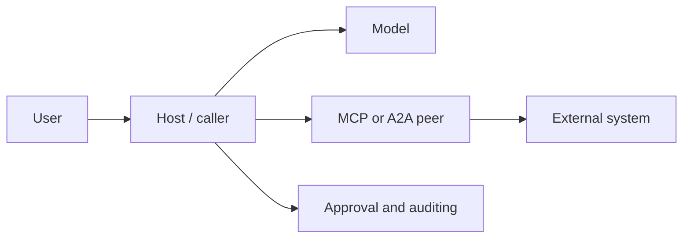

# Chapter 15: Tool Protocol Security

## 15.1 Establish trust boundaries first

MCP and A2A both bring data, descriptions, and actions outside the model's control into an agent's execution path. Protocol interoperability does not make the peer, tool description, or arguments trustworthy.

The Host/caller should enforce policy: verify identity and provenance, restrict tools and data, approve high-risk actions, and retain traceable evidence. Model text, Agent Cards, and tool `description` fields must not decide permissions for themselves.

## 15.2 OAuth 2.1, PKCE, and audience

Authorization is **OPTIONAL** in MCP. A protected HTTP Server adopting this authorization specification acts as an OAuth Resource Server, and the Client acts as an OAuth Client. stdio does not use this HTTP authorization-discovery flow; credentials come from the environment or controlled configuration. A2A can declare OAuth but also supports other security schemes, so OAuth is not universally required.

The 2026-07-28 MCP specification references **OAuth 2.1 IETF draft-13**, not a published RFC. Client ID Metadata Documents are also referenced as a draft. RFC 9728 (Protected Resource Metadata) and RFC 8707 (Resource Indicators), by contrast, are published RFCs. These are the versions referenced by MCP, not a claim that the drafts are the latest IETF revisions today.

| Control | Requirement |
|---|---|
| **Authorization Code + PKCE** | Public clients use the Authorization Code flow with PKCE (S256). Do not use the implicit flow or embed client secrets in desktop/browser applications. |
| **Exact redirect URI** | Match registered callback URIs exactly as specified. RFC 8252 defines an exception for native-application loopback ports; this is not permission to use arbitrary wildcards. |
| **audience/resource** | Specify the RFC 8707 `resource` in both authorization and token requests. The resource server checks the token's intended target, issuer, expiry, scopes, and object permissions. Verify JWT signatures; validate opaque tokens through the appropriate introspection or Server-side mechanism. |
| **Minimal scopes** | Grant only the permissions needed by the current user, Server, and operation. Separate reads and writes, projects, and tenants. |
| **Refresh and revocation** | Use short-lived access tokens, protect refresh tokens, and support revocation, rotation, and invalidation of anomalous sessions. |

An `audience` check prevents “using a token meant for A to call B.” Signature or `scope` validation alone is insufficient: the token must have been **issued for the current resource server**.

Authorization discovery finds the authorization server through protected resource metadata, then reads its OAuth/OIDC metadata. Discovered URLs still need SSRF and provenance checks. Current MCP recommends support for Client ID Metadata Documents; dynamic client registration (DCR) is deprecated but retained for compatibility. Isolate credentials by issuer and never reuse an old client secret after the issuer changes. When an authorization response includes `iss`, compare it with the recorded issuer. Reject a response that omits `iss` when the peer advertised that it would supply it.

### 15.2.1 Token passthrough is prohibited

A Client sending an access token **issued for the target MCP Server** to that Server is normal use. Prohibited token passthrough means an MCP Server accepts and uses a token issued for another service, or forwards a received token to a downstream API without validation. Downstream access requires a separate authorization relationship and credentials intended for that downstream service. Token exchange is an option only when the systems explicitly support it.

Token passthrough confuses Client and Resource Server responsibilities, bypasses intended token-audience boundaries, and creates more opportunities for tokens to enter logs. Forwarding does not itself change the token's `aud`. This can create a **confused deputy** risk: a service with downstream privileges is induced to perform an unauthorized operation for another caller.

## 15.3 Two classes of attacks involving tools and content

### 15.3.1 SSRF and network egress

URLs, callback addresses, file URIs, and A2A/MCP endpoints are potential SSRF inputs. Before executing network tools:

1. Allow only explicit schemes such as `https`, and use allowlists for domains, ports, paths, and redirect counts.
2. Public-web retrieval tools should deny loopback, link-local, private-network, metadata IP, and equivalent IPv6 destinations by default. Permit internal tools through separate, precise policies. Bind DNS validation to the actual connection target and repeat checks on every redirect.
3. Use isolated egress proxies, short timeouts, response-size limits, and network segments without credentials.
4. Validate `Origin` on local Streamable HTTP MCP Servers and bind only to loopback by default to guard against DNS rebinding.

Filtering URL strings alone is insufficient. DNS rebinding, decimal or IPv6 addresses, redirects, and proxies can defeat simple denylists.

### 15.3.2 Tool poisoning and indirect prompt injection

Tool names, descriptions, Agent Cards, Resource content, and tool results are all untrusted input. Malicious content may steer a model toward leaking data, expanding scopes, or calling unrelated write tools.

Defensive measures:

- Mark tool metadata and returned content as untrusted data; do not let them alter system policy, approval decisions, or identity.
- Before installation, pin the Server source, version, and publisher. Review requested filesystem, network, environment-variable, and OAuth-scope access.
- Expose tools to the model through an allowlist. Split high-risk tools into read-only, draft, and commit stages.
- Revalidate arguments, tenant, object ownership, and authorization on the Server. Do not trust model-generated JSON.
- Restrict Resource URIs, tool-output length, and executable content to limit context poisoning and data exfiltration.

Tool annotations such as `readOnlyHint`, `destructiveHint`, and `idempotentHint` are untrusted hints—not sandboxes, authorization, or idempotency implementations. Review description/schema changes again. MCP 2026-07-28 schemas may contain `$ref` and composition structures; constrain remote resolution, recursion, resource consumption, and cache scope so that the validator does not become another network entry point.

## 15.4 Least privilege, approval, and auditing

Security does not mean displaying a confirmation dialog every time. Confirmation should match risk and tell the user **what action will affect which object, under which identity, and with what scope of impact**.

| Risk | Suggested controls |
|---|---|
| Reading public material | Domain restrictions, rate limits, auditing |
| Reading user/tenant data | User authorization, object-level access control, redaction |
| Writing drafts or creating reversible objects | Preview; automation may be permitted by policy |
| Publishing, deleting, transferring money, changing permissions, or sending data externally | Explicit human approval, idempotency keys, and revalidation. Design rollback where possible; otherwise explain consequences first and prepare compensation |

Audit records should include at least the request correlation ID, user/service identity, Agent/Server identity and version, authorizing principal and scopes, tool name, a summary of validated arguments, approval decision, result, time, error, and data classification. Avoid logging bearer tokens, raw secrets, or unnecessary personal data.

Bind approval to the exact normalized arguments, target object, execution identity, and expiry. If the amount, recipient, or tool definition changes after approval, revalidate and seek approval again as policy requires. The user must not approve one operation only for a different one to execute.

### 15.4.1 Additional A2A considerations

An Agent Card declares capabilities; it does not prove trustworthiness. Apply the authentication required by A2A 1.0 `securitySchemes` and `securityRequirements`; individual capability entries may declare their own requirements. Validate webhooks using the agreed bearer token, signature, or other authentication, and handle replay, duplicate notifications, and task correlation. Not all A2A webhooks mandate the same signature scheme.

Tasks, artifacts, and file URIs also need object-level authorization and content scanning. An agent's claim that it has finished is not a substitute for verifying the result, provenance, and write actions.

## 15.5 Pre-release checklist

- [ ] MCP/A2A endpoints, redirect URIs, issuers, and audiences are allowlisted.
- [ ] Public OAuth Clients use Authorization Code + PKCE S256.
- [ ] Each resource server validates token validity, issuer, target resource, expiry, scopes, and tenant according to token type.
- [ ] Access tokens are not forwarded to undeclared downstream services.
- [ ] Tools, Cards, Resources, and returned content are treated as untrusted input.
- [ ] URL tools have DNS, redirect, private-network, and metadata protections.
- [ ] High-impact actions have previews, explicit approval, idempotency, and Server-side rechecks.
- [ ] Audit logs correlate the full task path while minimizing secrets and personal data.

## 15.6 Common mistakes

### 15.6.1 Treating an Agent Card or tool description as proof of authorization

These are peer-provided claims and potentially untrusted input. Permissions must come from authenticated identity, Server policy, and object-level checks.

### 15.6.2 Checking token signatures but not audience

A valid signature does not mean the token was issued for the current resource server. Also check issuer, `aud`, expiry, scopes, and tenant.

### 15.6.3 Confusing normal token use with token passthrough

A Client sending a token to its intended MCP Server is normal. That Server must not use the token to access another audience or accept tokens for another API as authorization for itself.

### 15.6.4 Replacing least privilege with confirmation dialogs

Users cannot inspect hidden arguments or complex call chains. Approval handles residual high risk; the basic boundaries still come from allowlists, isolation, and Server-side validation.

## 15.7 Chapter summary

1. Protocol interoperability does not establish trust. Hosts and Servers enforce authorization separately.
2. OAuth flows need PKCE, exact callbacks, audience checks, minimal scopes, rotation, and revocation.
3. Tool metadata, Cards, Resources, and results are untrusted input.
4. URLs, callbacks, and remote endpoints require SSRF and network-egress controls.
5. High-impact actions require explicit approval, idempotency, Server-side rechecks, and data-minimized auditing.

## References

- [MCP 2026-07-28 Authorization](https://modelcontextprotocol.io/specification/2026-07-28/basic/authorization)
- [MCP 2026-07-28 Security Best Practices](https://modelcontextprotocol.io/specification/2026-07-28/basic/security_best_practices)
- [MCP 2026-07-28 Transports](https://modelcontextprotocol.io/specification/2026-07-28/basic/transports)
- [A2A v1.0.1 released specification](https://github.com/a2aproject/A2A/blob/v1.0.1/docs/specification.md)
- [RFC 9728: OAuth 2.0 Protected Resource Metadata](https://www.rfc-editor.org/rfc/rfc9728)
- [RFC 8252: OAuth for Native Apps and loopback redirects](https://www.rfc-editor.org/rfc/rfc8252)
- [RFC 9700: OAuth 2.0 Security Best Current Practice](https://www.rfc-editor.org/rfc/rfc9700)
- [RFC 7636: PKCE](https://www.rfc-editor.org/rfc/rfc7636)
- [RFC 8707: Resource Indicators for OAuth 2.0](https://www.rfc-editor.org/rfc/rfc8707)
