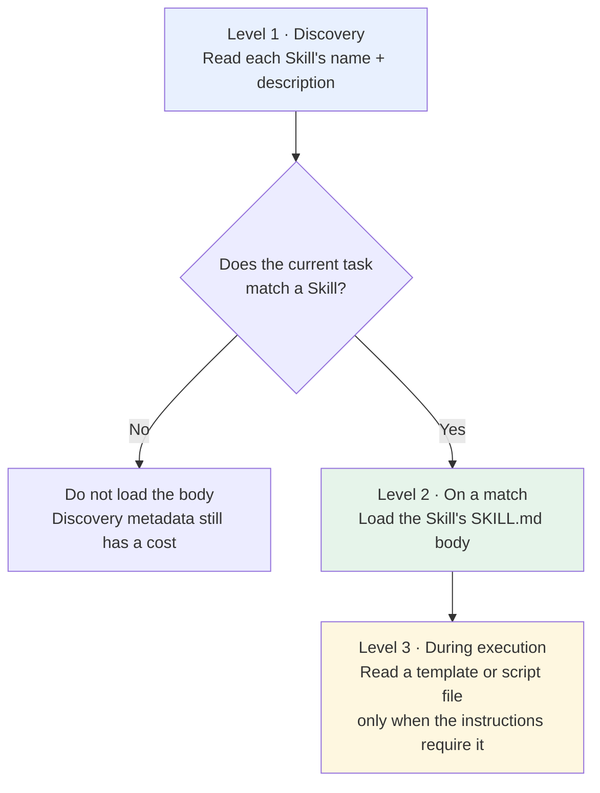
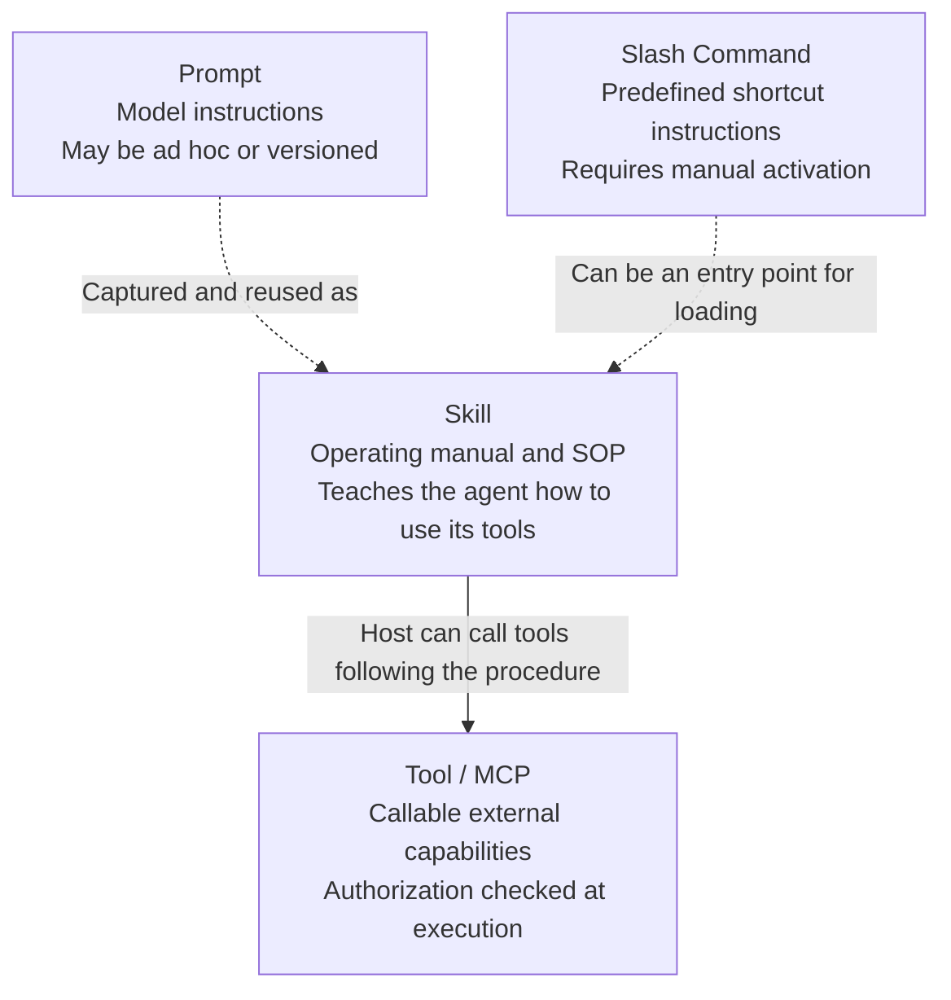

# Chapter 8: What Is a Skill?

## 8.1 The problem with pasting the same prompt

Every time you ask AI to review code, you paste a long set of instructions: which kinds of problems to check, how to format the output, and what to focus on. It is manageable the first time and tiresome by the third. Small differences in what you paste also make the output inconsistent.

The problem grows in a team. Ten people reviewing code may use ten different prompts. Some emphasize security, others performance, and the reviews no longer follow a common standard.

Putting the prompt in a shared document still leaves people to maintain and copy it manually. After an update, someone inevitably keeps using the old version, so review quality remains uneven.

> **A Skill packages recurring instructions, procedures, and templates into a standardized module. An agent can determine when and how to use it, rather than relying on someone to copy and paste the instructions.**

## 8.2 The structure of a Skill

A Skill is **a directory**:

Here, Skill means the **Agent Skills open file format**, not every product feature that happens to use the same name. A Skill's `metadata.version` is metadata supplied by its content maintainer, not a version number for the format specification.

```
code-review/                  # The directory name identifies the Skill
├── SKILL.md                  # Required: core instructions
├── scripts/                  # Optional: executable scripts
│   └── check_security.py
├── references/               # Optional: reference documents
│   └── review_standards.md
└── assets/                   # Optional: templates and resources
    └── report_template.md
```

`SKILL.md` has two parts: YAML front matter declares metadata, and the Markdown body contains the instructions. The following example retains the Chinese instructions that the agent would receive:

```markdown
---
name: code-review
description: "对代码进行全面审查，检查 bug、安全漏洞和性能问题，输出结构化审查报告"
---

# 代码审查 Skill

## 第一步：理解代码上下文
阅读提交的代码，理解功能和所属模块，确认修改范围。

## 第二步：逐项检查
1. 功能正确性：逻辑是否有 bug，边界条件是否处理
2. 安全性：注入、XSS、权限绕过
3. 性能：N+1 查询、不必要的循环、内存泄漏
4. 可读性：命名是否清晰，关键逻辑是否有注释

## 第三步：输出报告
使用 assets/report_template.md 的模板格式输出。
```

In English, the example describes a comprehensive code review for bugs, security vulnerabilities, and performance problems, producing a structured report. Step 1 asks the agent to read the submitted code, understand its functionality and module, and establish the scope of the changes. Step 2 checks four dimensions: functional correctness, including logic and edge cases; security, including injection, XSS, and authorization bypass; performance, including N+1 queries, unnecessary loops, and memory leaks; and readability, including clear names and comments on important logic. Step 3 requires the report format in `assets/report_template.md`.

Ordinary prompts can also be saved, versioned, and reused. What distinguishes a Skill is its agreed directory entry point, discoverable metadata, and organization of resources for on-demand use—not the invention of persistent prompts.

Separate format requirements from product behavior:

- `name` and `description` are required. The name must match its parent directory, be 1–64 characters long, and use the lowercase letters, numbers, and hyphens allowed by the specification. It cannot start or end with a hyphen or contain consecutive `--`.
- `description` must be 1–1024 characters and explain both purpose and activation conditions. `license`, `compatibility`, and the string-to-string map `metadata` are optional.
- `allowed-tools` is **experimental**, and host support varies. It is not a cross-platform grant of permission and cannot override user authorization or sandbox restrictions.
- `scripts/`, `references/`, and `assets/` are all optional. Document script dependencies, system tools, and network requirements clearly; declaring a dependency does not install it.

## 8.3 Progressive disclosure

A Skill's value lies not just in packaging, but in **how its content is loaded**.

### 8.3.1 The cost of loading everything

Suppose you have 20 Skills, each averaging 2000 tokens of instructions and reference material. Loading them all takes **40,000 tokens before anything else**.

On a model with a 200K context window, Skills alone consume one fifth of the capacity. System instructions, conversation history, and user files must share the rest. Worse, most of those 20 Skills are irrelevant to the current task: **loading them serves no purpose**.

### 8.3.2 Three levels of loading



| Level | What is loaded | When | Approximate size |
|---|---|---|---|
| Level 1 | `name` + `description` | Discovery of currently available Skills | The specification estimates about 100 tokens per Skill, not a fixed overhead |
| Level 2 | `SKILL.md` body | When the task is judged to match | The specification recommends fewer than 5000 tokens; this is not a hard limit |
| Level 3 | Scripts, templates, reference documents | When required by the instructions | As needed |

For the hypothetical 20 Skills above, the specification's estimate of roughly 100 metadata tokens per Skill gives about 2000 tokens at discovery. This is an illustration, not a measured guarantee. The specification also recommends keeping the main file under 500 lines and moving detailed material into referenced files. Actual cost depends on the text, tokenizer, and any additional metadata the host injects.

### 8.3.3 Why this design matters

Think of a **new employee's onboarding handbook**. On the first day, you do not read it cover to cover. You scan the contents to learn that it has sections on expense reimbursement and leave policies. When you actually need to claim an expense, you read that section in detail.

A context window has a capacity limit. Irrelevant instructions occupy space that could hold task evidence and may interfere with the model's choices. Loading content on demand reduces that input, but task quality also suffers if routing fails to select a necessary Skill.

This follows the same principle as [agent context compression](../../agent/03-memory-context/10-agent-memory-compression.md): do not fill all available space merely because you can. Give the model the right information at the right time.

### 8.3.4 How description affects Skill selection

Discovery exposes at least `name` and `description`; explicit user selection and host rules may also contribute. Vague descriptions increase both missed selections and false activations. These Chinese model-facing descriptions illustrate the difference:

```yaml
# Poor: too broad; may match anything incorrectly, or nothing at all.
# Meaning: "Help with code-related tasks."
description: "帮助处理代码相关的任务"

# Better: specifies the task type, activation conditions, and output.
# Meaning: "Review Python/Go code for security and performance, producing a
# structured report with risk levels. Use for PR review and pre-release checks."
description: "对 Python/Go 代码做安全与性能审查，输出含风险等级的结构化报告。适用于 PR review 和上线前检查。"
```

As with [tool description design](../01-function-calling/03-tool-schema-design.md), describe capabilities and boundaries clearly, then evaluate selection quality on a task set. Neither kind of description is the sole source of information or an enforcement rule.

## 8.4 Skills and related concepts

These concepts are often confused. An analogy with work in a company helps separate them:



| | What it provides | Who triggers it | Persistent? |
|---|---|---|---|
| **Tool / MCP** | Capability and context interfaces | Model proposals, host workflows, or users | Implementation-dependent |
| **Skill** | Knowledge, procedures, and optional resources | Automatic matching or explicit loading, depending on the host | Yes |
| **Prompt** | Model instructions | User or application | Can be persisted |
| **Slash Command** | Saved instructions | **A user, manually** | Yes |

Two distinctions deserve particular attention.

A Skill and a tool have different responsibilities. A tool provides a capability; a Skill provides a method for using it. Giving a new hire a computer and access to every system does not teach them the code review procedure, the order of checks, or the required report format. **Skills and tools complement rather than replace each other**.

A slash command is an interaction entry point; a Skill is a content format. A host can use `/code-review` to load a Skill explicitly while also allowing the model to select the same Skill automatically. Manual versus automatic activation does not make the two mutually exclusive.

## 8.5 Skills can contain executable scripts

The `scripts/` directory is easy to overlook, but useful in practice.

Scripts can perform deterministic checks, such as finding specific AST patterns. Static scans still have false negatives and false positives. A match does not establish a vulnerability; it must be assessed against data flow and the calling context.

The following Chinese Skill instruction says to run `scripts/check_security.py` first, assess suspicious locations in their calling context, and submit high-risk conclusions for human review:

```markdown
## 第二步：安全检查
先运行 scripts/check_security.py 拿到静态扫描结果，
再结合调用上下文分析可疑位置；高风险结论交由人工复核。
```

This is a division of engineering work: **use code for the parts that can be performed deterministically, and the model for the parts that require judgment**. A Skill provides a place to package both.

Before installing a third-party Skill, review its scripts, dependency installation steps, external links, and permission requirements. Scripts run through the host's tool runtime and may read files, access the network, or cause side effects. The Skill body can also contain prompt injection. A simple format does not imply trustworthiness, freedom from dependencies, or automatic portability.

## 8.6 From an Anthropic feature to an open standard

Anthropic introduced Agent Skills in October 2025, initially through three entry points: Claude Code, the Claude API, and claude.ai.

Two months later, Anthropic published the specification as an **open standard**, allowing any agent platform to implement it.

The file format does not require a separate network service. Using a Skill still requires a host to discover, load, and execute it; scripts also need the appropriate interpreter, dependencies, and permissions. This is an open content format, not a remote-call protocol.

Multiple clients have adopted the format; see the [official client list](https://agentskills.io/clients). When moving between platforms, check activation behavior, tool names, file paths, permission fields, and execution environments. The ability to read Markdown does not guarantee identical behavior.

## 8.7 Common mistakes

### 8.7.1 Calling a Skill an “advanced prompt template”

A minimal Skill can consist solely of `SKILL.md`, and its body can be a set of writing guidelines. What distinguishes it from an ordinary prompt is the convention for a directory entry point, discovery metadata, and on-demand loading. Scripts, reference documents, and templates can accompany it, but are not required.

### 8.7.2 Failing to explain the three levels of progressive disclosure

The three levels are: read metadata first → load instructions on a match → retrieve resources when needed. An explanation should also cover how the host triggers each level and what happens when content is missed, loaded repeatedly, or unavailable.

### 8.7.3 Treating Skills and tools as competitors

A tool provides a callable capability; a Skill organizes methods and materials. An analysis Skill may guide tool use, while a writing-only Skill may simply constrain style. The format does not require tool calls.

### 8.7.4 Writing an overly broad description

Make discovery names and descriptions specific. Test cases where the Skill should activate, cases where it should not, and conflicts with another Skill of the same name. Testing whether the agent follows the steps after loading is not enough.

### 8.7.5 Ignoring the scripts directory

Do not describe every operation in natural language and make the model carry out each one. Checks that can be performed deterministically are more accurate and less expensive when implemented as scripts.

### 8.7.6 Confusing Skills with slash commands

The same Skill can have both explicit and automatic entry points. Unattended operation also requires host policies, resource budgets, and permission for side effects; an activation description alone is insufficient.

## 8.8 Summary

1. **Skills address repeated prompt pasting and inconsistent team standards** by capturing procedural knowledge in maintainable, version-controlled modules.
2. **The structure is a directory**: a required `SKILL.md` plus optional scripts / references / assets.
3. **Progressive disclosure is the core design**: load metadata at startup, instructions on a match, and resources when needed.
4. **In implementation terms, this is context management**. Saving tokens is only part of the benefit; keeping irrelevant content from distracting the model matters more.
5. **`name` and `description` contribute to discovery**. Selection also depends on the user request and host routing.
6. **Tools provide capabilities; Skills provide methods**. They can be combined, but a writing-only Skill need not call tools.
7. **Activation depends on the host**. Slash commands and automatic loading can coexist.
8. **An open format supports reuse**, but scripts, permissions, and host extensions affect compatibility.

## References

- The source manuscript retains commit `69ef37e9424c0a7ea9dd2293b559e43ec8176379` as its historical format baseline and records a 2026-09-15 review of required fields, experimental fields, and loading recommendations on the official format page. The official page has no separate semantic version number. This translation retains that pin; the pinned specification and current format page were checked again on 2026-09-20.
- [Anthropic: Introducing Agent Skills](https://www.anthropic.com/news/skills)
- [Anthropic: Equipping Agents for the Real World with Agent Skills](https://www.anthropic.com/engineering/equipping-agents-for-the-real-world-with-agent-skills)
- [Agent Skills specification](https://agentskills.io/specification)
- [Agent Skills pinned commit used for the format review](https://github.com/agentskills/agentskills/tree/69ef37e9424c0a7ea9dd2293b559e43ec8176379)
- [Claude Docs: Agent Skills](https://docs.claude.com/en/docs/agents-and-tools/agent-skills/overview)
- [Anthropic: Building Effective Agents](https://www.anthropic.com/engineering/building-effective-agents)
- [Anthropic: Effective Context Engineering for AI Agents](https://www.anthropic.com/engineering/effective-context-engineering-for-ai-agents)
