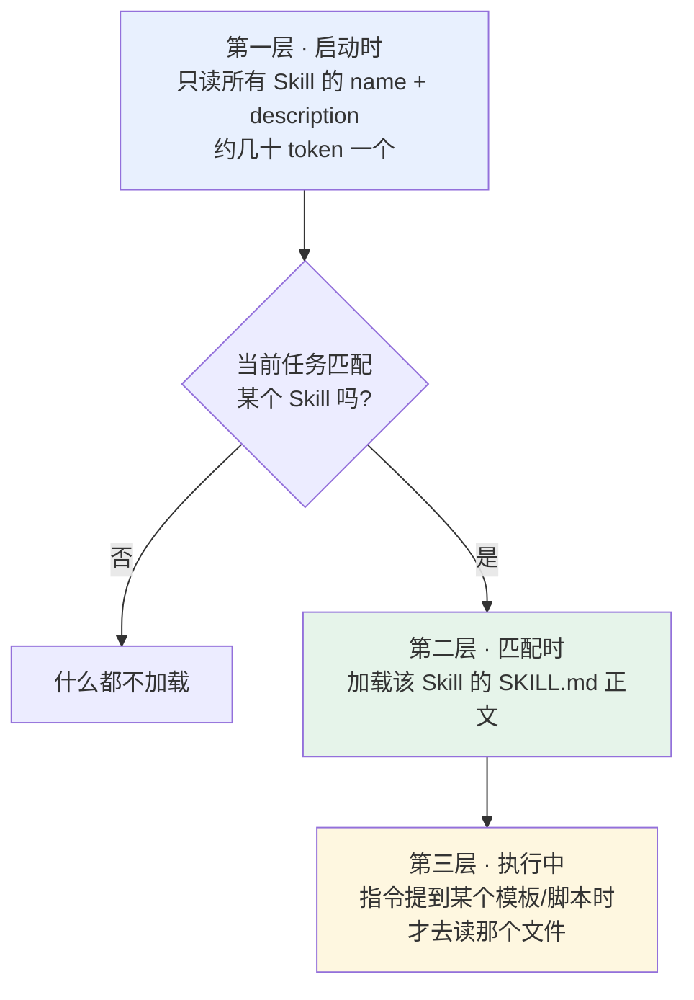
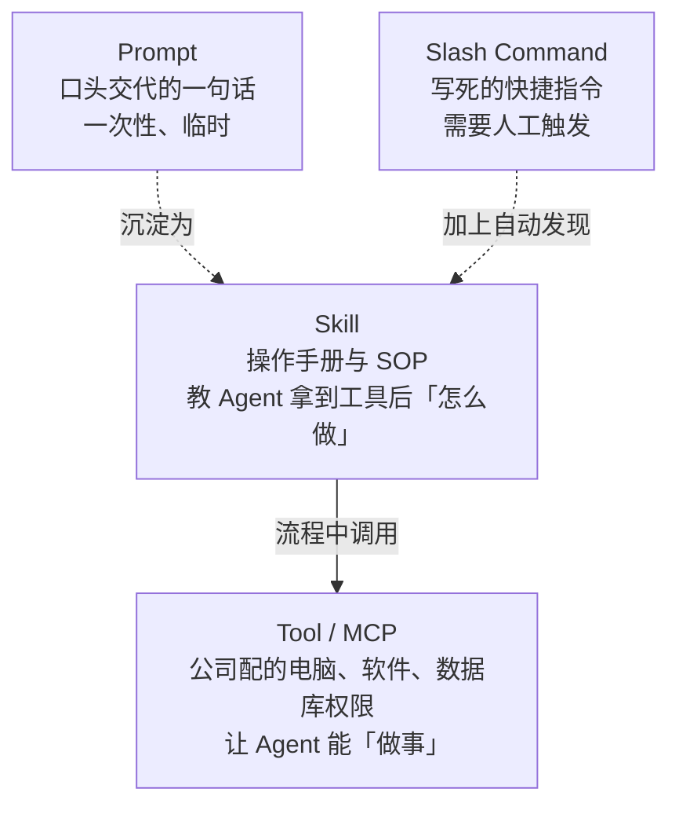

# 第八章：Skill 是什么

## 8.1 从「重复贴 Prompt」的痛点说起

每次让 AI 做代码审查，你都要贴一大段指令：检查哪几类问题、用什么格式输出、重点关注什么。第一次还行，第三次就开始烦了，而且每次贴的内容都略有出入，输出质量因此不稳定。

一个人尚且如此，团队协作更糟：十个人做代码审查，十份不同的 Prompt，有人关注安全有人关注性能，审查标准完全无法统一。

把 Prompt 写进共享文档让大家复制，还是靠人手工维护。文档更新后总会有人继续用旧版，审查质量自然也稳不住。

> **Skill 要解决的是：把反复使用的指令、流程、模板打包成标准化模块，让 Agent 自己知道什么时候该用、怎么用，不再依赖人工复制粘贴。**

## 8.2 Skill 的结构

一个 Skill 就是**一个文件夹**：

```
code-review/                  # 文件夹名就是 Skill 标识
├── SKILL.md                  # 核心指令文件（必须）
├── scripts/                  # 可选：可执行脚本
│   └── check_security.py
├── references/               # 可选：参考文档
│   └── review_standards.md
└── assets/                   # 可选：模板与资源
    └── report_template.md
```

`SKILL.md` 分两部分——YAML frontmatter 声明元数据，Markdown 正文写具体指令：

```markdown
---
name: code-review
description: "对代码进行全面审查，检查 bug、安全漏洞和性能问题，输出结构化审查报告"
---

# 代码审查 Skill

## 第一步：理解代码上下文
阅读提交的代码，理解功能和所属模块，确认修改范围。

## 第二步：逐项检查
1. 功能正确性：逻辑是否有 bug，边界条件是否处理
2. 安全性：注入、XSS、权限绕过
3. 性能：N+1 查询、不必要的循环、内存泄漏
4. 可读性：命名是否清晰，关键逻辑是否有注释

## 第三步：输出报告
使用 assets/report_template.md 的模板格式输出。
```

和普通 Prompt 的区别在于：**Prompt 是一段临时文字，用完就散了；Skill 是一个可以持续维护、纳入版本管理、全团队共享同一份的完整目录。**

## 8.3 渐进式加载：Skill 最聪明的设计

Skill 的价值不只在于「能打包」，更在于**加载方式**。

### 8.3.1 全量加载算不过来的账

假设你有 20 个 Skill，每个的指令加参考文档平均 2000 token，全量加载就是 **40,000 token 打底**。

在一个 200K 上下文的模型上，光 Skill 就吃掉了五分之一，剩下的要分给系统提示、对话历史、用户文件。更糟的是这 20 个里大部分在当前任务用不上——**加载了纯属浪费**。

### 8.3.2 三层加载



| 层次 | 加载什么 | 时机 | 量级 |
|---|---|---|---|
| 第一层 | `name` + `description` | 启动时，全部 Skill | 每个几十 token |
| 第二层 | `SKILL.md` 正文 | 判断任务匹配时 | 每个几百到几千 token |
| 第三层 | 脚本、模板、参考文档 | 指令中引用到时 | 按需 |

20 个 Skill 的启动开销从 40,000 token 降到了 **1,000 token 左右**。

### 8.3.3 为什么这个设计重要

类比是**新员工入职手册**：你第一天不会把整本手册从头读完，而是先扫一眼目录，知道有「报销流程」「请假制度」这些章节。等真要报销了，再翻开那一章仔细看。

深层原因是 **context window 是 Agent 最宝贵的资源**。全量塞进去不只是浪费 token，更严重的是**注意力被稀释**——真正有用的任务信息淹没在一堆无关指令里，输出质量反而下降。

这一点和 [Agent 的上下文压缩](../../agent/03-memory-context/10-agent-memory-compression.md) 是同一个思路：不是能塞多少就塞多少，而是让模型在恰当的时候只看到恰当的东西。

### 8.3.4 description 决定 Skill 能不能被用上

第一层只加载 `description`，它基本决定了 Agent 能不能把这个 Skill 选出来。写得含糊，就容易漏匹配。

```yaml
# 差：太宽泛，什么任务都可能误匹配，或者都不匹配
description: "帮助处理代码相关的任务"

# 好：任务类型、触发条件、产出都明确
description: "对 Python/Go 代码做安全与性能审查，输出含风险等级的结构化报告。适用于 PR review 和上线前检查。"
```

这和 [第三章](../01-function-calling/03-tool-schema-design.md) 里工具 `description` 的写法要求完全一致——都是模型在做选择判断时唯一能看到的信息。

## 8.4 Skill 与相邻概念的关系

这几个概念经常被混淆，用一个公司类比就能分清：



| | 提供什么 | 谁触发 | 是否持久 |
|---|---|---|---|
| **Tool / MCP** | 能力 | 模型判断 | 是 |
| **Skill** | 知识与流程 | **Agent 自动发现** | 是 |
| **Prompt** | 一次性指令 | 用户 | 否 |
| **Slash Command** | 保存的指令 | **用户手动触发** | 是 |

两个容易混淆的边界是：

Skill 和 Tool 的分工不同。Tool 提供能力，Skill 提供用这些能力的方法。给新人配了电脑和所有系统权限，他也不知道该按什么流程做代码审查、先查什么后查什么、用什么格式输出。**两者互补，不是替代**。

Skill 和 Slash Command 也不是一回事。两者都能把指令保存下来复用，但 Slash Command 必须你手动输入 `/code-review` 才会触发；Skill 能被 Agent **自动发现**，它看到任务后会自己判断该用哪个 Skill，再主动加载执行。

## 8.5 Skill 里可以放可执行脚本

`scripts/` 目录经常被忽略，但在工程上很有用。

有些工作用代码做比用自然语言描述可靠得多——比如「检查所有 SQL 拼接的地方」，写个 AST 分析脚本比让模型逐行读代码准确率高、成本低。

```markdown
## 第二步：安全检查
先运行 scripts/check_security.py 拿到静态扫描结果，
再针对脚本标记的可疑位置做人工语义分析。
```

这里更像一种工程分工：**能确定性完成的部分交给代码，需要判断的部分交给模型**。Skill 刚好提供了把两者放在一起的载体。

## 8.6 从 Anthropic 功能到开放标准

Agent Skills 是 Anthropic 在 2025 年 10 月推出的，最初只覆盖 Claude Code、Claude API 和 claude.ai 三个入口。

两个月后，Anthropic 把规范作为**开放标准**发布出来，任何 Agent 平台都可以按规范实现。

它能开放出来，一个重要原因是设计足够简单。一个 Skill 就是一个文件夹加一份 Markdown，不需要特殊运行时，也不用学新语言；任何支持文件系统的 Agent 平台，理论上都能实现。这种低门槛设计才让它有机会变成跨平台约定。

开放之后的实际意义是：你写的一份 Skill，未来有机会在不同 Agent 平台之间复用，而不是被某一家产品绑死。目前主要还是 Claude 生态在用，社区也在探索跨平台兼容，最终能走多远还要看行业采纳。

## 8.7 常见错误

### 8.7.1 把 Skill 说成「高级 Prompt 模板」

这是最常见的降格。Skill 是一个**完整的目录**，包含指令、可执行脚本、参考文档、输出模板，而且能被 Agent 自动发现和按需加载。说成 Prompt 模板，等于丢掉了它最有价值的两部分：可执行资源和渐进式加载。

### 8.7.2 说不出渐进式加载的三层

这是 Skill 最核心的设计，也是最能体现「context 工程」理解的点。三层是：只读元数据 → 匹配时加载指令 → 用到时才取资源。

### 8.7.3 把 Skill 和 Tool 当成竞争关系

Tool 提供能力，Skill 提供方法。一个 Skill 的执行过程中大概率要调用若干个 Tool。两者互补。

### 8.7.4 description 写得太宽泛

第一层加载只看 `description`。写得含糊，Skill 要么永远匹配不上，要么在不该用的时候被误用。

### 8.7.5 忽略 scripts 目录

把所有事情都用自然语言描述，让模型逐条执行。能确定性完成的检查用脚本更准也更省。

### 8.7.6 把 Skill 和 Slash Command 混为一谈

区别在**触发方式**：Slash Command 要人工输入，Skill 由 Agent 自动发现。这个差异决定了 Skill 能用在无人值守的自动化流程里。

## 8.8 本章总结

1. **Skill 解决的是「反复贴 Prompt」和「团队标准不统一」**，把流程知识沉淀成可维护、可版本管理的模块；
2. **结构上就是一个文件夹**：必需的 `SKILL.md` 加可选的 scripts / references / assets；
3. **渐进式加载是核心设计**：启动只读元数据，匹配才加载指令，用到才取资源；
4. **落到实现上，是在做 context 管理**：省 token 只是表面收益，更重要的是别让无关内容稀释模型注意力；
5. **`description` 决定 Skill 能否被发现**，写法要求和工具描述一致；
6. **Tool 提供能力，Skill 提供方法**，两者互补，Skill 的流程中会调用 Tool；
7. **相比 Slash Command 多了自动发现**，这让它能用于无人值守流程；
8. **2025 年 10 月推出，12 月开放为标准**，零运行时依赖是它有机会跨平台的原因。

> **可以把它记成：Tool 给 Agent 配电脑，Skill 给 Agent 发操作手册；手册平时只露出目录，真用到时才展开细节。**

## 参考资料

- [Anthropic: Introducing Agent Skills](https://www.anthropic.com/news/skills)
- [Anthropic: Equipping Agents for the Real World with Agent Skills](https://www.anthropic.com/engineering/equipping-agents-for-the-real-world-with-agent-skills)
- [Agent Skills 规范](https://agentskills.io/specification)
- [Claude Docs: Agent Skills](https://docs.claude.com/en/docs/agents-and-tools/agent-skills/overview)
- [Anthropic: Building Effective Agents](https://www.anthropic.com/engineering/building-effective-agents)
- [Anthropic: Effective Context Engineering for AI Agents](https://www.anthropic.com/engineering/effective-context-engineering-for-ai-agents)
