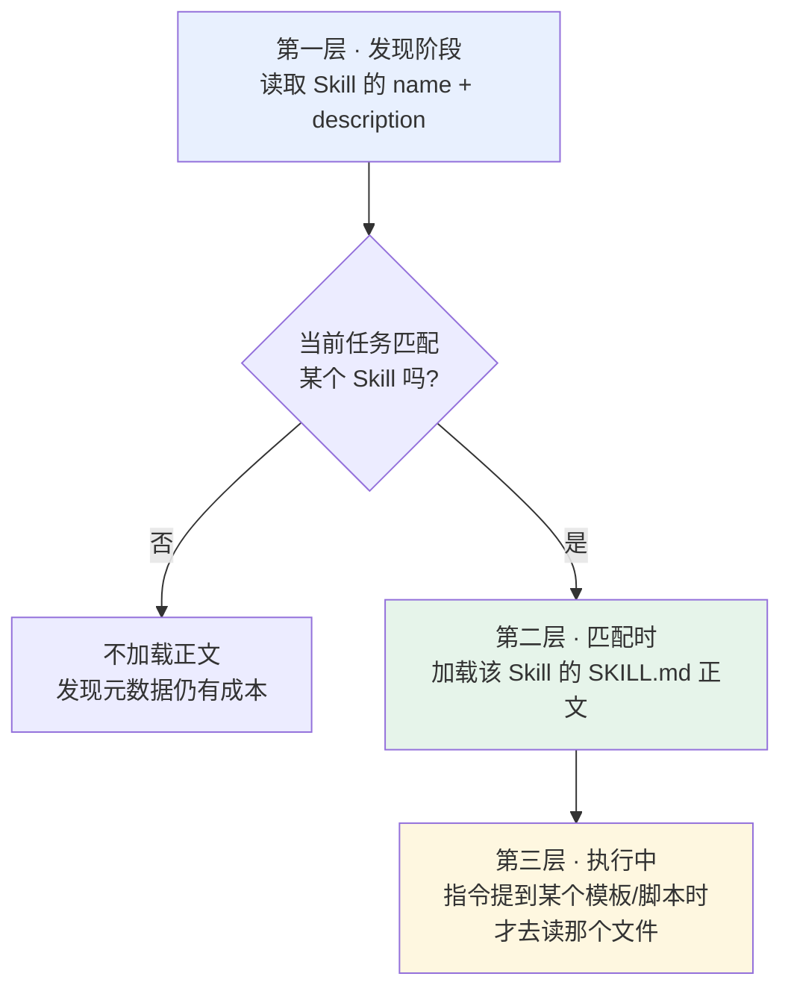
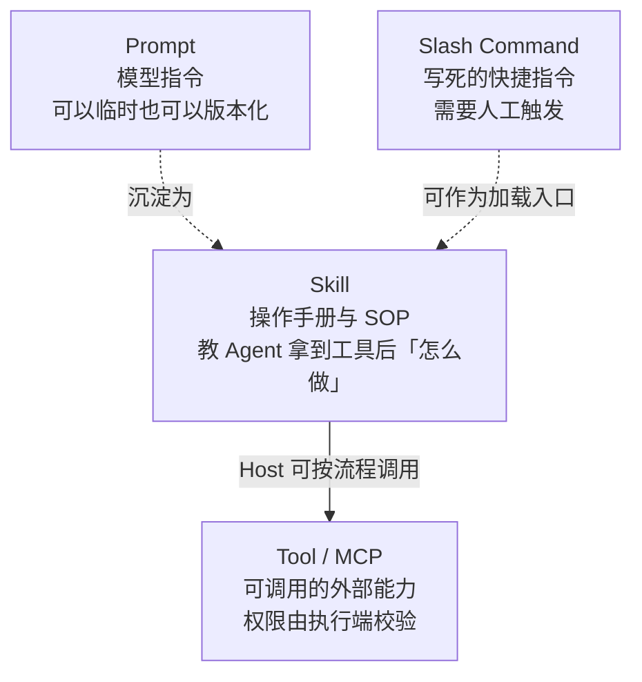

# 第八章：Skill 是什么

## 8.1 从「重复贴 Prompt」的痛点说起

每次让 AI 做代码审查，你都要贴一大段指令：检查哪几类问题、用什么格式输出、重点关注什么。第一次还行，第三次就开始烦了，而且每次贴的内容都略有出入，输出质量因此不稳定。

一个人尚且如此，团队协作更糟：十个人做代码审查，十份不同的 Prompt，有人关注安全有人关注性能，审查标准完全无法统一。

把 Prompt 写进共享文档让大家复制，还是靠人手工维护。文档更新后总会有人继续用旧版，审查质量自然也稳不住。

> **Skill 要解决的是：把反复使用的指令、流程、模板打包成标准化模块，让 Agent 自己知道什么时候该用、怎么用，不再依赖人工复制粘贴。**

## 8.2 Skill 的结构

一个 Skill 就是**一个文件夹**：

这里指 [Agent Skills 开放格式](https://agentskills.io/specification)，不是所有产品中同名的 “skill” 功能。本次于 2026-09-08 核查官方规范及仓库提交 `69ef37e9424c0a7ea9dd2293b559e43ec8176379`；规范页未给出独立的语义版本号，不能把 Skill 自身的 `metadata.version` 当规范版本。

```
code-review/                  # 文件夹名就是 Skill 标识
├── SKILL.md                  # 核心指令文件（必须）
├── scripts/                  # 可选：可执行脚本
│   └── check_security.py
├── references/               # 可选：参考文档
│   └── review_standards.md
└── assets/                   # 可选：模板与资源
    └── report_template.md
```

`SKILL.md` 分两部分——YAML frontmatter 声明元数据，Markdown 正文写具体指令：

```markdown
---
name: code-review
description: "对代码进行全面审查，检查 bug、安全漏洞和性能问题，输出结构化审查报告"
---

# 代码审查 Skill

## 第一步：理解代码上下文
阅读提交的代码，理解功能和所属模块，确认修改范围。

## 第二步：逐项检查
1. 功能正确性：逻辑是否有 bug，边界条件是否处理
2. 安全性：注入、XSS、权限绕过
3. 性能：N+1 查询、不必要的循环、内存泄漏
4. 可读性：命名是否清晰，关键逻辑是否有注释

## 第三步：输出报告
使用 assets/report_template.md 的模板格式输出。
```

Prompt 也能保存、版本化和复用。Skill 的区别在于约定了目录入口、可发现元数据和按需资源组织，而不是首次让提示词能够持久化。

格式要求与产品行为需分开：

- `name`、`description` 必需；名称与父目录一致，长度 1–64，使用规范允许的小写字母/数字与连字符，不能首尾连字符或连续 `--`。
- `description` 长度 1–1024，说明用途与触发情境；`license`、`compatibility`、字符串映射 `metadata` 可选。
- `allowed-tools` 是**实验性**字段，宿主支持不一致；它不是跨平台权限授予，更不能越过用户授权或沙箱。
- `scripts/`、`references/`、`assets/` 均可选。脚本依赖、系统工具和网络需求应写清，但声明依赖不会自动安装依赖。

## 8.3 渐进式加载

Skill 的价值不只在于「能打包」，更在于**加载方式**。

### 8.3.1 全量加载算不过来的账

假设你有 20 个 Skill，每个的指令加参考文档平均 2000 token，全量加载就是 **40,000 token 打底**。

在一个 200K 上下文的模型上，光 Skill 就吃掉了五分之一，剩下的要分给系统提示、对话历史、用户文件。更糟的是这 20 个里大部分在当前任务用不上——**加载了纯属浪费**。

### 8.3.2 三层加载



| 层次 | 加载什么 | 时机 | 量级 |
|---|---|---|---|
| 第一层 | `name` + `description` | 发现时，当前可用 Skill | 规范给出的约数为每个约 100 token，非固定开销 |
| 第二层 | `SKILL.md` 正文 | 判断任务匹配时 | 规范建议少于 5000 token，非硬限制 |
| 第三层 | 脚本、模板、参考文档 | 指令中引用到时 | 按需 |

以上面的 20 个 Skill 为假设，按规范约 100 token 的元数据示意估算，发现阶段约 2000 token；不是实测保证。规范另建议主文件少于 500 行，详细材料拆到引用文件。实际开销取决于文本、分词器和宿主是否注入额外元数据。

### 8.3.3 为什么这个设计重要

类比是**新员工入职手册**：你第一天不会把整本手册从头读完，而是先扫一眼目录，知道有「报销流程」「请假制度」这些章节。等真要报销了，再翻开那一章仔细看。

深层原因是 **context window 是 Agent 最宝贵的资源**。全量塞进去不只是浪费 token，更严重的是**注意力被稀释**——真正有用的任务信息淹没在一堆无关指令里，输出质量反而下降。

这一点和 [Agent 的上下文压缩](../../agent/03-memory-context/10-agent-memory-compression.md) 是同一个思路：不是能塞多少就塞多少，而是让模型在恰当的时候只看到恰当的东西。

### 8.3.4 description 决定 Skill 能不能被用上

发现阶段至少可见 `name` 与 `description`，还可能结合用户显式选择和宿主规则。含糊描述会增加漏选与误触发风险。

```yaml
# 差：太宽泛，什么任务都可能误匹配，或者都不匹配
description: "帮助处理代码相关的任务"

# 好：任务类型、触发条件、产出都明确
description: "对 Python/Go 代码做安全与性能审查，输出含风险等级的结构化报告。适用于 PR review 和上线前检查。"
```

这和[工具描述设计](../01-function-calling/03-tool-schema-design.md)类似：写清能力和边界，并用任务集评估触发质量；两者的描述都不是唯一信息源或强制执行规则。

## 8.4 Skill 与相邻概念的关系

这几个概念经常被混淆，用一个公司类比就能分清：



| | 提供什么 | 谁触发 | 是否持久 |
|---|---|---|---|
| **Tool / MCP** | 能力与上下文接口 | 模型建议、Host 工作流或用户 | 由实现决定 |
| **Skill** | 知识与流程及可选资源 | 自动匹配或显式加载，依宿主 | 是 |
| **Prompt** | 模型指令 | 用户或应用 | 可以持久化 |
| **Slash Command** | 保存的指令 | **用户手动触发** | 是 |

两个容易混淆的边界是：

Skill 和 Tool 的分工不同。Tool 提供能力，Skill 提供用这些能力的方法。给新人配了电脑和所有系统权限，他也不知道该按什么流程做代码审查、先查什么后查什么、用什么格式输出。**两者互补，不是替代**。

Slash Command 是交互入口，Skill 是内容格式。一个宿主完全可以用 `/code-review` 显式加载同一 Skill，也可以允许模型自动选择；不能以“手动还是自动”断言二者互斥。

## 8.5 Skill 里可以放可执行脚本

`scripts/` 目录经常被忽略，但在工程上很有用。

确定性检查可交给脚本，例如查找特定 AST 模式。静态扫描也有漏报与误报，脚本命中不等于已证实漏洞，仍需结合数据流和调用上下文。

```markdown
## 第二步：安全检查
先运行 scripts/check_security.py 拿到静态扫描结果，
再针对脚本标记的可疑位置做人工语义分析。
```

这里更像一种工程分工：**能确定性完成的部分交给代码，需要判断的部分交给模型**。Skill 刚好提供了把两者放在一起的载体。

安装第三方 Skill 前要审阅脚本、依赖安装、外链和权限要求。脚本由宿主工具运行时执行，可能读文件、联网或产生副作用；Skill 正文也可能包含提示注入。格式简单并不意味着可信、无依赖或自动可移植。

## 8.6 从 Anthropic 功能到开放标准

Agent Skills 是 Anthropic 在 2025 年 10 月推出的，最初只覆盖 Claude Code、Claude API 和 claude.ai 三个入口。

两个月后，Anthropic 把规范作为**开放标准**发布出来，任何 Agent 平台都可以按规范实现。

文件格式不要求独立网络服务；真正使用仍需要宿主发现、加载和执行，脚本还需要相应解释器、依赖与权限。这是开放内容格式，不是远程调用协议。

已有多种客户端采用，见[官方客户端列表](https://agentskills.io/clients)。跨平台迁移要核对触发方式、工具名称、文件路径、许可字段和执行环境，不能由“都能读 Markdown”推导出行为完全一致。

## 8.7 常见错误

### 8.7.1 把 Skill 说成「高级 Prompt 模板」

这是最常见的降格。Skill 是一个**完整的目录**，包含指令、可执行脚本、参考文档、输出模板，而且能被 Agent 自动发现和按需加载。说成 Prompt 模板，等于丢掉了它最有价值的两部分：可执行资源和渐进式加载。

### 8.7.2 说不出渐进式加载的三层

这是 Skill 最核心的设计，也是最能体现「context 工程」理解的点。三层是：只读元数据 → 匹配时加载指令 → 用到时才取资源。

### 8.7.3 把 Skill 和 Tool 当成竞争关系

Tool 提供能力，Skill 提供方法。一个 Skill 的执行过程中大概率要调用若干个 Tool。两者互补。

### 8.7.4 description 写得太宽泛

发现阶段的名称和描述应具体，同时测试“该触发/不该触发/同名冲突”场景；别只验证加载后能否照着步骤执行。

### 8.7.5 忽略 scripts 目录

把所有事情都用自然语言描述，让模型逐条执行。能确定性完成的检查用脚本更准也更省。

### 8.7.6 把 Skill 和 Slash Command 混为一谈

同一 Skill 可以有显式与自动入口。无人值守还需要宿主策略、资源预算及副作用许可，不能只靠触发描述。

## 8.8 本章总结

1. **Skill 解决的是「反复贴 Prompt」和「团队标准不统一」**，把流程知识沉淀成可维护、可版本管理的模块；
2. **结构上就是一个文件夹**：必需的 `SKILL.md` 加可选的 scripts / references / assets；
3. **渐进式加载是核心设计**：启动只读元数据，匹配才加载指令，用到才取资源；
4. **落到实现上，是在做 context 管理**：省 token 只是表面收益，更重要的是别让无关内容稀释模型注意力；
5. **`name` 与 `description` 参与发现**，是否选中还取决于用户请求和宿主路由；
6. **Tool 提供能力，Skill 提供方法**，两者可组合；纯写作 Skill 不必调用工具；
7. **触发方式依宿主**，斜杠命令与自动加载可以共存；
8. **开放格式利于复用**，但脚本、许可和宿主扩展影响兼容性。

## 参考资料

- [Anthropic: Introducing Agent Skills](https://www.anthropic.com/news/skills)
- [Anthropic: Equipping Agents for the Real World with Agent Skills](https://www.anthropic.com/engineering/equipping-agents-for-the-real-world-with-agent-skills)
- [Agent Skills 规范](https://agentskills.io/specification)
- [Agent Skills 本次核查的固定提交](https://github.com/agentskills/agentskills/tree/69ef37e9424c0a7ea9dd2293b559e43ec8176379)
- [Claude Docs: Agent Skills](https://docs.claude.com/en/docs/agents-and-tools/agent-skills/overview)
- [Anthropic: Building Effective Agents](https://www.anthropic.com/engineering/building-effective-agents)
- [Anthropic: Effective Context Engineering for AI Agents](https://www.anthropic.com/engineering/effective-context-engineering-for-ai-agents)
