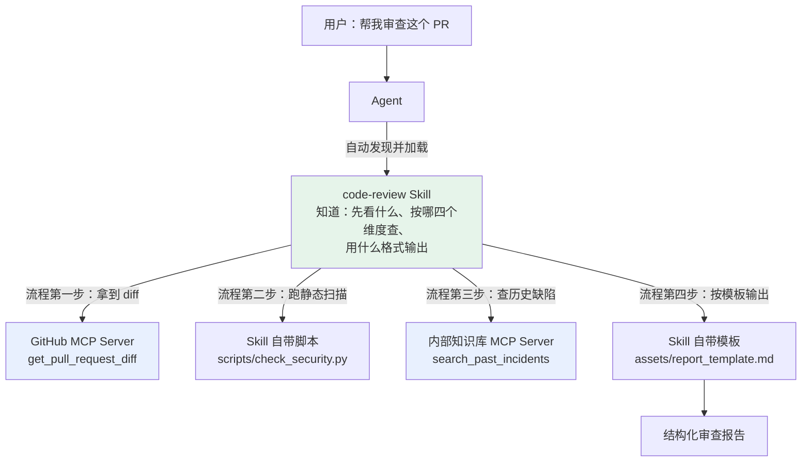
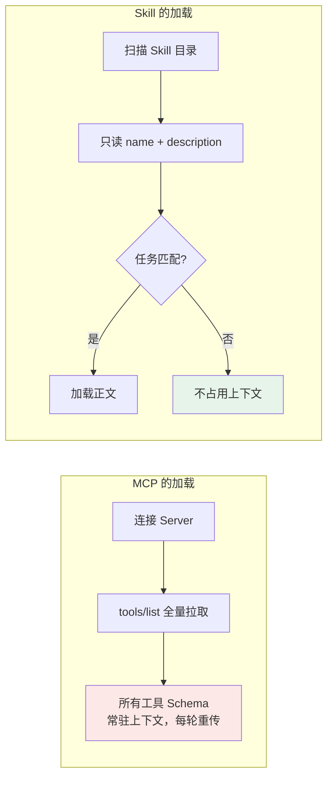
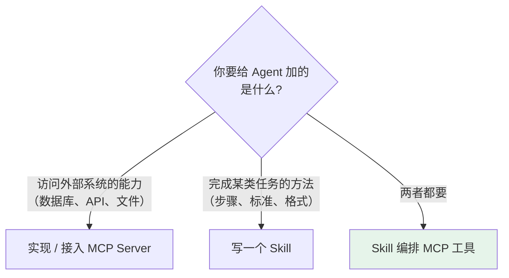
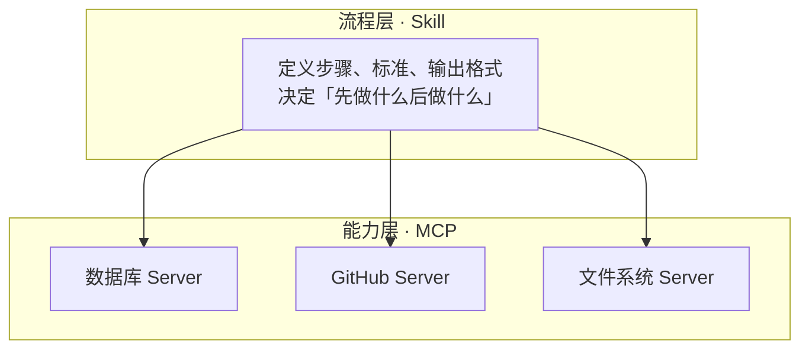

# 第九章：Skill 与 MCP 的区别

## 9.1 它们不是同类概念

最常见的误解是把 MCP 和 Skill 当成两种「给 Agent 加能力」的竞争方案，觉得选一个就够了。

实际上：

| | MCP | Skill |
|---|---|---|
| 解决的问题 | Agent **怎么获得**外部能力 | Agent 拿到能力后**怎么用** |
| 提供的东西 | 能力（工具、数据访问） | 知识与流程 |
| 形态 | 独立运行的服务进程 | 一个文件夹 + Markdown |
| 类比 | 公司配的电脑、软件、数据库权限 | 操作手册与 SOP |

> **可以这样记：MCP 是给 Agent 配电脑，Skill 是给 Agent 发操作手册。一个解决能力接入，一个解决能力使用。**

## 9.2 从一个具体任务看两者的分工

任务：**审查这个 PR**。



拆开看：

- **没有 MCP**：Agent 知道该怎么审查，但拿不到 PR 的 diff，也查不了内部知识库。有方法没能力；
- **没有 Skill**：Agent 能调 GitHub 拿到 diff，但不知道该按什么标准审、查哪几个维度、输出成什么样。每次审查的结果都不一样。有能力没方法。

两者缺一不可，而且**是 Skill 在编排 MCP**，不是反过来。

## 9.3 六个维度的对比

| 维度 | MCP | Skill |
|---|---|---|
| **本质** | 通信协议 | 内容规范 |
| **运行形态** | 独立进程 / 远程服务 | 静态文件，无运行时 |
| **加载方式** | 启动时连接，`tools/list` 全量拉取 | **渐进式**：元数据 → 指令 → 资源 |
| **谁来触发** | 模型判断调用某个工具 | Agent 判断任务匹配某个 Skill |
| **变更成本** | 改 Server 代码，可能要重新部署 | 改一个 Markdown 文件 |
| **跨平台** | 需要客户端实现 MCP 协议 | 需要平台支持 Skill 规范 |

### 9.3.1 最实质的差异：有没有运行时

这是两者最根本的区别。

**MCP Server 是活的**——它是一个进程，要启动、要维护连接、要处理认证、可能会挂。接一个 MCP Server 意味着引入一个新的运行时依赖。

**Skill 是死的**——它就是几个文件。没有进程，不会挂，不需要认证，复制到另一个项目里直接就能用。

这个差异决定了两者的分发方式：MCP Server 通过包管理器安装并配置启动命令，Skill 直接拷贝目录或用 git 管理。

### 9.3.2 另一个经常被忽略的差异：加载方式

MCP 的工具定义是**全量加载**的：连上 Server 就把所有工具的 Schema 拉进上下文，而且每轮都传。接五个 Server 可能就是上万 token 的固定开销。

Skill 是**渐进式加载**的：启动时只有几十 token 的元数据，匹配上才加载正文。



这不是说 MCP 设计得差——工具必须让模型随时可见才能被选中，这是它的功能要求。但它确实意味着**MCP 的上下文成本随接入数量线性增长，而 Skill 基本不增长**。

实践推论：接很多 MCP Server 时要做 [动态工具筛选](../01-function-calling/03-tool-schema-design.md)；而 Skill 可以放心地准备几十个。

## 9.4 什么时候用哪个

可以按这个标准判断：



具体一点：

| 需求 | 用什么 |
|---|---|
| 让 Agent 能查公司订单库 | MCP Server |
| 让 Agent 按公司规范写周报 | Skill |
| 让 Agent 能操作 GitHub | MCP Server（社区已有） |
| 统一团队的 PR 审查标准 | Skill |
| 让 Agent 能跑 SQL 并按固定流程做数据分析 | 两者：MCP 提供 SQL 能力，Skill 定义分析流程 |

一个实用的反向检验：**如果这个东西需要联网、需要认证、需要访问外部系统，那它是 MCP；如果它只是「怎么做」的知识，那它是 Skill。**

## 9.5 两者怎么配合

典型的组合形态是**分层**：



在 `SKILL.md` 里直接引用 MCP 工具是很自然的写法：

```markdown
## 第一步：获取数据
使用 GitHub MCP 的 `get_pull_request_diff` 拿到本次变更内容。
如果 diff 超过 2000 行，只处理 src/ 目录下的改动。

## 第二步：查历史
使用知识库 MCP 的 `search_past_incidents` 检索这几个文件
过去半年是否引发过线上问题。
```

像第一步末尾那句「如果超过 2000 行……」，就该写在 Skill 里。MCP 只提供「能拿到 diff」这个能力，**遇到大 diff 该怎么办属于流程知识**。

### 9.5.1 一个边界问题：逻辑该写在哪

有些能力两边都能实现，比如「过滤大 diff」。写在 MCP Server 里还是 Skill 里？

判断依据是**这个逻辑是不是通用的**：

- **所有使用者都需要** → 写进 MCP Server，作为工具的默认行为；
- **只有你的团队这么做** → 写进 Skill，保持 Server 的通用性。

把团队特有的业务规则塞进 MCP Server，会让这个 Server 失去复用价值——而复用正是 MCP 存在的理由。

## 9.6 常见错误

### 9.6.1 认为两者是竞争关系

它们解决不同层次的问题。真实系统里通常同时使用，且是 Skill 编排 MCP。

### 9.6.2 把 Skill 降格成 Prompt 模板

Skill 包含可执行脚本、参考文档、输出模板，而且有渐进式加载机制。它是一个完整的能力包，不只是一段指令文字。

### 9.6.3 用 MCP 实现流程知识

见过有人把「代码审查流程」做成一个 MCP Server 的工具，返回一段流程说明文字。这纯属绕远路——流程知识是静态内容，用 Skill 一个 Markdown 就够了，包成进程只是增加了部署和运维负担。

### 9.6.4 用 Skill 实现外部访问

反过来也有：在 Skill 里写「请调用 https://api.example.com/xxx」，指望模型自己去访问。模型没有网络能力，这必须由工具来做。

### 9.6.5 忽略两者上下文成本的差异

MCP 工具定义常驻上下文且每轮重传，Skill 基本不占。接 MCP Server 要克制并做筛选，准备 Skill 可以放开。

### 9.6.6 把团队特有规则写进 MCP Server

会让 Server 失去通用性，也就失去了用 MCP 的理由。通用行为进 Server，团队规则进 Skill。

## 9.7 本章总结

1. **不是同类概念**：MCP 管「怎么获得能力」，Skill 管「拿到能力后怎么用」；
2. **最实质的差异是有没有运行时**：MCP Server 是活的进程，Skill 是静态文件；
3. **加载方式差异同样关键**：MCP 全量常驻且每轮重传，Skill 渐进式按需加载；
4. **上下文成本的推论**：MCP 要克制并做动态筛选，Skill 可以放心准备几十个；
5. **配合方式是分层**：Skill 在流程层编排 MCP 提供的能力；
6. **判断用哪个**：需要联网、认证、访问外部系统的是 MCP，纯「怎么做」的知识是 Skill；
7. **逻辑归属看通用性**：所有人都需要的行为进 Server，团队特有规则进 Skill。

> **可以把它理解成：MCP 让 Agent 有能力伸手拿工具，Skill 决定这双手该按什么顺序做事。**

## 参考资料

- [Anthropic: Introducing Agent Skills](https://www.anthropic.com/news/skills)
- [Agent Skills 规范](https://agentskills.io/specification)
- [Model Context Protocol 官方文档](https://modelcontextprotocol.io/docs/getting-started/intro)
- [Anthropic: Equipping Agents for the Real World with Agent Skills](https://www.anthropic.com/engineering/equipping-agents-for-the-real-world-with-agent-skills)
- [Anthropic: Effective Context Engineering for AI Agents](https://www.anthropic.com/engineering/effective-context-engineering-for-ai-agents)
