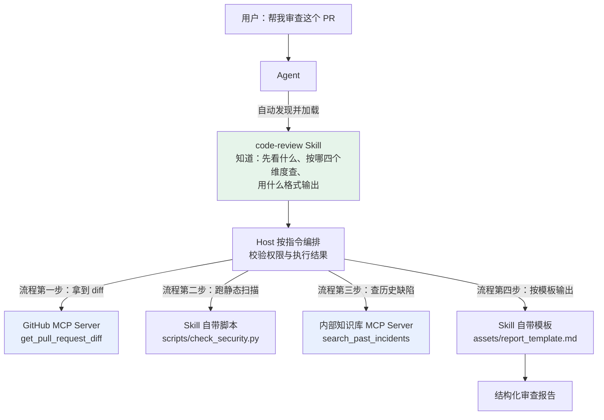
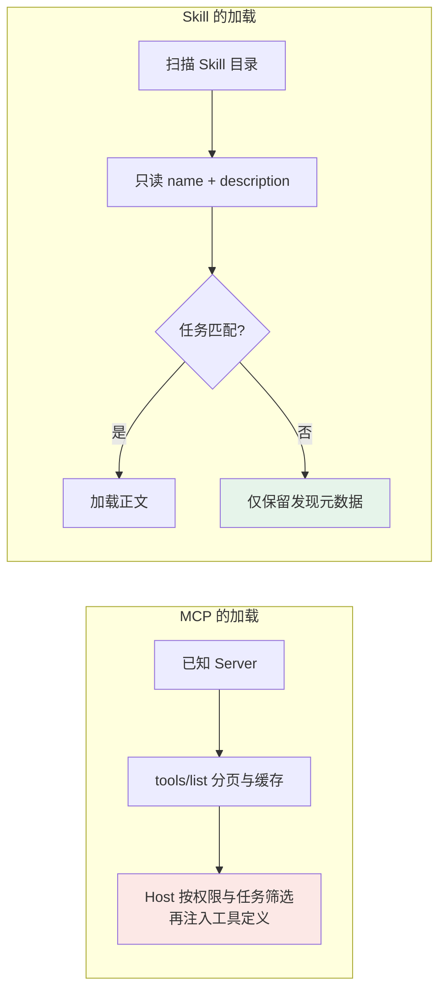
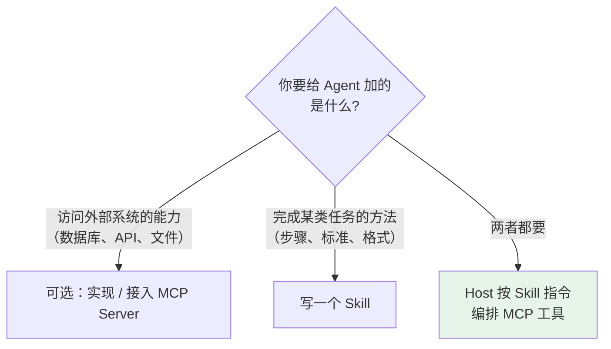
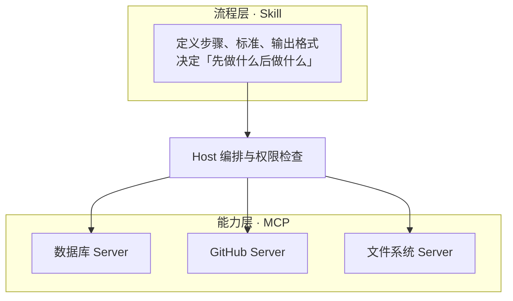

# 第九章：Skill 与 MCP 的区别

## 9.1 它们不是同类概念

最常见的误解是把 MCP 和 Skill 当成两种「给 Agent 加能力」的竞争方案，觉得选一个就够了。

实际上：

| | MCP | Skill |
|---|---|---|
| 解决的问题 | Agent **怎么获得**外部能力 | Agent 拿到能力后**怎么用** |
| 提供的东西 | 能力（工具、数据访问） | 知识与流程 |
| 形态 | Client 与 Server 之间的通信协议 | 一个文件夹 + Markdown |
| 类比 | 接入设备或服务的接口约定，不授予权限 | 操作手册与标准操作流程（SOP） |

## 9.2 从一个具体任务看两者的分工

任务：**审查这个 PR**。



拆开看：

- **没有 MCP**：仍可用 GitHub API、CLI 或内嵌工具读取 diff；缺的是统一协议接入，不是全部外部能力；
- **没有 Skill**：仍可用系统指令、用户说明或代码工作流规定审查步骤；缺的是该格式的可复用知识包。

两者可以组合，但缺一也能工作。真正编排执行的是 Host/Agent，Skill 提供流程指令，MCP 提供能力接口；协议并不规定固定上下层依赖。

## 9.3 六个维度的对比

| 维度 | MCP | Skill |
|---|---|---|
| **本质** | 通信协议 | 内容规范 |
| **运行形态** | Client 与 Server 通信 | 文件包；脚本执行仍需运行时 |
| **加载方式** | 可分页发现、缓存；注入多少工具由 Host 决定 | 元数据 → 指令 → 按需资源 |
| **谁来触发** | Host 可接受模型、规则或用户触发 | 自动匹配或显式加载，依宿主 |
| **变更成本** | 可能改代码、Schema 或数据，需兼容测试 | 可能改指令或脚本，也需回归与权限审查 |
| **跨平台** | 需要客户端实现 MCP 协议 | 需要平台支持 Skill 规范 |

### 9.3.1 服务接口与文件分发

两者的交付对象不同。

MCP Server 是服务端实现，需要部署、认证和错误处理。本地 stdio 通常由 Host 启动，远程服务可供多个 Client 共享。

Skill 文件本身不是服务，但脚本可能失败、依赖缺失，也可能访问需要凭据的 API。复制文件能保留内容，不保证另一宿主具有相同工具与权限。

本地 MCP Server 可以包管理器安装；远程 Server 可以只配置 URL。Skill 可用目录或 Git 分发，也可以由宿主集成分发；两者都需要版本固定和供应链审查。

### 9.3.2 另一个经常被忽略的差异：加载方式

MCP 的 `tools/list` 结果不等于模型上下文。Host 可分页拉取、按权限缓存，再检索少量相关定义或延迟加载；全量注入只是某些实现的策略。

Skill 推荐渐进加载，但元数据也随安装数量增长。一个冗长的 Skill 加载后仍可能占据大量上下文。



两者都涉及发现成本和运行时注入成本。工具搜索可以延迟暴露完整 Schema，Skill 也要维护可发现目录；比较时应统计实际模型输入，而不是只比较 Server 和文件夹数量。

工具与 Skill 都要测试路由召回、误触发、上下文预算和权限。相关方法见[动态工具筛选](../01-function-calling/03-tool-schema-design.md)。

## 9.4 什么时候用哪个

可以按这个标准判断：



具体一点：

| 需求 | 一种实现方式 |
|---|---|
| 让 Agent 能查公司订单库 | MCP Server |
| 让 Agent 按公司规范写周报 | Skill |
| 让 Agent 能操作 GitHub | MCP Server（社区已有） |
| 统一团队的 PR 审查标准 | Skill |
| 让 Agent 能跑 SQL 并按固定流程做数据分析 | 两者：MCP 提供 SQL 能力，Skill 定义分析流程 |

判断重点是要交付统一的远程能力接口，还是可加载的流程知识包。联网与认证不是二分标准：Skill 脚本也可通过受控工具访问 API，MCP 也能返回静态文档和提示模板。

## 9.5 两者怎么配合

典型的组合形态是**分层**：



在 `SKILL.md` 里直接引用 MCP 工具是很自然的写法：

```markdown
## 第一步：获取数据
使用 GitHub MCP 的 `get_pull_request_diff` 拿到本次变更内容。
若 diff 超过当前上下文预算，按模块分批审查并记录覆盖范围；
不要默默跳过配置、依赖或其他目录。

## 第二步：查历史
使用知识库 MCP 的 `search_past_incidents` 检索这几个文件
过去半年是否引发过线上问题。
```

如何分批阅读、记录遗漏和汇总结果属于流程知识。示例工具名仅为示意，必须映射到当前 Server 实际提供的名称。

### 9.5.1 一个边界问题：逻辑该写在哪

有些能力两边都能实现，比如「过滤大 diff」。写在 MCP Server 里还是 Skill 里？

判断依据是**这个逻辑是不是通用的**：

- **所有使用者都需要** → 写进 MCP Server，作为工具的默认行为；
- **只有你的团队这么做** → 写进 Skill，保持 Server 的通用性。

审查顺序和输出偏好适合 Skill；租户隔离、交易限额、权限和强制业务不变量必须在服务端落实，即使它们是团队特有规则。自然语言步骤不能替代强制执行。

## 9.6 常见错误

### 9.6.1 认为两者是竞争关系

它们解决不同层次的问题。两者可以同时使用：Host/Agent 按 Skill 指令安排步骤，再通过 MCP 或其他接口调用能力。Skill 文件本身不是执行调度器。

### 9.6.2 把 Skill 降格成 Prompt 模板

Skill 除必需的 `SKILL.md` 外，可以包含脚本、参考文档和模板。区别在于文件入口、元数据和按需资源约定，不在于每个 Skill 都必须带代码。

### 9.6.3 用 MCP 实现流程知识

静态流程可直接用 Skill，不一定要单独部署服务；但 MCP Prompts/Resources 分发受权限控制、动态更新的流程也合理。选择依据是分发、访问控制和动态性，不是“知识绝不能走 MCP”。

### 9.6.4 用 Skill 实现外部访问

在 Skill 写 URL 不会自动获得网络能力，但可通过已授权的 HTTP 工具或脚本访问，并不一定需要 MCP。需明确调用工具、凭据来源、网络范围和失败处理。

### 9.6.5 忽略两者上下文成本的差异

MCP 不强制全量注入，Skill 元数据也非零成本。两者都应按实际注入和任务表现评测。

### 9.6.6 把团队特有规则写进 MCP Server

应区分可变的流程偏好与不可绕过的业务规则。后者必须由服务端执行，不能只写在 Skill 中。

## 9.7 本章总结

1. **不是同类概念**：MCP 管「怎么获得能力」，Skill 管「拿到能力后怎么用」；
2. **MCP 是通信协议，Skill 是文件格式**，执行脚本仍需宿主运行时；
3. **发现不等于全量注入**，MCP 工具和 Skill 都可按需加载；
4. **元数据也有成本**，用实际 token 和路由效果评估；
5. **Host 执行编排**，Skill 指导步骤，MCP 提供一种能力接入方式；
6. **联网不是二分标准**，Skill 脚本也可访问 API；
7. **强制权限与业务不变量在服务端**，不要只写进自然语言流程。

## 参考资料

- [Anthropic: Introducing Agent Skills](https://www.anthropic.com/news/skills)
- [Agent Skills 规范](https://agentskills.io/specification)
- [Model Context Protocol 官方文档](https://modelcontextprotocol.io/docs/getting-started/intro)
- [MCP 2026-07-28 工具发现与 Schema](https://modelcontextprotocol.io/specification/2026-07-28/server/tools)
- [Anthropic: Equipping Agents for the Real World with Agent Skills](https://www.anthropic.com/engineering/equipping-agents-for-the-real-world-with-agent-skills)
- [Anthropic: Effective Context Engineering for AI Agents](https://www.anthropic.com/engineering/effective-context-engineering-for-ai-agents)
