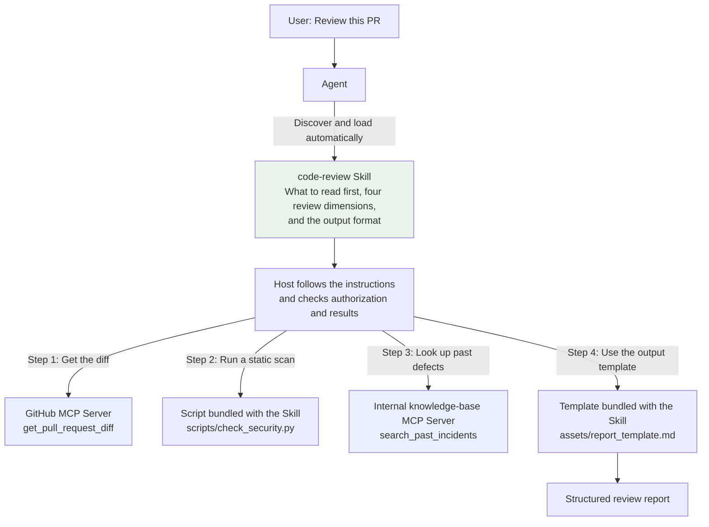
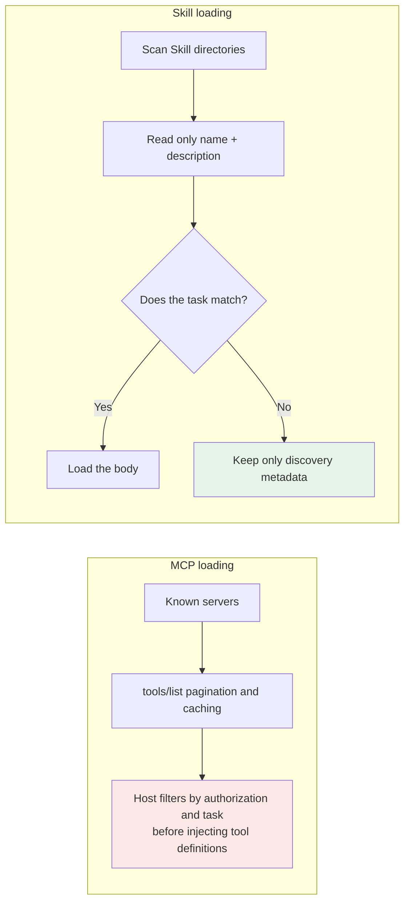
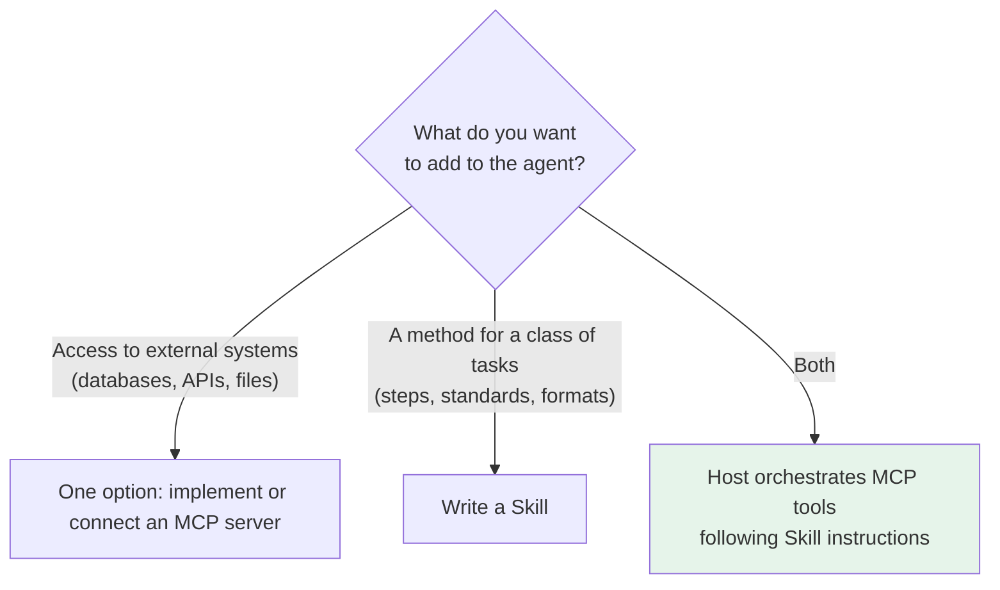
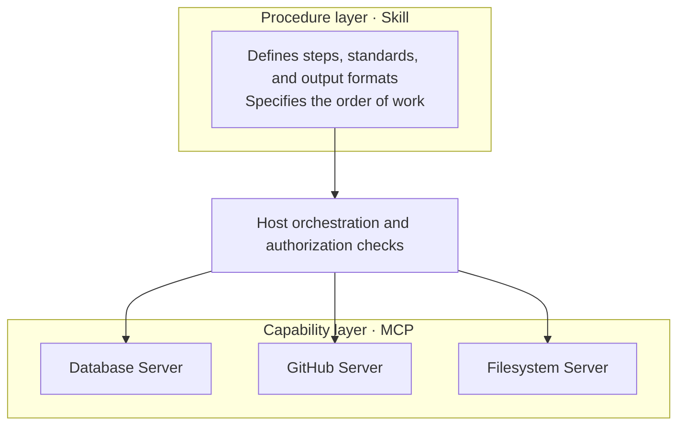

# Chapter 9: Skills and MCP

## 9.1 They are different kinds of mechanism

The most common misconception is to treat MCP and Skills as competing ways to add capabilities to an agent, as though choosing one makes the other unnecessary.

They address different concerns:

| | MCP | Skill |
|---|---|---|
| Problem addressed | **How to access** external capabilities | **How to use** the capabilities available to the agent |
| What it provides | Capabilities: tools and data access | Knowledge and procedures |
| Form | A communication protocol between clients and servers | A directory plus Markdown |
| Analogy | An interface agreement for connecting devices or services, not a grant of permission | An operating manual and standard operating procedures (SOPs) |

## 9.2 Their roles in a concrete task

The task is: **review this PR**.



Consider each mechanism separately:

- **Without MCP**, the agent can still read the diff through the GitHub API, a CLI, or an embedded tool. What is missing is integration through a common protocol, not all external capabilities.
- **Without a Skill**, system instructions, user directions, or a workflow implemented in code can still define the review steps. What is missing is a reusable knowledge package in this particular format.

The two can be combined, but either can work without the other. The host or agent orchestrates execution; the Skill provides procedural instructions, and MCP provides capability interfaces. The protocol does not prescribe a fixed dependency hierarchy.

## 9.3 A comparison across six dimensions

| Dimension | MCP | Skill |
|---|---|---|
| **Nature** | Communication protocol | Content specification |
| **Runtime form** | Communication between a client and a server | A file package; running scripts still requires a runtime |
| **Loading** | Discovery can use pagination and caching; the host decides how many tools to inject | Metadata → instructions → resources as needed |
| **Activation** | The host can accept triggers from a model, rules, or a user | Automatic matching or explicit loading, depending on the host |
| **Cost of changes** | May involve code, schemas, or data; requires compatibility testing | May involve instructions or scripts; also requires regression testing and permission review |
| **Cross-platform support** | The client must implement MCP | The platform must support the Skill specification |

### 9.3.1 Service interfaces versus file distribution

The artifacts being delivered are different.

An MCP server is a server-side implementation, with deployment, authentication, and error-handling concerns. A local stdio server is typically started by the host; a remote service can be shared by multiple clients.

Skill files are not themselves a service, but their scripts may fail, lack dependencies, or access APIs that require credentials. Copying files preserves the content; it does not guarantee that another host has the same tools and permissions.

A local MCP server can be installed through a package manager; a remote server may require only a URL configuration. Skills can be distributed as directories, through Git, or through a host's integrated distribution mechanism. Both require version pinning and supply-chain review.

### 9.3.2 An often-overlooked difference: loading

The result of MCP's `tools/list` is not the model's context. A host can fetch pages, cache results according to authorization, and then retrieve a small set of relevant definitions or defer loading them. Injecting every tool is a policy chosen by some implementations, not a protocol requirement.

Skills recommend progressive disclosure, but their metadata grows with the number installed. A verbose Skill can still consume substantial context once loaded.



Both have discovery costs and runtime context-injection costs. Tool search can defer exposure of complete schemas, while Skills still need a discoverable catalog. Compare actual model input, not just the number of servers or directories.

For both tools and Skills, test routing recall, false activations, context budgets, and authorization. See [dynamic tool selection](../01-function-calling/03-tool-schema-design.md) for related methods.

## 9.4 When to use each

Start with the kind of addition you need:



Some concrete examples:

| Requirement | One possible implementation |
|---|---|
| Let the agent query the company's order database | MCP server |
| Have the agent write weekly reports to company standards | Skill |
| Let the agent operate GitHub | MCP server; community implementations exist |
| Standardize the team's PR review criteria | Skill |
| Let the agent run SQL and follow a defined data-analysis procedure | Both: MCP provides SQL capabilities, and a Skill defines the analysis procedure |

The central question is whether you are delivering a common remote capability interface or a loadable package of procedural knowledge. Network access and authentication do not create a clean dividing line: Skill scripts can access APIs through controlled tools, and MCP can return static documents and prompt templates.

## 9.5 How they work together

A typical combination uses **layers**:



It is natural to reference MCP tools directly in `SKILL.md`. This Chinese instruction example first requests the PR diff, requires module-by-module review with coverage tracking if it exceeds the context budget, and forbids silently skipping configuration, dependencies, or other directories. It then asks for production incidents involving those files during the past six months:

```markdown
## 第一步：获取数据
使用 GitHub MCP 的 `get_pull_request_diff` 拿到本次变更内容。
若 diff 超过当前上下文预算，按模块分批审查并记录覆盖范围；
不要默默跳过配置、依赖或其他目录。

## 第二步：查历史
使用知识库 MCP 的 `search_past_incidents` 检索这几个文件
过去半年是否引发过线上问题。
```

How to read in batches, record gaps, and aggregate results is procedural knowledge. The example tool names are illustrative and must be mapped to the names actually exposed by the current server.

### 9.5.1 A boundary question: where should the logic live?

Some behavior, such as filtering a large diff, could be implemented on either side. Should it live in the MCP server or the Skill?

Ask **whether the logic is generally useful**:

- **All users need it** → implement it in the MCP server as the tool's default behavior.
- **Only your team does it this way** → put it in the Skill, keeping the server general-purpose.

Review order and output preferences fit in a Skill. Tenant isolation, transaction limits, authorization, and mandatory business invariants must be enforced server-side, even when they are specific to one team. Natural-language steps are not a substitute for enforcement.

## 9.6 Common mistakes

### 9.6.1 Treating the two as competitors

They address problems at different levels and can be used together. The host or agent arranges steps according to Skill instructions, then invokes capabilities through MCP or another interface. A Skill file is not itself an execution scheduler.

### 9.6.2 Reducing a Skill to a prompt template

Alongside the required `SKILL.md`, a Skill can contain scripts, reference documents, and templates. The distinction lies in conventions for the entry file, metadata, and on-demand resources—not in a requirement that every Skill contain code.

### 9.6.3 Using MCP for procedural knowledge

A static procedure can be distributed directly as a Skill without deploying a separate service. However, MCP Prompts or Resources are also reasonable ways to distribute dynamically updated procedures under access controls. Choose based on distribution, access control, and update requirements, not a blanket rule that knowledge must never travel through MCP.

### 9.6.4 Using a Skill for external access

Writing a URL in a Skill does not grant network access. An authorized HTTP tool or script can access it, though, without necessarily using MCP. Specify the tool to call, the source of credentials, the allowed network scope, and failure handling.

### 9.6.5 Ignoring differences in context cost

MCP does not require every definition to be injected, and Skill metadata is not free. Evaluate both using the content actually injected and performance on the task.

### 9.6.6 Putting team-specific rules in the MCP server

Distinguish changeable workflow preferences from business rules that must not be bypassed. The latter must be enforced by the server, not merely written in a Skill.

## 9.7 Summary

1. **These are different kinds of mechanism**: MCP addresses how to access capabilities; a Skill addresses how to use them.
2. **MCP is a communication protocol; a Skill is a file format**. Script execution still needs a host runtime.
3. **Discovery is not the same as injecting everything**. Both MCP tools and Skills can be loaded on demand.
4. **Metadata has a cost, too**. Measure actual tokens and routing effectiveness.
5. **The host orchestrates execution**. Skills guide the steps; MCP is one way to access capabilities.
6. **Network access is not a dividing line**. Skill scripts can also access APIs.
7. **Authorization and business invariants must be enforced server-side**, not left solely to natural-language procedures.

## References

- [Anthropic: Introducing Agent Skills](https://www.anthropic.com/news/skills)
- [Agent Skills specification](https://agentskills.io/specification)
- [Model Context Protocol official documentation](https://modelcontextprotocol.io/docs/getting-started/intro)
- [MCP 2026-07-28 tool discovery and schemas](https://modelcontextprotocol.io/specification/2026-07-28/server/tools)
- [Anthropic: Equipping Agents for the Real World with Agent Skills](https://www.anthropic.com/engineering/equipping-agents-for-the-real-world-with-agent-skills)
- [Anthropic: Effective Context Engineering for AI Agents](https://www.anthropic.com/engineering/effective-context-engineering-for-ai-agents)
