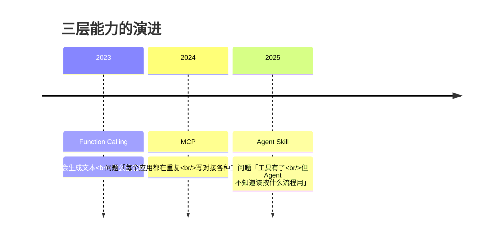
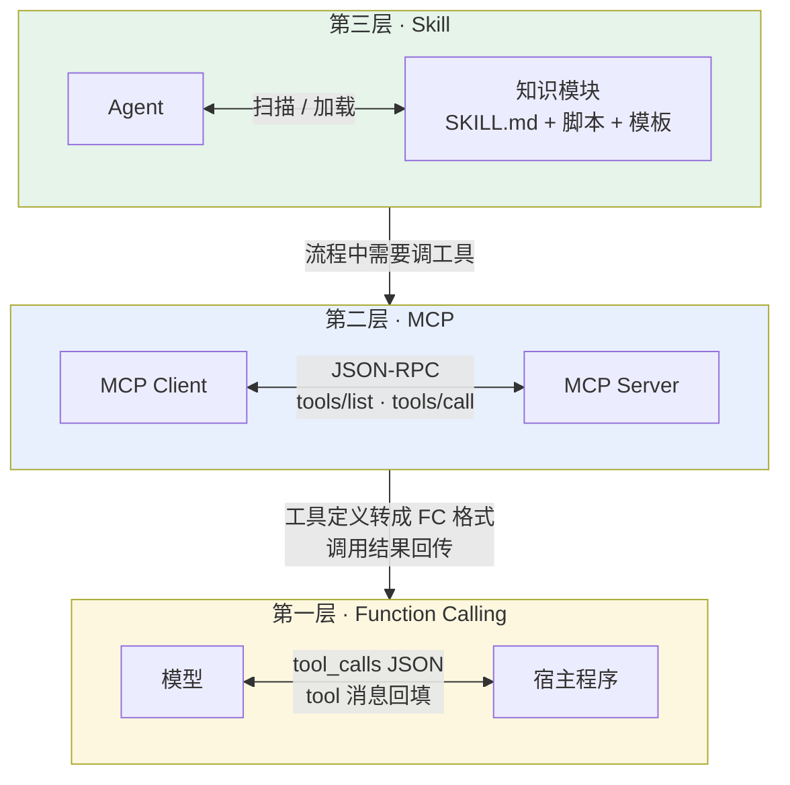
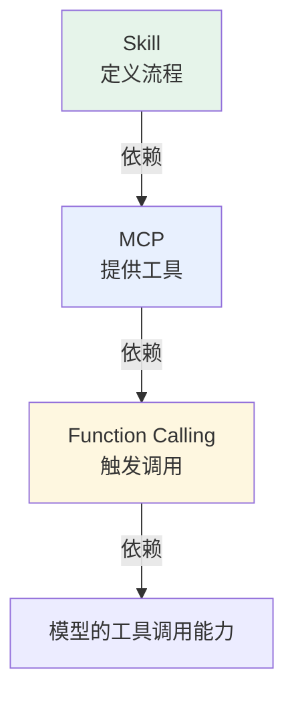
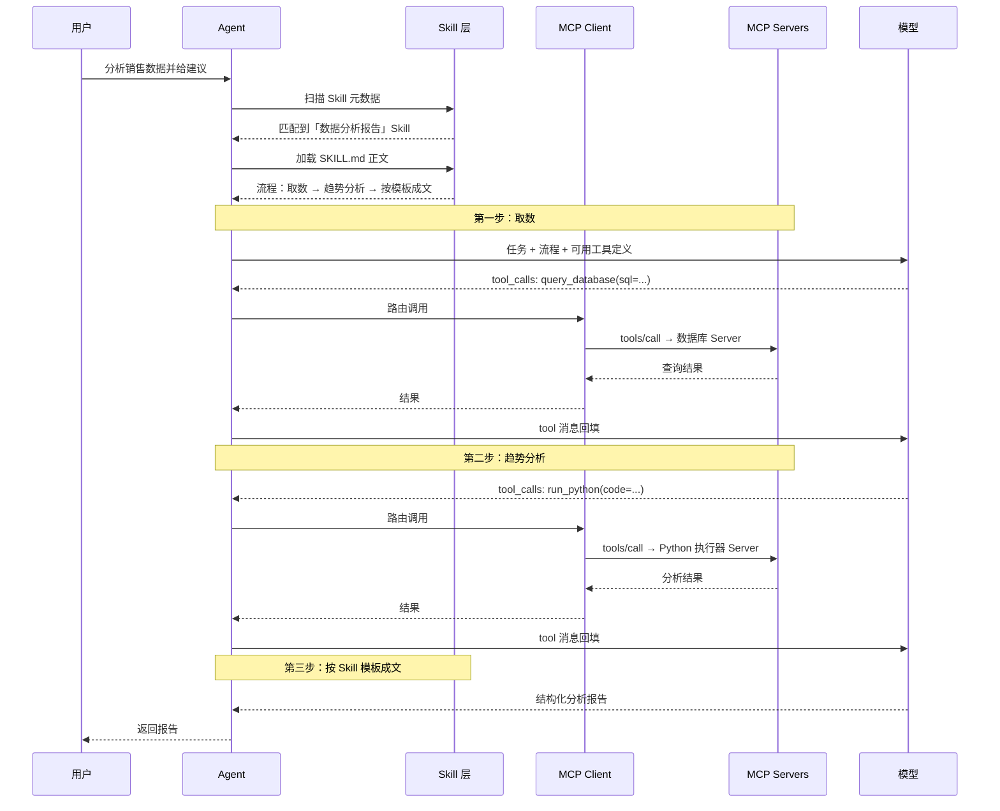

# 第十章：Function Calling、MCP、Skill 三者关系

## 10.1 为什么会有三个概念

最典型的误解是把这三个当成「不同厂商在不同时期推出的竞争方案，选一个用就行」。

实际上它们是**从底到顶的三层**，每一层建立在下一层之上。

可以先看**每句话的主语是谁**：

| | 谁在说话 | 说什么 |
|---|---|---|
| **Function Calling** | 模型 | 「我要调这个函数，参数是这些」 |
| **MCP** | 工具服务 | 「我能提供这些函数」 |
| **Skill** | 操作手册 | 「用这些工具，按这个流程做」 |

主语不同、对话对象不同、粒度不同——这就是三者的本质差异。

### 10.1.1 时间线解释了这个分层

每一层都是在**上一层普及之后暴露出的新痛点**上诞生的：

- Function Calling 解决**调用协议**问题：模型和程序之间需要一套结构化的表达方式；
- 它普及后，重复对接的痛点浮现——每个应用都要给数据库写一套、文件系统写一套、API 再写一套。MCP 把工具接入**标准化**，一次实现到处复用；
- 工具有了、接入也标准化了，新问题是 Agent 面对复杂任务不知道该按什么流程用这些工具。Skill 解决**知识与流程复用**。

## 10.2 从「谁和谁通信」定位三者

| 层次 | 发生在哪两个角色之间 | 本质 | 粒度 |
|---|---|---|---|
| Function Calling | 模型 ↔ 宿主程序 | 单次调用的格式规范 | 一次函数调用 |
| MCP | MCP Client ↔ MCP Server | 工具的标准化封装与发现 | 一个工具 / 一组工具 |
| Skill | Agent ↔ 知识模块 | 流程与标准的可复用封装 | 一类完整任务 |

注意粒度的跨度：「查询订单表」是一个 **MCP 工具**，「代码审查」「数据分析报告」是一个 **Skill**——一个 Skill 内部可能有好几个步骤，每步可调用多个 MCP 工具；由 LLM 驱动时，常以 Function Calling 或结构化输出表达调用意图。

## 10.3 层级依赖是单向的

三者不只是「分层」，而且有**明确的依赖方向**：

为什么是这个方向：

- **Function Calling 在最底层**，因为它是模型触发调用的「语言」。没有它，模型无法告诉外部「我要调什么、传什么参数」，上层一切能力都无从谈起；
- **MCP 可与 Function Calling 配合**：许多 Host 会把 MCP Tool 转成模型 schema，但 MCP 不强制这条适配路径。[第六章](../02-mcp/06-mcp-vs-function-calling.md) 详细拆过这条时序链；
- **Skill 依赖可执行能力而非特定协议**：执行中可使用 MCP、内嵌函数或其他受控集成。

反过来则不成立：**只有 Function Calling 也能工作**（把工具定义硬编码在应用里），**只有 FC + MCP 也能工作**（模型自己临场决定怎么用工具）。Skill 是最上层的增强，不是必需品。

## 10.4 做菜类比

| | 类比 | 缺了它会怎样 |
|---|---|---|
| **Function Calling** | 你的**手** | 站在厨房里拿着菜谱，连刀都拿不起来 |
| **MCP** | 你的**厨房** | 有手有菜谱，但家里什么厨具食材都没有 |
| **Skill** | 那份**菜谱** | 有手有厨具，但面对一桌食材不知道先切什么后炒什么 |

这个类比也说明了**为什么它们不能互相替代**：手不能变成厨房，厨房也不能代替菜谱。

## 10.5 一个完整场景串起三层

用户说：**「帮我分析最近三个月的销售数据，找出下滑的产品线，给改进建议。」**

放到这个流程里看，三层分工分别是：

- **Skill 做流程编排**——决定「先取数、再分析、最后按模板成文」，以及每步的标准（比如「下滑幅度超过 15% 才算显著」）；
- **MCP 做工具管理**——Client 已经连着数据库 Server 和 Python 执行器 Server，工具列表自动可见，不需要在应用里写死；
- **Function Calling 做模型与工具的通信**——每一次 `tool_calls` 输出和 `tool` 消息回填。

## 10.6 常见错误

### 10.6.1 当成三个竞争方案

这是最常见的误解。它们是三层架构，同一个系统里通常三者同时存在。

### 10.6.2 说不清依赖方向

更准确的关系是：Skill 编排能力；MCP 标准化一部分能力接入；Function Calling 是模型选择工具时常见的表达层。三者可组合，不构成强制的单向依赖。

### 10.6.3 认为三者缺一不可

上一节的类比容易造成这个印象，但**只有 Function Calling 完全可以工作**——工具定义硬编码在应用里就行。MCP 解决的是复用成本，Skill 解决的是流程稳定性，都是随规模增长才出现的问题。小项目直接用 FC 是合理选择。

### 10.6.4 混淆粒度

一个 Skill ≠ 一个工具。Skill 的粒度是「一类完整任务」，内部会调用多个工具、经历多轮 Function Calling。

### 10.6.5 把 MCP 说成「Anthropic 版的 Function Calling」

MCP 不是 FC 的替代实现，也不建立在 FC 之上。同一个 MCP Server 可以服务不同 Host；当 Host 使用模型工具接口时，可将工具定义翻译成各家的 FC schema，也可采用其他调用路径。

### 10.6.6 只背概念不讲协作

如果要向别人解释这三者，拿一个具体场景把三层串起来，通常比分别背三段定义更能说明问题。

## 10.7 本章总结

1. **三者是从底到顶的三层，不是竞争方案**；
2. **主语法可以快速区分**：模型说「我要调」、服务说「我能提供」、手册说「按这个流程做」；
3. **演进逻辑清晰**：调用协议 → 接入标准化 → 流程复用，每层都是上一层普及后的新痛点；
4. **可组合而非强制依赖**：Skill 可编排 MCP 或其他能力；MCP Tool 可由 Function Calling、结构化输出或确定性流程触发；
5. **粒度跨度大**：一次调用 / 一个工具 / 一类完整任务；
6. **不是缺一不可**：只有 FC 也能工作，MCP 和 Skill 解决的是规模化之后的成本与稳定性问题；
7. **答题要用完整场景串三层**，比分别给三段定义有说服力得多。

> **可以把它们记成三层：Function Calling 是语言，MCP 是工具箱，Skill 是操作手册；能不能调用、能调用什么、该怎么调用，分别落在这三层。**

## 参考资料

- [OpenAI: Function Calling 指南](https://platform.openai.com/docs/guides/function-calling)
- [Model Context Protocol 官方文档](https://modelcontextprotocol.io/docs/getting-started/intro)
- [MCP 规范 2026-07-28](https://modelcontextprotocol.io/specification/2026-07-28)
- [Anthropic: Introducing Agent Skills](https://www.anthropic.com/news/skills)
- [Agent Skills 规范](https://agentskills.io/specification)
- [Anthropic: Building Effective Agents](https://www.anthropic.com/engineering/building-effective-agents)
