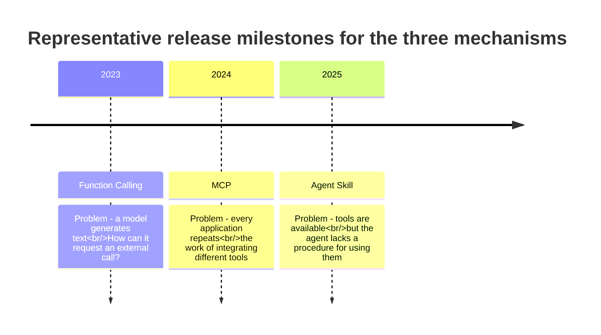
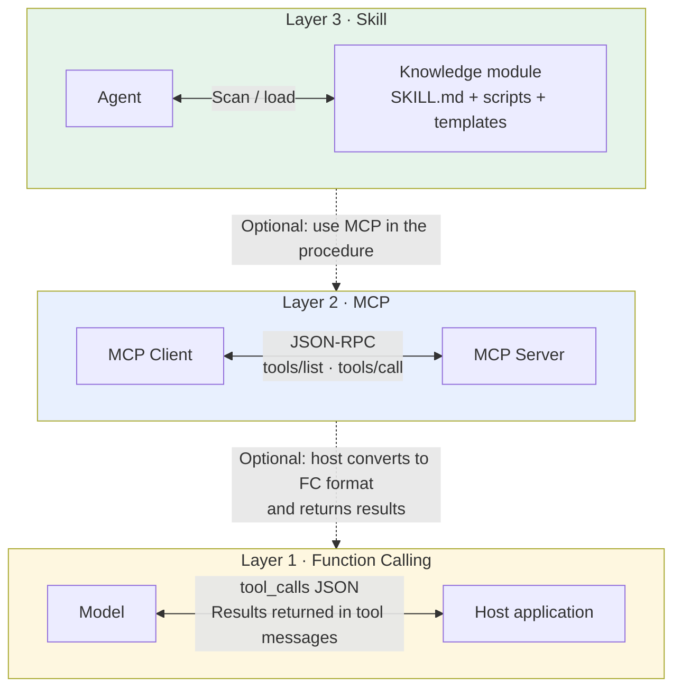
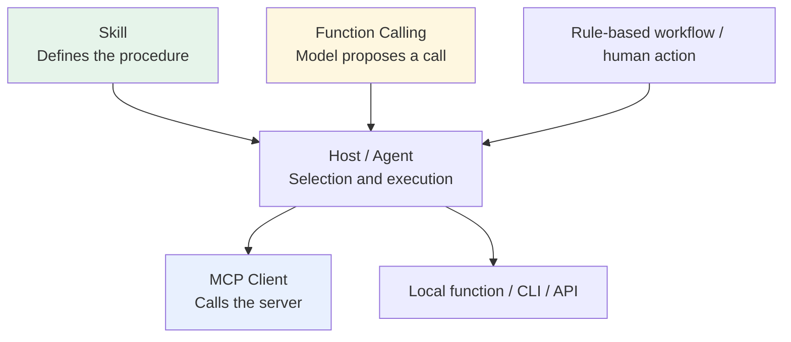
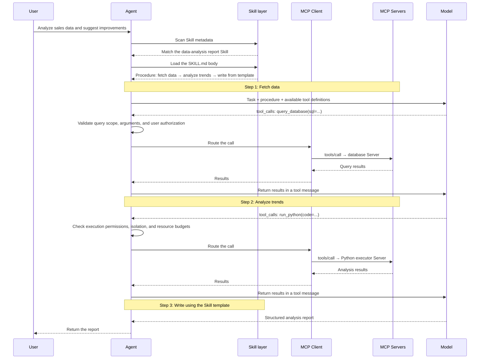

# Chapter 10: How Function Calling, MCP, and Skills Fit Together

## 10.1 Why are there three concepts?

The typical misconception is that these are competing solutions introduced by different vendors at different times, and you only need to choose one.

They are **three composable interface and content mechanisms**, not a technology stack in which every layer must depend on the next.

Start by asking **who is speaking in each case**:

| | Who is speaking | What they say |
|---|---|---|
| **Function Calling** | The model | “I want to call this function with these arguments.” |
| **MCP** | The tool service | “These are the functions I provide.” |
| **Skill** | The operating manual | “Use these tools and follow this procedure.” |

Different speakers, different counterparts, and different granularities explain the essential distinction.

### 10.1.1 Release milestones do not establish dependencies

The timeline marks the releases of OpenAI Function Calling, MCP, and Anthropic Agent Skills. It does not date the origins of tool use, interface standardization, or reusable procedures. Their respective concerns are:

- Function calling addresses the **call interface**: the model and application need a structured way to express calls.
- MCP addresses repeated integration work by **standardizing** access to tools, resources, and prompt templates, so compatible applications can reuse server capabilities.
- Skills address repeated maintenance of task steps and standards by organizing **reusable knowledge and procedures**. They do not require tools to be connected through MCP first.

## 10.2 Identify the communicating parties

| Layer | Communicating parties | Nature | Granularity |
|---|---|---|---|
| Function Calling | Model ↔ host application | Format for an individual call | One function call |
| MCP | MCP client ↔ MCP server | Standardized tool packaging and discovery | A tool or set of tools |
| Skill | Agent ↔ knowledge module | Reusable packaging of procedures and standards | A complete class of tasks |

Notice the difference in granularity. Querying an order table is an **MCP tool**; code review or producing a data-analysis report is a **Skill**. A Skill may contain several steps, each of which may call multiple MCP tools. When an LLM drives the process, it commonly expresses its intent to call a tool through function calling or structured output.

## 10.3 Composition does not mean mandatory dependency

Counterexamples help reveal whether responsibilities have been confused:

All of these paths are possible:

- **Without native function calling**, a host can still trigger tools through structured text, rules, or human selection. The differences lie in reliability and adaptation cost.
- **MCP can work with function calling**. Many hosts convert MCP tools into model schemas, but MCP does not require this adaptation path. [Chapter 6](../02-mcp/06-mcp-vs-function-calling.md) examines that sequence in detail.
- **A Skill that requires external actions depends on the host providing the corresponding capabilities, not on a particular protocol**. It can use MCP, embedded functions, or other controlled integrations during execution.

Function calling with an executor can work on its own. A deterministic program can use MCP alone. A writing-only Skill can avoid external tools entirely. None of the three is a prerequisite for either of the others.

## 10.4 Three boundaries, three kinds of failure

| | Boundary | Typical failures |
|---|---|---|
| **Function Calling** | Model proposal → application execution | Wrong tool selected, semantically wrong arguments, unauthorized calls |
| **MCP** | Client → server | Incompatible versions, authentication failures, unknown outcomes after timeouts |
| **Skill** | Reusable knowledge → current task context | Incorrect activation, outdated instructions, missing script dependencies |

“The arguments are valid JSON,” “the server is reachable,” and “the Skill is loaded” each establish only that one stage passed. None proves that the whole task is complete.

## 10.5 A complete scenario connecting the three layers

The user asks in Chinese: **“帮我分析最近三个月的销售数据，找出下滑的产品线，给改进建议。”** In English: “Analyze sales data from the last three months, identify declining product lines, and suggest improvements.”

Within this process, the three responsibilities are:

- **The Skill guides the procedure**: fetch data, analyze it, then write the report using a template. State who defines business alert thresholds; an arbitrary percentage is not statistical significance.
- **MCP provides interfaces for capability discovery and invocation**: the client obtains tool lists from known servers, and the host filters them by authorization and task. Establishing a connection does not automatically place every tool in the model's context.
- **Function calling mediates the model's use of tools**: each `tool_calls` output and the corresponding results returned in `tool` messages.

The host must also validate which sales data the user may access, constrain SQL, isolate the Python executor, and retain the data's time range and source. Manage the versions of MCP 2026-07-28, the Agent Skills file format, and the model's tool API separately. An upgrade at any layer requires regression testing of the complete chain.

The diagram shows the successful path. If the query fails, do not proceed to generate sales conclusions. If the data covers only part of the requested period, state the actual scope. If the analysis script fails, retain the data already retrieved and report the missing step. A decline in sales does not establish its cause; improvement recommendations must distinguish conclusions supported by the data from hypotheses that still need testing.

## 10.6 Common mistakes

### 10.6.1 Treating them as three competing solutions

They can appear together or be used independently. First determine whether the problem concerns model output, capability integration, or procedure reuse.

### 10.6.2 Misstating the dependency direction

A more accurate description is that the host orchestrates capabilities according to Skill instructions; MCP standardizes some capability integrations; and function calling is a common way for a model to express tool selection. The mechanisms compose, but do not form a mandatory one-way dependency chain.

### 10.6.3 Assuming all three are required

Alternative implementation paths exist when any one is absent. Small projects may still need standardization or procedure reuse, so project size alone is not a sufficient criterion.

### 10.6.4 Confusing granularity

One Skill does not equal one tool. It can describe a whole class of tasks or simply organize writing standards. The format specifies neither whether tools are called nor how many calls are made.

### 10.6.5 Calling MCP “Anthropic's version of function calling”

MCP is neither an alternative implementation of function calling nor a protocol built on top of it. The same MCP server can serve different hosts. When a host uses a model tool interface, it can translate tool definitions into the provider's function-calling schema, but other invocation paths are possible.

### 10.6.6 Reciting definitions without explaining collaboration

When explaining the three mechanisms, walking through a concrete scenario that connects them usually communicates more than reciting three separate definitions.

## 10.7 Summary

1. **The three mechanisms compose; they do not form a mandatory dependency stack**.
2. **Identify the speaker to distinguish them quickly**: the model says “I want to call,” the service says “I provide,” and the manual says “follow this procedure.”
3. **Release dates do not establish dependencies**. These problems and approaches existed before the particular products were released.
4. **A host can follow a Skill to orchestrate MCP or other capabilities**. MCP tools can be triggered by a model proposal or a deterministic workflow; calls still need validation before execution.
5. **Their granularities differ substantially**: one call / one tool / a complete class of tasks.
6. **Not all three are necessary**. Function calling plus an executor can work on its own. Whether to introduce MCP or Skills depends on interface and procedure reuse, not a project-size threshold.
7. **The complete call chain must include authorization, failure recovery, and evidence for results**, rather than depicting only the successful path.

## References

- [OpenAI: Function calling guide](https://platform.openai.com/docs/guides/function-calling)
- [Model Context Protocol official documentation](https://modelcontextprotocol.io/docs/getting-started/intro)
- [MCP specification 2026-07-28](https://modelcontextprotocol.io/specification/2026-07-28)
- [Anthropic: Introducing Agent Skills](https://www.anthropic.com/news/skills)
- [Agent Skills specification](https://agentskills.io/specification)
- [Anthropic: Building Effective Agents](https://www.anthropic.com/engineering/building-effective-agents)
