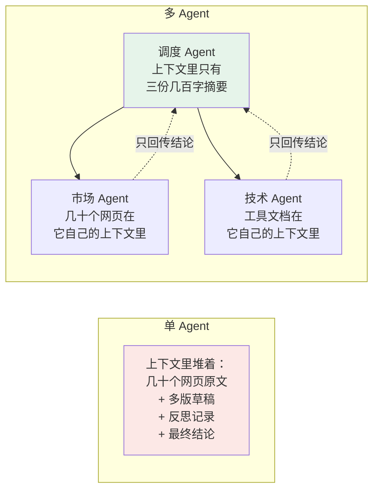
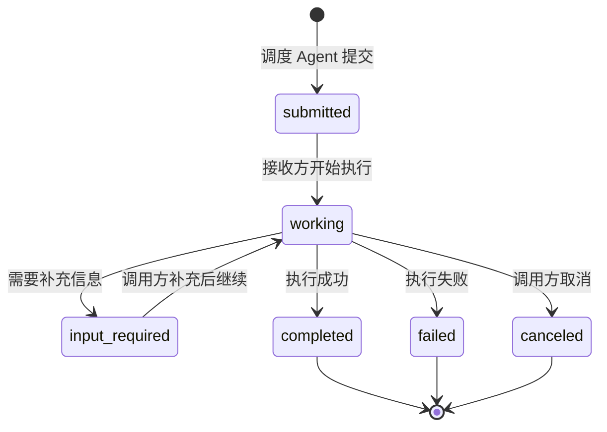
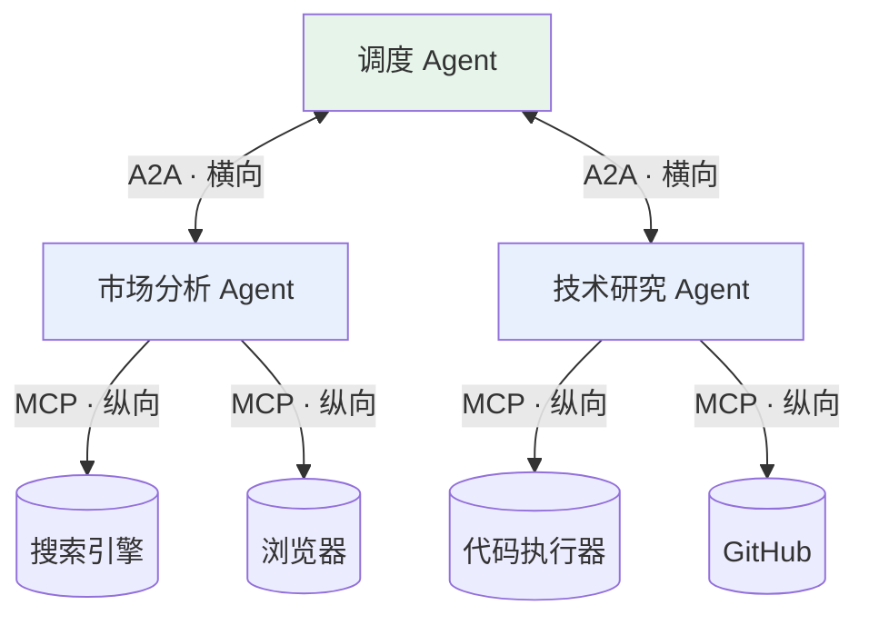

# 第十一章：A2A 协议

## 11.1 单个 Agent 的三个天花板

一个 Agent 可以近似看成 **一个 LLM + 一组工具 + 一段上下文窗口**。这三个维度各有上限：

| 维度 | 上限表现 |
|---|---|
| **工具数量** | 装 100 个工具，模型选择准确率显著下降，且工具定义每轮全量重传（见 [第三章](../01-function-calling/03-tool-schema-design.md)） |
| **上下文窗口** | 复杂任务的中间产物（搜索结果、草稿、反思记录）会迅速填满窗口 |
| **专业能力** | 同一个 Agent 既做代码审查又做市场分析，不如各自专精的 Agent |

举个具体任务：**「做一份 AI 编程工具的竞品分析报告，要有行业趋势、技术对比、商业模式分析和 SWOT」**。

单 Agent 做这件事的问题是：搜索结果和草稿会把上下文撑满，等写到 SWOT 时，前面的行业趋势分析早已被挤出有效注意力范围；而且市场调研和技术分析需要不同的知识侧重。

### 11.1.1 多 Agent 在上下文层面的真正收益

有个值得追问的问题：**拆成多个 Agent，上下文压力就真的变小了吗？**

关键在于**中间过程被隔离了**：



市场 Agent 自己去搜几十个网页、写草稿、反复迭代，这些**中间过程全在它自己的上下文里**。任务完成后只把一份几百字的结论回传。

调度 Agent 的上下文里只多了一份摘要，而不是几十个网页原文。**这就是多 Agent 协作在上下文层面的核心收益：把调研过程的上下文压力隔离在专业 Agent 内部。**

## 11.2 基础问题：Agent 之间怎么互相认识

Agent A 要把任务委托给 Agent B，前提是它得知道 B 能做什么。

最直接但也最难维护的方案，是把配置写死：A 的代码里硬编码「B 可以做竞品分析」。B 的能力一变，A 的代码就得改。

**A2A 的方案**是让 B 主动「发名片」——**Agent Card**。

### 11.2.1 Agent Card

Agent Card 是 JSON 能力声明。部署可通过配置、目录或 `/.well-known/agent-card.json` 等发现约定取得它；调用方应使用已知或可信的 Card URL，而非把任意网络位置自动视为可信。

```json
{
  "name": "Market Research Agent",
  "description": "面向科技行业的市场趋势与竞品调研",
  "url": "https://agents.example.com/market",
  "version": "1.2.0",
  "capabilities": {
    "streaming": true,
    "pushNotifications": true
  },
  "skills": [
    {
      "id": "competitor-analysis",
      "name": "竞品分析",
      "description": "针对指定产品品类，输出竞品清单、定位对比与差异化分析",
      "examples": ["分析国内 AI 编程助手的竞争格局"]
    },
    {
      "id": "trend-analysis",
      "name": "行业趋势分析",
      "description": "基于公开数据与新闻，输出指定行业未来 12 个月的趋势判断"
    }
  ]
}
```

名片里最关键的是 **skills 列表**。调度 Agent 靠这些描述做路由决策——「这个任务和哪个 Agent 的哪个 skill 最匹配」。

这和 [工具的 description](../01-function-calling/03-tool-schema-design.md) 起的作用完全一致：**都是在被选择的那一刻，对方唯一能看到的信息**。写得含糊，这个 Agent 就很难被正确路由到任务。

> 注意这里的 `skills` 和 [第八章](../03-skills/08-what-is-skill.md) 讲的 Agent Skill **不是一回事**。A2A 的 skill 是「对外声明的能力条目」，Agent Skill 是「Agent 内部的流程知识模块」。名字撞车，层次完全不同。

### 11.2.2 可插拔是这套机制的价值

新加一个 Agent 后，支持相同发现机制的调用方可以读取其 Agent Card 并考虑调用它；是否自动接纳仍应经过信任、认证和策略检查。

这和 MCP 的 `tools/list` 自动发现是同一个思路——[第四章](../02-mcp/04-what-is-mcp.md) 里说过，「自动发现」才是标准化协议真正的价值所在。

## 11.3 Task 是 A2A 的一等公民

A2A 里任务协作的基本单位是 **Task**：调度 Agent 委托任务 = 创建一个 Task；接收方执行；完成后把产出（**artifacts**，可以是文本、文件等）返回。



### 11.3.1 为什么需要这么完整的状态机

因为 **A2A 是专门为长时间任务设计的**。

一个「竞品分析」任务可能要跑几分钟：先搜索、再整理、再写报告。不可能让调度 Agent 同步阻塞等着。

所以调度 Agent 提交任务后可以去处理别的事，通过两种方式得知完成：

| 方式 | 说明 | 适用 |
|---|---|---|
| **轮询** | 定期查 Task 状态 | 实现简单，任务不多时够用 |
| **Push Notification** | 接收方完成时主动回调调用方 | 任务多、耗时长，避免空轮询 |
| **流式** | HTTP/JSON-RPC binding 通常用 SSE，gRPC binding 用 server streaming | 需要给用户展示进度 |

### 11.3.2 黑盒是解耦的意义

调度 Agent 的视角非常干净：**提交 Task → 查状态 → 取 artifacts**。

它完全不需要知道接收方内部用了什么工具、调了几次 LLM、是不是又委托给了别的 Agent。每个专业 Agent 的实现对外不可见——这正是解耦的价值。

## 11.4 架构本质：Agent 的微服务化

有后端经验的话，A2A 会很眼熟——**它就是 Agent 世界里的微服务架构**：

| 微服务 | A2A |
|---|---|
| 独立部署的服务（HTTP、gRPC 等） | 独立部署的 Agent |
| API 文档 / OpenAPI | Agent Card |
| 服务注册中心的一条记录 | `/.well-known/agent-card.json` |
| 异步消息队列 | Task 状态机 + Push Notification |
| 服务间多种 RPC/HTTP 调用 | Agent 间 A2A 调用 |

一个 A2A Agent 可通过 JSON-RPC、HTTP/REST、gRPC 或协商的 custom binding 暴露服务。兼容调用方可在完成发现、认证和策略检查后提交任务并接收结果；A2A 不绑定特定 AI 框架或编程语言。

这个理念和 MCP 一脉相承：**MCP 让工具成为独立标准化服务，A2A 让 Agent 成为独立标准化服务。**

A2A 由 Google 在 2025 年 4 月提出，同年 6 月捐给 Linux 基金会独立治理——这一步和 MCP 走的路径也很像：先由一家推出，再交给中立组织维护，以争取生态采纳。

## 11.5 A2A 的多种 protocol binding

A2A 把**数据模型与操作**和网络 binding 分开。v1.0.0 定义 JSON-RPC、gRPC、HTTP/REST binding，并允许自定义 binding；同一 Task、Message、Part、Artifact 语义不应因 binding 改变。

| binding | 常见用途 | 流式更新 |
|---|---|---|
| **JSON-RPC** | 复用 RPC 方法与错误模型 | `message/stream` 使用 SSE |
| **HTTP/REST** | Web 网关与资源式 HTTP 集成 | SSE 传递 Task/Artifact 更新 |
| **gRPC** | 强类型服务间调用 | server streaming RPC |
| **Custom binding** | 双方已协商的特定环境 | 由扩展定义 |

WebSocket **不是 A2A 核心 binding**；需要它的双方可定义 custom binding 或用它承载自己的会话层，但不能据此宣称通用 A2A 互操作。WebRTC 同样不是 A2A binding：A2A 可通过 file URI 或文件 Part 交换音频/视频等内容，实时媒体协商与传输需由应用另行设计。

## 11.6 A2A 与 MCP：一纵一横

理清两者关系最简单的方式是**看方向**：



| | 连接方向 | 对端是谁 | 解决什么 |
|---|---|---|---|
| **MCP** | 向下（纵向） | 工具、数据源 | Agent 怎么获得外部能力 |
| **A2A** | 向外（横向） | 其他 Agent | Agent 之间怎么分工协作 |

类比：**MCP 是每个员工的工具箱**，决定这个人能用什么工具干活；**A2A 是公司的协作流程**，决定不同岗位的人怎么分工交接。工具箱和协作流程是两回事，缺哪个都不行。

复杂系统里两者同时在用：MCP 管纵向连接，A2A 管横向协作。

### 11.6.1 一个自然的推论

既然一个 Agent 对外是 A2A 服务、对下用 MCP 连工具，那么**能不能把一个 Agent 直接包装成 MCP Server 给别的 Agent 用**？

技术上可以，而且社区里确实有这种做法。但两者的语义不同：

- **包成 MCP 工具**：调用方把它当成一次同步的函数调用，期待快速返回。适合能力边界窄、执行快的 Agent；
- **走 A2A**：有完整的任务生命周期、异步、可取消、可补充输入、可流式。适合长时间、多轮、需要澄清的复杂委托。

判断依据是：**这个委托更像「调一次接口」还是「派一个活」**。

## 11.7 常见错误

### 11.7.1 把 A2A 当成 MCP 的竞品

这是最容易混淆的点。两者面向的对象完全不同——一个连工具，一个连 Agent。它们互补，而且经常同时出现。

### 11.7.2 只把 A2A 当成一种 HTTP API

A2A 定义的是跨实现共享的数据模型、任务生命周期、发现和安全语义，不只是一组 HTTP endpoint。v1.0 提供 JSON-RPC、HTTP/REST、gRPC 和 custom binding；SSE 是相应 binding 的流式承载方式，WebSocket/WebRTC 不属于核心 binding。

### 11.7.3 忽略 Task 状态机的设计动机

状态机不是为了把协议做得完整好看，而是因为 A2A 专门面向**长时间异步任务**。如果调用天然就是同步阻塞，确实用不上这么细的状态管理。

### 11.7.4 把 A2A 的 skill 和 Agent Skill 混为一谈

名字撞车但层次不同：A2A 的 skill 是对外的能力声明条目，Agent Skill 是 Agent 内部的流程知识模块。

### 11.7.5 认为有了 A2A 就必须用 A2A

绝大多数多 Agent 系统跑在**单进程内**（比如 LangGraph 的多节点图），Agent 之间直接传共享状态就行，根本不需要跨进程协议。A2A 的价值出现在**Agent 由不同团队开发、独立部署、跨组织协作**的时候。为一个单进程系统引入 A2A 是过度设计。

### 11.7.6 忽略 Agent Card 的描述质量

和工具 description 一样，写得含糊的 Agent Card 会导致这个 Agent 要么永远派不到活，要么被派到不该做的活。

## 11.8 本章总结

1. **A2A 解决的是单 Agent 的三个天花板**：工具数量、上下文窗口、专业能力；
2. **多 Agent 在上下文层面的真正收益是中间过程隔离**，调度 Agent 只收结论不收原始素材；
3. **Agent Card 实现能力声明与发现**；可通过已知 URL、配置或 well-known 约定取得，skills 描述可辅助路由；
4. **Task 是一等公民**，完整状态机是为异步长任务设计的，支持轮询、回调、流式三种感知方式；
5. **架构本质是 Agent 的微服务化**：Agent Card 对应 API 文档，Task 状态机对应异步消息队列；
6. **多 binding 保持同一语义**：JSON-RPC、HTTP/REST、gRPC 是核心 binding；SSE 用于相应 binding 的流式更新，WebSocket/WebRTC 不属于核心 binding；
7. **与 MCP 是一纵一横**：MCP 向下连工具，A2A 向外连 Agent，互补不竞争；
8. **不是所有多 Agent 系统都需要 A2A**，单进程内协作用共享状态更简单，A2A 面向跨团队跨部署的场景。

> **可以把它理解成：MCP 负责给 Agent 接工具，A2A 负责让 Agent 之间交接任务；一个管纵向能力，一个管横向协作。**

## 参考资料

- [A2A 协议官网](https://a2a-protocol.org/)
- [A2A v1.0.0 规范](https://a2a-protocol.org/v1.0.0/specification)
- [Google: Announcing the Agent2Agent Protocol](https://developers.googleblog.com/en/a2a-a-new-era-of-agent-interoperability/)
- [Linux Foundation: A2A Project](https://www.linuxfoundation.org/press/linux-foundation-launches-the-agent2agent-protocol-project-to-enable-secure-intelligent-communication-between-ai-agents)
- [Model Context Protocol 官方文档](https://modelcontextprotocol.io/docs/getting-started/intro)
- [Anthropic: Building Effective Agents](https://www.anthropic.com/engineering/building-effective-agents)
