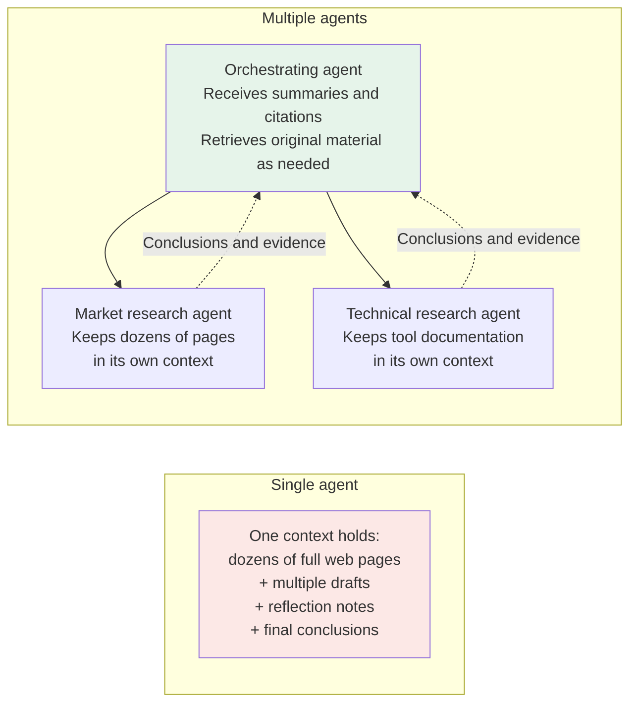
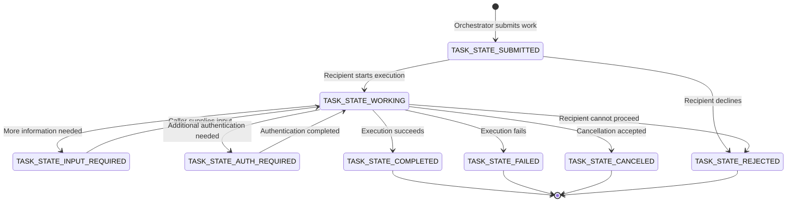
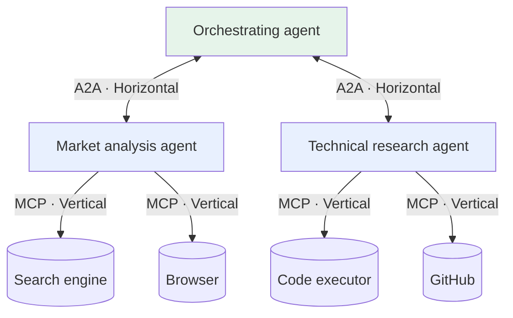

# Chapter 11: The A2A Protocol

This chapter uses the **A2A v1.0.1 release specification**. The wire-level `A2A-Version` is `1.0`, without the patch number. The specification version, SDK version, and agent software version are three separate things.

## 11.1 Three Limits of a Single Agent

Consider an agent built from **one LLM, a set of tools, and an active context**. This is a simplified implementation for discussing why we might split the work, not a universal definition of an agent. It may encounter the following limits:

| Dimension | How the limit appears |
|---|---|
| **Number of tools** | Similar tools can be harder to distinguish; injecting every definition adds cost, though retrieval or deferred loading can help (see [Chapter 3](../01-function-calling/03-tool-schema-design.md)) |
| **Context window** | Intermediate work from a complex task—search results, drafts, and reflection notes—can quickly fill the window |
| **Specialization** | Different tasks need different knowledge and tool configurations; evaluate coordination cost and final quality before splitting them |

Take this concrete request: **「做一份 AI 编程工具的竞品分析报告，要有行业趋势、技术对比、商业模式分析和 SWOT」**—“Write a competitive analysis of AI coding tools, covering industry trends, technical comparisons, business models, and SWOT.”

If every search result and draft is appended in full, earlier evidence may have been truncated or become difficult to use by the time the agent reaches SWOT: strengths, weaknesses, opportunities, and threats. Start by considering retrieval, summarization, and external storage. When market and technical research can proceed independently, assess whether multiple agents would help.

### 11.1.1 Where Multiple Agents Actually Save Context

A useful follow-up is: **does splitting the work across agents really reduce context pressure?**

The key is that **intermediate work stays in separate contexts**:



The market research agent searches dozens of pages, writes drafts, and revises them. **All that intermediate work stays in its own context.** When finished, it returns a short conclusion of a few hundred Chinese characters.

The orchestrating agent receives a summary rather than dozens of full pages. **The core context benefit is that each specialist absorbs the context pressure of its own research process.**

This is a possible benefit of a multi-agent architecture, not a guarantee from A2A. Total token use may increase, and summaries can omit evidence. Return sources, assumptions, and retrievable original artifacts, not just a conclusion.

## 11.2 How Do Agents Discover Each Other?

Before agent A can delegate work to agent B, it needs to know what B can do.

The most direct—and difficult to maintain—approach is hard-coded configuration: A's code says that B can perform competitive analysis. Whenever B's capabilities change, A's code needs updating.

**A2A's approach** is for B to publish an **Agent Card**, a machine-readable introduction to its capabilities.

### 11.2.1 The Agent Card

An Agent Card is a JSON capability declaration. A deployment can obtain one through configuration, a catalog, or a discovery convention such as `/.well-known/agent-card.json`. Callers should use known or trusted Card URLs, rather than automatically trusting an arbitrary network location.

```json
{
  "name": "Market Research Agent",
  "description": "Market trend and competitor research for the technology industry",
  "supportedInterfaces": [
    {
      "url": "https://agents.example.com/market",
      "protocolBinding": "JSONRPC",
      "protocolVersion": "1.0"
    }
  ],
  "version": "1.2.0",
  "defaultInputModes": ["text/plain"],
  "defaultOutputModes": ["text/plain"],
  "capabilities": {
    "streaming": true,
    "pushNotifications": true
  },
  "skills": [
    {
      "id": "competitor-analysis",
      "name": "Competitive analysis",
      "description": "Identify competitors in a product category, compare their positioning, and analyze differentiation",
      "tags": ["market", "research"],
      "examples": ["分析国内 AI 编程助手的竞争格局"]
    },
    {
      "id": "trend-analysis",
      "name": "Industry trend analysis",
      "description": "Analyze industry trends using public information, with sources, dates, and uncertainties",
      "tags": ["trends"]
    }
  ]
}
```

The **skills list** is central to the Card. The orchestrating agent uses these descriptions to help decide which agent and skill best match a task. The Chinese prompt retained in `examples` means “Analyze the competitive landscape of AI coding assistants in China”; it is example input, not a protocol field.

This example is a public capability card with no protected operations configured. `version: "1.2.0"` is an example version of the agent software, not the A2A version. Version 1.0 declares interfaces through `supportedInterfaces`, rather than the older top-level `url`. Production cards should also declare `securitySchemes` and `securityRequirements` where needed, and confirm that the advertised streaming and push capabilities are actually enabled.

Descriptions can guide routing, but callers must also consider input and output modes, authentication requirements, trusted provenance, and task constraints. A Card is neither proof of authorization nor an evaluation showing that the agent performs correctly.

> These `skills` are **not the Agent Skills** discussed in [Chapter 8](../03-skills/08-what-is-skill.md). An A2A skill is an externally advertised capability; an Agent Skill packages procedural knowledge for use inside an agent. The names overlap, but they describe different layers.

### 11.2.2 Making Agents Pluggable

When a new agent is added, callers that support the same discovery mechanism can read its Card and consider using it. Automatic admission still requires trust, authentication, and policy checks.

This resembles calling MCP's `tools/list` on a known server: metadata reduces the need for hard-coded capability lists. Discovery is only one part of interoperability; it does not replace a shared data model, version handling, or authentication.

## 11.3 Tasks Are First-Class Objects in A2A

An A2A **Task** is a stateful unit of work. After a client sends a Message, the server may return a Message directly or create and return a Task; not every message creates a task. **Artifacts** carry task outputs, while messages support interaction, clarification, and status communication.

The server creates the task identifier referenced by `taskId`; `contextId` links tasks and messages in the same conversational context, and `messageId` identifies a message. These are not user identities and do not automatically provide business-level idempotency. A `Part` can carry text, raw or referenced files, or structured data.



These are typical paths; a task need not visit every state. Version 1.0 ProtoJSON uses the `TASK_STATE_*` enum names shown above. Lowercase or hyphenated values from older articles cannot be copied directly into 1.0 messages. `TASK_STATE_UNSPECIFIED` should not be used as a normal business state. Completed, failed, canceled, and rejected are terminal states; input required and authentication required are interrupted states.

### 11.3.1 Why Such a Detailed State Machine?

Because **A2A must support work that spans multiple interactions and may run for a long time**, while still allowing simple requests to return a Message directly.

Competitive analysis may involve several tools or human steps. In `SendMessage`, `configuration.returnImmediately` defaults to `false`: when returning a Task, the operation waits for a terminal state or an interrupted state requiring input or authentication. Setting it to `true` returns immediately after task creation and leaves further tracking to the caller. This option does not change direct Message responses or control streaming operations.

Callers can track tasks in three ways:

| Mechanism | How it works | When it fits |
|---|---|---|
| **Polling** | Query the Task's state periodically | Simple to implement and often sufficient for a small number of tasks |
| **Push notifications** | The recipient calls a registered endpoint on task updates, not only on completion | Requires capability support, a reachable webhook, and authentication |
| **Streaming** | HTTP/JSON-RPC bindings normally use SSE; the gRPC binding uses server streaming | Useful when users need to see progress |

### 11.3.2 Black-Box Delegation Decouples Implementations

The orchestrating agent has a simple view: **submit work → check task status → retrieve artifacts**.

It need not know which tools the recipient used, how many LLM calls it made, or whether it delegated work to another agent. Each specialist hides its implementation behind the contract. That is the value of decoupling.

A disconnected stream does not cancel the task. After reconnecting, use `GetTask` or `SubscribeToTask` to obtain its state. A subscription starts with the current Task, but does not guarantee replay of all earlier deltas. `CancelTask` requests cancellation; it can fail if the task has already finished or cannot be canceled. Side effects such as a sent email or completed payment are not automatically rolled back. Reconstruct Artifact updates using `artifactId`, `append`, and `lastChunk`, rather than treating every stream event as a separate complete file.

## 11.4 The Architectural Analogy: Agents as Microservices

If you have backend experience, microservices offer a useful analogy for A2A's independent deployment and black-box contracts. But **A2A is an interoperability protocol, not a complete microservices architecture**. The system must still implement registration, persistence, scheduling, and disaster recovery:

| Microservices | A2A |
|---|---|
| Independently deployed services using HTTP, gRPC, and other protocols | Independently deployed agents |
| API documentation / OpenAPI | Agent Card |
| Entry point for capability metadata | `/.well-known/agent-card.json`, not a global registry |
| Abstraction for asynchronous work | Tasks and update mechanisms, without a message queue's durable-delivery guarantees |
| RPC/HTTP calls between services | A2A calls between agents |

An A2A agent can expose its service through JSON-RPC, HTTP/REST, gRPC, or an agreed custom binding. Compatible callers can submit work and receive results after discovery, authentication, and policy checks. A2A is not tied to a particular AI framework or programming language.

The idea parallels MCP: **MCP exposes tools through a standard service interface; A2A does the same for agents.**

Google introduced A2A in April 2025 and contributed it to the Linux Foundation for independent governance that June. Like MCP, it followed a path from introduction by one company to stewardship by a neutral organization, seeking broader ecosystem adoption.

## 11.5 A2A's Protocol Bindings

A2A 1.0 separates **the data model and operations** from their network bindings. It defines JSON-RPC, gRPC, and HTTP/REST bindings and allows custom bindings. Version v1.0.1 is a patch release that corrects documentation and HTTP media-type guidance, among other issues, without changing the `Major.Minor` negotiation identifier.

| Binding | Typical use | Streaming updates |
|---|---|---|
| **JSON-RPC** | Reuse RPC methods and error models | `SendStreamingMessage` uses SSE |
| **HTTP/REST** | Web gateways and resource-oriented HTTP integration | SSE carries Task/Artifact updates |
| **gRPC** | Strongly typed service-to-service calls | Server-streaming RPC |
| **Custom binding** | A specific environment agreed by both parties | Defined by the extension |

WebSocket **is not a core A2A binding**. Parties that need it may define a custom binding or use it for their own session layer, but that alone does not establish general A2A interoperability. WebRTC is not an A2A binding either. A2A can exchange audio, video, and other content through file URIs or file Parts; the application must separately design real-time media negotiation and transport.

Version 1.0 JSON-RPC methods include `SendMessage`, `GetTask`, `CancelTask`, and `SubscribeToTask`; corresponding HTTP routes include `POST /message:send`, `GET /tasks/{id}`, and `POST /tasks/{id}:cancel`. Do not mix older method names such as `message/send` or `tasks/get` into the new protocol. HTTP clients explicitly send `A2A-Version: 1.0`; an omitted version is interpreted as `0.3` for compatibility, not as “use the latest.” The v1.0.1 HTTP binding prefers `application/a2a+json`, while SSE responses remain `text/event-stream`.

## 11.6 A2A and MCP: Horizontal and Vertical Connections

One simple way to understand their relationship is to **look at the direction of the connection**:



| | Direction | Counterpart | Problem addressed |
|---|---|---|---|
| **MCP** | Downward, or vertical | Tools and data sources | How an agent accesses external capabilities |
| **A2A** | Outward, or horizontal | Other agents | How agents divide work and collaborate |

“Vertical” and “horizontal” illustrate common usage, not a required topology. MCP can expose an agent's capabilities, and an A2A backend can be a deterministic program. The key distinction is the external contract, not whether the counterpart actually uses a model.

A complex system can use both: MCP for vertical access to capabilities and A2A for horizontal collaboration.

### 11.6.1 Could an Agent Be Exposed as an MCP Tool?

If an agent exposes an A2A service while using MCP to reach tools, **could we instead wrap the agent in an MCP server for other agents to use?**

Yes, and community implementations do this. The semantics differ, however:

- **Expose an MCP tool:** provide a tool contract. Long-running work can also use MRTR, explicit handles, or the optional Tasks extension; MCP is not limited to synchronous calls.
- **Use A2A:** provide a full task lifecycle with asynchronous work, cancellation requests, further input, and streaming. This suits long-running, multi-turn delegation that may require clarification.

The useful question is: **is this delegation closer to making an API call or assigning a piece of work?**

## 11.7 Common Mistakes

### 11.7.1 Treating A2A as an MCP Competitor

They are commonly used for capability access and cross-system delegation, respectively, but are not strictly separated by whether the counterpart contains a model. An agent can be wrapped as an MCP tool, and an A2A backend can run a deterministic workflow. Compare the tool contract and task lifecycle against what the application needs.

### 11.7.2 Seeing A2A as Just Another HTTP API

A2A defines a data model, task lifecycle, discovery, and security semantics shared across implementations—not merely a set of HTTP endpoints. Version 1.0 provides JSON-RPC, HTTP/REST, gRPC, and custom bindings. SSE carries streaming updates for the relevant bindings; WebSocket and WebRTC are not core bindings.

### 11.7.3 Missing the Reason for the Task State Machine

The state machine expresses work in progress, requests for input or authentication, and the different terminal outcomes. Synchronous waiting does not eliminate state management: clarification or cancellation can still be needed while the caller waits. A direct Message response suits simple interactions that need no task tracking.

### 11.7.4 Confusing an A2A Skill with an Agent Skill

The names overlap, but the layers differ: an A2A skill is an externally advertised capability, whereas an Agent Skill packages procedural knowledge used inside an agent.

### 11.7.5 Adopting A2A Simply Because It Exists

Nodes in the same process can call functions or pass state directly; they do not necessarily need a cross-system protocol. A2A is better suited to different implementations, independent deployments, or cross-organization collaboration. Also consider whether existing internal RPC already meets the requirement. The label “multi-agent” is not itself a reason to add a protocol.

### 11.7.6 Neglecting Agent Card Descriptions

As with tool descriptions, vague Agent Card descriptions can leave an agent with no assignments—or send it work it should not be doing.

## 11.8 Chapter Summary

1. **A2A provides an interface for collaboration across implementations.** It does not automatically improve expertise or reduce total context cost.
2. **Multiple agents can isolate intermediate work**, but summaries lose information. The orchestrator should be able to trace the evidence, not merely receive conclusions.
3. **Agent Cards support capability declaration and discovery.** They can be obtained through known URLs, configuration, or a well-known convention, and skill descriptions can help routing.
4. **Tasks are first-class objects.** Their state machine supports long-running asynchronous work, with polling, callbacks, and streaming for tracking updates.
5. **Black-box delegation decouples implementations**, but a task state machine is not a durable message queue or an exactly-once execution guarantee.
6. **Bindings preserve shared semantics.** JSON-RPC, HTTP/REST, and gRPC are core bindings. SSE carries updates for the relevant bindings; WebSocket and WebRTC are not core bindings.
7. **MCP and A2A commonly serve vertical and horizontal connections.** MCP connects to tools and A2A to other agents; they complement one another.
8. **Not every multi-agent system needs A2A.** Shared state can be simpler within one process; A2A addresses collaboration across teams and deployments.

## References

- Source review: the Chinese manuscript's 2026-09-15 review read the v1.0.1 release notes, specification, and Proto definitions. The English migration rechecked the release metadata through GitHub's API and the relevant tagged specification and Proto sections. The release web page did not render through the retrieval tool. The tagged specification still contains an outdated “Latest Released Version 1.0.0” notice. Its Send Message overview also says the operation returns immediately, contradicting the execution-mode section and the Proto definition of blocking by default. This chapter follows the explicit `return_immediately` definition in the latter two sources; the JSON wire field is `returnImmediately`.
- [A2A v1.0.1 release notes](https://github.com/a2aproject/A2A/releases/tag/v1.0.1)
- [A2A protocol website](https://a2a-protocol.org/)
- [A2A v1.0.1 release specification](https://github.com/a2aproject/A2A/blob/v1.0.1/docs/specification.md)
- [A2A v1.0.1 protocol data definitions](https://github.com/a2aproject/A2A/blob/v1.0.1/specification/a2a.proto)
- [Google: Announcing the Agent2Agent Protocol](https://developers.googleblog.com/en/a2a-a-new-era-of-agent-interoperability/)
- [Linux Foundation: A2A Project](https://www.linuxfoundation.org/press/linux-foundation-launches-the-agent2agent-protocol-project-to-enable-secure-intelligent-communication-between-ai-agents)
- [Model Context Protocol documentation](https://modelcontextprotocol.io/docs/getting-started/intro)
- [Anthropic: Building Effective Agents](https://www.anthropic.com/engineering/building-effective-agents)
