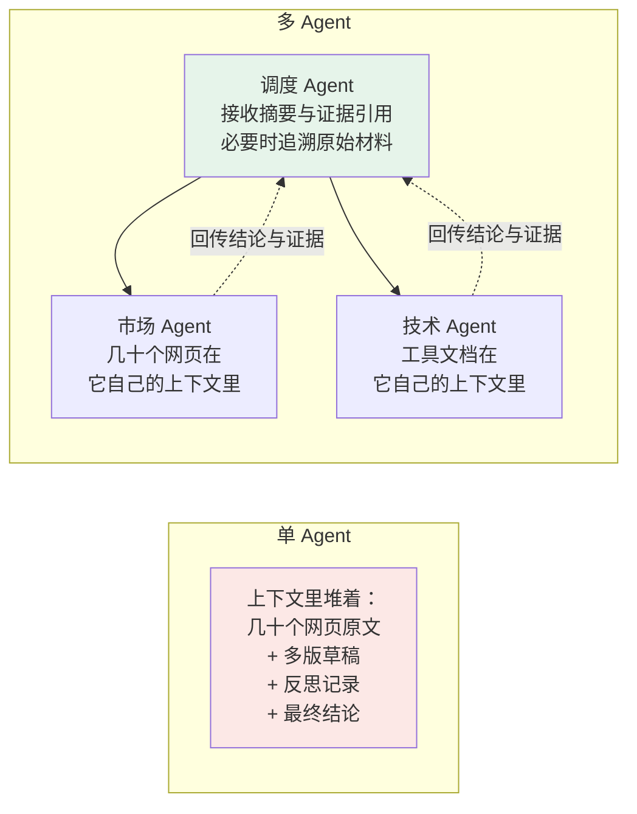
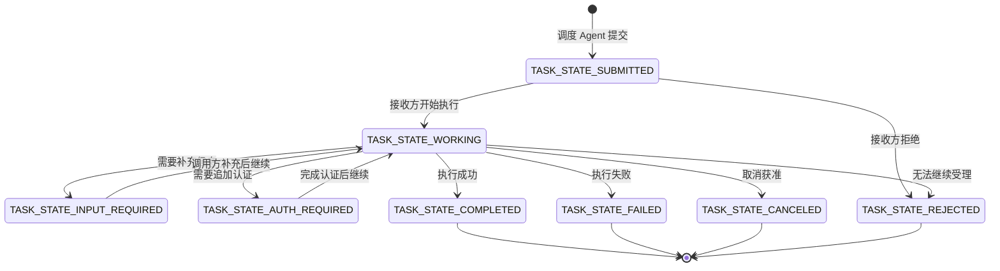
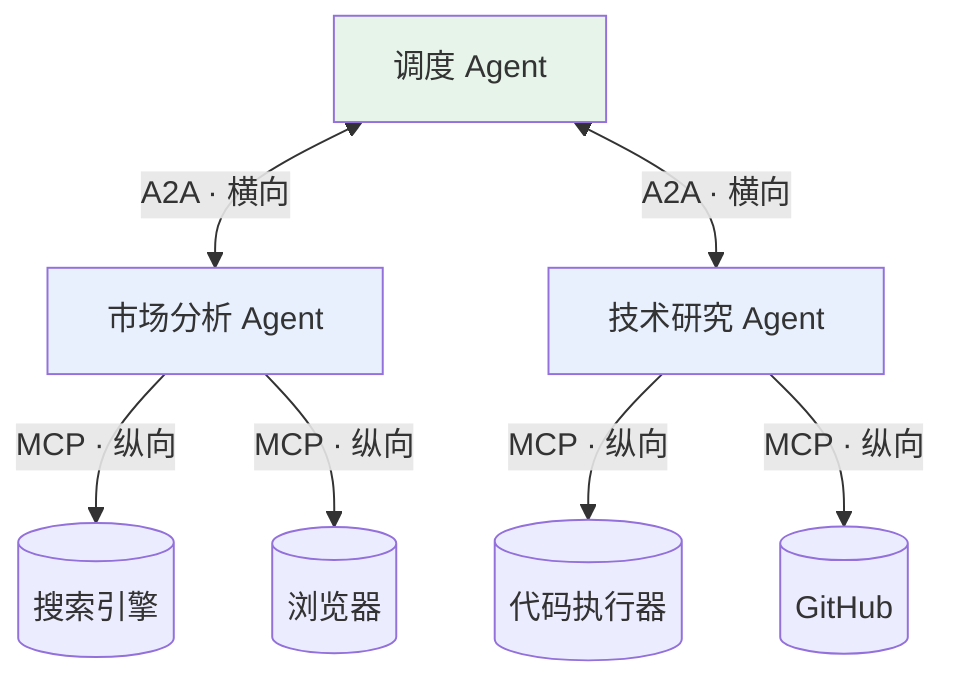

# 第十一章：A2A 协议

本章固定采用 **A2A v1.0.1 发布规范**；线上 `A2A-Version` 为 `1.0`，不含补丁号。协议规范、SDK 版本、Agent 软件版本三者不同。

## 11.1 单个 Agent 的三个天花板

先看一个由 **单个 LLM、一组工具和一段活动上下文**构成的 Agent。这里是讨论拆分动机的简化实现，不是 Agent 的通用定义。它可能受以下限制：

| 维度 | 上限表现 |
|---|---|
| **工具数量** | 相近工具可能增加选择混淆；全量注入会增加成本，但可检索或延迟加载（见[第三章](../01-function-calling/03-tool-schema-design.zh.md)） |
| **上下文窗口** | 复杂任务的中间产物（搜索结果、草稿、反思记录）会迅速填满窗口 |
| **专业能力** | 不同任务需要不同知识与工具配置，是否拆分应评测协调成本和最终质量 |

举个具体任务：**「做一份 AI 编程工具的竞品分析报告，要有行业趋势、技术对比、商业模式分析和 SWOT」**。

如果不断把搜索结果与草稿全量追加进上下文，写到 SWOT（优势、劣势、机会、威胁）分析时，早期证据可能已被截断或难以有效利用。可以先做检索、摘要和外部存储；市场与技术任务能够独立推进时，再评估拆成多个 Agent 的收益。

### 11.1.1 多 Agent 在上下文层面的真正收益

有个值得追问的问题：**拆成多个 Agent，上下文压力就真的变小了吗？**

关键在于**中间过程被隔离了**：



市场 Agent 自己去搜几十个网页、写草稿、反复迭代，这些**中间过程全在它自己的上下文里**。任务完成后只把一份几百字的结论回传。

调度 Agent 的上下文里只多了一份摘要，而不是几十个网页原文。**这就是多 Agent 协作在上下文层面的核心收益：把调研过程的上下文压力隔离在专业 Agent 内部。**

这是多 Agent 架构可能带来的收益，不是 A2A 协议保证。总 token 可能增加，摘要也可能丢失证据；应回传来源、假设和可取回的原始制品，而不只是一句结论。

## 11.2 基础问题：Agent 之间怎么互相认识

Agent A 要把任务委托给 Agent B，前提是它得知道 B 能做什么。

最直接但也最难维护的方案，是把配置写死：A 的代码里硬编码「B 可以做竞品分析」。B 的能力一变，A 的代码就得改。

**A2A 的方案**是让 B 主动「发名片」——**Agent Card**。

### 11.2.1 Agent Card

Agent Card 是 JSON 能力声明。部署可通过配置、目录或 `/.well-known/agent-card.json` 等发现约定取得它；调用方应使用已知或可信的 Card URL，而非把任意网络位置自动视为可信。

```json
{
  "name": "Market Research Agent",
  "description": "面向科技行业的市场趋势与竞品调研",
  "supportedInterfaces": [
    {
      "url": "https://agents.example.com/market",
      "protocolBinding": "JSONRPC",
      "protocolVersion": "1.0"
    }
  ],
  "version": "1.2.0",
  "defaultInputModes": ["text/plain"],
  "defaultOutputModes": ["text/plain"],
  "capabilities": {
    "streaming": true,
    "pushNotifications": true
  },
  "skills": [
    {
      "id": "competitor-analysis",
      "name": "竞品分析",
      "description": "针对指定产品品类，输出竞品清单、定位对比与差异化分析",
      "tags": ["market", "research"],
      "examples": ["分析国内 AI 编程助手的竞争格局"]
    },
    {
      "id": "trend-analysis",
      "name": "行业趋势分析",
      "description": "基于公开资料整理行业趋势，并标注来源、时间与不确定性",
      "tags": ["trends"]
    }
  ]
}
```

名片里最关键的是 **skills 列表**。调度 Agent 靠这些描述做路由决策——「这个任务和哪个 Agent 的哪个 skill 最匹配」。

示例是公开能力卡，未配置受保护操作。`version: "1.2.0"` 是这个 Agent 软件的示例版本，不是 A2A 版本；1.0 用 `supportedInterfaces` 声明接口，而不是旧版顶层 `url`。生产卡还应按需声明 `securitySchemes`、`securityRequirements`，并确认所需流式/推送能力确实启用。

描述可辅助路由，但还要结合输入输出模式、认证要求、可信来源和任务约束。Card 内容不是授权证明，也不是能力正确性的测评报告。

> 注意这里的 `skills` 和 [第八章](../03-skills/08-what-is-skill.zh.md) 讲的 Agent Skill **不是一回事**。A2A 的 skill 是「对外声明的能力条目」，Agent Skill 是「Agent 内部的流程知识模块」。名字撞车，层次完全不同。

### 11.2.2 可插拔是这套机制的价值

新加一个 Agent 后，支持相同发现机制的调用方可以读取其 Agent Card 并考虑调用它；是否自动接纳仍应经过信任、认证和策略检查。

这与 MCP 从已知 Server 调用 `tools/list` 的思路相近：通过元数据减少能力清单的硬编码。发现只是互操作的一部分，不能替代共同的数据模型、版本处理和认证。

## 11.3 Task 是 A2A 的一等公民

A2A 的 **Task** 是有状态的工作单元。Client 发 Message 后，Server 可以直接返回 Message，也可以创建并返回 Task；不是每条消息都创建任务。任务产出用 **Artifact**，消息用于交互、澄清和状态沟通。

`taskId` 由 Server 创建，`contextId` 关联同一会话中的多个任务与消息，`messageId` 标识消息；它们不是用户身份，也不会自动提供业务幂等性。`Part` 可携带文本、原始/引用文件或结构化数据。



这是典型路径，不要求每个任务走过全部状态。1.0 的 ProtoJSON 使用图中的 `TASK_STATE_*` 枚举名；旧文章中的小写或连字符值不能直接用于 1.0 报文。`TASK_STATE_UNSPECIFIED` 不应作为正常业务状态；完成、失败、取消、拒绝是终态，补充输入和追加认证是中断态。

### 11.3.1 为什么需要这么完整的状态机

因为 **A2A 需要支持跨多轮交互、可能长时间运行的任务**，同时也允许简单请求直接返回 Message。

竞品分析可能跨多个工具或人工环节。`SendMessage` 的 `configuration.returnImmediately` 默认为 `false`：返回 Task 时，等待到终态或需要输入、认证的中断态；设为 `true` 才在创建任务后立即返回，由调用方继续跟踪。这个选项不改变直接返回 Message 的交互，也不控制流式操作。

调用方可通过三种机制跟踪任务：

| 方式 | 说明 | 适用 |
|---|---|---|
| **轮询** | 定期查 Task 状态 | 实现简单，任务不多时够用 |
| **Push Notification** | 接收方在任务更新时回调注册端点，不仅限于完成 | 需能力支持、可达 webhook 和认证 |
| **流式** | HTTP/JSON-RPC binding 通常用 SSE，gRPC binding 用 server streaming | 需要给用户展示进度 |

### 11.3.2 黑盒是解耦的意义

调度 Agent 的视角非常干净：**提交 Task → 查状态 → 取 artifacts**。

它完全不需要知道接收方内部用了什么工具、调了几次 LLM、是不是又委托给了别的 Agent。每个专业 Agent 的实现对外不可见——这正是解耦的价值。

连接中断不等于任务取消。重连可 `GetTask` 或 `SubscribeToTask` 获取状态；后者首条事件为当前 Task，但不保证补齐全部历史增量。`CancelTask` 是取消请求，可能因已完成或不可取消而失败；已发邮件、已付款等副作用更不会自动回滚。处理 Artifact 增量要依据 `artifactId`、`append`、`lastChunk`，不能把每个流事件都当独立完整文件。

## 11.4 架构本质：Agent 的微服务化

有后端经验的话，可以用微服务架构理解 A2A 的独立部署和黑盒契约。但 **A2A 是互操作协议，不等于完整的微服务架构**；注册、持久化、调度和容灾仍需系统实现：

| 微服务 | A2A |
|---|---|
| 独立部署的服务（HTTP、gRPC 等） | 独立部署的 Agent |
| API 文档 / OpenAPI | Agent Card |
| 能力元数据入口 | `/.well-known/agent-card.json`，不是全局注册中心 |
| 异步工作抽象 | Task 与更新机制；不提供消息队列的持久化交付保证 |
| 服务间多种 RPC/HTTP 调用 | Agent 间 A2A 调用 |

一个 A2A Agent 可通过 JSON-RPC、HTTP/REST、gRPC 或协商的 custom binding 暴露服务。兼容调用方可在完成发现、认证和策略检查后提交任务并接收结果；A2A 不绑定特定 AI 框架或编程语言。

这个理念和 MCP 一脉相承：**MCP 让工具成为独立标准化服务，A2A 让 Agent 成为独立标准化服务。**

A2A 由 Google 在 2025 年 4 月提出，同年 6 月捐给 Linux 基金会独立治理——这一步和 MCP 走的路径也很像：先由一家推出，再交给中立组织维护，以争取生态采纳。

## 11.5 A2A 的多种 protocol binding

A2A 1.0 把**数据模型与操作**和网络 binding 分开，定义 JSON-RPC、gRPC、HTTP/REST binding，并允许自定义 binding。v1.0.1 为补丁发布，修正文档和 HTTP 媒体类型等，不改变 `Major.Minor` 协商标识。

| binding | 常见用途 | 流式更新 |
|---|---|---|
| **JSON-RPC** | 复用 RPC 方法与错误模型 | `SendStreamingMessage` 使用 SSE |
| **HTTP/REST** | Web 网关与资源式 HTTP 集成 | SSE 传递 Task/Artifact 更新 |
| **gRPC** | 强类型服务间调用 | server streaming RPC |
| **Custom binding** | 双方已协商的特定环境 | 由扩展定义 |

WebSocket **不是 A2A 核心 binding**；需要它的双方可定义 custom binding 或用它承载自己的会话层，但不能据此宣称通用 A2A 互操作。WebRTC 同样不是 A2A binding：A2A 可通过 file URI 或文件 Part 交换音频/视频等内容，实时媒体协商与传输需由应用另行设计。

1.0 JSON-RPC 方法是 `SendMessage`、`GetTask`、`CancelTask`、`SubscribeToTask` 等；HTTP 路径对应 `POST /message:send`、`GET /tasks/{id}`、`POST /tasks/{id}:cancel`。不要把旧版 `message/send`、`tasks/get` 混进新协议。HTTP 客户端显式发送 `A2A-Version: 1.0`；省略版本按兼容规则解释为 `0.3`，不是自动使用最新。v1.0.1 HTTP 绑定优先使用 `application/a2a+json`，SSE 响应仍是 `text/event-stream`。

## 11.6 A2A 与 MCP：一纵一横

理清两者关系最简单的方式是**看方向**：



| | 连接方向 | 对端是谁 | 解决什么 |
|---|---|---|---|
| **MCP** | 向下（纵向） | 工具、数据源 | Agent 怎么获得外部能力 |
| **A2A** | 向外（横向） | 其他 Agent | Agent 之间怎么分工协作 |

“纵向/横向”是常见用法的示意，不是强制拓扑。MCP 可以暴露 Agent 能力，A2A 后端也可以是确定性程序；核心区别是对外契约，而非对端是否真的使用模型。

复杂系统里两者同时在用：MCP 管纵向连接，A2A 管横向协作。

### 11.6.1 一个自然的推论

既然一个 Agent 对外是 A2A 服务、对下用 MCP 连工具，那么**能不能把一个 Agent 直接包装成 MCP Server 给别的 Agent 用**？

技术上可以，而且社区里确实有这种做法。但两者的语义不同：

- **包成 MCP 工具**：对外提供工具契约，也可通过 MRTR、显式 handle 或可选 Tasks 扩展处理长任务，不能说 MCP 只能同步；
- **走 A2A**：有完整的任务生命周期、异步、可取消、可补充输入、可流式。适合长时间、多轮、需要澄清的复杂委托。

判断依据是：**这个委托更像「调一次接口」还是「派一个活」**。

## 11.7 常见错误

### 11.7.1 把 A2A 当成 MCP 的竞品

两者常分别用于能力接入和跨系统委托，但不是按“对端有没有模型”硬分。Agent 可包装成 MCP 工具，A2A 后端也可执行确定性流程；应比较工具契约与任务生命周期是否符合需求。

### 11.7.2 只把 A2A 当成一种 HTTP API

A2A 定义的是跨实现共享的数据模型、任务生命周期、发现和安全语义，不只是一组 HTTP endpoint。v1.0 提供 JSON-RPC、HTTP/REST、gRPC 和 custom binding；SSE 是相应 binding 的流式承载方式，WebSocket/WebRTC 不属于核心 binding。

### 11.7.3 忽略 Task 状态机的设计动机

状态机用来表达处理中、需要输入、需要认证及各类终态。同步等待不等于不需要状态管理：等待期间仍可能要求澄清或取消；只有无需任务跟踪的简单交互，才可直接返回 Message。

### 11.7.4 把 A2A 的 skill 和 Agent Skill 混为一谈

名字撞车但层次不同：A2A 的 skill 是对外的能力声明条目，Agent Skill 是 Agent 内部的流程知识模块。

### 11.7.5 认为有了 A2A 就必须用 A2A

同进程多节点可直接调用函数或传状态，未必需要跨系统协议。A2A 更适合不同实现、独立部署或跨组织协作；也应评估已有内部 RPC 是否已经满足需求，不根据“多 Agent”这个名称自动引入协议。

### 11.7.6 忽略 Agent Card 的描述质量

和工具 description 一样，写得含糊的 Agent Card 会导致这个 Agent 要么永远派不到活，要么被派到不该做的活。

## 11.8 本章总结

1. **A2A 解决跨实现协作接口**，不自动提升专业能力或降低总上下文成本；
2. **多 Agent 可隔离中间过程**，但摘要会丢信息；调度者仍应能追溯证据，而非只能接收结论；
3. **Agent Card 实现能力声明与发现**；可通过已知 URL、配置或 well-known 约定取得，skills 描述可辅助路由；
4. **Task 是一等公民**，完整状态机是为异步长任务设计的，支持轮询、回调、流式三种感知方式；
5. **黑盒委托利于解耦**，但 Task 状态机不等于持久化消息队列或 exactly-once 执行；
6. **多 binding 保持同一语义**：JSON-RPC、HTTP/REST、gRPC 是核心 binding；SSE 用于相应 binding 的流式更新，WebSocket/WebRTC 不属于核心 binding；
7. **与 MCP 是一纵一横**：MCP 向下连工具，A2A 向外连 Agent，互补不竞争；
8. **不是所有多 Agent 系统都需要 A2A**，单进程内协作用共享状态更简单，A2A 面向跨团队跨部署的场景。

## 参考资料

- 来源核对：2026-09-15 读取 v1.0.1 发布记录、规范和 Proto 定义。该标签内规范页仍有“Latest Released Version 1.0.0”的旧提示；Send Message 概述中的立即返回措辞，也与执行模式小节和 Proto 的默认阻塞定义不一致。本章按后两处明确的 `return_immediately` 字段定义说明，线上 JSON 使用 `returnImmediately`。
- [A2A v1.0.1 发布记录](https://github.com/a2aproject/A2A/releases/tag/v1.0.1)
- [A2A 协议官网](https://a2a-protocol.org/)
- [A2A v1.0.1 发布规范](https://github.com/a2aproject/A2A/blob/v1.0.1/docs/specification.md)
- [A2A v1.0.1 规范数据定义](https://github.com/a2aproject/A2A/blob/v1.0.1/specification/a2a.proto)
- [Google: Announcing the Agent2Agent Protocol](https://developers.googleblog.com/en/a2a-a-new-era-of-agent-interoperability/)
- [Linux Foundation: A2A Project](https://www.linuxfoundation.org/press/linux-foundation-launches-the-agent2agent-protocol-project-to-enable-secure-intelligent-communication-between-ai-agents)
- [Model Context Protocol 官方文档](https://modelcontextprotocol.io/docs/getting-started/intro)
- [Anthropic: Building Effective Agents](https://www.anthropic.com/engineering/building-effective-agents)
