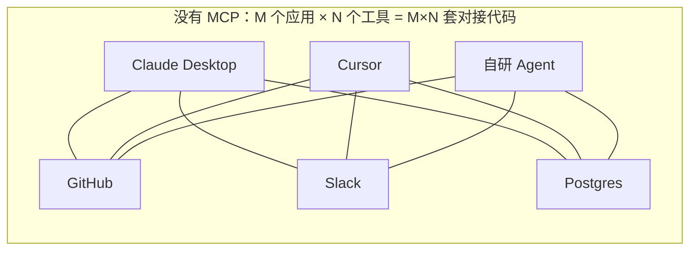
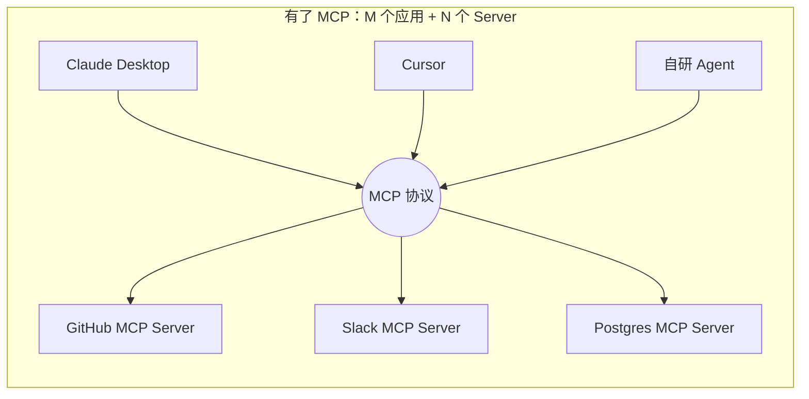
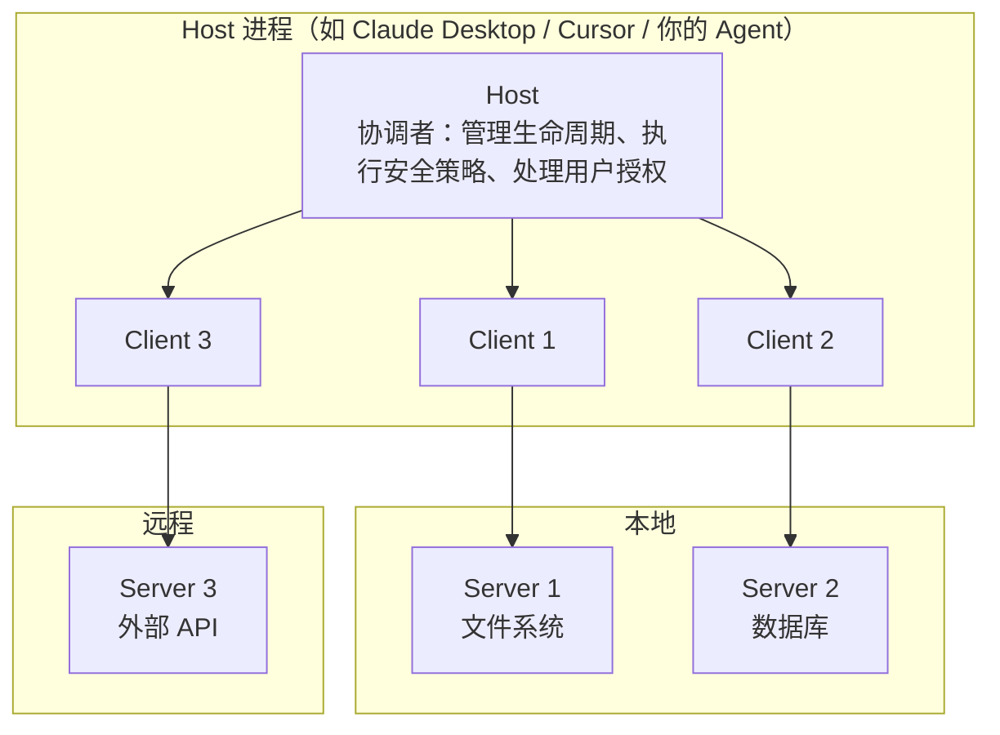

# 第四章：MCP 模型上下文协议的核心内容

## 4.1 MCP 解决的不是 Function Calling 解决的问题

先把边界划清楚，这是理解 MCP 的前提。

[Function Calling](01-function-calling.md) 解决的是「**模型怎么表达调用意图**」——一个模型层的输出格式约定。

MCP 解决的是完全不同的一组问题：

- 工具**在哪里**？怎么被发现，而不是硬编码在应用代码里；
- 工具**怎么跨进程提供**？能不能装在另一台机器上；
- 同一个工具，**能不能被不同的 AI 应用复用**？
- 工具变更了，**接入方要不要改代码**？

一句话：

> **Function Calling 是一种常见的模型—应用接口；MCP 是 Host/Client—Server 的开放协议。二者可在同一应用中配合，但 MCP 本身不规定、更不必然依赖某家模型的 Function Calling。**

## 4.2 没有 MCP 之前：M×N 的对接地狱

假设你要把 GitHub 接进一个 AI 应用。你得自己写 GitHub API 的调用代码、处理 OAuth 认证、把各种返回格式转成模型能理解的 Schema、写错误处理。好不容易接完了，接下来会发生三件事：

1. **同一个应用接第二个工具**：Slack 的认证方式、返回格式、错误码跟 GitHub 完全不同，整套逻辑重写一遍；
2. **同一个工具给第二个应用用**：Cursor 的接入方式和你原来那个应用完全不同，再重写一遍；
3. **工具方升级 API**：所有接入方各自改代码。



M 个应用、N 个工具，需要 M×N 套对接代码。这就是 2024 年之前 AI 工具生态的真实状态：碎片化、难复用、强绑定。

## 4.3 MCP 的核心思路：把 M×N 变成 M+N

MCP 的类比是 **USB**。USB 出现之前，鼠标一个接口、键盘一个接口、打印机又是另一个。USB 之后，设备厂商只需要做一次适配，就能插进全世界所有电脑。

MCP 为「AI 接工具」定了同一种标准：



工具提供方按规范实现一次 Server，任何支持 MCP 的应用都能连上、**自动发现**里面的工具并使用，接入方零对接代码。

「自动发现」这四个字是关键。传统方式下，应用必须在代码里硬编码工具的 Schema；MCP 下，应用连上 Server 后调一次 `tools/list` 就拿到了完整的工具清单。**工具方新增一个工具，接入方什么都不用改**。

## 4.4 Host、Client、Server 三个角色

MCP 采用 client-host-server 架构，注意是三个角色而不是两个——这里最容易被讲错。



| 角色 | 职责 | 数量关系 |
|---|---|---|
| **Host** | AI 应用本身。管理 Client 生命周期、执行安全策略、处理用户授权、协调 LLM 调用、聚合多个 Server 的上下文 | 1 |
| **Client** | Host 内的协议连接器，通常对应一个 Server 连接 | N |
| **Server** | 工具实现方。独立运行，职责聚焦，暴露 Tools / Resources / Prompts | N |

Host 通常为每个 Server 维护独立 Client/连接，便于生命周期和错误隔离；但这不是协议自动提供的安全沙箱。Server 能看到什么仍取决于 Host 传入的参数、进程与网络权限，隔离必须由 Host、操作系统和网络策略共同实现。

**Host 才是权限的把关者**。用户授权、敏感操作确认、把哪些工具暴露给模型，这些决策都在 Host 层做，Server 无权决定。

## 4.5 三类核心能力：Tools、Resources、Prompts

MCP Server 可以暴露三类能力。规范强调的是**默认发起方/控制路径**，而不是以副作用给能力定性；实际调用始终由 Host 许可、执行与审计。

| 能力 | 有副作用吗 | 谁来触发 | 类比 |
|---|---|---|---|
| **Tools** | 可读、可写或有外部副作用，取决于实现 | 模型或 Host 工作流可建议调用，Host 最终决定 | 手 |
| **Resources** | 面向应用提供可读取的上下文；通常应设计为安全读取 | Host/Client 决定何时列出、读取或注入 | 资料室 |
| **Prompts** | 返回提示模板或消息 | 用户或 Host 选择并取得 | 模板库 |

### 4.5.1 Tools：模型控制

Tools 是可由模型或工作流选择的可执行能力：可以是只读搜索，也可以是创建文件、提交代码、发消息等写操作。是否有副作用**不能**从 `tools/call` 这一类型本身推断。

对转账、删除、发布等高风险 Tool，Host 应在执行前按策略要求确认、授权或审批；低风险只读 Tool 也应遵循最小权限。这是 Host 的职责，不能交给模型或 Server 自行判断。

### 4.5.2 Resources：应用控制

Resources 是 Server 暴露给 Client 的、由 URI 标识的上下文数据。它们通常用于读取文档、日志或记录；“Resource”不是对底层实现绝无副作用的安全保证，Host 不应仅凭类别跳过信任与访问控制。

一个常被搞混的点：**Resources 不是模型自己去读的**。是宿主应用决定把哪些资源加载进上下文——比如用户在 IDE 里打开了某个文件，应用把它作为 Resource 提供给模型。这个控制权的差异，是 Tools 和 Resources 的分界线，而不只是「读」和「写」。

### 4.5.3 Prompts：用户控制

带参数占位符的预定义提示词模板。团队有一套固定的代码审查标准 Prompt，接受「编程语言」和「代码内容」两个参数，调用时传参就能展开成完整提示词。

Prompts 通常以「斜杠命令」或菜单项的形式暴露给用户，由**用户**主动选择触发，而不是模型自己决定用哪个。把公司积累的优质 Prompt 封装成 MCP Prompts，全团队复用同一套标准，这在实际工程里比想象中有用。

## 4.6 底层通信：JSON-RPC 2.0

MCP 的消息格式是 JSON-RPC 2.0——一种用 JSON 表达「远程函数调用」的轻量协议。

```json
// 请求：客户端列出所有工具
{"jsonrpc": "2.0", "id": 1, "method": "tools/list"}

// 响应
{"jsonrpc": "2.0", "id": 1, "result": {"tools": [{"name": "create_issue", ...}]}}

// 请求：调用某个工具
{"jsonrpc": "2.0", "id": 2, "method": "tools/call",
 "params": {"name": "create_issue", "arguments": {"title": "Bug", "body": "..."}}}
```

选 JSON-RPC 而不是二进制协议或 REST，理由很实际：易读易调试、语言无关、任何语言都能十几行代码实现一个最小客户端。这直接降低了生态的实现门槛。

传输方式（stdio / Streamable HTTP）的细节见 [第十二章](12-mcp-transport.md)。

## 4.7 生命周期与版本兼容

不要把某个 SDK 的实现策略当成 MCP 的强制语义。**截至 2026-07-28 规范，MCP 已改为无状态、请求自包含的模型**：每个请求都携带协议版本与 Client capabilities；Server 可通过 `server/discover` 提前声明版本和能力。旧版基于 `initialize` 的连接级会话仍有兼容路径，但不再是当前核心语义。

### 4.7.1 版本时间线

| 版本 | 关键变化 |
|---|---|
| 2024-11-05 | 初版。HTTP + SSE 双端点传输 |
| 2025-03-26 | Streamable HTTP 取代 HTTP+SSE 双端点 |
| 2025-06-18 | 授权规范完善，结构化工具输出 |
| 2025-11-25 | 授权、任务与元数据等能力持续演进；以发布规范及 changelog 为准 |
| 2026-07-28 | 改为无状态、每请求携带版本与能力；引入 `server/discover` 和订阅流，旧初始化模型进入兼容路径 |

### 4.7.2 每请求协商与旧版兼容

新规范中，请求通过 `_meta.io.modelcontextprotocol/*` 携带协议版本和 Client capabilities。Client 可先调用 `server/discover` 获取 Server 支持的版本与能力，也可直接发起带元数据的业务请求。需要持续通知时，Client 显式建立 subscription；需要模型或用户补充输入时，Server 在响应中返回 `InputRequiredResult`，Client 补齐输入后重发原请求。

与旧版 Server 互操作时，SDK 可按兼容矩阵回退到 `initialize`、`notifications/initialized` 和连接级 session。应用必须区分“当前协议语义”和“兼容旧端点”，不能把旧握手继续写成所有 MCP 调用的必经步骤。

### 4.7.3 工程上要注意什么

**多版本共存是常态**。涉及 transports、authorization、sampling 或任务等特性时，应核对 Client、Server 与目标发布版本的兼容性，不能凭教程假定其存在或不存在。

## 4.8 MCP 生态为什么起得这么快

MCP 是 Anthropic 在 2024 年 11 月开源的，两年内成为事实标准。两个原因：

**第一，实现门槛极低**。官方开源了规范和多语言 SDK，写一个最小可用的 MCP Server 不到 30 行：

```python
from mcp.server.fastmcp import FastMCP

mcp = FastMCP("demo")

@mcp.tool()
def add(a: int, b: int) -> int:
    """将两个整数相加"""
    return a + b

if __name__ == "__main__":
    mcp.run()
```

函数签名和 docstring 会被自动转成 JSON Schema。一个新技术如果上手成本高，设计再好也推不开。

**第二，头部工具第一时间跟进**。GitHub、Slack、PostgreSQL、Puppeteer、Google Maps 等高频工具很快有了官方或社区 Server。对使用者来说，接一个新工具从「写一堆对接代码」降到了「改几行配置」：

```json
{
  "mcpServers": {
    "github": {
      "command": "npx",
      "args": ["-y", "@modelcontextprotocol/server-github"],
      "env": {"GITHUB_TOKEN": "..."}
    }
  }
}
```

可用工具足够多 → 更多应用支持 MCP → 更多工具方愿意实现 Server，正向循环就转起来了。2025 年之后 OpenAI、Google 等也相继宣布支持，MCP 从「Anthropic 的协议」变成了行业标准。

## 4.9 常见错误

### 4.9.1 认为 MCP 取代了 Function Calling

许多 LLM Host 会把 MCP Tool 转为该模型的 Function Calling schema，再将模型输出路由为 `tools/call`。但这只是常见适配方式：Host 也可用结构化输出、规则工作流或人工选择调用 MCP。**MCP 不把 Function Calling 作为协议前提。**

### 4.9.2 把 Host 和 Client 混为一谈

Client 是 Host 内的协议连接器，通常对应一个 Server。这个映射便于管理，但不是安全沙箱；Host 才是管权限、生命周期和策略的角色。这个区分在讨论 MCP 安全模型时至关重要——**授权决策必须在 Host**。

### 4.9.3 用 Tools 实现只读查询

只读数据常适合用 Resources 提供，而需要模型选择并执行的查询也可以是 Tool。不要从类别推导「无副作用」或「无需授权」：按数据敏感度、调用者身份与实际动作做最小授权和审批。

### 4.9.4 以为 Resources 是模型主动读的

协议调用由 Client 发起；Host 可以让用户、固定工作流或模型决策触发 `resources/read`，再决定哪些内容进入上下文。MCP 不规定某种 UI，也不能据此假定 Resource 天然可信或无需授权。

### 4.9.5 按旧规范理解 MCP 的状态模型

2026-07-28 规范是每请求自包含的无状态模型；`initialize` 和连接级 session 属于旧版兼容语义。应固定目标协议版本并按官方兼容矩阵实现，不能混用不同年代的消息流。

### 4.9.6 忽视 MCP Server 的信任边界

装一个第三方 MCP Server 等于在你的 AI 应用里运行第三方代码，而且它能看到传给它的所有参数。工具描述本身也可能是恶意的（工具投毒）。这部分风险见 [Agent 安全章节](../agent/15-agent-security.md)。

## 4.10 本章总结

1. **MCP 与 Function Calling 可以配合但并非依赖关系**：前者定义 Host/Client 与 Server 的互操作，后者是常见的模型调用接口；
2. **核心价值是把 M×N 变成 M+N**，工具实现一次，所有支持 MCP 的应用都能用；
3. **「自动发现」是关键能力**，工具方新增工具，接入方零改动；
4. **三个角色**：Host 管权限与生命周期，Client 连接 Server，Server 提供能力；安全隔离要由 Host 与运行环境落实；
5. **三类能力按默认控制路径区分**：Tools 可由模型/工作流选择，Resources 由 Client 加载，Prompts 由用户/Host 取得；副作用须逐项声明和治理；
6. **底层是 JSON-RPC 2.0**，选它是为了降低生态实现门槛；
7. **版本语义发生过结构性变化**：当前版本按请求携带版本与能力，旧初始化/会话模型只在兼容路径出现；
8. **生态起飞靠两点**：SDK 让实现成本降到 30 行，头部工具第一时间提供官方 Server。

> **一句话概括：MCP 是 AI 工具生态的 USB 标准，它不改变模型怎么调工具，改变的是工具怎么被接进来。**

## 参考资料

- [Model Context Protocol 官方文档](https://modelcontextprotocol.io/docs/getting-started/intro)
- [MCP 规范 2026-07-28](https://modelcontextprotocol.io/specification/2026-07-28)
- [MCP 版本兼容说明](https://modelcontextprotocol.io/specification/2026-07-28/basic/versioning)
- [MCP 架构说明](https://modelcontextprotocol.io/specification/2026-07-28/architecture)
- [Anthropic: Introducing the Model Context Protocol](https://www.anthropic.com/news/model-context-protocol)
- [JSON-RPC 2.0 规范](https://www.jsonrpc.org/specification)
