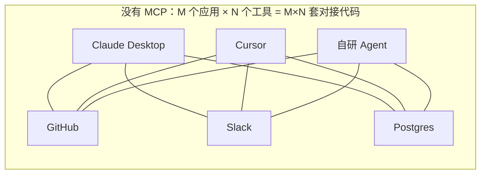
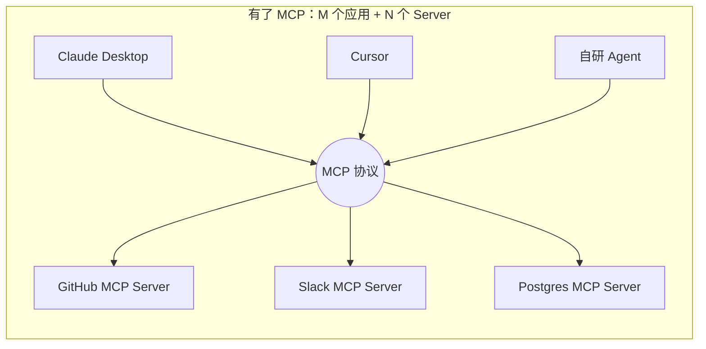
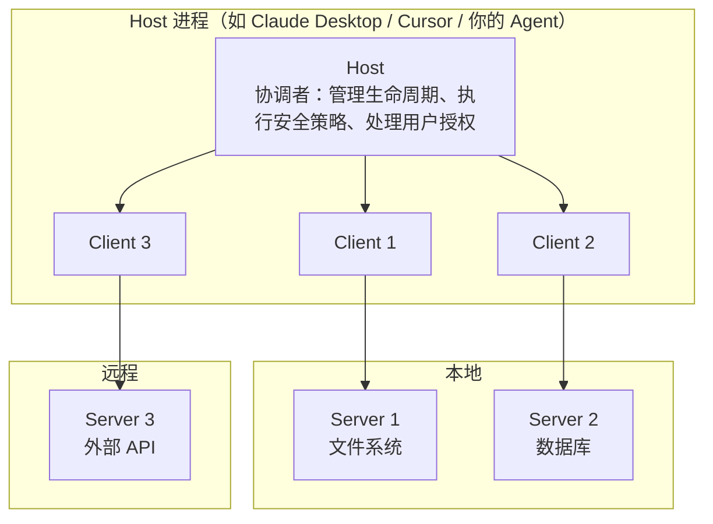
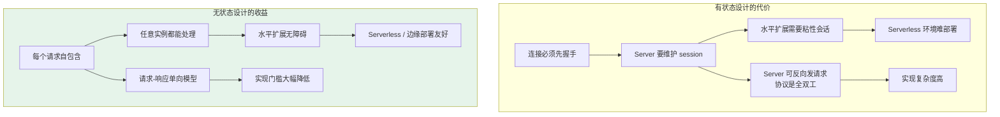

# 第四章：MCP 模型上下文协议的核心内容

## 4.1 MCP 解决的不是 Function Calling 解决的问题

先把边界划清楚，这是理解 MCP 的前提。

[Function Calling](01-function-calling.md) 解决的是「**模型怎么表达调用意图**」——一个模型层的输出格式约定。

MCP 解决的是完全不同的一组问题：

- 工具**在哪里**？怎么被发现，而不是硬编码在应用代码里；
- 工具**怎么跨进程提供**？能不能装在另一台机器上；
- 同一个工具，**能不能被不同的 AI 应用复用**？
- 工具变更了，**接入方要不要改代码**？

一句话：

> **Function Calling 是模型和应用之间的约定，MCP 是应用和工具提供方之间的约定。两者是上下游关系，不是替代关系。**

## 4.2 没有 MCP 之前：M×N 的对接地狱

假设你要把 GitHub 接进一个 AI 应用。你得自己写 GitHub API 的调用代码、处理 OAuth 认证、把各种返回格式转成模型能理解的 Schema、写错误处理。好不容易接完了，接下来会发生三件事：

1. **同一个应用接第二个工具**：Slack 的认证方式、返回格式、错误码跟 GitHub 完全不同，整套逻辑重写一遍；
2. **同一个工具给第二个应用用**：Cursor 的接入方式和你原来那个应用完全不同，再重写一遍；
3. **工具方升级 API**：所有接入方各自改代码。



M 个应用、N 个工具，需要 M×N 套对接代码。这就是 2024 年之前 AI 工具生态的真实状态：碎片化、难复用、强绑定。

## 4.3 MCP 的核心思路：把 M×N 变成 M+N

MCP 的类比是 **USB**。USB 出现之前，鼠标一个接口、键盘一个接口、打印机又是另一个。USB 之后，设备厂商只需要做一次适配，就能插进全世界所有电脑。

MCP 为「AI 接工具」定了同一种标准：



工具提供方按规范实现一次 Server，任何支持 MCP 的应用都能连上、**自动发现**里面的工具并使用，接入方零对接代码。

「自动发现」这四个字是关键。传统方式下，应用必须在代码里硬编码工具的 Schema；MCP 下，应用连上 Server 后调一次 `tools/list` 就拿到了完整的工具清单。**工具方新增一个工具，接入方什么都不用改**。

## 4.4 Host、Client、Server 三个角色

MCP 采用 client-host-server 架构，注意是三个角色而不是两个——这里最容易被讲错。



| 角色 | 职责 | 数量关系 |
|---|---|---|
| **Host** | AI 应用本身。管理 Client 生命周期、执行安全策略、处理用户授权、协调 LLM 调用、聚合多个 Server 的上下文 | 1 |
| **Client** | 协议连接器。每个 Client 只连**一个** Server，维护 Server 之间的安全边界 | N |
| **Server** | 工具实现方。独立运行，职责聚焦，暴露 Tools / Resources / Prompts | N |

**为什么 Client 和 Server 必须是 1:1**？这是安全设计。每个 Server 被隔离在自己的 Client 里，一个 Server 拿不到另一个 Server 的数据。如果让一个 Client 同时连多个 Server，Server 之间的隔离边界就没了——恶意的 Server 可以窥探其他 Server 的调用内容。

**Host 才是权限的把关者**。用户授权、敏感操作确认、把哪些工具暴露给模型，这些决策都在 Host 层做，Server 无权决定。

## 4.5 三类核心能力：Tools、Resources、Prompts

MCP Server 可以暴露三类能力，区分它们的核心维度是**副作用**和**控制权**。

| 能力 | 有副作用吗 | 谁来触发 | 类比 |
|---|---|---|---|
| **Tools** | 是，会改变外部状态 | **模型**决定调用 | 手 |
| **Resources** | 否，只读 | **应用**决定加载 | 资料室 |
| **Prompts** | 否 | **用户**主动选择 | 模板库 |

### 4.5.1 Tools：模型控制

对应 Function Calling 里的函数。本质是**有副作用的操作**：创建文件、提交代码、发 Slack 消息、调第三方 API。执行完之后环境状态变了，而且往往不可逆。

正因为不可逆，Tools 通常需要用户授权确认才能执行。这是 Host 的职责。

### 4.5.2 Resources：应用控制

和 Tools 最本质的区别只有一个字：**只读**。读日志文件、查数据库记录、获取文档内容都属于 Resources。

一个常被搞混的点：**Resources 不是模型自己去读的**。是宿主应用决定把哪些资源加载进上下文——比如用户在 IDE 里打开了某个文件，应用把它作为 Resource 提供给模型。这个控制权的差异，是 Tools 和 Resources 的分界线，而不只是「读」和「写」。

### 4.5.3 Prompts：用户控制

带参数占位符的预定义提示词模板。团队有一套固定的代码审查标准 Prompt，接受「编程语言」和「代码内容」两个参数，调用时传参就能展开成完整提示词。

Prompts 通常以「斜杠命令」或菜单项的形式暴露给用户，由**用户**主动选择触发，而不是模型自己决定用哪个。把公司积累的优质 Prompt 封装成 MCP Prompts，全团队复用同一套标准，这在实际工程里比想象中有用。

## 4.6 底层通信：JSON-RPC 2.0

MCP 的消息格式是 JSON-RPC 2.0——一种用 JSON 表达「远程函数调用」的轻量协议。

```json
// 请求：客户端列出所有工具
{"jsonrpc": "2.0", "id": 1, "method": "tools/list"}

// 响应
{"jsonrpc": "2.0", "id": 1, "result": {"tools": [{"name": "create_issue", ...}]}}

// 请求：调用某个工具
{"jsonrpc": "2.0", "id": 2, "method": "tools/call",
 "params": {"name": "create_issue", "arguments": {"title": "Bug", "body": "..."}}}
```

选 JSON-RPC 而不是二进制协议或 REST，理由很实际：易读易调试、语言无关、任何语言都能十几行代码实现一个最小客户端。这直接降低了生态的实现门槛。

传输方式（stdio / Streamable HTTP）的细节见 [第十二章](12-mcp-transport.md)。

## 4.7 协议的演进：从有状态到无状态

这是 2026 年理解 MCP 最重要的一件事，也是大部分中文资料还没跟上的部分。

### 4.7.1 版本时间线

| 版本 | 关键变化 |
|---|---|
| 2024-11-05 | 初版。HTTP + SSE 双端点传输 |
| 2025-03-26 | Streamable HTTP 取代 HTTP+SSE 双端点 |
| 2025-06-18 | 授权规范完善，结构化工具输出 |
| 2025-11-25 | OAuth 增强、图标元数据、实验性 Tasks |
| **2026-07-28** | **协议无状态化**：移除 session、移除 `initialize` 握手、引入 MRTR |

### 4.7.2 2026-07-28 做了什么

这一版是迄今最大的一次架构调整，核心是**把 MCP 变成无状态协议**：

- **移除协议级 session 与 `Mcp-Session-Id` 头**。需要跨调用状态的 Server，改用显式的、由 Server 生成的 handle，作为普通工具参数传递；
- **移除 `initialize` / `notifications/initialized` 握手**。每个请求自带协议版本和客户端能力（放在 `_meta` 里）；
- **新增 `server/discover`**：Server 必须实现，用于声明支持的协议版本、能力和身份。Client 可以在任何请求之前调用它来做版本协商；
- **引入 MRTR（Multi Round-Trip Requests）**：过去 Server 需要反向请求 Client 时（如 sampling、elicitation、roots），是 Server 主动发起请求。现在改成 Server 返回一个 `resultType: "input_required"` 的结果，Client 补上信息后**重试原请求**；
- **移除 SSE 流的可恢复性**：断流即丢失在途请求，Client 必须用新的 request ID 重发。

### 4.7.3 为什么要这么改



根本动因是**部署形态**。MCP 早期主要面向本地场景（Claude Desktop 起一个本地子进程），有状态没什么问题。但当 MCP Server 开始被大规模部署成远程服务时，session 就成了扩展的枷锁：负载均衡器必须做粘性会话，Serverless 平台的实例随时可能被回收，一次重启就断掉所有连接。

无状态化之后，任意一个实例都能处理任意一个请求，这才让 MCP Server 可以像普通 HTTP 服务一样部署。

### 4.7.4 工程上要注意什么

**多版本共存是常态**。协议改得快，但生态跟进慢。你会长期面对同时存在 2025-03-26、2025-06-18、2026-07-28 版本 Server 的情况。SDK 通常会处理兼容，但涉及新特性时必须检查目标 Server 的版本。

**不要假设 Server 会记得你**。在新规范下，Server 不维护会话状态。任何跨调用的上下文，要么由 Client 保存并在每次请求里带上，要么用 Server 返回的显式 handle。

## 4.8 MCP 生态为什么起得这么快

MCP 是 Anthropic 在 2024 年 11 月开源的，两年内成为事实标准。两个原因：

**第一，实现门槛极低**。官方开源了规范和多语言 SDK，写一个最小可用的 MCP Server 不到 30 行：

```python
from mcp.server.fastmcp import FastMCP

mcp = FastMCP("demo")

@mcp.tool()
def add(a: int, b: int) -> int:
    """将两个整数相加"""
    return a + b

if __name__ == "__main__":
    mcp.run()
```

函数签名和 docstring 会被自动转成 JSON Schema。一个新技术如果上手成本高，设计再好也推不开。

**第二，头部工具第一时间跟进**。GitHub、Slack、PostgreSQL、Puppeteer、Google Maps 等高频工具很快有了官方或社区 Server。对使用者来说，接一个新工具从「写一堆对接代码」降到了「改几行配置」：

```json
{
  "mcpServers": {
    "github": {
      "command": "npx",
      "args": ["-y", "@modelcontextprotocol/server-github"],
      "env": {"GITHUB_TOKEN": "..."}
    }
  }
}
```

可用工具足够多 → 更多应用支持 MCP → 更多工具方愿意实现 Server，正向循环就转起来了。2025 年之后 OpenAI、Google 等也相继宣布支持，MCP 从「Anthropic 的协议」变成了行业标准。

## 4.9 常见错误

### 4.9.1 认为 MCP 取代了 Function Calling

MCP Server 暴露的 Tool，最终依然要被转成模型能理解的 Schema，塞进 `tools` 参数，由模型输出 `tool_calls` 来触发。**MCP 底层依然是 Function Calling 在驱动**，它替换的是「应用怎么获得工具」，不是「模型怎么调工具」。

### 4.9.2 把 Host 和 Client 混为一谈

Client 只是一个协议连接器，一对一连 Server。Host 才是管权限、管生命周期、管安全策略的角色。这个区分在讨论 MCP 安全模型时至关重要——**授权决策必须在 Host**。

### 4.9.3 用 Tools 实现只读查询

只读操作用 Resources 更合适：无副作用、不需要授权确认、可以更宽松地提供。全都做成 Tools 会让授权确认变得频繁而无意义，用户很快就会习惯性点「同意」，安全提示形同虚设。

### 4.9.4 以为 Resources 是模型主动读的

Resources 是**应用**控制的。模型不会自己去 `resources/read`，是宿主应用决定加载什么进上下文。搞错这一点会导致整个交互设计做反。

### 4.9.5 按旧规范理解 MCP 的状态模型

「MCP 连接需要先 initialize 握手」「Server 维护 session」这些说法在 2026-07-28 规范里已经不成立了。协议已经无状态化，这直接影响你的部署架构设计。

### 4.9.6 忽视 MCP Server 的信任边界

装一个第三方 MCP Server 等于在你的 AI 应用里运行第三方代码，而且它能看到传给它的所有参数。工具描述本身也可能是恶意的（工具投毒）。这部分风险见 [Agent 安全章节](../agent/15-agent-security.md)。

## 4.10 本章总结

1. **MCP 与 Function Calling 是上下游关系**：前者管工具怎么被发现和提供，后者管模型怎么表达调用；
2. **核心价值是把 M×N 变成 M+N**，工具实现一次，所有支持 MCP 的应用都能用；
3. **「自动发现」是关键能力**，工具方新增工具，接入方零改动；
4. **三个角色**：Host 管权限与生命周期，Client 一对一连 Server 维持隔离，Server 提供能力；
5. **三类能力按控制权区分**：Tools 模型控制、Resources 应用控制、Prompts 用户控制；
6. **底层是 JSON-RPC 2.0**，选它是为了降低生态实现门槛；
7. **2026-07-28 规范把 MCP 无状态化**，移除 session 和握手，为远程与 Serverless 部署扫清障碍；
8. **生态起飞靠两点**：SDK 让实现成本降到 30 行，头部工具第一时间提供官方 Server。

> **一句话概括：MCP 是 AI 工具生态的 USB 标准，它不改变模型怎么调工具，改变的是工具怎么被接进来。**

## 参考资料

- [Model Context Protocol 官方文档](https://modelcontextprotocol.io/docs/getting-started/intro)
- [MCP 规范 2026-07-28](https://modelcontextprotocol.io/specification/2026-07-28)
- [MCP 规范 2026-07-28 变更说明](https://modelcontextprotocol.io/specification/2026-07-28/changelog)
- [MCP 架构说明](https://modelcontextprotocol.io/specification/2026-07-28/architecture)
- [Anthropic: Introducing the Model Context Protocol](https://www.anthropic.com/news/model-context-protocol)
- [JSON-RPC 2.0 规范](https://www.jsonrpc.org/specification)
