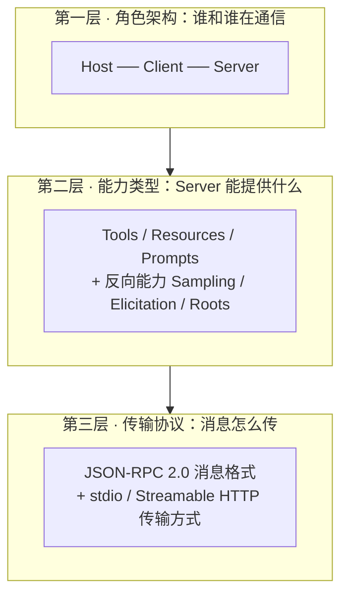
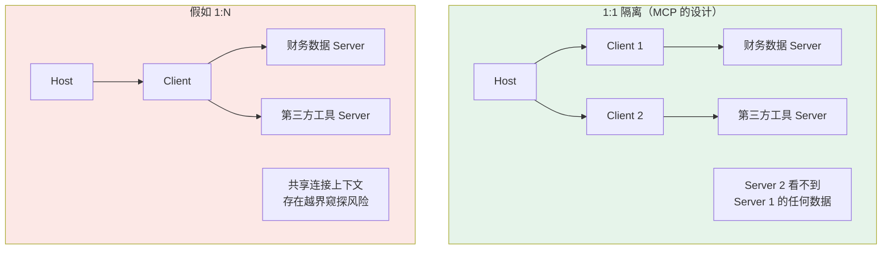
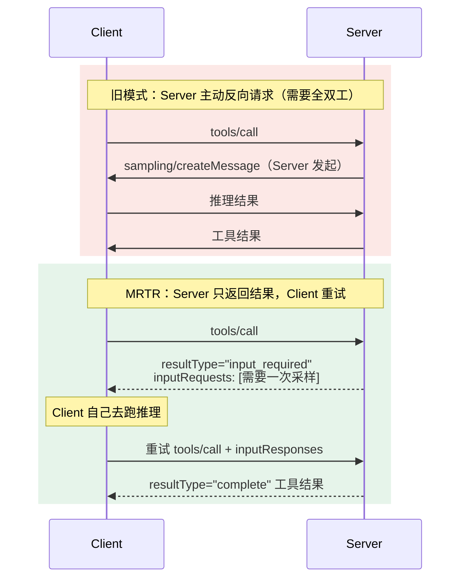
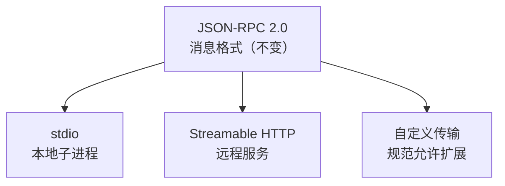
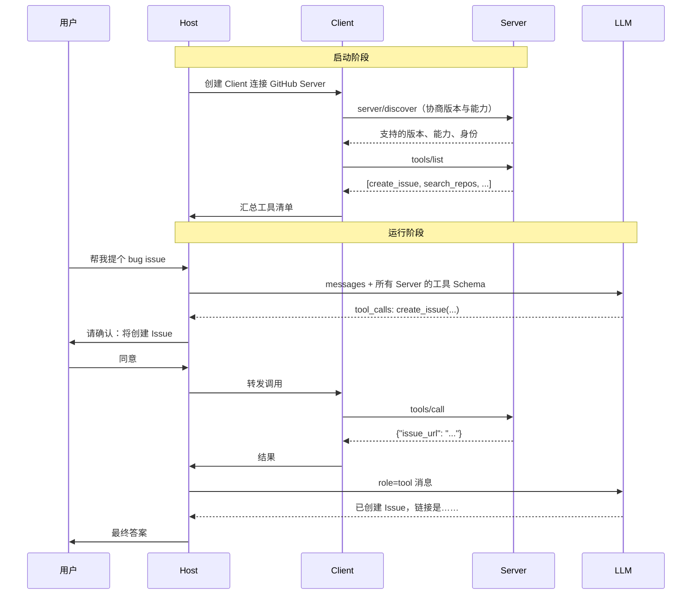

# 第五章：MCP 的三层组成

## 5.1 用三层把概念理清

第一次接触 MCP，最劝退的是名词密度：Host、Client、Server、Tools、Resources、Prompts、JSON-RPC、stdio、Streamable HTTP、sampling、elicitation、roots……

其实把它拆成三层就清楚了，而且**三层之间完全解耦**：



解耦的意思是：换传输方式不影响能力定义，加一类新能力不影响角色架构。这也是为什么 MCP 在 2026 年做了那么大的传输层重构，而工具定义部分几乎没动。

## 5.2 第一层：角色架构

### 5.2.1 三个角色各自做什么

| 角色 | 是什么 | 核心职责 |
|---|---|---|
| **Host** | AI 应用本身（Claude Desktop、Cursor、你的 Agent） | 启动和管理所有 Client、决定连哪些 Server、执行安全策略、处理用户授权、协调 LLM 调用 |
| **Client** | Host 内部的连接模块 | 与**一个** Server 通信、能力发现、转发请求与结果、维持安全边界 |
| **Server** | 工具提供方的独立进程 | 暴露 Tools / Resources / Prompts，不关心上游是谁 |

用一个公司的类比：Host 是公司，决定和哪些供应商合作；Client 是派驻到每个供应商的联络员，一人对接一家；Server 是供应商，只管按标准交付，不关心客户是谁。

### 5.2.2 为什么 Client 与 Server 必须 1:1

这是**安全设计**，不是实现上的偷懒。



每个 Server 被隔离在自己的 Client 里，拿不到其他 Server 的调用内容。考虑到 MCP Server 大量来自第三方，这个隔离是必需的。

### 5.2.3 Host 是唯一的权限把关者

面试里最容易混的是 Host 和 Client。记住一句话：**Client 只是管道，Host 才是决策者**。

具体来说，这些决策全在 Host：

- 用户是否授权某次工具调用；
- 哪些 Server 的工具可以暴露给模型；
- 敏感操作是否需要二次确认；
- 多个 Server 的上下文怎么聚合进 Prompt。

Server 无权决定自己的工具会不会被调用，Client 也无权替用户同意。这条边界在讨论 MCP 安全时是核心。

## 5.3 第二层：能力类型

### 5.3.1 Server 提供的三类能力

区分它们的关键维度是**控制权归谁**，而不只是「读还是写」：

| 能力 | 控制权 | 有副作用 | 典型场景 |
|---|---|---|---|
| **Tools** | 模型 | 是 | 创建 Issue、发消息、写文件、执行 SQL |
| **Resources** | 应用 | 否 | 读日志、读文档、读数据库记录 |
| **Prompts** | 用户 | 否 | 代码审查模板、周报生成模板 |

> **Tools 改变世界，Resources 观察世界，Prompts 结构化表达。**

对应的 JSON-RPC 方法：

```json
{"method": "tools/list"}          // 发现有哪些工具
{"method": "tools/call"}          // 调用某个工具
{"method": "resources/list"}      // 列出可用资源
{"method": "resources/read"}      // 读取某个资源
{"method": "prompts/list"}        // 列出提示模板
{"method": "prompts/get"}         // 展开某个模板
```

`*/list` 这组方法就是「自动发现」的实现。应用不需要硬编码工具清单，连上就问一句。

### 5.3.2 容易被漏掉的第四类：Server 反向要东西

上面三类是 Server **提供**给 Client 的。反过来，Server 有时需要向 Client **索取**东西，这一类经常被忽略但很重要：

| 能力 | Server 想要什么 | 用途 |
|---|---|---|
| **Sampling** | 让 Client 那边的 LLM 跑一次推理 | Server 内部需要模型能力，但自己不持有 API Key |
| **Elicitation** | 向用户提问，索取额外信息 | 参数不全时补充，或请求确认 |
| **Roots** | 询问当前工作目录 / 项目边界 | 文件类 Server 需要知道能操作哪些路径 |

**Sampling 的设计很巧妙**：Server 不需要自己的模型 API Key，也不需要付推理费用，而是借用 Host 侧已有的模型能力。这让 MCP Server 可以保持轻量和无状态。同时 Host 可以审查这些请求，防止 Server 滥用模型资源。

### 5.3.3 这类反向请求在 2026 规范里变了

旧规范里，Server 直接向 Client 发起请求——这意味着协议必须是**全双工**的，传输层要支持双向主动通信。

2026-07-28 规范引入了 **MRTR（Multi Round-Trip Requests）** 来消除这个要求：



好处是协议退化成了纯粹的**请求-响应**模型：Server 永远不主动发起请求，只回复。这样一来，MCP 可以跑在任何普通的 HTTP 基础设施上，不需要长连接和双向通道支持。

这是 2026 规范无状态化改造的一部分——为了让 MCP Server 能像普通 Web 服务一样部署。

## 5.4 第三层：传输协议

### 5.4.1 消息格式与传输方式是解耦的

这是这一层最重要的设计点：



同一套 JSON-RPC 消息可以跑在任意传输层上。**切换传输方式不影响上层的工具调用逻辑**——同一个 Server 实现，改几行配置就能从本地子进程变成远程 HTTP 服务。

### 5.4.2 两种主要传输方式

| | stdio | Streamable HTTP |
|---|---|---|
| Server 形态 | 本地子进程 | 独立 HTTP 服务 |
| 通信通道 | 操作系统管道（stdin/stdout） | HTTP POST |
| 延迟 | 极低 | 有网络开销 |
| 多 Client 共享 | 不支持，每个 Host 起一份 | 支持 |
| 认证 | 靠进程隔离和环境变量 | 需要完整的 OAuth 授权 |
| 典型用途 | 文件系统、本地 Git、本地数据库 | 团队共享服务、SaaS 工具 |

一个实用细节：stdio 模式下 **stdout 只能走协议消息**，任何 `print` 调试输出都会污染消息流导致解析失败。日志必须写 stderr——这是新手写 MCP Server 最常踩的坑。

传输层的完整细节，包括 HTTP+SSE 到 Streamable HTTP 的演进，见 [第十二章](12-mcp-transport.md)。

## 5.5 三层拼起来：一次完整调用



从这张图能看出三个关键事实：

1. **模型看到的仍然是普通的 Function Calling Schema**。MCP 的存在对模型是透明的；
2. **用户授权发生在 Host 层**，在调用真正发出去之前；
3. **能力发现在启动时完成**，运行时不需要重复问。

## 5.6 常见错误

### 5.6.1 把三层混在一起讲

面试时把 Host/Client/Server 和 Tools/Resources/Prompts 和 stdio/HTTP 混着说，听起来像在背名词。分成三层，每层回答一个问题（谁在通信、提供什么、怎么传），结构立刻清晰。

### 5.6.2 认为 Client 可以连多个 Server

1:1 是安全设计。想连三个 Server，Host 就创建三个 Client。

### 5.6.3 把 Host 的职责安到 Client 上

授权、安全策略、生命周期管理都在 Host。Client 只是管道。

### 5.6.4 只知道三类能力，不知道反向能力

Sampling、Elicitation、Roots 是区分度很高的知识点。尤其是 Sampling——「Server 借用 Host 的模型能力」这个设计能体现对协议的理解深度。

### 5.6.5 忽略 stdout 污染问题

stdio 模式下往 stdout 打日志会直接破坏协议消息流，而且报错信息通常是难懂的 JSON 解析失败。日志一律写 stderr。

### 5.6.6 假设传输层还是全双工

MRTR 之后，Server 不再主动发请求。按旧模型设计的架构（比如依赖 Server 主动推送）在新规范下会失效。

## 5.7 本章总结

1. **三层拆解**：角色架构解决「谁和谁通信」，能力类型解决「提供什么」，传输协议解决「怎么传」；
2. **三层完全解耦**，这是 MCP 能大改传输层而不动工具定义的原因；
3. **Host 是决策者，Client 是管道，Server 是提供者**，Client 与 Server 严格 1:1 以保证隔离；
4. **三类正向能力按控制权区分**：Tools 归模型、Resources 归应用、Prompts 归用户；
5. **三类反向能力容易被漏**：Sampling 让 Server 借用 Host 的模型，Elicitation 补信息，Roots 划定边界；
6. **MRTR 把协议退化成纯请求-响应**，Server 不再主动发起请求，部署门槛大幅降低；
7. **消息格式与传输方式解耦**，同一个 Server 换配置就能在本地和远程之间切换；
8. **stdio 下 stdout 是协议专用通道**，日志必须走 stderr。

> **一句话概括：把 MCP 拆成角色、能力、传输三层，每层只回答一个问题，所有名词就各归其位了。**

## 参考资料

- [MCP 架构说明](https://modelcontextprotocol.io/specification/2026-07-28/architecture)
- [MCP 规范 2026-07-28](https://modelcontextprotocol.io/specification/2026-07-28)
- [MCP Server 能力：Tools](https://modelcontextprotocol.io/specification/2026-07-28/server/tools)
- [MCP Client 能力：Sampling](https://modelcontextprotocol.io/specification/2026-07-28/client/sampling)
- [MCP 传输层规范](https://modelcontextprotocol.io/specification/2026-07-28/basic/transports)
- [JSON-RPC 2.0 规范](https://www.jsonrpc.org/specification)
