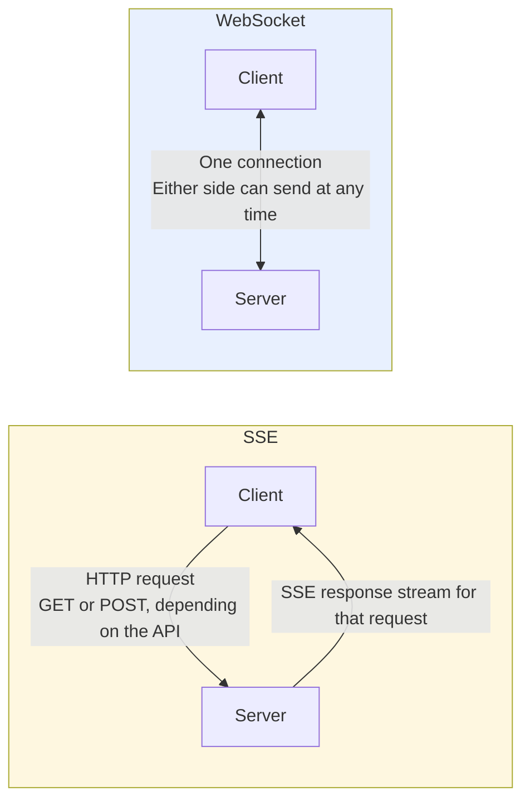
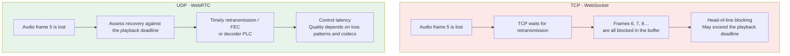
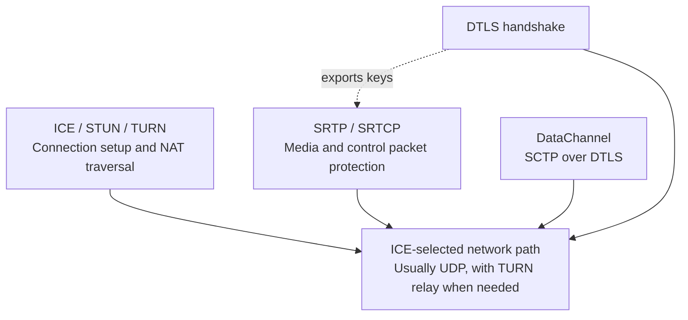
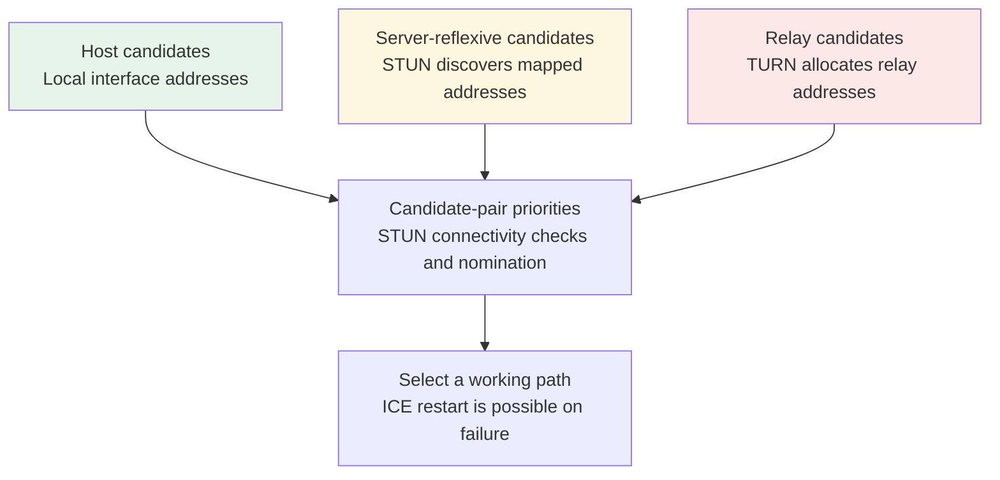
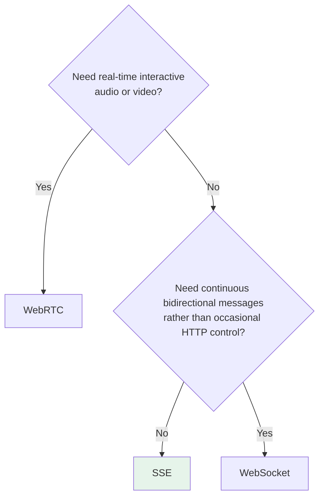

# Chapter 13: SSE, WebSocket, and WebRTC

## 13.1 Start with How HTTP Works

SSE and WebSocket extend interaction in web applications in different ways; WebRTC organizes a set of protocols around real-time media and data channels. They often appear in the same technology comparison, but they are not three interchangeable options at the same layer.

A traditional HTTP request originates at the client, and the server returns data through its response. Streaming HTTP responses, SSE, long polling, and HTTP/2/3 streams can keep a response open longer, but the server still cannot send messages out of nowhere to a client that has not established a request.

This is usually enough for traditional web applications, but often falls short in AI applications. A model may take several seconds to more than ten seconds to generate a complete answer. Waiting until generation finishes before returning anything leaves the interface blank for a long time. The more common approach is to **push output as it is generated**, displaying text progressively, as ChatGPT does.

To do this, the connection must remain open and continue sending data. SSE is one standard way to package this kind of HTTP streaming.

## 13.2 SSE: A One-Way Pipe over Ordinary HTTP

### 13.2.1 It Is Not a New Protocol

SSE (Server-Sent Events) is a server-to-client event-streaming mechanism defined in the HTML standard and carried over HTTP.

The browser's native `EventSource` uses GET, and the server returns an event stream with `Content-Type: text/event-stream`. **The SSE format is not the same thing as the EventSource API**: LLM APIs also commonly accept a POST request through `fetch` and return SSE in that same response.

The response body can keep growing or end after a finite stream. SSE has no universal “generation complete” marker; the application defines its completion event.

Think of it as **a one-way pipe from server to client**: data flows toward the client, and the client cannot pour data back into that pipe.

### 13.2.2 The Message Format Is Simple

The following example streams the Chinese characters “你” and “好,” which together mean “hello”:

```
data: {"token": "你"}

data: {"token": "好"}

data: [DONE]

```

This is a UTF-8 text event format, with blank lines separating events. It can contain `event:`, `id:`, `retry:`, multiple `data:` lines, and comments beginning with a colon. `[DONE]` is an application convention used by some APIs, not part of the SSE standard; an event does not necessarily correspond to one model token.

Native `EventSource` handles parsing and reconnection automatically, but does not let you directly configure a POST body or arbitrary `Authorization` headers. Use `fetch` with an SSE parser when you need those capabilities. A network chunk can split a UTF-8 character or an event line: decode incrementally and assemble events at blank-line boundaries rather than calling `JSON.parse` on each chunk.

### 13.2.3 Text Usually Needs Reliable, Ordered Delivery

Many text-generation APIs use SSE not only because it fits easily into HTTP, but also because it benefits from a reliable, ordered byte stream:

**Model output is a sequence of text tokens. Losing one in the middle can change the meaning entirely, and receiving them out of order makes the text unreadable.**

HTTP/1.1 and HTTP/2 commonly use TCP. HTTP/3 uses QUIC, which also provides reliable, ordered delivery within each HTTP stream. SSE is not a “TCP-only” format, and TCP is not the only transport that offers reliability and ordering.

Real-time media cares more about playback deadlines: data that arrives too late may be worthless. That is a different delivery objective from complete text, but it does not mean audio can never use TCP.

## 13.3 WebSocket: From HTTP to a Bidirectional Channel

### 13.3.1 The Handshake

Classic RFC 6455 WebSocket runs over TCP and organizes full-duplex communication into messages and frames; `wss` adds TLS.

The HTTP/1.1 path uses an Upgrade request and `101 Switching Protocols`. RFC 8441 for HTTP/2 and RFC 9220 for HTTP/3 use extended CONNECT instead. Do not describe the 101 upgrade as a mandatory step for every WebSocket connection.

On the HTTP/1.1 path, the upgraded TCP connection carries WebSocket frames. On the HTTP/2/3 path, an extended CONNECT stream carries them, while other HTTP streams can remain active. Both paths provide **a full-duplex channel in which either side can send messages independently**.



An SSE response flows in one direction, but the client can send other HTTP requests in parallel while reading it. It is not a half-duplex “walkie-talkie” that requires the server to finish speaking before the client can respond.

### 13.3.2 See the Difference through Interruption

Suppose a user wants to interrupt the model while it is speaking:

| | SSE | WebSocket |
|---|---|---|
| Action | Abort response reading, or POST a cancellation request in parallel | Send an application-defined cancellation message over the same connection |
| When cancellation takes effect | Depends on whether the server and upstream propagate cancellation | Also depends on application handling, queues, and upstream cancellation support |

Stopping the browser from reading does not automatically guarantee that model billing or tool execution stops. MCP 2026-07-28 defines disconnection of an HTTP SSE stream for an unfinished request as cancellation. An A2A task, by contrast, is independent of its monitoring stream and requires a `CancelTask` call. The same network action can have different protocol semantics.

## 13.4 Four Limitations of SSE

These are also where many practical engineering problems arise.

### 13.4.1 Distinguish Separate Subscriptions from POST Response Streams

One implementation uses a separate GET to subscribe to events and POST to send commands. It needs a conversation ID and routing across connections.

Another returns SSE directly in the POST response body. The request and stream are naturally associated, with no separate GET needed. Both streaming LLM generation and modern MCP Streamable HTTP can use this approach.

The old dual-endpoint MCP design belongs to the first category. Do not generalize its limitations to all SSE implementations; see [Chapter 12](../02-mcp/12-mcp-transport.md).

### 13.4.2 HTTP/1.1 Connection Limits

Browsers commonly limit concurrent HTTP/1.x connections per origin. MDN uses the common limit of 6 to illustrate the risk of SSE requests queuing across multiple tabs. This is a browser implementation constraint, not a hard limit in the SSE standard.

HTTP/2 supports multiplexing, but concurrent streams are still bounded by the peers' settings and available resources; they are not unlimited. Also check whether a CDN or proxy buffers responses or has an overly short idle timeout. Heartbeat comments can prevent silent connections from being reclaimed, but cannot fix a blocked backend.

### 13.4.3 Event Payloads Are Text

SSE event fields are UTF-8 text. Binary media usually requires Base64 encoding, a URL or file reference instead, or a different channel. Base64 adds transfer and encoding/decoding costs. SSE is generally a poor fit for continuous, low-latency media, though whether it is acceptable still depends on data volume and latency targets.

### 13.4.4 Reconnection Can Lose Content

Native `EventSource` provides reconnection and `Last-Event-ID`; applications using `fetch` streams must implement these themselves. Replay also requires the server to retain an event log and define cursors, retention periods, and deduplication rules. Adding `id:` alone is not enough to claim lossless delivery.

MCP 2026-07-28 explicitly does not support resumable SSE streams, so generic EventSource reconnection logic does not apply. Other applications may also require clients to retrieve a fresh task snapshot rather than replay generation.

## 13.5 Three Limitations of WebSocket

### 13.5.1 Long-Lived Connections Need Explicit Ownership

Both WebSocket and SSE use long-lived connections. Both require the server to manage connection lifecycles and track which instance currently owns each connection. The distinction is not “stateful versus stateless”; it is whether bidirectional messages, broadcasts, and application sessions add coordination costs.

Once established, each connection is held by a particular instance. Scaling out does not automatically migrate existing connections. To send to a specific connection, sticky routing, a connection registry, or a message bus must deliver the event to the right instance.

WebSocket often carries bidirectional commands, rooms, and broadcasts, so it usually needs more application-level coordination. SSE implementations are often simpler when they only push server-to-client events. Still, SSE does not let an arbitrary instance write directly to a TCP connection held by another instance.

Redis Pub/Sub is only one option. A dedicated gateway, broker, or platform-provided WebSocket/SSE service can also work. Load-test candidates against requirements for connection counts, broadcast patterns, ordering, reconnection, and latency.

### 13.5.2 Getting through Proxies and Firewalls

Many enterprise HTTP proxies, such as Squid, older CDNs, and some security gateways **do not support the WebSocket Upgrade handshake** and reject the request as abnormal.

SSE usually avoids this particular class of Upgrade rejection: it remains an ordinary HTTP request that most proxies can forward.

This is a deployment tradeoff. Without a first-party design record, it should not be asserted as the sole reason MCP chose its transports.

### 13.5.3 No Built-In Request–Response Pairing

In HTTP, each request has its own response, giving a natural one-to-one association. In WebSocket, a message is just a message: when the server sends one, **the transport does not tell you which request it belongs to**.

You must add request IDs to messages and maintain a client-side mapping from request ID to waiting callback. The idea is straightforward, but implementation takes work. What happens to requests still awaiting responses after disconnection and reconnection also needs an explicit design.

> The `id` field in JSON-RPC 2.0 addresses exactly this problem; see [Chapter 12](../02-mcp/12-mcp-transport.md).

## 13.6 WebRTC: Transport Designed around Media Deadlines

### 13.6.1 More than UDP

WebRTC is a protocol family led by Google and standardized jointly through the W3C and IETF, with work underway since 2011. Its original goal was real-time browser-to-browser audio and video calls without plugins.

WebRTC favors UDP for real-time media and combines congestion control, jitter buffering, codecs, packet-loss recovery, and encryption. In restricted networks, it can also relay traffic through TURN over TCP/TLS.

UDP itself does not guarantee delivery, but a WebRTC media path can combine NACKs (negative acknowledgments) to request retransmission, FEC (forward error correction) to recover data, and PLC (packet-loss concealment) to estimate missing audio. These are retransmission, recovery from redundancy, and signal concealment respectively—not the same reliability guarantee. DataChannel uses SCTP/DTLS and can provide reliable, ordered delivery or be configured for partial reliability or unordered delivery. Calling WebRTC “entirely unreliable” is therefore incorrect.

### 13.6.2 When TCP Retransmission Slows Real-Time Voice



If audio travels in one TCP byte stream, retransmitting missing bytes blocks delivery of later data in that stream. The impact depends on RTT, packet loss, buffering, and the playback budget; one lost packet does not inevitably freeze playback.

PLC usually estimates a signal in the codec or decoder when audio is missing. It is not one universal “interpolation algorithm between adjacent frames.” Consecutive losses or severe congestion can still cause obvious distortion; inaudibility cannot be promised.

The tradeoff is to **recover as much as possible before the playback deadline, then discard or conceal what cannot arrive in time**, rather than wait unconditionally for complete data. This does not guarantee consistently low latency or only minor distortion when the network deteriorates.

Real-time voice balances latency against audio quality. Audio tasks such as offline transcription and file uploads still place more weight on complete, reliable delivery.

### 13.6.3 WebRTC Is a Whole Protocol Stack

Media and data channels follow different paths. DTLS negotiates SRTP keys; it does not wrap every SRTP packet in another DTLS layer:



| Layer | Responsibility | Why it is needed |
|---|---|---|
| **Network path** | Usually UDP, with TURN/TCP/TLS when needed | Balance latency with network reachability |
| **DTLS-SRTP** | Negotiate media keys using DTLS | Media packets are protected by SRTP/SRTCP, not nested in DTLS records |
| **RTP / RTCP** | Media timing and quality feedback | RTP sequence numbers and timestamps support timing, loss, and jitter handling |
| **SCTP over DTLS** | DataChannel | Supports reliable, ordered or partially reliable delivery; distinct from the media path |
| **ICE / STUN / TURN** | NAT traversal | The most complex part of practical deployment |

### 13.6.4 SDP Signaling Does Not Require WebSocket

Before connecting, the two sides need to exchange capabilities: supported codecs, network addresses, and encryption parameters. This negotiation uses **SDP (Session Description Protocol)**.

**SDP is a format, not a transport requirement**. The peers need a signaling channel to exchange SDP. That channel can use WebSocket, HTTP, or any other bidirectional communication mechanism—**WebRTC does not prescribe it**.

Signaling can use HTTP, WebSocket, or another application channel:

- **The signaling channel exchanges SDP, ICE candidates, and session control**; it need not be WebSocket.
- **Media travels over the negotiated WebRTC path**; control events can also use DataChannel.

**They serve different purposes rather than replacing one another.** The common mistake is to treat them as mutually exclusive choices.

### 13.6.5 ICE Candidate Gathering and Connectivity Checks

ICE gathers host, server-reflexive, relay, and other candidates, forms candidate pairs, and performs paced connectivity checks and nomination. It is not a strictly sequential three-stage fallback of “local fails → STUN fails → TURN”:



NAT mapping and filtering behavior, blocked UDP, firewalls, and candidate reachability can all prevent a direct connection. Labels such as “enterprise network” or “carrier NAT” alone do not establish a particular behavior. Some deployments deliberately use relays for privacy or network-policy reasons.

TURN relaying adds bandwidth and deployment costs, but preserves WebRTC's media, encryption, and congestion-control semantics; it does not turn WebRTC into WebSocket. A TCP/TLS path to TURN can reintroduce head-of-line blocking and should be measured on the target network.

### 13.6.6 Built-In Audio Processing

This is one of the hardest gaps to close when carrying voice over WebSocket. Focusing only on the transport protocol can hide these engineering differences:

| Capability | Problem it addresses |
|---|---|
| **AEC: acoustic echo cancellation** | The microphone picks up the AI's speech from the speaker, creating a feedback loop unless it is handled |
| **NS: noise suppression** | Filter background noise in noisy environments to transmit the user's voice |
| **AGC: automatic gain control** | Amplify quiet speech and attenuate loud speech to keep volume stable |
| **ABR: adaptive bitrate** | Monitor the network continuously through RTCP, using higher bitrates for quality on good links and lower bitrates for smoother playback on poor links |

These capabilities come from browser media capture, codecs, and WebRTC implementations. AEC, NS, and AGC can be requested through media constraints, with support varying by device and browser. WebSocket applications can also reuse capture processing or existing media libraries, but must integrate their own transport and playback pipelines.

## 13.7 Why the OpenAI Realtime API Uses WebRTC

OpenAI released the Realtime API in 2024 for real-time voice conversations: the AI listens as the user speaks, the user hears the AI as it speaks, and either side can interrupt.

This scenario has demanding requirements:

| Requirement | Behavior to measure |
|---|---|
| End-to-end latency | Measure network time, endpoint detection, time to the model's first audio, and playback buffering separately; there is no universal 300ms API guarantee |
| Simultaneous bidirectional flow | Neither side should have to wait for the other to finish |
| Interruption at any time | Measure the delay from detecting user speech to stopping generation and clearing queued playback audio |
| Echo cancellation | The microphone must not feed the AI's played audio back to it |

OpenAI's official guidance recommends WebRTC for browsers and mobile clients for more consistent performance; server-side integrations can use WebSocket. Its official WebRTC example exchanges SDP through HTTP POST, then uses DataChannel for events. WebSocket signaling is not required.

Keep long-lived API keys on the backend. The browser should use a backend-established session or short-lived credentials, with session configuration and identity constrained. Do not embed a server key in a web page just to enable a direct connection.

## 13.8 How This Relates to MCP and A2A

MCP's standard transports are stdio and Streamable HTTP. The latter can stream JSON-RPC messages through SSE. WebSocket is a custom transport that the parties can agree to use, not a standard MCP transport.

The JSON-RPC and HTTP/REST bindings in A2A 1.0 (using release v1.0.1 in this chapter) can deliver streaming Task/Artifact updates through SSE; gRPC uses server streaming. WebSocket and WebRTC are not core bindings, and media channels require a separate design.

## 13.9 Comparing and Choosing the Three

| Dimension | SSE | WebSocket | WebRTC |
|---|---|---|---|
| **Underlying transport** | HTTP over TCP or QUIC | TCP or an HTTP/2/3 stream | ICE-selected media/data path |
| **Direction** | One-way, server → client | Full-duplex | Full-duplex |
| **Delivery objective** | Reliable, ordered events | Reliable, ordered messages | Deadline-sensitive media; configurable data channels |
| **Media processing** | Implement separately | Integrate separately | Supported by media protocols and implementations |
| **Connection setup** | HTTP request and response stream | Handshake and application session | Signaling, ICE, and encryption negotiation |
| **Scaling focus** | Connection ownership and event routing | Connection ownership and bidirectional sessions | Signaling, media services, and relays |
| **Network constraints** | Buffering and idle timeouts | Proxies must support the applicable handshake | Check UDP and relay reachability |

Reliable delivery in this table refers only to transport semantics while the connection is functioning. Redelivery, deduplication, and business recovery after disconnection remain application responsibilities. For all three, measure network, buffering, and processing overhead in end-to-end latency; for WebRTC, also include codecs and any relay costs.

A selection guide:



| Scenario | Approach | Reason |
|---|---|---|
| Streaming LLM text output | **SSE** | One-way push is enough; lightweight, native to HTTP, and simple to operate |
| Multi-turn conversations | **SSE + POST** | POST sends user messages and SSE carries replies, with straightforward separation |
| Mid-response interruption | **HTTP cancellation or WebSocket control** | Server-side cancellation propagation and stopping playback matter most; interruption alone does not require switching protocols |
| Collaborative editing | **WebSocket** | Frequent bidirectional traffic makes separate SSE + POST channels cumbersome |
| Real-time voice conversations | **WebRTC** | Reuses media-deadline management and audio-processing pipelines; measurement is still required |
| Remote MCP servers | **Streamable HTTP** | The standard HTTP transport returns JSON or SSE for each request |

**Start with the interaction pattern**: SSE is common for one-way event streams; evaluate WebSocket when the application needs full-duplex messaging; evaluate WebRTC for real-time interactive audio and video. Proxy, browser, media-processing, and operational constraints can also change the choice.

Many text-generation APIs use SSE. Whether it is sufficient still depends on interruption, bidirectional control, client capabilities, and deployment constraints.

## 13.10 Common Mistakes

### 13.10.1 Assuming WebSocket Is Better Because It Is More Powerful

The distinction is not simply “simple versus complex,” but **direction of communication**. WebSocket's full-duplex capability adds bidirectional protocol handling, ordering, backpressure, and application-session management. When bidirectional communication is unnecessary, SSE is usually simpler.

### 13.10.2 Assuming TCP Retransmission Is Always Good for Voice

Real-time media retransmission must respect playback deadlines; data that arrives too late may be useless. Limited retransmission, FEC, and PLC can complement one another. Do not mistake UDP's lack of guaranteed delivery for WebRTC making no attempt to recover from packet loss.

### 13.10.3 Assuming WebRTC's Advantage Is P2P

Its advantages extend beyond a direct peer-to-peer connection to media timing, congestion control, packet-loss recovery, and audio processing. The path may use a TURN relay, and the peer may be a media server. Those deployments can still benefit from WebRTC; its value is not limited to direct browser-to-browser connections.

### 13.10.4 Assuming WebRTC Can Completely Replace WebSocket

WebRTC needs application-defined signaling, but HTTP is sufficient to carry SDP exchanges. WebSocket is not a mandatory dependency.

### 13.10.5 Calling SSE, WebSocket, and WebRTC Equivalent A2A Bindings

A2A defines JSON-RPC, HTTP/REST, and gRPC as its core bindings. SSE carries streaming data on the HTTP paths. WebSocket and WebRTC require additional custom-binding or media-channel design.

### 13.10.6 Stopping at “SSE Is One-Way”

Also check EventSource's GET and request-header restrictions, browser concurrency, proxy buffering, event boundaries, and disconnection semantics. A POST response can stream directly; two separate channels are not an SSE requirement.

### 13.10.7 Ignoring the Scaling Costs of Long-Lived Connections

Both SSE and WebSocket connections belong to a particular instance. Scaling, reconnection, and cross-instance push require connection registration, routing, or a broker. WebSocket is often more complex because of bidirectional commands and broadcasts, but Redis is not mandatory.

## 13.11 Chapter Summary

1. **SSE and WebSocket extend HTTP interaction patterns; WebRTC serves real-time peer-to-peer or relayed media and data communication.**
2. **SSE is a standard event stream over HTTP**, with native browser support through `EventSource`.
3. **The SSE format is not limited to GET or TCP**; EventSource and fetch offer different client capabilities.
4. **SSE requires management of buffering, concurrency, and reconnection**; recovery follows the application protocol.
5. **Common WebSocket costs** include more complex bidirectional sessions and cross-instance routing, Upgrade restrictions in some proxies, and no built-in request–response pairing.
6. **WebRTC manages latency and recovery around media deadlines**; it does not abandon reliability altogether.
7. **Understand media and DataChannel paths separately**; SRTP is not nested inside DTLS.
8. **WebRTC signaling can use HTTP or WebSocket**; ICE checks candidates rather than enforcing a strict three-stage fallback.
9. **Media-processing capabilities depend on implementations and devices**; WebSocket applications can also reuse processing libraries.
10. **Distinguish specifications from implementations when choosing a protocol**: MCP's standard transports are stdio and Streamable HTTP; A2A's core bindings are JSON-RPC, HTTP/REST, and gRPC. WebSocket and WebRTC need separate agreement or design.

## References

- [MDN: Using Server-Sent Events](https://developer.mozilla.org/en-US/docs/Web/API/Server-sent_events/Using_server-sent_events)
- [MDN: The WebSocket API](https://developer.mozilla.org/en-US/docs/Web/API/WebSockets_API)
- [MDN: WebRTC API](https://developer.mozilla.org/en-US/docs/Web/API/WebRTC_API)
- [RFC 6455: The WebSocket Protocol](https://www.rfc-editor.org/rfc/rfc6455)
- [RFC 8445: Interactive Connectivity Establishment (ICE)](https://www.rfc-editor.org/rfc/rfc8445)
- [WebRTC Official Site](https://webrtc.org/)
- [WHATWG HTML: Server-Sent Events](https://html.spec.whatwg.org/multipage/server-sent-events.html)
- [RFC 8835: WebRTC Transports](https://www.rfc-editor.org/rfc/rfc8835)
- [RFC 8834: WebRTC Media and Packet-Loss Recovery](https://www.rfc-editor.org/rfc/rfc8834)
- [RFC 8831: WebRTC Data Channels](https://www.rfc-editor.org/rfc/rfc8831)
- [RFC 8441: WebSocket over HTTP/2](https://www.rfc-editor.org/rfc/rfc8441)
- [RFC 9220: WebSocket over HTTP/3](https://www.rfc-editor.org/rfc/rfc9220)
- [OpenAI: WebRTC Connections (Realtime API Section)](https://developers.openai.com/api/docs/guides/voice-webrtc?api=realtime)
- [MCP Specification: Transports](https://modelcontextprotocol.io/specification/2026-07-28/basic/transports)
- [A2A v1.0.1 Released Specification](https://github.com/a2aproject/A2A/blob/v1.0.1/docs/specification.md)
