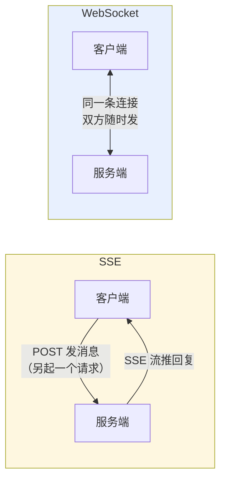
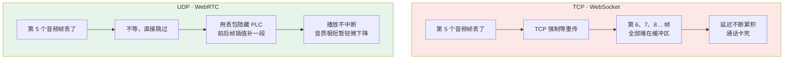
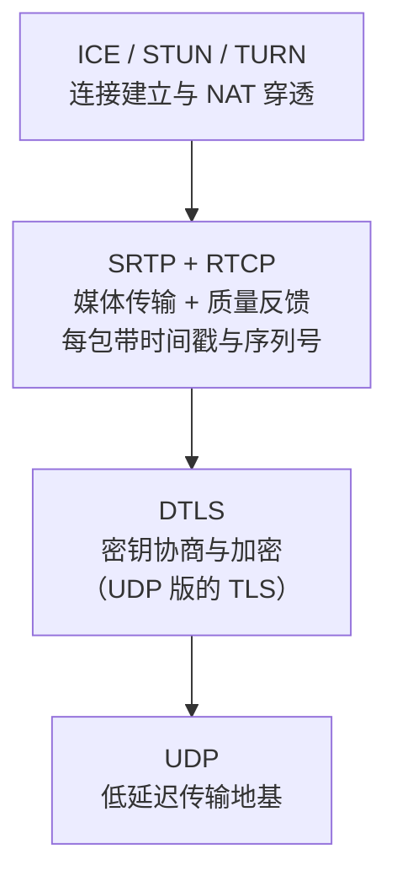
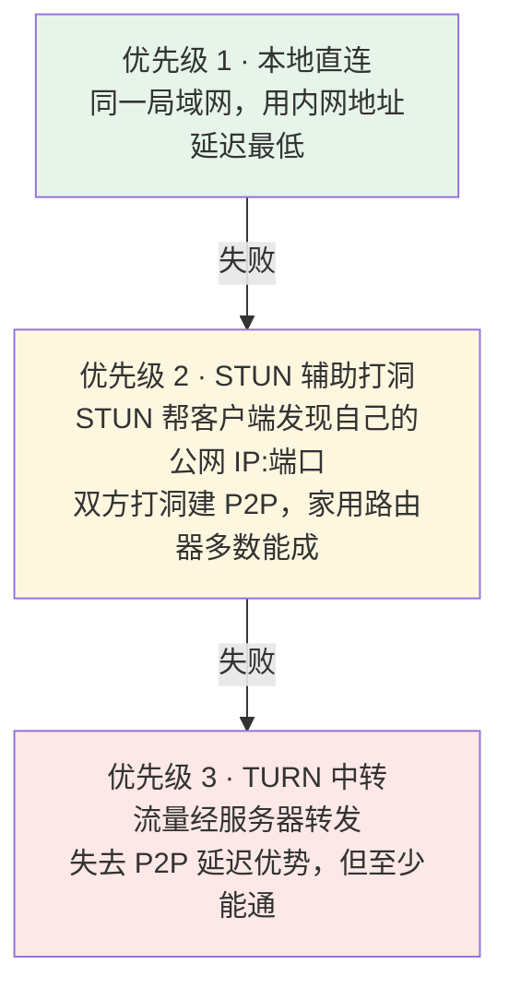
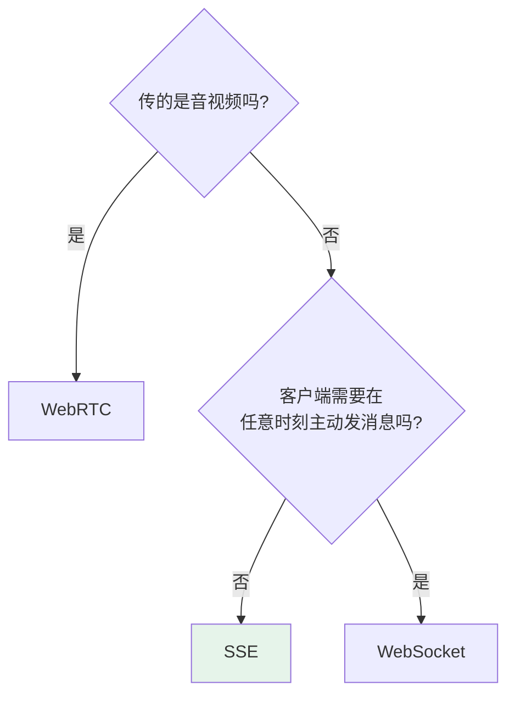

# 第十三章：SSE、WebSocket 与 WebRTC

## 13.1 先从 HTTP 的本质说起

这三种机制都在补 HTTP 原生交互的短板，只是补法不同。

传统 HTTP 请求由客户端发起，服务端沿着这个响应回数据；HTTP 流式响应、SSE、长轮询与 HTTP/2/3 流虽然能把一个响应拉长，但服务端仍不能凭空向尚未建立请求的客户端发消息。

这在传统 Web 里通常够用，但 AI 场景经常不够：模型生成完整回答往往要几秒到十几秒，如果非得等全部生成完再一次性返回，界面就会长时间空着。更常见的做法是**边生成边推送**，像 ChatGPT 那样逐字显示。

要做到这一点，连接就得保持打开并持续发送数据；SSE 是这类 HTTP 流式场景的标准封装之一。

## 13.2 SSE：用普通 HTTP 撑开一条单向水管

### 13.2.1 它不是新协议

SSE（Server-Sent Events）是 HTML 标准定义的、运行在 HTTP 之上的服务器到客户端事件流机制。

做法：客户端发一个普通 HTTP GET，请求头里声明 `Accept: text/event-stream`。服务端收到后**不关闭连接**，保持打开并不停往里写数据。

这条连接在技术上仍然是一个 HTTP 响应，只不过**响应体是「无限长」的**——服务端不断往里追加，直到生成完毕才发结束标志。

可以理解为**一根从服务端流向客户端的单向水管**：水只能从服务端流向客户端，客户端没法往管子里倒水。

### 13.2.2 消息格式非常简单

```
data: {"token": "你"}

data: {"token": "好"}

data: [DONE]

```

它本质上就是纯文本协议：每条消息以 `data:` 开头，结尾两个换行符。

打开 ChatGPT 按 F12 切到 Network 面板，找到流式响应请求，就能看到这样一行行文本在不断追加。浏览器有内置的 `EventSource` API 处理这种格式，注册一个 `onmessage` 回调即可，完全不用自己解析数据流。

### 13.2.3 一个容易被忽视的原因：文字天然适合 TCP

SSE 成为 LLM 流式输出的行业标准，除了实现简单，还有传输特性上的原因：

**模型输出是连续的 token 文本，中间丢一个 token 意思可能完全变了，顺序乱了更没法读。**

所以你希望每个 token 都准确到达、不乱序——这恰恰是 TCP 的强项。你**愿意**等网络重传，因为等来的是正确内容。

这也解释了为什么后面的语音场景（WebRTC）会得出相反结论：**文字场景里 TCP 是朋友，语音场景里 TCP 反而会拖垮体验。**

## 13.3 WebSocket：从 HTTP 升级成双向信道

### 13.3.1 握手仪式

WebSocket 是**独立协议**，建立在 TCP 之上，但不是 HTTP 的特性。

建连过程有一个特殊的「升级仪式」：客户端先发一个看起来像普通 HTTP 请求的东西，但头里带一句「我想升级成 WebSocket」。服务端同意就回 `101 Switching Protocols`。

从这一刻起，这条 TCP 连接就不再遵循 HTTP 的一问一答，而是变成**双方都可随时发消息的全双工信道**。



类比：SSE 像**对讲机**（一方说完，另一方才通过另一条通道回），WebSocket 像**电话**（双方随时开口，谁都不用等谁）。

### 13.3.2 用「打断」场景感受差别

用户想在模型说话中途打断：

| | SSE | WebSocket |
|---|---|---|
| 操作 | 先关掉当前 SSE 流 → 再发一个新 POST | 直接在同一条连接里发「停止」指令 |
| 体验 | 有明显的断-重连过程，割裂 | 服务端立刻收到、立刻停止，无缝 |

## 13.4 SSE 的四个局限

工程上真正容易踩坑的，也集中在这里。

### 13.4.1 双通道的架构尴尬

SSE 只能服务端→客户端，用户发消息必须走独立 POST。**同一个对话实际上用了两条通道**，靠 conversation ID 关联。

服务端收到 POST 后要找到对应的 SSE 长连接把输出推过去。简单场景够用，但状态管理比 WebSocket 的单通道复杂，出问题时排查链路更长。

> 这和 [第十二章](../02-mcp/12-mcp-transport.md) 里 MCP 废弃「HTTP + SSE 双端点」的理由是同一个问题。

### 13.4.2 HTTP/1.1 的连接数上限

浏览器对同一域名的 HTTP/1.1 连接有 **6 条上限**。SSE 占一条长连接，用户开了多个标签页，第 7 个标签页的 SSE 请求会被排队等待——表现出来就是「页面卡死了」。

HTTP/2 的多路复用解决了这个问题（一条 TCP 上跑无数逻辑流），所以现代部署一般要求 HTTP/2。但如果用户环境里有老浏览器或不支持 HTTP/2 的代理，这就是个真实的坑。

### 13.4.3 事件载荷是文本

SSE 的事件字段是 UTF-8 文本。二进制媒体通常要么 Base64 编码，要么改成 URL/文件引用，或者换其他通道；Base64 会增加传输和编解码成本。它通常不适合作为低延迟连续媒体传输，但是否能接受，还是要看数据量和时延目标。

### 13.4.4 断线重连容易丢内容

SSE 有内置重连机制，这是优点。但要做到「断了接着上次继续」而不丢消息，服务端必须支持 `Last-Event-ID`：客户端重连时带上最后收到的消息 ID，服务端从那条之后重放。

很多实现省略了这块，结果断线后用户丢失中间内容，重连看到的是截断的回答。

## 13.5 WebSocket 的三个局限

### 13.5.1 长连接需要明确连接所有权

WebSocket 和 SSE 都是长连接，服务端都要维护连接生命周期和“这条连接当前在哪个实例”的路由信息。差异不在“一个有状态、一个无状态”，而在双向消息、广播和应用会话是否增加了协调成本。

每条连接建立后由某个实例持有。横向扩容不会自动迁移既有连接；向指定连接发送消息时，需要 sticky routing、connection registry 或消息总线把事件送到正确实例。

WebSocket 常承载双向命令、房间和广播，因此应用级关联通常更多；SSE 只做服务端单向推送时实现往往更简单。但 SSE 同样不能让任意实例直接写入另一实例持有的 TCP 连接。

Redis Pub/Sub 只是可选实现之一，也可使用专用网关、broker 或平台提供的 WebSocket/SSE 服务。选型应按连接数、广播模式、顺序、重连与延迟要求压测。

### 13.5.2 代理和防火墙穿透

很多企业 HTTP 代理（如 Squid）、老版本 CDN、某些安全网关**不支持 WebSocket 的 Upgrade 握手**，直接把这个请求当异常拒掉。

SSE 通常不会遇到 Upgrade 被拒这一类问题——它始终是普通 HTTP 请求，大多数代理都能透传。

> 这正是早期 MCP 远程传输选 SSE 而非 WebSocket 的原因：MCP Server 需要在各种复杂网络环境下都能工作。

### 13.5.3 没有内置的请求-响应配对

HTTP 里每个请求有自己的响应，天然一一对应。WebSocket 里消息就是消息——服务端发来一条，你**不知道它对应哪个请求**。

需要自己在消息里加请求 ID，在客户端维护「请求 ID → 等待回调」的映射表。说起来不难，但实现有工作量，而且断线重连时那些还在等待响应的请求怎么处理，需要专门设计。

> JSON-RPC 2.0 的 `id` 字段解决的就是这个问题——见 [第十二章](../02-mcp/12-mcp-transport.md)。

## 13.6 WebRTC：主动放弃可靠性

### 13.6.1 核心决策是把 TCP 换成 UDP

WebRTC 是 Google 主导、W3C 与 IETF 联合标准化的协议族，2011 年起推进，最初目的是让浏览器之间无插件做实时音视频通话。

它最核心的设计决策：**底层用 UDP**。

UDP 完全不管可靠性，包丢了就丢了，没有重传也没有等待。听起来很不可靠，但对语音**恰恰是正确的选择**。

### 13.6.2 为什么 TCP 重传对语音是灾难



丢了一个 20ms 的音频片段，TCP 会强制等重传，**后面所有音频全部堵住**，延迟一堆积通话就卡死了。

WebRTC 在 UDP 之上实现了对语音友好的策略：**丢包隐藏（Packet Loss Concealment）**——用前后帧插值生成一段听起来合理的音频填补，整体播放不中断，人耳几乎感知不到。

这是典型的工程权衡：**用偶尔轻微的音质损失，换取稳定的低延迟。**

> **语音场景的铁律：容忍丢包，绝不容忍延迟。** TCP 的设计哲学和这个需求正好相反。

### 13.6.3 WebRTC 是一套协议全家桶

它不是单一协议，而是在 UDP 之上叠了好几层：



| 层 | 职责 | 为什么需要 |
|---|---|---|
| **UDP** | 低延迟传输 | 整个 WebRTC 的地基 |
| **DTLS** | 密钥协商与加密 | UDP 没有现成的 TLS 握手机制，需要「UDP 版 TLS」 |
| **SRTP / RTCP** | 媒体传输与质量反馈 | RTP 每包带时间戳和序列号，接收方知道包的时序和丢失情况 |
| **ICE / STUN / TURN** | NAT 穿透 | 实际部署中最复杂的部分 |

### 13.6.4 SDP 信令：为什么用 WebRTC 还要 WebSocket

建连前双方需要互相告知能力：支持哪些编解码格式、网络地址是什么、加密参数是什么。这个协商通过 **SDP（Session Description Protocol）** 完成。

**SDP 只是一种格式，不规定怎么传输**。双方需要一个「信令通道」来交换 SDP，这个通道可以是 WebSocket、HTTP 或任何双向传输方式——**WebRTC 不关心**。

所以用 WebRTC 做 AI 语音时，通常还是需要一个 WebSocket 连接：

- **WebSocket 负责信令交换**（「我的网络地址是 xxx，我支持 Opus 编解码」）
- **真正的音频流走 WebRTC 的 UDP 通道**

**两者各司其职，不是替代关系**。这里最容易混淆的，就是把它们当成二选一。

### 13.6.5 ICE 的三级降级

现实中大多数用户在路由器后面，没有公网 IP，直接用内网地址互连行不通。ICE 按优先级依次尝试：



**为什么打洞会失败？** 最常见的原因是**对称 NAT**（常见于企业防火墙、运营商级 NAT）：这类 NAT 对每个目标地址分配不同的出口端口，STUN 探测到的那个端口在对端连进来时已经换了，洞自然打不通。

这时只能退回 TURN 中转——**最差情况下 WebRTC 退化成类似 WebSocket 经服务器中转的模式**。

### 13.6.6 内置的音频处理能力

这是用 WebSocket 传语音时最难补齐的部分。只盯着传输协议，往往会漏掉这里的工程差异：

| 能力 | 解决什么 |
|---|---|
| **AEC 回声消除** | 扬声器外放 AI 的声音会被麦克风采集回去，不处理就形成反馈循环 |
| **NS 噪声抑制** | 用户在嘈杂环境说话，过滤背景噪声只传人声 |
| **AGC 自动增益** | 说话声音太小自动放大、太大自动降低，保证音量稳定 |
| **ABR 自适应码率** | 通过 RTCP 持续监测网络，好时高码率保音质，差时降码率保流畅 |

这些是 WebRTC 多年实时通信工程经验的沉淀。**用 WebSocket 做语音，这些全得自己造轮子。**

## 13.7 OpenAI Realtime API 为什么选 WebRTC

OpenAI 在 2024 年发布 Realtime API，实现实时语音对话：用户说话 AI 实时听，AI 说话用户实时听，双方可随时打断。

这个场景的硬要求：

| 要求 | 具体标准 |
|---|---|
| 端到端延迟 | **低于 300ms** 才有自然对话感 |
| 双向同时流动 | 不能等一方说完再切换 |
| 随时打断 | 用户说话时 AI 立即停止 |
| 回声消除 | 麦克风不能把 AI 播放的声音传回去 |

综合来看：**TCP 系方案（WebSocket）在网络抖动时很难稳定满足延迟要求，而且没有内置音频处理能力**，需要补很多额外工程。WebRTC 更贴近这类实时语音需求。

（Realtime API 同时也提供 WebSocket 接入方式，适合服务端到服务端的场景——那里网络环境可控，也不需要浏览器端的音频处理链路。）

## 13.8 与 MCP、A2A 的关系

MCP 的标准 transport 是 stdio 和 Streamable HTTP；后者可用 SSE 流式传递 JSON-RPC 消息。WebSocket 是可协商的 custom transport，不是 MCP 标准 transport。

A2A v1.0.0 的 JSON-RPC 与 HTTP/REST binding 可用 SSE 交付流式 Task/Artifact 更新，gRPC binding 使用 server streaming RPC。WebSocket 与 WebRTC 均非 A2A 核心 binding；前者只能作为双方定义的 custom binding，后者适合独立的实时媒体通道或信令方案。

## 13.9 三者对比与选型

| 维度 | SSE | WebSocket | WebRTC |
|---|---|---|---|
| **底层** | HTTP/TCP | TCP（HTTP 升级） | UDP |
| **方向** | 服务端→客户端单向 | 全双工 | 全双工 |
| **延迟** | 受网络、缓冲与 TCP 重传影响 | 受网络、缓冲与 TCP 重传影响 | 受网络、编解码、拥塞控制与 relay 影响 |
| **丢包处理** | 强制重传 | 强制重传，后续数据等待 | 丢包隐藏，不阻塞 |
| **音视频** | 文本事件中编码或引用媒体 | 支持二进制帧，但媒体处理链路需自行设计 | 面向实时媒体；浏览器实现通常提供音频处理能力 |
| **建连复杂度** | 极低（普通 GET） | 低（HTTP Upgrade） | 高（信令 + ICE 穿透） |
| **横向扩展** | 需连接所有权与事件路由；单向语义较简单 | 需连接所有权与事件路由；双向会话通常更复杂 | 需信令、ICE 与必要时的 TURN |
| **代理穿透** | 好 | 常被企业代理拒绝 | 需 UDP 放行，企业网络常受限 |

选型原则：



| 场景 | 方案 | 原因 |
|---|---|---|
| LLM 流式文字输出 | **SSE** | 单向推够用，轻量，HTTP 原生，运维简单 |
| 多轮对话 | **SSE + POST** | 用户发消息走 POST，回复走 SSE，解耦简单 |
| 需要中途打断 | **WebSocket** | 客户端要在流式输出中途主动发消息 |
| 多人协同编辑 | **WebSocket** | 频繁双向，SSE + POST 双通道太繁琐 |
| 实时语音对话 | **WebRTC** | 需要 UDP 低延迟 + 内置音频处理 |
| MCP 远程 Server | **Streamable HTTP** | 内部仍用 SSE 流，代理穿透友好 |

**选型时先看交互形态**：单向事件流常选 SSE；需要应用层全双工消息时评估 WebSocket；实时交互式音视频通常评估 WebRTC。代理、浏览器、媒体处理与运维约束同样会改变选择。

许多文字生成 API 采用 SSE；是否足够仍取决于中断、双向控制、客户端能力和部署约束。

## 13.10 常见错误

### 13.10.1 认为「WebSocket 功能更强所以更好」

它们不是「简单 vs 复杂」的关系，是**方向**的差异。WebSocket 的全双工能力会增加双向协议、顺序、背压和应用会话治理；用不到双向时，SSE 通常更简单。

### 13.10.2 认为 TCP 重传对语音也是好事

这是 WebRTC 那道题最大的雷。丢一个 20ms 音频帧，TCP 强制等重传会把后面所有音频堵住，延迟累积导致通话卡死。**语音容忍丢包，绝不容忍延迟。**

### 13.10.3 认为 WebRTC 的优势是 P2P

P2P 只是它的一个特点，不是核心原因。核心是**UDP + 丢包隐藏 + 内置音频处理链路**。而且大量场景下 WebRTC 根本没走 P2P（打洞失败退到 TURN、或者对端本来就是服务器）。

### 13.10.4 认为 WebRTC 可以完全替代 WebSocket

WebRTC 建连**需要一个信令通道来交换 SDP**，这个通道通常就是 WebSocket。两者是配合关系。

### 13.10.5 把 SSE、WebSocket、WebRTC 误称为 A2A 的等价 binding

A2A 核心定义 JSON-RPC、HTTP/REST 和 gRPC binding；SSE 是其中 HTTP 路径的流式承载方式。WebSocket/WebRTC 需要额外的 custom 或媒体设计。

### 13.10.6 只说「SSE 是单向的」就完事

要能说出四个具体局限：双通道架构复杂、HTTP/1.1 的浏览器并发限制、事件载荷为文本、断线续传需要 Server 支持事件 ID 与重放。

### 13.10.7 忽略长连接的扩展代价

SSE 与 WebSocket 连接都由某个实例持有。扩容、重连和跨实例推送需要连接注册、路由或 broker；WebSocket 因双向命令与广播通常更复杂，但不要求必须使用 Redis。

## 13.11 本章总结

1. **SSE 与 WebSocket 扩展 HTTP 的交互模式；WebRTC 面向实时点对点/中继媒体与数据通信**；
2. **SSE 是 HTTP 上的标准事件流**，浏览器有 `EventSource` 原生支持；
3. **文字场景 TCP 是朋友**：token 丢了或乱序意思就变了，你愿意等重传；
4. **SSE 的常见局限**：双通道架构、HTTP/1.1 并发限制、文本事件载荷、重连需事件 ID 与重放支持；
5. **WebSocket 的常见代价**：双向会话与跨实例路由更复杂、部分代理限制 Upgrade、无内置请求-响应配对；
6. **WebRTC 的核心决策是换成 UDP**，用丢包隐藏换稳定低延迟——语音容忍丢包不容忍延迟；
7. **WebRTC 是协议全家桶**：UDP + DTLS + SRTP/RTCP + ICE/STUN/TURN；
8. **WebRTC 仍需 WebSocket 做信令通道**交换 SDP，两者配合而非替代；
9. **WebRTC 真正的门槛是内置音频处理**（AEC/NS/AGC/ABR），用 WebSocket 全得自己造；
10. **协议选型要区分规范与实现**：MCP 标准 transport 是 stdio/Streamable HTTP；A2A 核心 binding 是 JSON-RPC/HTTP-REST/gRPC，WebSocket/WebRTC 要另行协商或设计。

> **可以把取舍记成两句话：文字更在意不丢不乱，所以常走 TCP 上的 SSE；语音更在意别卡顿，所以更适合走 UDP 上的 WebRTC。**

## 参考资料

- [MDN: Using Server-Sent Events](https://developer.mozilla.org/en-US/docs/Web/API/Server-sent_events/Using_server-sent_events)
- [MDN: The WebSocket API](https://developer.mozilla.org/en-US/docs/Web/API/WebSockets_API)
- [MDN: WebRTC API](https://developer.mozilla.org/en-US/docs/Web/API/WebRTC_API)
- [RFC 6455: The WebSocket Protocol](https://www.rfc-editor.org/rfc/rfc6455)
- [RFC 8445: Interactive Connectivity Establishment (ICE)](https://www.rfc-editor.org/rfc/rfc8445)
- [WebRTC 官方站点](https://webrtc.org/)
- [OpenAI: Realtime API](https://platform.openai.com/docs/guides/realtime)
- [MCP 规范：Transports](https://modelcontextprotocol.io/specification/2026-07-28/basic/transports)
- [A2A v1.0.0 规范](https://a2a-protocol.org/v1.0.0/specification)
