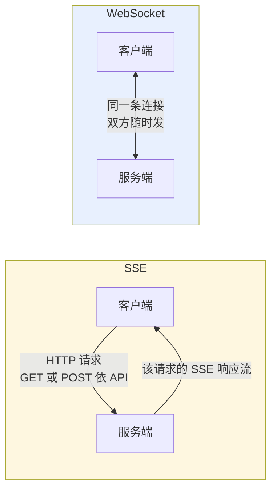
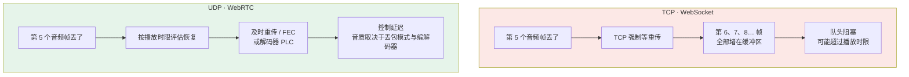
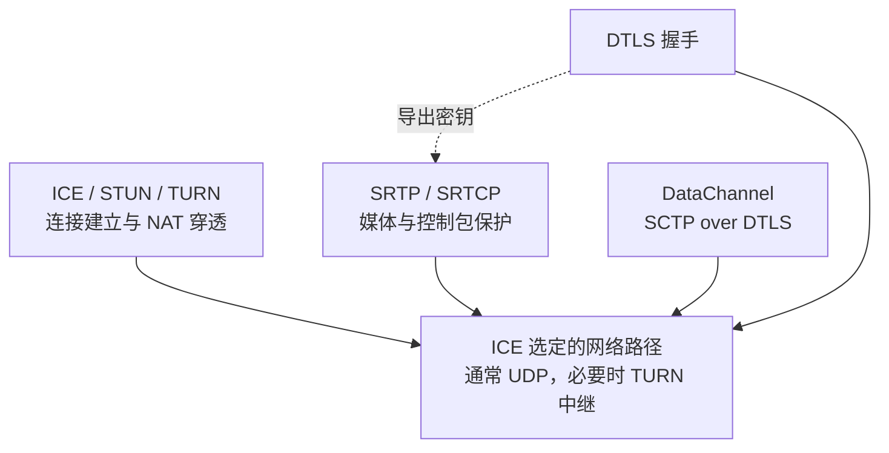
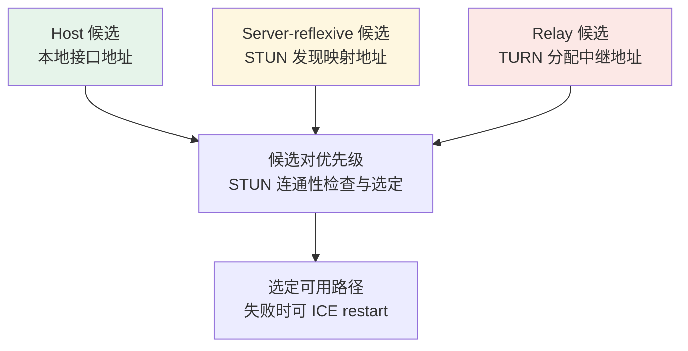
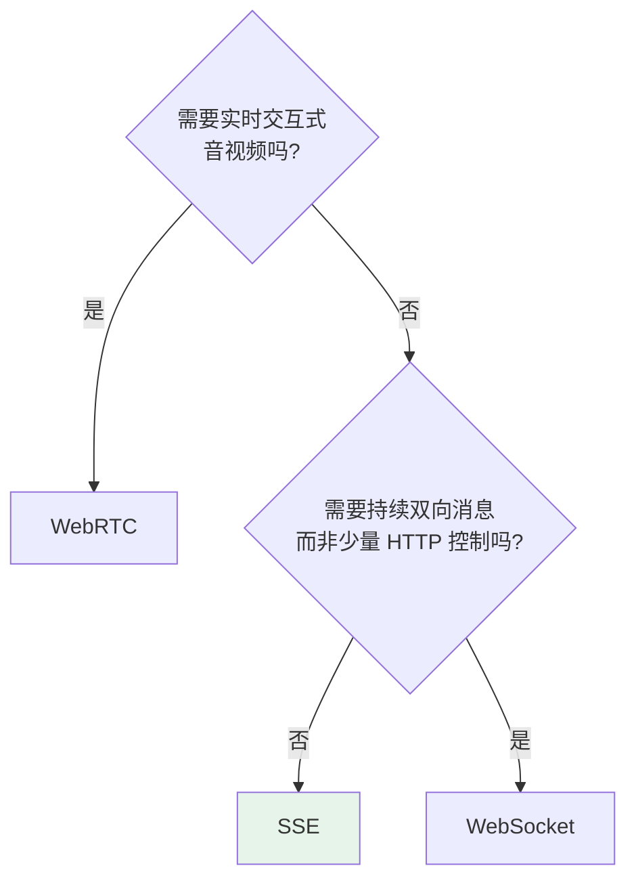

# 第十三章：SSE、WebSocket 与 WebRTC

## 13.1 先从 HTTP 的本质说起

SSE 与 WebSocket 用不同方式扩展 Web 应用的交互；WebRTC 则围绕实时媒体和数据通道组织一套协议。三者常被一起选型，但不是同一层的三个替代品。

传统 HTTP 请求由客户端发起，服务端沿着这个响应回数据；HTTP 流式响应、SSE、长轮询与 HTTP/2/3 流虽然能把一个响应拉长，但服务端仍不能凭空向尚未建立请求的客户端发消息。

这在传统 Web 里通常够用，但 AI 场景经常不够：模型生成完整回答往往要几秒到十几秒，如果非得等全部生成完再一次性返回，界面就会长时间空着。更常见的做法是**边生成边推送**，像 ChatGPT 那样逐字显示。

要做到这一点，连接就得保持打开并持续发送数据；SSE 是这类 HTTP 流式场景的标准封装之一。

## 13.2 SSE：用普通 HTTP 撑开一条单向水管

### 13.2.1 它不是新协议

SSE（Server-Sent Events）是 HTML 标准定义的、运行在 HTTP 之上的服务器到客户端事件流机制。

浏览器原生 `EventSource` 使用 GET，服务端以 `Content-Type: text/event-stream` 返回事件流。**SSE 格式不等于 EventSource API**：LLM API 也常用 `fetch` POST 提交请求，再在同一响应中读取 SSE。

响应体可以持续追加，也可以有限结束。SSE 没有通用的“生成完成”标志，完成事件由应用定义。

可以理解为**一根从服务端流向客户端的单向水管**：水只能从服务端流向客户端，客户端没法往管子里倒水。

### 13.2.2 消息格式非常简单

```
data: {"token": "你"}

data: {"token": "好"}

data: [DONE]

```

这是 UTF-8 文本事件格式，空行分隔事件；可以含 `event:`、`id:`、`retry:`、多条 `data:` 和以冒号开头的注释。`[DONE]` 是某些 API 的应用约定，不属于 SSE 标准；一个事件也不一定对应一个模型 token。

原生 `EventSource` 自动解析和重连，但不能直接配置 POST body 或任意 `Authorization` 头。需要这些能力时用 `fetch` 加 SSE 解析器；网络 chunk 可能切断 UTF-8 字符或事件行，必须增量解码并按空行组装，不能把每个 chunk 直接 `JSON.parse`。

### 13.2.3 文本通常需要可靠有序交付

SSE 被多种文字生成 API 采用，除了容易融入 HTTP，还能利用可靠有序的字节流：

**模型输出是连续的 token 文本，中间丢一个 token 意思可能完全变了，顺序乱了更没法读。**

HTTP/1.1、HTTP/2 常用 TCP；HTTP/3 用 QUIC，也向每个 HTTP 流提供可靠有序交付。SSE 不是“只能基于 TCP”的格式，可靠有序也不是只有 TCP 才具备。

实时媒体更关注播放截止时间，过晚的数据可能没有价值；这与完整文本的交付目标不同，但不意味着音频绝不能使用 TCP。

## 13.3 WebSocket：从 HTTP 升级成双向信道

### 13.3.1 握手仪式

经典 RFC 6455 WebSocket 建立在 TCP 上，以消息和帧组织全双工通信；`wss` 再使用 TLS。

HTTP/1.1 路径使用 Upgrade 请求和 `101 Switching Protocols`；HTTP/2 的 RFC 8441 与 HTTP/3 的 RFC 9220 使用扩展 CONNECT，不能把 101 升级描述成所有 WebSocket 连接的必经步骤。

在 HTTP/1.1 路径中，升级后的 TCP 连接承载 WebSocket 帧；在 HTTP/2/3 路径中，则由一个扩展 CONNECT 流承载，其他 HTTP 流可以继续存在。两种路径都提供**双方可独立发送消息的全双工信道**。



SSE 的响应方向是单向，但客户端可在读取期间并行发送其他 HTTP 请求；它不是必须等服务端说完才响应的半双工“对讲机”。

### 13.3.2 用「打断」场景感受差别

用户想在模型说话中途打断：

| | SSE | WebSocket |
|---|---|---|
| 操作 | 可中止响应读取，或并行 POST 取消请求 | 可在同一连接发送应用定义的取消消息 |
| 取消生效 | 取决于服务端及上游是否传播取消 | 同样取决于应用处理、排队和上游取消支持 |

关闭浏览器读取不自动保证模型停止计费或工具停止执行。MCP 2026-07-28 把未完成请求的 HTTP SSE 断开定义为取消；A2A 任务则独立于监控流，需调用 `CancelTask`。同样的网络动作可有不同协议语义。

## 13.4 SSE 的四个局限

工程上真正容易踩坑的，也集中在这里。

### 13.4.1 区分分离订阅与 POST 响应流

一种实现是独立 GET 订阅事件，再 POST 发送命令，需要 conversation ID 和跨连接路由。

另一种实现是在 POST 的响应体直接返回 SSE，请求与流天然关联，不需要另开 GET。LLM 流式生成和现代 MCP Streamable HTTP 都可采用此方式。

旧 MCP 的双端点方案属于前一种；不能把其局限推广到全部 SSE，见[第十二章](../02-mcp/12-mcp-transport.zh.md)。

### 13.4.2 HTTP/1.1 的连接数上限

浏览器常限制每源 HTTP/1.x 并发连接；MDN 以常见的 6 条限制说明多标签页 SSE 的排队风险。这是浏览器实现约束，不是 SSE 标准规定的硬上限。

HTTP/2 可多路复用，但并发流数量受双方设置和资源限制，并非无限。还要核查 CDN/代理是否缓冲、空闲超时是否过短；心跳注释可防静默连接被回收，但不能修复后端阻塞。

### 13.4.3 事件载荷是文本

SSE 的事件字段是 UTF-8 文本。二进制媒体通常要么 Base64 编码，要么改成 URL/文件引用，或者换其他通道；Base64 会增加传输和编解码成本。它通常不适合作为低延迟连续媒体传输，但是否能接受，还是要看数据量和时延目标。

### 13.4.4 断线重连容易丢内容

原生 `EventSource` 有重连与 `Last-Event-ID` 机制；`fetch` 流需要应用自己实现。若要重放，服务端还要保留事件日志并定义游标、保留期与去重规则，不能仅加一个 `id:` 就宣称不丢消息。

MCP 2026-07-28 明确不支持 SSE 断点续传；不能套用通用 EventSource 重连逻辑。其他应用也可能要求重新查询任务快照，而不是重放生成过程。

## 13.5 WebSocket 的三个局限

### 13.5.1 长连接需要明确连接所有权

WebSocket 和 SSE 都是长连接，服务端都要维护连接生命周期和“这条连接当前在哪个实例”的路由信息。差异不在“一个有状态、一个无状态”，而在双向消息、广播和应用会话是否增加了协调成本。

每条连接建立后由某个实例持有。横向扩容不会自动迁移既有连接；向指定连接发送消息时，需要 sticky routing、connection registry 或消息总线把事件送到正确实例。

WebSocket 常承载双向命令、房间和广播，因此应用级关联通常更多；SSE 只做服务端单向推送时实现往往更简单。但 SSE 同样不能让任意实例直接写入另一实例持有的 TCP 连接。

Redis Pub/Sub 只是可选实现之一，也可使用专用网关、broker 或平台提供的 WebSocket/SSE 服务。选型应按连接数、广播模式、顺序、重连与延迟要求压测。

### 13.5.2 代理和防火墙穿透

很多企业 HTTP 代理（如 Squid）、老版本 CDN、某些安全网关**不支持 WebSocket 的 Upgrade 握手**，直接把这个请求当异常拒掉。

SSE 通常不会遇到 Upgrade 被拒这一类问题——它始终是普通 HTTP 请求，大多数代理都能透传。

这是一项部署取舍，不能未经一手设计记录就断言它是 MCP 选择传输的唯一原因。

### 13.5.3 没有内置的请求-响应配对

HTTP 里每个请求有自己的响应，天然一一对应。WebSocket 里消息就是消息——服务端发来一条，你**不知道它对应哪个请求**。

需要自己在消息里加请求 ID，在客户端维护「请求 ID → 等待回调」的映射表。说起来不难，但实现有工作量，而且断线重连时那些还在等待响应的请求怎么处理，需要专门设计。

> JSON-RPC 2.0 的 `id` 字段解决的就是这个问题——见 [第十二章](../02-mcp/12-mcp-transport.zh.md)。

## 13.6 WebRTC：围绕媒体时限设计传输

### 13.6.1 不只是 UDP

WebRTC 是 Google 主导、W3C 与 IETF 联合标准化的协议族，2011 年起推进，最初目的是让浏览器之间无插件做实时音视频通话。

WebRTC 优先利用 UDP 承载实时媒体，并组合拥塞控制、抖动缓冲、编解码、丢包恢复与加密；受限网络也可经 TURN 的 TCP/TLS 路径中继。

UDP 自身不保证交付，但 WebRTC 媒体链路可结合 NACK（否定确认）请求重传、FEC（前向纠错）恢复数据，以及 PLC（丢包隐藏）估计缺失音频。它们分别是重传、冗余恢复和信号补偿，不是同一种可靠性保证。DataChannel 使用 SCTP/DTLS，可以可靠有序，也可配置部分可靠或无序；所以“WebRTC 完全不可靠”是错误的。

### 13.6.2 TCP 重传何时会拖慢实时语音



若音频位于同一 TCP 字节流，丢失字节的重传会阻塞该流后续数据交付；影响取决于 RTT、丢包、缓冲和播放预算，不是一次丢包就必然卡死。

PLC 通常由编解码器/解码器在缺失音频时估计信号，不是统一的“前后帧插值算法”。连续丢包或拥塞严重时仍会有明显失真，不能承诺人耳无感。

这里的权衡是：**在播放截止时间内尽量恢复，来不及的部分再丢弃或补偿**，而不是无条件等待完整数据。它不能保证网络恶化时仍有稳定低延迟或轻微失真。

实时语音在延迟与音质之间取舍；离线转录、文件上传等音频任务仍更重视完整可靠交付。

### 13.6.3 WebRTC 是一套协议全家桶

媒体与数据通道是不同路径，DTLS 用于协商 SRTP 密钥，不是把每个 SRTP 包再包一层 DTLS：



| 层 | 职责 | 为什么需要 |
|---|---|---|
| **网络路径** | 通常 UDP，必要时 TURN/TCP/TLS | 兼顾时延与网络可达性 |
| **DTLS-SRTP** | 用 DTLS 协商媒体密钥 | 媒体包用 SRTP/SRTCP 保护，不嵌套在 DTLS 记录中 |
| **RTP / RTCP** | 媒体时序与质量反馈 | RTP 序列号/时间戳支持时序、丢包与抖动处理 |
| **SCTP over DTLS** | DataChannel | 可选可靠有序或部分可靠传输，不等于媒体路径 |
| **ICE / STUN / TURN** | NAT 穿透 | 实际部署中最复杂的部分 |

### 13.6.4 SDP 信令不强制使用 WebSocket

建连前双方需要互相告知能力：支持哪些编解码格式、网络地址是什么、加密参数是什么。这个协商通过 **SDP（Session Description Protocol）** 完成。

**SDP 只是一种格式，不规定怎么传输**。双方需要一个「信令通道」来交换 SDP，这个通道可以是 WebSocket、HTTP 或任何双向传输方式——**WebRTC 不关心**。

信令可以用 HTTP、WebSocket 或其他应用通道：

- **信令通道交换 SDP、ICE 候选及会话控制**，不要求是 WebSocket；
- **媒体走协商出的 WebRTC 路径**，控制事件也可通过 DataChannel。

**两者各司其职，不是替代关系**。这里最容易混淆的，就是把它们当成二选一。

### 13.6.5 ICE 候选收集与连通性检查

ICE 收集 host、server-reflexive、relay 等候选，构造候选对并进行有节奏的连通性检查与 nomination。它不是严格“本地失败 → STUN 失败 → TURN”的三阶段串行降级：



NAT 映射/过滤行为、UDP 阻断、防火墙与候选可达性都可能导致直连失败；不能仅凭“企业网络”或“运营商 NAT”推断特定行为。某些部署还会为隐私或网络策略主动使用 relay。

TURN 中继增加带宽与部署成本，但仍保留 WebRTC 的媒体、加密与拥塞控制语义，并没有变成 WebSocket。使用 TCP/TLS 到 TURN 的路径可能重新引入队头阻塞，需在目标网络实测。

### 13.6.6 内置的音频处理能力

这是用 WebSocket 传语音时最难补齐的部分。只盯着传输协议，往往会漏掉这里的工程差异：

| 能力 | 解决什么 |
|---|---|
| **AEC 回声消除** | 扬声器外放 AI 的声音会被麦克风采集回去，不处理就形成反馈循环 |
| **NS 噪声抑制** | 用户在嘈杂环境说话，过滤背景噪声只传人声 |
| **AGC 自动增益** | 说话声音太小自动放大、太大自动降低，保证音量稳定 |
| **ABR 自适应码率** | 通过 RTCP 持续监测网络，好时高码率保音质，差时降码率保流畅 |

这些能力来自浏览器媒体采集、编解码和 WebRTC 实现。AEC/NS/AGC 等可通过媒体约束请求，支持程度因设备与浏览器而异；WebSocket 应用也能复用采集处理或现有媒体库，但需自行整合传输和播放链路。

## 13.7 OpenAI Realtime API 为什么选 WebRTC

OpenAI 在 2024 年发布 Realtime API，实现实时语音对话：用户说话 AI 实时听，AI 说话用户实时听，双方可随时打断。

这个场景的硬要求：

| 要求 | 需要测量的行为 |
|---|---|
| 端到端延迟 | 分开测网络、端点检测、模型首音频与播放缓冲；没有统一的 300ms API 保证 |
| 双向同时流动 | 不能等一方说完再切换 |
| 随时打断 | 测量从检测到用户说话，到停止生成及清空待播放音频的延迟 |
| 回声消除 | 麦克风不能把 AI 播放的声音传回去 |

OpenAI 官方对浏览器和移动端推荐 WebRTC 以获得更一致的表现；服务端集成可用 WebSocket。其官方 WebRTC 示例通过 HTTP POST 交换 SDP，再用 DataChannel 交换事件，并不需要 WebSocket 信令。

长期 API Key 只放后端；浏览器使用后端建立的会话或短期凭据，并限制会话配置与身份。不要为了直连把服务端密钥嵌入网页。

## 13.8 与 MCP、A2A 的关系

MCP 的标准 transport 是 stdio 和 Streamable HTTP；后者可用 SSE 流式传递 JSON-RPC 消息。WebSocket 是可协商的 custom transport，不是 MCP 标准 transport。

A2A 1.0（本章采用发布版 v1.0.1）的 JSON-RPC 与 HTTP/REST binding 可用 SSE 交付流式 Task/Artifact 更新，gRPC 用 server streaming。WebSocket/WebRTC 不是核心 binding；媒体通道需单独设计。

## 13.9 三者对比与选型

| 维度 | SSE | WebSocket | WebRTC |
|---|---|---|---|
| **承载** | HTTP（TCP 或 QUIC） | TCP 或 HTTP/2/3 流 | ICE 选定的媒体/数据路径 |
| **方向** | 服务端→客户端单向 | 全双工 | 全双工 |
| **交付目标** | 事件可靠有序 | 消息可靠有序 | 媒体重时限，数据通道可配置 |
| **媒体处理** | 另行实现 | 另行整合 | 有媒体协议与实现支持 |
| **建连** | HTTP 请求与响应流 | 握手及应用会话 | 信令、ICE、加密协商 |
| **扩展重点** | 连接归属与事件路由 | 连接归属与双向会话 | 信令、媒体服务与中继 |
| **网络限制** | 缓冲与空闲超时 | 代理需支持对应握手 | 检查 UDP 与中继可达性 |

表中的可靠交付只指连接正常工作期间的传输语义，断线后的补发、去重和业务恢复仍由应用负责。三者的端到端延迟都要测网络、缓冲与处理开销；WebRTC 还要计入编解码和可能的中继成本。

选型原则：



| 场景 | 方案 | 原因 |
|---|---|---|
| LLM 流式文字输出 | **SSE** | 单向推够用，轻量，HTTP 原生，运维简单 |
| 多轮对话 | **SSE + POST** | 用户发消息走 POST，回复走 SSE，解耦简单 |
| 需要中途打断 | **HTTP 取消或 WebSocket 控制** | 关键是服务端传播取消及停止播放，不必仅因此换协议 |
| 多人协同编辑 | **WebSocket** | 频繁双向，SSE + POST 双通道太繁琐 |
| 实时语音对话 | **WebRTC** | 复用媒体时限控制与音频处理链路，仍需实测 |
| MCP 远程 Server | **Streamable HTTP** | 标准 HTTP 传输，按请求返回 JSON 或 SSE |

**选型时先看交互形态**：单向事件流常选 SSE；需要应用层全双工消息时评估 WebSocket；实时交互式音视频通常评估 WebRTC。代理、浏览器、媒体处理与运维约束同样会改变选择。

许多文字生成 API 采用 SSE；是否足够仍取决于中断、双向控制、客户端能力和部署约束。

## 13.10 常见错误

### 13.10.1 认为「WebSocket 功能更强所以更好」

它们不是「简单 vs 复杂」的关系，是**方向**的差异。WebSocket 的全双工能力会增加双向协议、顺序、背压和应用会话治理；用不到双向时，SSE 通常更简单。

### 13.10.2 认为 TCP 重传对语音也是好事

实时媒体重传需考虑播放截止时间，过晚的数据可能无用；但有限重传、FEC 与 PLC 可以互补。不要把 UDP 不保证交付误读成 WebRTC 完全不恢复丢包。

### 13.10.3 认为 WebRTC 的优势是 P2P

优势不只来自端到端直连，还包括媒体时序、拥塞控制、丢包恢复与音频处理。路径可以经 TURN 中继，对端也可以是媒体服务器；这些部署仍可受益于 WebRTC，而不是只有浏览器直连才有价值。

### 13.10.4 认为 WebRTC 可以完全替代 WebSocket

WebRTC 需要应用定义的信令通道，但 HTTP 足以承载 SDP 交换，WebSocket 不是强制依赖。

### 13.10.5 把 SSE、WebSocket、WebRTC 误称为 A2A 的等价 binding

A2A 核心定义 JSON-RPC、HTTP/REST 和 gRPC binding；SSE 是其中 HTTP 路径的流式承载方式。WebSocket/WebRTC 需要额外的 custom 或媒体设计。

### 13.10.6 只说「SSE 是单向的」就完事

还要检查 EventSource 的 GET/请求头限制、浏览器并发、代理缓冲、事件边界及断线语义。POST 响应可直接流式，不能把双通道说成 SSE 必需条件。

### 13.10.7 忽略长连接的扩展代价

SSE 与 WebSocket 连接都由某个实例持有。扩容、重连和跨实例推送需要连接注册、路由或 broker；WebSocket 因双向命令与广播通常更复杂，但不要求必须使用 Redis。

## 13.11 本章总结

1. **SSE 与 WebSocket 扩展 HTTP 的交互模式；WebRTC 面向实时点对点/中继媒体与数据通信**；
2. **SSE 是 HTTP 上的标准事件流**，浏览器有 `EventSource` 原生支持；
3. **SSE 格式不限定 GET 或 TCP**，EventSource 与 fetch 具有不同客户端能力；
4. **SSE 要治理缓冲、并发与重连**，恢复策略以应用协议为准；
5. **WebSocket 的常见代价**：双向会话与跨实例路由更复杂、部分代理限制 Upgrade、无内置请求-响应配对；
6. **WebRTC 围绕媒体时限控制延迟与恢复**，不是完全放弃可靠性；
7. **分开理解媒体与 DataChannel 路径**，SRTP 不嵌套在 DTLS 中；
8. **WebRTC 信令可用 HTTP 或 WebSocket**，ICE 是候选检查而非严格三级降级；
9. **媒体处理能力依赖实现与设备**，WebSocket 应用也可复用处理库；
10. **协议选型要区分规范与实现**：MCP 标准 transport 是 stdio/Streamable HTTP；A2A 核心 binding 是 JSON-RPC/HTTP-REST/gRPC，WebSocket/WebRTC 要另行协商或设计。

## 参考资料

- [MDN: Using Server-Sent Events](https://developer.mozilla.org/en-US/docs/Web/API/Server-sent_events/Using_server-sent_events)
- [MDN: The WebSocket API](https://developer.mozilla.org/en-US/docs/Web/API/WebSockets_API)
- [MDN: WebRTC API](https://developer.mozilla.org/en-US/docs/Web/API/WebRTC_API)
- [RFC 6455: The WebSocket Protocol](https://www.rfc-editor.org/rfc/rfc6455)
- [RFC 8445: Interactive Connectivity Establishment (ICE)](https://www.rfc-editor.org/rfc/rfc8445)
- [WebRTC 官方站点](https://webrtc.org/)
- [WHATWG HTML：Server-sent events](https://html.spec.whatwg.org/multipage/server-sent-events.html)
- [RFC 8835：WebRTC 传输](https://www.rfc-editor.org/rfc/rfc8835)
- [RFC 8834：WebRTC 媒体与丢包恢复](https://www.rfc-editor.org/rfc/rfc8834)
- [RFC 8831：WebRTC Data Channels](https://www.rfc-editor.org/rfc/rfc8831)
- [RFC 8441：WebSocket over HTTP/2](https://www.rfc-editor.org/rfc/rfc8441)
- [RFC 9220：WebSocket over HTTP/3](https://www.rfc-editor.org/rfc/rfc9220)
- [OpenAI: WebRTC 接入（Realtime API 部分）](https://developers.openai.com/api/docs/guides/voice-webrtc?api=realtime)
- [MCP 规范：Transports](https://modelcontextprotocol.io/specification/2026-07-28/basic/transports)
- [A2A v1.0.1 发布规范](https://github.com/a2aproject/A2A/blob/v1.0.1/docs/specification.md)
