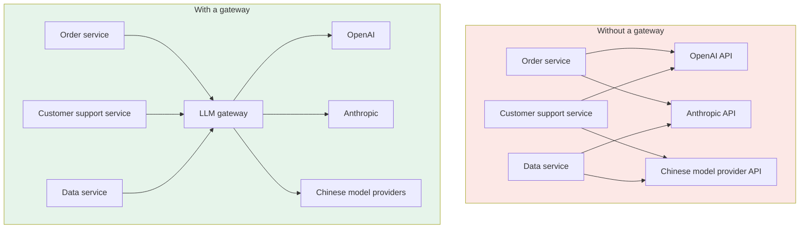
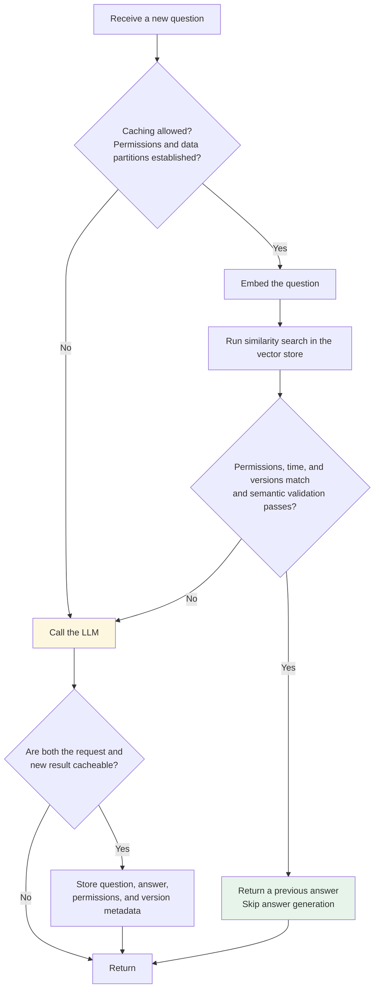

# Chapter 14: LLM Gateways

## 14.1 What a Gateway Is and Where It Fits

Start with its position in the system.



A gateway is **an intermediary between applications and model APIs**. Applications know the gateway rather than integrating directly with multiple providers.

That position determines what it is best suited to handle: **because all traffic passes through it, cross-cutting concerns such as authentication, routing, rate limiting, and observability can be managed centrally.**

## 14.2 Five Problems without a Gateway

An AI product of any meaningful size commonly uses several models: a high-end model for the main workflow, a small model for cost-sensitive tasks, another provider for coding, and yet another model for embeddings. Each has different SDKs, authentication, and parameter formats. Without a gateway, these differences **spread into every business service**.

### 14.2.1 Scattered API Keys

Keys are scattered across service configuration files, and a leak in any one of them becomes a security incident.

For example, once a long-lived key has been copied to a developer's machine or a document, an employee leaving the company does not automatically invalidate it. Manage keys centrally, constrain their uses and budgets, and support rotation and revocation.

### 14.2.2 Duplicated Work and Inconsistent Versions

Each service implements retries and rate limiting separately, making inconsistent policies likely. Retries may even stack across SDK, business, and gateway layers, amplifying pressure on the upstream service.

### 14.2.3 Opaque Costs

Without consistent model, usage, and tenant labels in service logs, costs are difficult to allocate. Centralized observability can standardize accounting, but the records must still be reconciled against provider invoices.

### 14.2.4 Model Changes Require Code Changes

Want to move a task from model A to model B? Change code, test, and release. Want to A/B test model quality? Repeat the process.

### 14.2.5 Uncontrolled Quotas

A runaway batch job can exhaust shared upstream RPM/TPM limits, concurrency allowances, or spending budgets. These are different constraints: “local budget exhausted” must not be treated as the same error as “provider rate limit reached.”

Budgets need server-side enforcement, not just cooperation from callers.

### 14.2.6 One Underlying Cause

These problems look separate, but all point to the same issue:

> **Without one place to manage them, every business service has to handle its own share.**

This is also why an LLM gateway is not equivalent to an Nginx reverse proxy. Nginx can forward traffic, but does not understand tokens, model semantics, or prompts.

## 14.3 Seven Core Gateway Capabilities

### 14.3.1 A Unified Interface for Multiple Models

Most LLM gateways expose an **OpenAI-compatible interface**. Business code calls it as though calling OpenAI:

The following example shows client configuration, not gateway deployment. It requires a reachable gateway, a configured logical model, and a virtual key in the environment. The Chinese user message asks the model to explain the difference between a tool call and tool execution.

```python
import os
from openai import OpenAI

# Only valid if the gateway supports this API subset.
client = OpenAI(
    base_url="https://llm-gateway.internal/v1",  # Replace with the gateway URL.
    api_key=os.environ["LLM_GATEWAY_API_KEY"],
)

# Logical models and parameters still need compatibility tests.
resp = client.chat.completions.create(
    model="chat-default",       # Logical model name, not a provider model name.
    messages=[{"role": "user", "content": "请解释工具调用与工具执行的区别。"}],
)
```

Notice that `model` receives a **logical name**, `chat-default`. The gateway chooses the actual provider according to its routing configuration.

Business code therefore sees only the logical model name. A/B testing, cost optimization, and model replacement usually do not require business-code changes.

“OpenAI-compatible” must be backed by a capability matrix covering Chat Completions/Responses, streaming events, tool-call IDs, the supported strict Schema subset, reasoning state, multimodal inputs and outputs, usage, and error formats. Unsupported fields must not be silently discarded: reject the request, degrade explicitly, or route to a compatible deployment. HTTP 200 does not prove that tool semantics were preserved.

### 14.3.2 Load Balancing and Failover

Model APIs are not 100% reliable: occasional 503s occur, regional endpoints time out, and peak traffic triggers rate limits.

A gateway can map one logical model name to several routes:

The following is conceptual routing pseudoconfiguration, not YAML that a particular gateway can load directly. The model names are examples, not current model recommendations.

```yaml
model_list:
  - model_name: chat-default
    provider: openai
    model: gpt-4o
    priority: 1
  - model_name: chat-default
    provider: azure          # Another deployment of the same model.
    model: gpt-4o
    priority: 2
  - model_name: chat-default
    provider: anthropic      # Cross-provider fallback.
    model: claude-sonnet-4
    priority: 3
```

When consecutive primary-route failures reach a threshold, traffic switches automatically to a backup route, usually without changes to business code.

Failover requires more than comparing output quality. Model snapshots, API features, data regions, retention policies, tool authorization, and context capacity must also match. Even models with the same name can have different APIs or safety policies on different platforms.

#### Streaming and Tool Calls Cannot Be Retried Transparently without Limits

- Even before content has been delivered to a user or executor, first establish that the upstream service has not produced non-repeatable side effects, then retry recoverable errors within the budget. Platform-hosted tools may already have executed upstream; whether a call item arrived locally is not sufficient evidence. Honor `Retry-After`, backoff, and jitter, and distinguish short-lived rate limits, exhausted quotas, and non-retryable parameter errors.
- Once streaming fragments have been delivered, do not append a different model's continuation directly to them. Explicitly terminate the failed response, or restart according to the product's defined behavior and inform the user. Retain the attempt ID.
- After tools have executed—especially writes—switching models must not replay the entire call chain. First check business state, idempotency keys, and call IDs. A gateway retrying a model request does not make tool execution exactly-once.
- Propagate cancellation and bound both the maximum number of attempts and the overall deadline. Independent retries at every layer can amplify exponentially. Circuit breakers should distinguish failing deployments, models, and the entities to which rate limits apply.

### 14.3.3 Rate Limits and Quotas

Budgets can be assigned to team-specific virtual keys, while keeping request frequency, token rate, concurrency, daily spending, and per-task caps distinct. When output usage is unknown in advance, reserve an upper bound first and settle the actual usage afterward; reconcile usage after abnormal stream disconnections.

A local key can be rejected independently when it exceeds its budget. However, teams can still affect one another if they share upstream organization quotas, connection pools, or compute resources. Hierarchical limits, fair scheduling, and resource reservations where needed are required; complete isolation cannot be promised.

### 14.3.4 Cost Tracking and Observability

A gateway centrally records token usage, response times, and error rates for each call, helping answer questions such as:

- Which endpoint costs the most?
- How much did the engineering and product teams each use?
- What is each model's P95 response time?

Also distinguish time to first token, intervals between outputs, total duration, retry counts, and final success rate. Break tokens down according to provider billing categories, such as input, cached input, output, and reasoning. Record the model price table and the version of the cost calculation as well.

Usage fields can overlap: reasoning tokens, for example, may already be included in total output tokens. Follow the provider's billing definitions rather than adding every field together. Failed attempts can also consume billable usage.

The gateway can collect model-call metrics, but it does not know whether a tool actually succeeded or whether an answer solved the business problem. The agent layer still needs trace correlation and business metrics. Minimize logs by default rather than unconditionally storing every prompt and tool result.

### 14.3.5 Prompt Security and Content Filtering

Centralize input and output checks at the gateway:

| Check | What it guards against |
|---|---|
| Prompt-injection detection | Users attempting to hijack model behavior through specially crafted instructions |
| PII filtering | Sending national ID numbers or phone numbers to external APIs |
| Content-safety moderation | Inputs and outputs that violate policy |

A common entry point makes policy updates easier, but injection detection has false negatives, PII filtering has false positives, and traffic that bypasses the gateway is unprotected. Object-level authorization, tool-execution sandboxes, and business approvals must still be enforced at the actual execution boundary. Streaming content already delivered before moderation cannot be recalled, so the buffering-versus-latency tradeoff must be explicit.

### 14.3.6 Semantic Caching

This capability particularly clearly distinguishes an LLM gateway from an ordinary API gateway.

HTTP caching works through cache keys, methods, and rules such as `Vary`, not by comparing entire requests character for character. LLM applications can also cache exact matches on normalized requests. Semantic caching adds similarity-based retrieval of candidate answers:

> “北京今天热吗” / “北京现在天气怎样” / “今天北京气温多少”
>
> These Chinese questions ask “Is Beijing hot today?”, “What is the weather like in Beijing now?”, and “What is the temperature in Beijing today?”

The questions look similar, but different cities, times, user preferences, or data versions can make reuse invalid. Semantic similarity only identifies candidates; it cannot determine a cache hit by itself.



**Two engineering details matter especially:**

**First, false-hit risk.** Do not copy another system's threshold without evaluation:

| Threshold | Consequence |
|---|---|
| Too strict | Lower recall; added embedding and retrieval costs may not be worthwhile |
| Too permissive | Questions with different entities, negations, or time ranges may produce false hits |
| Calibration method | Fix the embedding model and distance definition, then use positive and negative examples to evaluate incorrect-answer reuse, hit rate, and benefit |

**Second, cache lifetime.** Requirements vary greatly by content:

- Invalidate real-time information according to source freshness and business requirements; queries with strict real-time needs can bypass the cache entirely.
- FAQ and technical-document answers must also be tied to document versions, ACLs, and update events. A long TTL does not remove the need for validation.

Cache keys or partitions should also cover tenants, user permissions, model and prompt versions, tool definitions, language, and retrieval-data versions. Requests with side effects must not be skipped or replayed merely because their text is similar. A cache hit still incurs embedding, retrieval, validation, and storage costs.

**Good fit:** frequent, repetitive questions, such as those handled by customer-support bots, can achieve high hit rates and substantial savings. **Identify questions requiring personalization or strict real-time information at the gateway and bypass the cache directly.**

> Semantic caching is not the same as [Prompt Caching](../../llm/03-inference-serving/14-kv-cache.md): the former skips the entire model call, while the latter still makes the call but reuses previously computed KV.

### 14.3.7 Centralized API-Key Management

In a centrally managed credential setup, business services use **virtual keys** issued by the gateway and never handle provider keys. BYOK and passthrough modes have different credential paths and must be explicitly disabled or governed.

The benefits go beyond preventing leaks. A virtual key naturally carries quota, cost-allocation, and access-control policies. Issue different keys for teams, projects, or environments, then revoke an individual key without affecting everyone else.

## 14.4 Common Gateway Frameworks

| Framework | Type | Characteristics |
|---|---|---|
| **LiteLLM** | Open-source core in Python, with additional enterprise capabilities | Unified model interfaces and proxy governance; verify support for the specific provider and version |
| **Bifrost** | Open-source core in Go, with additional enterprise capabilities | Model gateway and governance features; do not generalize project-reported benchmarks into universal latency claims |
| **Portkey** | Commercial + open source | Hosted and self-deployed options; check the governance features required |
| **Kong AI Gateway** | Commercial Kong extension | Adds AI capabilities to the established Kong gateway; suitable for teams already using Kong |
| **One API / New API** | Go projects | Focus on model channels, keys, and quotas; check each project's maintenance status and license separately |
| **Envoy AI Gateway** | Open source | Built on Envoy; suitable for teams with an existing service mesh |
| **Custom implementation on Nginx/Envoy** | In-house | Flexible but labor-intensive; suitable for teams with special compliance requirements |

These are starting points for evaluation, not recommendations that eliminate the need to test:

- **Getting started quickly with many model types** → LiteLLM
- **Existing Kong / Envoy infrastructure** → The corresponding AI Gateway extension
- **Primarily Chinese model providers** → The One API family
- **Avoiding self-managed operations** → Hosted offerings such as Portkey

A gateway is a logically centralized entry point; whether it becomes a single point of failure depends on deployment. Multiple replicas still need coordinated rate-limit counters, consistent budgets, shared caches, and connection draining. Prefer credential services or workload identity where possible, pin dependency and plugin versions, and follow upstream security advisories. The product table is not a feature or performance ranking; verify commercial capabilities and licenses for the versions actually used.

## 14.5 A Gateway Cannot Do Everything

Some responsibilities are outside what a gateway can or should handle:

| What should stay outside the gateway | Reason |
|---|---|
| Business decisions about prompts | Templates may be centrally hosted, but business teams should own content versions, experiments, and releases |
| Complex agent orchestration | Task systems should manage task state and recovery from side effects; the gateway itself may still retain budget, cache, and session state |
| RAG retrieval | Retrieval strategies are closely tied to the business and require access to business data |

A gateway primarily handles **cross-cutting concerns**: authentication, routing, rate limiting, observability, caching, and security. Some products also host prompts or integrate retrieval. The point is not that this is technically impossible, but that business rules and traffic governance should not share a single release and failure boundary.

A gateway adds network, authentication, filtering, logging, and possibly embedding overhead. Load-test the bare proxy path separately from paths with governance and caching enabled. Report load, concurrency, payload size, and p50/p95/p99. Do not claim a fixed millisecond overhead or call it negligible without those conditions.

## 14.6 Common Mistakes

### 14.6.1 Equating an LLM Gateway with an Nginx Reverse Proxy

Nginx forwards traffic, but **does not understand tokens, model semantics, or prompts**. Token-priced quotas, semantic caching, prompt-injection detection, and cost allocation all need additional understanding of LLM semantics.

### 14.6.2 Talking Only about Load Balancing

Load balancing is just one capability. A fuller view includes a unified interface, failover, centralized key management, team quotas, cost tracking, security filtering, and semantic caching.

### 14.6.3 Failing to Distinguish Semantic Caching from Ordinary Caching

Exact caching matches normalized keys. Semantic caching uses methods such as vector similarity to find candidates, then must check entities, time, permissions, and data versions. State whether a threshold measures similarity or distance: raising a similarity threshold usually makes matching stricter, while raising the maximum allowed distance makes it more permissive.

### 14.6.4 Enabling Semantic Caching Indiscriminately

A user's order status cannot be reused just because a question sounds similar. Personalized answers need permission partitions and reliable state invalidation. Strict real-time requirements generally call for bypassing answer caches. FAQ answers must also be tied to document versions and evaluated for false-hit rates; benefits cannot be assumed.

### 14.6.5 Ignoring Quality Consistency in Cross-Provider Failover

Cross-provider switching requires checks on tools, reasoning state, context, and data policies, not just output style. Multiple deployments of the same model do not guarantee identical interfaces. If opaque reasoning items cannot be migrated, the interaction cannot simply continue unchanged: fail explicitly or let the application define an auditable restart process.

### 14.6.6 Ignoring the Gateway's Own Single-Point-of-Failure Risk

A single-instance failure can interrupt every call passing through it, while centralized credentials make it a high-value attack target. Beyond multiple replicas, address shared-budget and cache consistency, common-cause upstream failures, connection draining, and credential isolation. More replicas alone do not eliminate a single point of failure.

### 14.6.7 Stuffing Business Logic into the Gateway

Do not put all business decisions, agent-task recovery, and RAG retrieval strategies into the traffic gateway. A product may integrate these features, but they should retain separate versioning, permissions, state, and operational ownership.

## 14.7 Chapter Summary

1. **A gateway can govern model API traffic that passes through it**; prevent bypass requests from escaping quotas and auditing.
2. **The five problems share one cause: no central management**—scattered keys, duplicated work, opaque costs, code changes for model switches, and uncontrolled quotas.
3. **An ordinary reverse proxy does not automatically adapt model semantics**; token, tool, reasoning, and cost handling require additional implementation.
4. **The seven core capabilities** are a unified interface, failover, quotas and rate limits, cost tracking, security filtering, semantic caching, and centralized key management.
5. **Semantic caching first validates permissions and semantic conditions**; calibrate similarity thresholds for the embedding model and workload.
6. **Caches need time-, data-, and permission-based invalidation**; even stable content is not trustworthy forever.
7. **A gateway is a central entry point, not necessarily a single point of failure**; it needs multiple replicas, state consistency, and credential isolation.
8. **Its primary scope is cross-cutting concerns**; even when prompt hosting or retrieval is integrated, avoid tight coupling to business decisions and task state.

## References

- [LiteLLM Documentation](https://docs.litellm.ai/)
- [LiteLLM GitHub](https://github.com/BerriAI/litellm)
- [Bifrost Official Repository (Go Implementation)](https://github.com/maximhq/bifrost)
- [LiteLLM Retries and Failover](https://docs.litellm.ai/docs/proxy/reliability)
- [RFC 9111: HTTP Caching](https://www.rfc-editor.org/rfc/rfc9111)
- [Portkey AI Gateway](https://github.com/Portkey-AI/gateway)
- [Kong AI Gateway](https://konghq.com/products/kong-ai-gateway)
- [Envoy AI Gateway](https://aigateway.envoyproxy.io/)
- [Langfuse: LLM Observability](https://langfuse.com/docs)
- [OWASP Top 10 for LLM Applications](https://genai.owasp.org/llm-top-10/)
