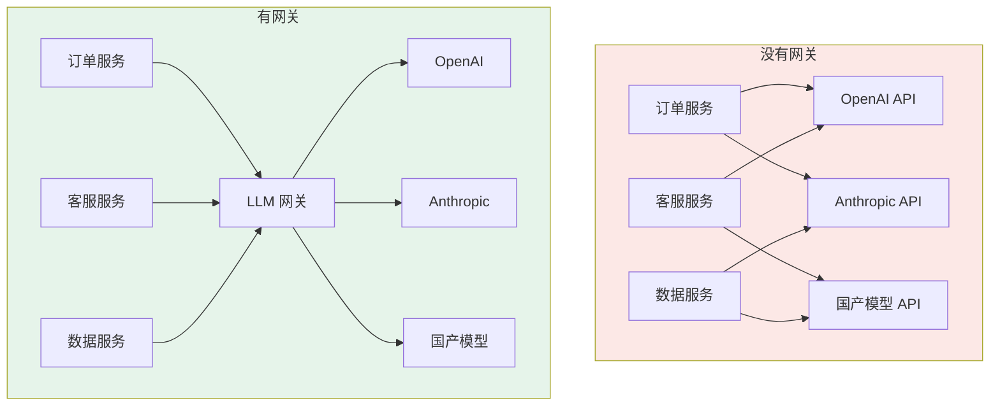
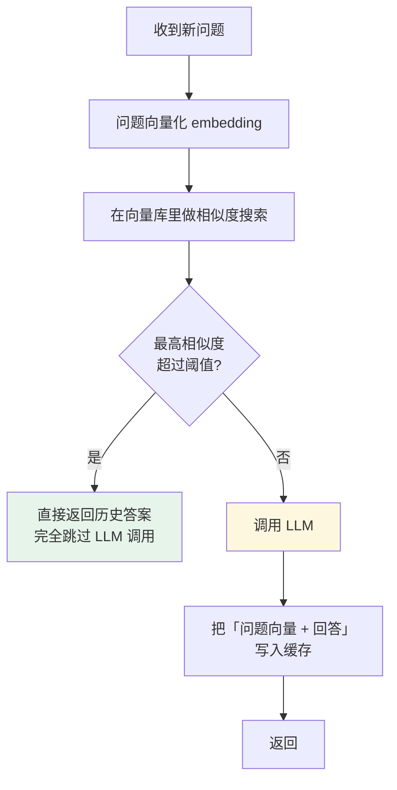

# 第十四章：LLM 网关

## 14.1 网关是什么，放在哪

先看它在系统里的位置。



网关就是**坐在应用和各模型 API 之间的中间人**。应用只认识网关，不直接对接多个厂商。

位置决定了它最适合处理什么问题：**所有流量都会经过这里，所以认证、路由、限流、观测这类横切关注点适合集中收口。**

## 14.2 没有网关时的五个痛点

一个稍具规模的 AI 产品同时用多个模型是常态：主流程用高端模型，成本敏感任务用小模型，代码任务换一家，向量化又是另一个模型。每家的 SDK、鉴权方式、参数格式都有差异。不做网关，这些差异会**渗透到每个业务服务里**。

### 14.2.1 API Key 散落

Key 散在各服务的配置文件里，任何一处泄露都是安全事故。

一个真实的场景：某工程师离职，他存在本地开发机或内部文档里的 Key 没及时清理，两周后被扫到，拿去跑批量请求——**几千美元的账单是一个晚上就能烧出来的**。

### 14.2.2 重复劳动且版本不一

每个服务各写一套重试和限流逻辑。同一个逻辑（比如「429 要指数退避重试」）A 服务写对了、B 服务写错了，出问题时要先花半小时搞清楚是哪个服务的重试逻辑在作怪。

### 14.2.3 成本黑箱

想知道这个月花了多少钱、哪个团队用得最多？没法统计，因为各服务各记各的。月底财务问「这笔三万美元的账单分摊给哪个业务线」，你只能两手一摊。

### 14.2.4 换模型要改代码

想把某个任务从 A 模型换成 B 模型？改代码、测试、发版。A/B 测试模型效果？再来一遍。

### 14.2.5 配额无法管控

周五下班前某工程师无意中跑了个死循环脚本，一晚上吃光下周的 token 预算，周一用户打开产品全是 429。

**这种事一年只要发生一次，你就会明白配额管理不能指望各服务自觉。**

### 14.2.6 根本原因是同一个

这几个痛点看起来分散，其实都指向同一个问题：

> **这些问题没有统一收口，结果就是每个业务服务都得各管一摊。**

这也是为什么 LLM 网关不能等同于 Nginx 反向代理——Nginx 能做流量转发，但不理解 token、不理解模型语义、不理解 prompt。

## 14.3 网关的七项核心能力

### 14.3.1 多模型统一接口

大多数 LLM 网关对外暴露一个 **OpenAI 兼容接口**。业务代码就像调 OpenAI 一样调它：

```python
# 接入网关只改两处
client = OpenAI(
    base_url="https://llm-gateway.internal/v1",  # 改成网关地址
    api_key="sk-virtual-team-order-xxx",          # 网关分配的虚拟 Key
)

# 其余代码一行不动
resp = client.chat.completions.create(
    model="chat-default",       # 逻辑模型名，不是厂商模型名
    messages=[...],
)
```

注意 `model` 传的是**逻辑名**（`chat-default`），网关根据路由配置决定实际打到哪家。

这样一来，业务层看到的始终只是逻辑模型名。做 A/B 测试、成本优化或模型替换时，通常不用改业务代码。

### 14.3.2 负载均衡与故障转移

模型 API 不是 100% 可靠：会偶发 503，某地区节点会超时，高峰期会被限流。

网关可以给同一个逻辑模型名配多条路由：

```yaml
model_list:
  - model_name: chat-default
    provider: openai
    model: gpt-4o
    priority: 1
  - model_name: chat-default
    provider: azure          # 同一个模型的另一个部署
    model: gpt-4o
    priority: 2
  - model_name: chat-default
    provider: anthropic      # 跨厂商兜底
    model: claude-sonnet-4
    priority: 3
```

主路由连续失败达到阈值时自动切到备用路由，业务代码通常不需要跟着改。

> 注意跨厂商兜底有个前提：两个模型的能力和输出风格要足够接近，否则故障转移会带来质量抖动。工程上更稳的做法是同一模型的多个部署（如 OpenAI + Azure OpenAI）优先，跨厂商作为最后一层。

### 14.3.3 限流与配额

给每个团队的虚拟 Key 设独立的 token 日预算：研发团队每天 100 万，产品团队每天 50 万。

某个团队超配额时，**只有该 Key 的请求返回 429，其他团队完全不受影响**。这就把 14.2.5 那个「死循环脚本吃光全公司预算」的事故封在了单个 Key 里。

### 14.3.4 成本追踪与可观测性

网关集中记录每次调用的 token 用量、响应时间、错误率，这让你能回答：

- 哪个接口最烧钱？
- 研发团队和产品团队各用了多少？
- 各模型的 P95 响应时间分别是多少？

有了这些数据，**成本优化才有依据**——比如发现某个接口消耗了 40% 的 token，但实际上可以用便宜得多的模型替代。

网关通常可直接对接 Langfuse、Prometheus 等监控系统，**不需要在业务代码里手动埋点**。

### 14.3.5 Prompt 安全与内容过滤

在网关层统一做输入输出校验：

| 检查项 | 防什么 |
|---|---|
| Prompt 注入检测 | 用户通过特殊指令劫持模型行为 |
| PII 过滤 | 身份证号、手机号被发送到外部 API |
| 内容安全审核 | 违规输入输出 |

集中做的好处是**安全策略统一更新，任何接入点自动获得保护**——「有一个服务漏了检测」这种事不会再发生。

### 14.3.6 语义缓存

这类能力最能体现 LLM 网关和普通 API 网关的区别。

**普通 HTTP 缓存是精确匹配**，请求一字不差才命中。但 LLM 的问题有大量语义相近的变体：

> 「北京今天热吗」/「北京现在天气怎样」/「今天北京气温多少」

三个问题本质上是同一个需求，精确匹配全部 miss，每次都要打底层模型——三次完整的 LLM 调用费用。



**两个关键工程细节：**

**一是相似度阈值**，这是最重要的调参点：

| 阈值 | 后果 |
|---|---|
| 太高（0.99） | 基本只有一模一样的问题才命中，缓存形同虚设 |
| 太低（0.7） | 「北京今天热吗」命中「上海今天热吗」的答案，答非所问 |
| **0.85–0.95** | 通常的调试区间，具体看场景和用户提问多样性 |

**二是缓存有效期**，不同内容差别极大：

- 天气、股价这类实时信息：几分钟，过期必须重查；
- 产品 FAQ、技术文档：几天甚至更长都没问题。

**适用场景**：高频重复问答（如客服机器人），命中率可以很高，省下的费用可观。**需要个性化或强实时性的问答要在网关层识别出来直接绕过缓存。**

> 语义缓存和 [Prompt Caching](../../llm/03-inference-serving/14-kv-cache.md) 不是一回事：前者是「跳过整次调用」，后者是「调用照做但复用已计算的 KV」。

### 14.3.7 API Key 集中管理

业务服务拿到的是网关分配的**虚拟 Key**，根本接触不到真实密钥。

好处不只是防泄漏：虚拟 Key 天然就是配额、成本归属、权限控制的载体——你可以按团队、按项目、按环境发不同的 Key，随时吊销单个 Key 而不影响其他人。

## 14.4 常见网关框架

| 框架 | 类型 | 特点 |
|---|---|---|
| **LiteLLM** | 开源，Python | 支持上百个模型，OpenAI 兼容接口，社区最活跃，功能最全 |
| **Bifrost** | 开源，Rust | 主打高性能低延迟，适合对吞吐要求高的场景 |
| **Portkey** | 商业 + 开源 | 功能完整，有托管版，适合不想自运维的团队 |
| **Kong AI Gateway** | 商业（Kong 扩展） | 基于成熟的 Kong 网关扩展 AI 能力，适合已有 Kong 的团队 |
| **One API / New API** | 开源，Go | 国内社区活跃，对国产模型支持好，部署简单 |
| **Envoy AI Gateway** | 开源 | 基于 Envoy，适合已有 service mesh 的团队 |
| **自研（Nginx/Envoy 之上）** | 自研 | 灵活但工作量大，适合有特殊合规需求的团队 |

选型建议：

- **快速起步、模型种类多** → LiteLLM
- **已有 Kong / Envoy 基础设施** → 对应的 AI Gateway 扩展
- **国产模型为主** → One API 系
- **不想自运维** → Portkey 等托管方案

不管选哪个，**网关是整条链路上的单点**，务必做好这几件事：多副本部署、健康检查、锁定依赖版本并关注上游安全公告（开源网关是典型的供应链攻击目标，因为它手里握着所有真实 API Key）。

## 14.5 网关不是万能的

有几件事网关做不了或不该做：

| 不该放进网关 | 原因 |
|---|---|
| 业务 prompt 模板 | 属于业务逻辑，放网关会让网关变成业务耦合点 |
| 复杂的 Agent 编排 | 网关是无状态转发层，多轮状态管理不是它的职责 |
| RAG 检索 | 检索策略与业务强相关，且需要访问业务数据 |

网关的边界应该是**横切关注点**：认证、路由、限流、观测、缓存、安全。一旦开始往里塞业务逻辑，它就从「基础设施」退化成了「另一个需要跟着业务发版的服务」。

另外，**网关会增加一跳延迟**（通常几毫秒到几十毫秒）。对绝大多数 LLM 调用（动辄数百毫秒到数秒）这可以忽略，但对延迟极度敏感的场景要实测评估。

## 14.6 常见错误

### 14.6.1 把 LLM 网关等同于 Nginx 反向代理

Nginx 能转发流量，但**不理解 token、不理解模型语义、不理解 prompt**。按 token 计费的配额、语义缓存、prompt 注入检测、成本归属——这些都需要理解 LLM 语义才能做。

### 14.6.2 只说负载均衡

负载均衡只是其中一项。更完整的视角还包括：统一接口、故障转移、Key 集中管理、按团队配额、成本追踪、安全过滤、语义缓存。

### 14.6.3 说不清语义缓存与普通缓存的区别

普通缓存是精确匹配，语义缓存是**向量相似度匹配**。而且要能说出阈值调参这个关键点——太高等于没有缓存，太低会答非所问。

### 14.6.4 语义缓存无差别开启

需要个性化或强实时性的问答必须绕过缓存。给客服 FAQ 开缓存很划算，给「查一下我的订单状态」开缓存是事故。

### 14.6.5 跨厂商故障转移不考虑质量一致性

自动从 A 厂商切到 B 厂商，业务层无感知——但输出风格和能力可能明显不同。优先用同一模型的多个部署做兜底。

### 14.6.6 忽略网关自身的单点风险

所有流量都过网关，它挂了整个 AI 能力就没了。而且它握着所有真实 Key，是供应链攻击的高价值目标。多副本 + 版本锁定 + 关注安全公告是基本要求。

### 14.6.7 往网关里塞业务逻辑

Prompt 模板、Agent 编排、RAG 检索都不该进网关。网关只管横切关注点。

## 14.7 本章总结

1. **网关是应用与模型 API 之间的中间人**，集中拦截所有流量，所以能统一处理横切关注点；
2. **五个痛点源自同一个原因**：没有集中管理的地方——Key 散落、重复造轮子、成本黑箱、换模型要改代码、配额失控；
3. **它不等于 Nginx**：Nginx 不理解 token、不理解 prompt、不理解模型语义；
4. **七项核心能力**：统一接口、故障转移、配额限流、成本追踪、安全过滤、语义缓存、Key 集中管理；
5. **语义缓存是最有代表性的能力**，用向量相似度替代精确匹配，阈值通常调在 0.85–0.95；
6. **语义缓存要区分内容类型**：实时信息短 TTL 或绕过，稳定知识可长期缓存；
7. **网关是单点**，要多副本、锁版本、关注安全公告——它握着所有真实 Key；
8. **边界是横切关注点**，业务 prompt、Agent 编排、RAG 检索不该进网关。

> **可以把它理解成一个懂模型语义的统一入口：请求当然会从这里转发，但更大的价值在于把 Key 管理、配额、成本、安全、缓存这些重复问题集中治理。**

## 参考资料

- [LiteLLM 文档](https://docs.litellm.ai/)
- [LiteLLM GitHub](https://github.com/BerriAI/litellm)
- [Portkey AI Gateway](https://github.com/Portkey-AI/gateway)
- [Kong AI Gateway](https://konghq.com/products/kong-ai-gateway)
- [Envoy AI Gateway](https://aigateway.envoyproxy.io/)
- [Langfuse: LLM 可观测性](https://langfuse.com/docs)
- [OWASP Top 10 for LLM Applications](https://genai.owasp.org/llm-top-10/)
