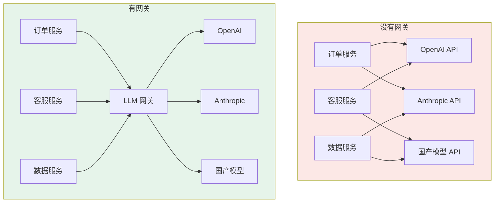
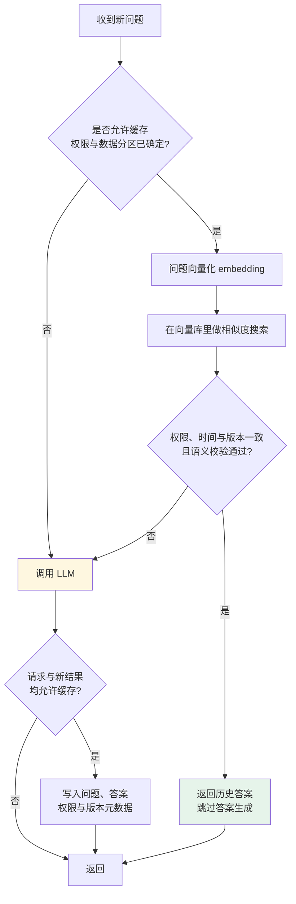

# 第十四章：LLM 网关

## 14.1 网关是什么，放在哪

先看它在系统里的位置。



网关就是**坐在应用和各模型 API 之间的中间人**。应用只认识网关，不直接对接多个厂商。

位置决定了它最适合处理什么问题：**所有流量都会经过这里，所以认证、路由、限流、观测这类横切关注点适合集中收口。**

## 14.2 没有网关时的五个痛点

一个稍具规模的 AI 产品同时用多个模型是常态：主流程用高端模型，成本敏感任务用小模型，代码任务换一家，向量化又是另一个模型。每家的 SDK、鉴权方式、参数格式都有差异。不做网关，这些差异会**渗透到每个业务服务里**。

### 14.2.1 API Key 散落

Key 散在各服务的配置文件里，任何一处泄露都是安全事故。

例如，长期 Key 被复制到开发机或文档后，人员离岗并不会自动使其失效。应集中管理、限制用途和预算，并支持轮换与撤销。

### 14.2.2 重复劳动且版本不一

每个服务各写重试和限流，容易出现策略不一致，甚至 SDK、业务层、网关三层叠加重试，放大上游压力。

### 14.2.3 成本黑箱

若各服务日志没有统一模型、用量与租户标签，就难以分摊成本。集中观测可以统一口径，也需和供应商账单对账。

### 14.2.4 换模型要改代码

想把某个任务从 A 模型换成 B 模型？改代码、测试、发版。A/B 测试模型效果？再来一遍。

### 14.2.5 配额无法管控

失控批处理可能耗尽共享的上游 RPM/TPM、并发额度或支出预算。这几种限制不同，不能把“本地预算用完”和“供应商限流”混作一个错误。

预算需要服务端强制执行，而不是只靠调用方自律。

### 14.2.6 根本原因是同一个

这几个痛点看起来分散，其实都指向同一个问题：

> **这些问题没有统一收口，结果就是每个业务服务都得各管一摊。**

这也是为什么 LLM 网关不能等同于 Nginx 反向代理——Nginx 能做流量转发，但不理解 token、不理解模型语义、不理解 prompt。

## 14.3 网关的七项核心能力

### 14.3.1 多模型统一接口

大多数 LLM 网关对外暴露一个 **OpenAI 兼容接口**。业务代码就像调 OpenAI 一样调它：

下面展示客户端配置；运行前需有可访问的网关、已配置的逻辑模型及环境变量中的虚拟 Key，不包含网关部署过程。

```python
import os
from openai import OpenAI

# 仅适用于网关支持这一 API 子集的情况
client = OpenAI(
    base_url="https://llm-gateway.internal/v1",  # 改成网关地址
    api_key=os.environ["LLM_GATEWAY_API_KEY"],
)

# 逻辑模型与参数仍需做兼容性测试
resp = client.chat.completions.create(
    model="chat-default",       # 逻辑模型名，不是厂商模型名
    messages=[{"role": "user", "content": "请解释工具调用与工具执行的区别。"}],
)
```

注意 `model` 传的是**逻辑名**（`chat-default`），网关根据路由配置决定实际打到哪家。

这样一来，业务层看到的始终只是逻辑模型名。做 A/B 测试、成本优化或模型替换时，通常不用改业务代码。

“OpenAI 兼容”必须落到能力矩阵：Chat Completions/Responses、流式事件、工具调用 ID、strict Schema 子集、reasoning 状态、多模态、usage 与错误格式。不能静默丢弃不支持的字段；应拒绝、显式降级或路由到兼容部署。HTTP 200 不证明工具语义被完整保留。

### 14.3.2 负载均衡与故障转移

模型 API 不是 100% 可靠：会偶发 503，某地区节点会超时，高峰期会被限流。

网关可以给同一个逻辑模型名配多条路由：

以下是路由概念伪配置，不是某个网关可直接加载的 YAML；模型名也是示例，不代表当前推荐型号。

```yaml
model_list:
  - model_name: chat-default
    provider: openai
    model: gpt-4o
    priority: 1
  - model_name: chat-default
    provider: azure          # 同一个模型的另一个部署
    model: gpt-4o
    priority: 2
  - model_name: chat-default
    provider: anthropic      # 跨厂商兜底
    model: claude-sonnet-4
    priority: 3
```

主路由连续失败达到阈值时自动切到备用路由，业务代码通常不需要跟着改。

故障转移不仅要比较输出质量，还要匹配模型快照、接口功能、数据地域、保留政策、工具授权和上下文容量。同名模型在不同平台也可能有 API 或安全策略差异。

#### 流式与工具调用不能透明重试到底

- 未向用户或执行器交付内容前，也要先确认上游没有不可重复的副作用，再在预算内重试可恢复错误；平台托管工具可能已在上游执行，不能只看本地是否收到调用项。遵循 `Retry-After`、退避与抖动，区分短时限流、配额耗尽和不可重试的参数错误。
- 已交付流式片段后，不应把另一家模型的续写直接拼接上去。要显式结束失败的响应，或按产品定义重启并告知用户，保留 attempt ID。
- 已执行工具尤其是写操作后，换模型不能重放整段调用链。先核对业务状态、幂等键和调用 ID；网关重试模型请求并不等于工具执行具备 exactly-once。
- 传播取消、限制最大尝试次数和总 deadline，避免每层独立重试导致指数放大。熔断应区分故障的部署、模型和限流主体。

### 14.3.3 限流与配额

可按团队虚拟 Key 设置预算，同时区分请求频率、token 速率、并发、日支出与单任务上限。输出用量事前未知时，可先预留上界、结束后结算，异常断流再对账。

本地 Key 超预算可以独立拒绝，但若多个团队共享上游组织配额、连接池或计算资源，仍会相互影响。需要分层限流、公平调度和必要的资源预留，不能承诺完全隔离。

### 14.3.4 成本追踪与可观测性

网关集中记录每次调用的 token 用量、响应时间、错误率，这让你能回答：

- 哪个接口最烧钱？
- 研发团队和产品团队各用了多少？
- 各模型的 P95 响应时间分别是多少？

再区分首 token 延迟、输出间隔、总时长、重试次数和最终成功率；token 还应分输入、缓存输入、输出和 reasoning 等提供方计费项。模型价格表与计算版本也要记录。

这些用量字段可能存在包含关系，例如 reasoning token 已包含在总输出 token 中。应按提供方账单口径计费，不能把所有字段直接相加；失败尝试也可能产生用量。

网关可采集模型调用指标，但不知道工具执行是否真正成功、答案是否解决业务问题。Agent 层仍需 trace 关联和业务指标；日志默认最小化，不应无条件保存全部 prompt 或工具结果。

### 14.3.5 Prompt 安全与内容过滤

在网关层统一做输入输出校验：

| 检查项 | 防什么 |
|---|---|
| Prompt 注入检测 | 用户通过特殊指令劫持模型行为 |
| PII 过滤 | 身份证号、手机号被发送到外部 API |
| 内容安全审核 | 违规输入输出 |

统一入口便于策略更新，但注入检测有漏报、PII 过滤有误报，绕过网关的流量也不受保护。对象级授权、工具执行沙箱及业务审批仍在实际执行边界落实；流式内容在审核前已交付时无法撤回，要明确缓冲与延迟取舍。

### 14.3.6 语义缓存

这类能力最能体现 LLM 网关和普通 API 网关的区别。

HTTP 缓存按缓存键、方法及 `Vary` 等规则工作，不是逐字比较整个请求。LLM 应用也可对规范化请求做精确缓存；语义缓存额外使用相似度检索候选答案：

> 「北京今天热吗」/「北京现在天气怎样」/「今天北京气温多少」

这些问题看似接近，但城市、时间、用户偏好或数据版本不同就未必可复用。语义相似只是候选条件，不能单独决定命中。



**两个关键工程细节：**

**一是误命中风险**，不应照抄其他系统的阈值：

| 阈值 | 后果 |
|---|---|
| 阈值过严 | 召回下降，额外 embedding/检索成本可能不值得 |
| 阈值过宽 | 实体、否定词、时间范围不同的问题可能误命中 |
| 校准方法 | 固定 embedding 模型与距离定义，用正反例评估错误答案复用率、命中率及收益 |

**二是缓存有效期**，不同内容差别极大：

- 实时信息应按数据源时效和业务要求失效，强实时查询可直接绕过；
- FAQ/技术文档也要绑定文档版本、ACL 和更新事件，不能只设长 TTL 就不再验证。

缓存键或分区还应覆盖租户、用户权限、模型及 prompt 版本、工具定义、语言和检索数据版本。带副作用的请求不能因文本相似而跳过或重放。命中缓存仍有 embedding、检索、验证与存储成本。

**适用场景**：高频重复问答（如客服机器人），命中率可以很高，省下的费用可观。**需要个性化或强实时性的问答要在网关层识别出来直接绕过缓存。**

> 语义缓存和 [Prompt Caching](../../llm/03-inference-serving/14-kv-cache.zh.md) 不是一回事：前者是「跳过整次调用」，后者是「调用照做但复用已计算的 KV」。

### 14.3.7 API Key 集中管理

集中托管模式下，业务服务使用网关分配的**虚拟 Key**，不接触提供方密钥；BYOK 或 passthrough 模式则有不同的密钥路径，需明确禁用或治理。

好处不只是防泄漏：虚拟 Key 天然就是配额、成本归属、权限控制的载体——你可以按团队、按项目、按环境发不同的 Key，随时吊销单个 Key 而不影响其他人。

## 14.4 常见网关框架

| 框架 | 类型 | 特点 |
|---|---|---|
| **LiteLLM** | 开源核心，Python；另有企业能力 | 统一模型接口与代理治理，需核查具体 provider 与版本支持 |
| **Bifrost** | 开源核心，Go；另有企业能力 | 提供模型网关与治理功能；不能把项目自报 benchmark 当通用延迟结论 |
| **Portkey** | 商业 + 开源 | 提供托管与自部署路径，按所需治理功能核查 |
| **Kong AI Gateway** | 商业（Kong 扩展） | 基于成熟的 Kong 网关扩展 AI 能力，适合已有 Kong 的团队 |
| **One API / New API** | Go 项目 | 关注模型渠道、密钥与额度管理；分别核查维护状态及许可证 |
| **Envoy AI Gateway** | 开源 | 基于 Envoy，适合已有 service mesh 的团队 |
| **自研（Nginx/Envoy 之上）** | 自研 | 灵活但工作量大，适合有特殊合规需求的团队 |

这些是候选方向，不是免评测的推荐排名：

- **快速起步、模型种类多** → LiteLLM
- **已有 Kong / Envoy 基础设施** → 对应的 AI Gateway 扩展
- **国产模型为主** → One API 系
- **不想自运维** → Portkey 等托管方案

网关是逻辑集中入口，是否形成单点取决于部署。多副本还要处理限流计数、预算一致性、共享缓存和连接排空；密钥尽量使用凭据服务或 workload identity，固定依赖与插件版本并关注上游安全公告。产品表不是功能或性能排名，商业能力与许可证需按实际版本核查。

## 14.5 网关不是万能的

有几件事网关做不了或不该做：

| 不该放进网关 | 原因 |
|---|---|
| 业务 prompt 的决策逻辑 | 模板可以集中托管，但内容版本、实验和发布责任应由业务团队掌握 |
| 复杂的 Agent 编排 | 任务状态与副作用恢复应由任务系统管理；网关本身也可能保存预算、缓存及会话状态 |
| RAG 检索 | 检索策略与业务强相关，且需要访问业务数据 |

网关主要处理**横切关注点**：认证、路由、限流、观测、缓存、安全。某些产品也能托管 Prompt 或集成检索；这不是技术上做不到，而是要避免业务规则与流量治理共用一个发布和故障边界。

网关增加网络、鉴权、过滤、日志和可能的 embedding 开销。分别压测空代理、启用治理与缓存的路径，报告负载、并发、报文大小和 p50/p95/p99；不脱离条件给固定毫秒数或宣称可忽略。

## 14.6 常见错误

### 14.6.1 把 LLM 网关等同于 Nginx 反向代理

Nginx 能转发流量，但**不理解 token、不理解模型语义、不理解 prompt**。按 token 计费的配额、语义缓存、prompt 注入检测、成本归属——这些都需要理解 LLM 语义才能做。

### 14.6.2 只说负载均衡

负载均衡只是其中一项。更完整的视角还包括：统一接口、故障转移、Key 集中管理、按团队配额、成本追踪、安全过滤、语义缓存。

### 14.6.3 说不清语义缓存与普通缓存的区别

精确缓存依规范化后的键匹配；语义缓存用向量相似度等方法找候选，还需检查实体、时间、权限和数据版本。阈值应说明使用相似度还是距离：提高相似度门槛通常更严格，提高最大距离门槛却更宽松。

### 14.6.4 语义缓存无差别开启

不能仅凭问题相似就复用用户订单状态。个性化答案需要权限分区与可靠的状态失效机制，强实时要求通常应绕过答案缓存；FAQ 也要绑定文档版本，并评估误命中率，不能默认有收益。

### 14.6.5 跨厂商故障转移不考虑质量一致性

跨厂商切换要校验工具、推理状态、上下文和数据政策，而不只比较输出风格。同模型的多个部署也不保证接口完全一致；若不透明的 reasoning 项不能迁移，就不能原样接续，应明确失败或由应用设计可审计的重启流程。

### 14.6.6 忽略网关自身的单点风险

单实例故障可能中断全部经过它的调用，集中凭据也使其成为高价值攻击目标。多副本之外，还要处理共享预算与缓存的一致性、上游共因故障、连接排空及凭据隔离；仅增加副本不等于消除了单点。

### 14.6.7 往网关里塞业务逻辑

不要把业务决策、Agent 任务恢复和 RAG 检索策略全部塞进流量网关。产品可以集成相关功能，但应保留独立的版本、权限、状态和运维责任。

## 14.7 本章总结

1. **网关可治理经过它的模型 API 流量**，需防止旁路请求绕过配额与审计；
2. **五个痛点源自同一个原因**：没有集中管理的地方——Key 散落、重复造轮子、成本黑箱、换模型要改代码、配额失控；
3. **普通反向代理不自动具备模型语义适配**，需要额外实现 token、工具、推理和费用处理；
4. **七项核心能力**：统一接口、故障转移、配额限流、成本追踪、安全过滤、语义缓存、Key 集中管理；
5. **语义缓存先校验权限与语义条件**，相似度阈值依 embedding 和工作负载校准；
6. **缓存需时间、数据与权限失效机制**，不是稳定内容就永久可信；
7. **网关是集中入口而非必然单点**，需多副本、状态一致性和凭据隔离；
8. **主要边界是横切关注点**，即使集成 Prompt 托管或检索，也要避免与业务决策和任务状态紧耦合。

## 参考资料

- [LiteLLM 文档](https://docs.litellm.ai/)
- [LiteLLM GitHub](https://github.com/BerriAI/litellm)
- [Bifrost 官方仓库（Go 实现）](https://github.com/maximhq/bifrost)
- [LiteLLM 重试与故障转移](https://docs.litellm.ai/docs/proxy/reliability)
- [RFC 9111：HTTP 缓存](https://www.rfc-editor.org/rfc/rfc9111)
- [Portkey AI Gateway](https://github.com/Portkey-AI/gateway)
- [Kong AI Gateway](https://konghq.com/products/kong-ai-gateway)
- [Envoy AI Gateway](https://aigateway.envoyproxy.io/)
- [Langfuse: LLM 可观测性](https://langfuse.com/docs)
- [OWASP Top 10 for LLM Applications](https://genai.owasp.org/llm-top-10/)
