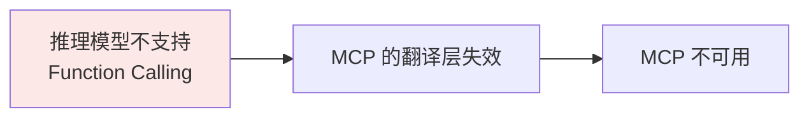
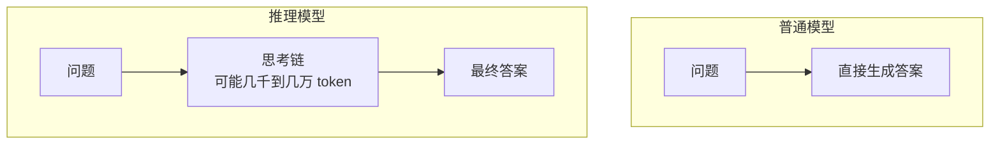

# 第七章：为什么有些推理模型不支持 MCP

## 7.1 问题的传导链

这个问题的答案分两步，第二步比第一步简单：

[第六章](06-mcp-vs-function-calling.md) 讲过，MCP Client 的工作是把 Server 的工具定义转换成模型原生的 Function Calling 格式。这个翻译层是整条链路的关键环节。模型不支持 FC，翻译层就没有落点——工具信息传不进模型，调用请求也生不出来，链路从中间断掉。

所以真正要解释的是第一步：**推理模型为什么早期不支持 Function Calling**。

## 7.2 推理模型特殊在哪

普通模型收到问题就直接生成答案。推理模型（o 系列、DeepSeek-R1、Claude Extended Thinking 等）会先生成一段很长的内部思考链，再基于思考产出答案。

关键在于**思考链是一个连续、有机的整体**：每一步推理都建立在前面所有推理内容之上。这个特性带来了和工具调用的根本冲突。

## 7.3 冲突一：工具调用的本质是「中途暂停」

工具调用天然是多轮的：

1. 模型生成调用请求；
2. **停下来**，等宿主程序执行；
3. 拿到结果；
4. 继续生成。

第二步是问题所在。对普通模型来说这没什么——它的状态很轻，随时可以截断再重启。但对推理模型，这相当于**在思维最活跃的时刻被打断**。

类比一下：你正在写一篇复杂的论证文章，脑子里已经建好了一整套逻辑框架，各论点之间的关系都串起来了。这时电话响了，你去接了 20 分钟，回来坐下——很多细节想不起来了，之前建立的推理脉络断了。

### 7.3.1 「保存状态再恢复不就行了」

技术上可行，代价很大。

模型推理时的中间状态是 **KV Cache**——缓存的注意力计算结果，体积非常庞大。一旦暂停：

| 代价 | 说明 |
|---|---|
| **显存被占住** | 这块 KV Cache 必须原封不动地占着 GPU 显存，工具执行几秒到几十秒，期间不能给别的请求用 |
| **吞吐量腰斩** | 对一个要同时服务上万请求的在线系统，这个占用是承受不了的 |
| **调度复杂度** | 需要区分「正在计算」和「正在等外部 IO」两种状态，推理引擎的调度逻辑复杂度上升 |

更难的是**一致性问题**。思考到一半接入工具结果，等于在模型「想到一半」时改变了输入。模型之前的思路是基于「我还不知道这个结果」建立的，突然结果来了，而且可能和之前的推理**矛盾**——怎么融合？这个「思考状态一致性」问题没有简单解法。

## 7.4 冲突二：训练目标相反

除了生成范式，训练层面的冲突更根本。

| | 推理模型的训练目标 | 工具调用的训练目标 |
|---|---|---|
| 奖励什么 | 思考链完整且结论正确 | 在合适时机**打断自己**，输出结构化 JSON |
| 塑造的倾向 | 一直想、想到底 | 该停就停，切换输出模式 |

这两个目标方向相反。强行把两类数据混着训，会出现三种典型失败模式：

1. **两边都没干好**：思考到一半突然跳出来输出一段 JSON，而且格式还是错的；
2. **彻底偏向一边**：要么思考链缩水变浅退化成普通模型，要么干脆不会输出工具调用；
3. **融合处推理断裂**：工具结果回来之后，后续推理和之前的思考链对不上，答非所问。

所以早期推理模型的选择是**先把推理能力做扎实，工具调用后面再说**。这不是懒得做，是结构性冲突下的工程取舍。

## 7.5 历史事实：哪些模型确实不支持

| 模型 | 时间 | 工具调用支持 |
|---|---|---|
| OpenAI o1-preview | 2024 年 9 月 | **不支持**，官方文档明确标注 |
| OpenAI o1 正式版 | 2024 年 12 月 | 支持 |
| DeepSeek-R1 早期版本 | 2025 年 1 月 | 极弱或没有 |
| o3 / Claude Extended Thinking | 2025 年起 | 支持 |

注意区分 **o1-preview 和 o1 正式版**——这是个容易说错的细节。不支持工具调用的是预览版，三个月后的正式版就加上了。

## 7.6 后来是怎么解决的

### 7.6.1 方案一：思考结束后再调工具

最直接的折中：**让工具调用发生在思考阶段完全结束之后**。

思考过程仍然是一次性完整生成的，推理质量得以保住。

代价很明确：**思考阶段完全感知不到工具结果**。模型只能基于自己的已有知识推理，外部数据只在答案生成阶段才能引入。

对「需要先查到某个数据，再基于这个数据做深度推理」的任务，这个方案有明显局限。但对大多数场景，「先想清楚再调工具」已经够用。

### 7.6.2 方案二：交错思考

Anthropic 后来推出了 **interleaved thinking（交错思考）**：允许模型在多次工具调用**之间**穿插思考，而不是只能在所有思考结束后才调工具。

这在很大程度上缓解了「思考阶段感知不到工具结果」的局限——模型可以边查边想。

代价是每一次工具调用都构成一次思考的中断点，需要推理引擎和 API 层配合处理状态。而且 token 消耗更高，因为思考内容需要在多轮之间被保留和重新传递。

### 7.6.3 方案三：把工具调用训进推理链

2025 年之后更彻底的做法，是在训练阶段就把工具调用作为推理链的**一部分**来训。

思路是：让模型在长思维链的中途插入工具调用，用工具结果继续推理，整条轨迹用**可验证奖励**（最终答案对不对、工具调用成不成功）来做强化学习。ReTool、ToolRL 这类工作走的就是这条路。

这解决的是 [第二章](02-tool-learning.md) 提到的训练目标冲突——不再是把两类数据混着喂，而是把工具调用**内化**成推理过程的一个动作。模型学到的不是「什么时候打断思考」，而是「思考到需要外部信息时，就去拿」。

这也是 2026 年主流模型的方向：推理与工具调用不再是两种对立的能力，而是同一条轨迹里的不同动作。

## 7.7 现在还需要关心这个问题吗

2026 年的现状是**主流推理模型基本都支持工具调用了**，但这个问题依然值得理解，原因有三：

**第一，理解代价在哪**。推理模型的工具调用**成本明显更高**：思考 token 要计费，交错思考模式下思考内容还要跨轮重传。一个在普通模型上几千 token 的 Agent 任务，换到推理模型可能翻好几倍。

**第二，支持程度有差异**。「支持工具调用」是个粗粒度的描述。实际要看：

| 能力 | 说明 |
|---|---|
| 是否支持并行调用 | 有些推理模型只能串行 |
| 是否支持交错思考 | 决定了能不能「边查边想」 |
| 思考内容是否可见 | 有些厂商只返回摘要，影响调试和审计 |
| 多轮工具调用后思考是否连贯 | 长任务里差异明显 |

**第三，选型判断**。不是所有 Agent 任务都该用推理模型。判断标准是：

- 任务的难点在**规划和推理**（复杂问题分解、多步逻辑）→ 推理模型收益大；
- 任务的难点在**执行和调度**（调很多工具、流程清晰）→ 普通模型加显式的 Agent 框架更划算。

在第二类任务上用推理模型，往往是花几倍成本买不到对应的收益。

## 7.8 常见错误

### 7.8.1 说「推理模型不支持 MCP」而不解释传导链

要说清楚：MCP 依赖 FC 做翻译层，推理模型早期不支持 FC，所以 MCP 用不了。直接说不支持 MCP，说明没理解 MCP 的实现机制。

### 7.8.2 说不清冲突的根源

「因为架构不一样」是空话。要能具体说出两条：**生成范式冲突**（思考链是连续整体，工具调用要求中途暂停，KV Cache 占用和状态一致性都是硬成本）和**训练目标冲突**（一个奖励想到底，一个奖励该停就停）。

### 7.8.3 混淆 o1-preview 和 o1 正式版

不支持的是 2024 年 9 月的预览版，12 月的正式版已支持。说成「o1 不支持工具调用」是错的。

### 7.8.4 认为现在还普遍不支持

2026 年主流推理模型都支持了。停留在 2024 年的认知会显得信息陈旧。正确的说法是「早期存在这个限制，后来通过三条路线逐步解决」。

### 7.8.5 不知道折中方案的代价

「思考结束后再调工具」保住了推理质量，但代价是思考阶段拿不到外部数据。这个代价在「需要基于查询结果做深度推理」的任务上很致命。说不出代价，等于只知道结论不知道权衡。

### 7.8.6 无脑用推理模型做 Agent

推理模型的 token 成本高出好几倍。执行密集型任务用普通模型 + 显式规划框架，往往性价比更高。

## 7.9 本章总结

1. **传导链是 FC → MCP**，MCP 依赖 Function Calling 做翻译层，前者不支持后者必然不可用；
2. **冲突一是生成范式**：思考链是连续整体，工具调用要求中途暂停，代价是 KV Cache 占用显存和思考状态一致性问题；
3. **冲突二是训练目标相反**：推理模型被训成「想到底」，工具调用要求「该停就停」，混训会出现三种典型失败；
4. **历史事实要说准**：o1-preview 不支持，o1 正式版支持，DeepSeek-R1 早期版本很弱；
5. **解法一是思考后调用**，保推理质量，代价是思考阶段拿不到工具结果；
6. **解法二是交错思考**，允许边查边想，代价是 token 消耗和状态管理复杂度；
7. **解法三是把工具调用训进推理链**，用可验证奖励做 RL，这是 2026 年的主流方向；
8. **现在的实际关注点**是成本、支持粒度和选型，而不是「支不支持」。

> **一句话概括：推理模型早期不支持工具调用，是因为「一口气想到底」和「中途停下来调工具」在生成范式和训练目标上都是相反的，而 MCP 又完全建立在工具调用之上，所以一断全断。**

## 参考资料

- [OpenAI: Reasoning Models 指南](https://platform.openai.com/docs/guides/reasoning)
- [Anthropic: Extended Thinking](https://docs.claude.com/en/docs/build-with-claude/extended-thinking)
- [DeepSeek-R1: Incentivizing Reasoning Capability in LLMs via Reinforcement Learning](https://arxiv.org/abs/2501.12948)
- [ReTool: Reinforcement Learning for Strategic Tool Use in LLMs](https://arxiv.org/abs/2504.11536)
- [ToolRL: Reward is All Tool Learning Needs](https://arxiv.org/abs/2504.13958)
- [Efficient Memory Management for Large Language Model Serving with PagedAttention](https://arxiv.org/abs/2309.06180)
