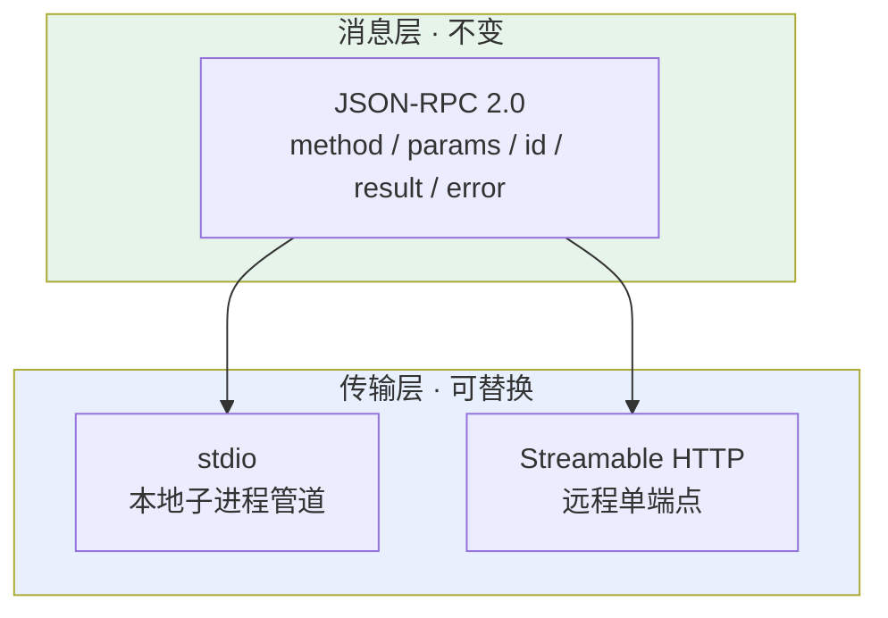
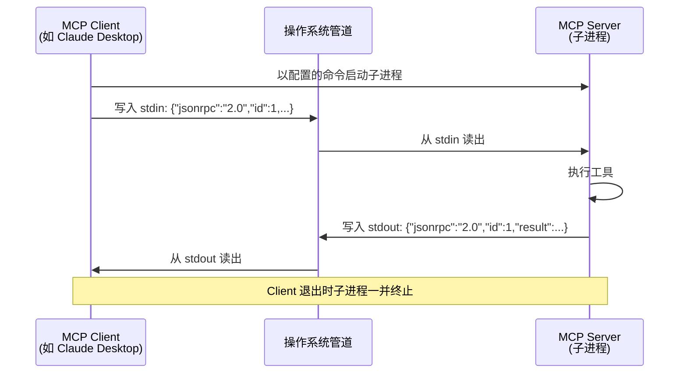
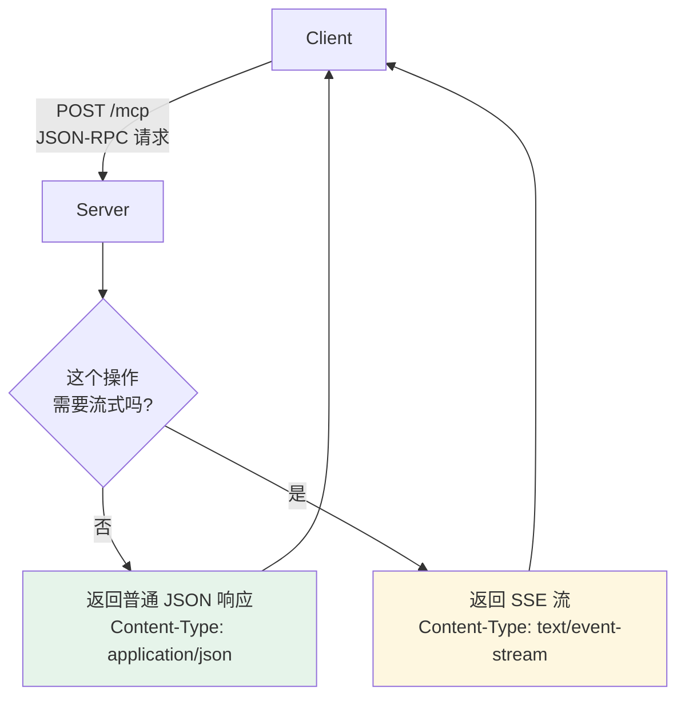
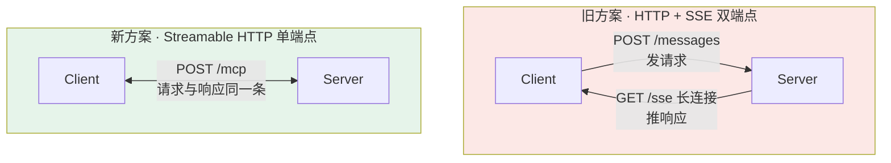

# 第十二章：MCP 的传输层

## 12.1 传输方式与消息格式是解耦的

这是理解 MCP 通信最重要的一句话。



传输方式只决定**「消息怎么传过去」**，不影响消息本身长什么样。换传输方式，上层调用逻辑一行都不用改。

一个常见的错误答案是「MCP 用 WebSocket，因为需要双向通信」——**MCP 从来没有用过 WebSocket**。

## 12.2 消息格式：JSON-RPC 2.0

### 12.2.1 为什么选它

原因很朴素：MCP 需要的通信模式就是「Client 调用 Server 的方法，Server 返回结果」——这本质上是**远程过程调用（RPC）**。

JSON-RPC 2.0 是现成的、足够轻量的 RPC 规范：JSON 易读易调试，任何语言都能实现。Server 是 Python 写的还是 TypeScript 写的，消息格式完全一样，不需要额外的序列化工具（对比 gRPC 要编译 protobuf、Thrift 要生成 stub）。

### 12.2.2 消息长什么样

```json
// 请求（Client → Server）
{
  "jsonrpc": "2.0",
  "id": 1,
  "method": "tools/call",
  "params": {
    "name": "take_screenshot",
    "arguments": { "url": "https://example.com" }
  }
}

// 响应（Server → Client）
{
  "jsonrpc": "2.0",
  "id": 1,
  "result": {
    "content": [{ "type": "image", "data": "...base64..." }]
  }
}
```

三个要点：

- **`id` 用于匹配请求与响应**，这是支持并发请求的基础——多个请求可以同时在途，靠 `id` 对上号；
- **没有 `id` 的消息是通知（notification）**，不需要响应；
- **错误走 `error` 字段而不是 `result`**，格式固定为 `{code, message, data}`。

## 12.3 传输方式一：stdio

### 12.3.1 工作原理

Client 启动时把 Server **当作子进程拉起来**，通过进程的标准输入（stdin）发请求、从标准输出（stdout）读响应。



「管道」是什么？可以理解成**操作系统在内存里给两个进程分配的一段先进先出缓冲区**。Client 往里塞一行 JSON，Server 从另一头读出来处理，处理完往另一条管道塞回去。

整个过程**不经过网卡、不经过 TCP/IP 协议栈**，数据在 RAM 里走了一趟就到了。

### 12.3.2 stdio 的三个优点

| 优点 | 说明 |
|---|---|
| **延迟极低** | 进程间通信比走网络快一个数量级，没有序列化成网络字节流的开销 |
| **不开端口** | 没有网络攻击面，不用担心被外部访问 |
| **生命周期自动管理** | 随 Client 启动、随 Client 关闭，不需要手动管进程 |

配置只需要告诉 Client「用什么命令启动 Server」：

```json
{
  "mcpServers": {
    "filesystem": {
      "command": "npx",
      "args": ["-y", "@modelcontextprotocol/server-filesystem", "/tmp"],
      "env": {}
    }
  }
}
```

### 12.3.3 stdio 最大的坑：stdout 是协议专用通道

[第五章](05-mcp-components.md) 提过，这里再强调一次，因为它是自写 Server 时踩得最多的坑：

**stdout 被 JSON-RPC 独占，任何非协议内容写进去都会污染通道，导致 Client 解析失败。**

```python
# 致命错误：print 写的是 stdout
print(f"正在查询数据库: {sql}")

# 正确：日志走 stderr
import sys
print(f"正在查询数据库: {sql}", file=sys.stderr)
```

一个 `print` 调试语句就能让整个 Server 挂掉，而且报错信息通常是「JSON 解析失败」，看不出根因。

## 12.4 传输方式二：Streamable HTTP

### 12.4.1 核心设计：单端点

远程场景下 Server 作为独立 HTTP 服务运行。当前推荐的传输方式是 **Streamable HTTP**。

核心设计是**用单个 HTTP 端点（通常是 `/mcp`）同时处理请求和响应**：



**「按需选择」是关键**：简单同步操作直接返回 JSON，需要流式输出时才返回 SSE 流。不强制建立长连接。

### 12.4.2 优缺点

| 优点 | 代价 |
|---|---|
| Server 部署在云端，多 Client 共享同一份 | 多了网络开销，延迟高于 stdio |
| 跨机器访问，团队统一管理工具服务 | 需要处理认证、鉴权 |
| 不需要每个人本地跑一份 | 需要处理网络中断与重连 |

典型场景：团队共用一个部署在服务器上的数据库 MCP Server，所有人连同一个服务，权限和审计集中管理。

## 12.5 为什么早期的 SSE 双端点方案被弃用

一些早期教程还在讲「HTTP + SSE」传输方式。这是 MCP 最初版本（2024-11-05 规范）的远程方案，**在 2025-03-26 规范里被标记为 deprecated**——保留向后兼容，但新项目不应再用。

### 12.5.1 问题出在两条通道



同一个对话被拆成了两条通道，具体问题是**状态管理复杂**：

Client POST 了一条消息后网络突然断了——**那条消息到底被处理了没？SSE 流会不会推回结果？** Client 没有简单办法判断，排查链路很长。

而且两条通道对负载均衡器很不友好：POST 和 SSE 长连接可能被路由到不同的后端实例。

### 12.5.2 一个重要澄清

**Streamable HTTP 并没有抛弃 SSE。**

流式推送的部分底层依然是 SSE（`Content-Type: text/event-stream`），只是把端点从两个合并成了一个。变的是架构，不是底层技术。

## 12.6 2026-07-28 规范的进一步改动

传输层在最新规范里还有两处值得注意的变化（[第四章](04-what-is-mcp.md) 已介绍整体背景）：

### 12.6.1 移除了 SSE 流的可恢复性

旧版支持通过 `Last-Event-ID` 头在断线后恢复 SSE 流，续上中断处的消息。2026-07-28 移除了这个机制——**断流即丢失在途请求**，Client 必须重新发起。

代价看似变大了，但换来的是 Server 不用维护「已发送事件」的缓冲，这对 Serverless 部署至关重要。

### 12.6.2 用 `subscriptions/listen` 替换 HTTP GET 端点

旧版用一个单独的 HTTP GET 打开长连接来接收 Server 的主动推送。新版把这件事收进协议本身：Client 发一个 `subscriptions/listen` 请求，Server 通过这个请求的 SSE 响应流推送通知。

配合 [第五章](05-mcp-components.md) 讲的 MRTR 改造（Server 不再反向发请求），整个协议退化成**纯粹的请求-响应模型**，不再需要全双工能力。

### 12.6.3 为什么这些改动都指向同一个方向

三处改动——移除 session、移除 SSE 可恢复性、移除反向请求——动机是一致的：

> **让 MCP Server 变成无状态的、可水平扩展的、能跑在 Serverless 上的普通 HTTP 服务。**

早期 MCP 的设计假设是「Server 是一个跟着桌面应用跑的本地进程」，所以有状态没问题。但生态起飞后，大量 Server 需要部署在云上给多个用户共享，有状态设计就成了扩展的障碍。

## 12.7 常见错误

### 12.7.1 说 MCP 用 WebSocket

MCP 从未采用 WebSocket。本地用 stdio，远程用 Streamable HTTP。

### 12.7.2 本地场景想成 HTTP

「在本机起个服务，通过 localhost 访问」——想复杂了。stdio 直接走进程管道，不需要网络栈，也不用开端口。

### 12.7.3 把消息格式和传输方式混为一谈

这是这道题最关键的加分点。JSON-RPC 2.0 是消息格式，stdio / Streamable HTTP 是传输方式，两者解耦。切换传输不影响上层逻辑。

### 12.7.4 认为 Streamable HTTP 抛弃了 SSE

它内部流式推送仍然用 SSE，变的是端点数量（两个合成一个），不是底层技术。

### 12.7.5 stdio 场景里往 stdout 打日志

一个 `print` 就能让 Server 彻底不可用。日志必须走 stderr。

### 12.7.6 不知道最新规范的传输层变化

移除 SSE 可恢复性、引入 `subscriptions/listen`，以及背后「让 Server 无状态化」的统一动机，是能拉开差距的内容。

## 12.8 本章总结

1. **传输方式与消息格式解耦**，这是理解 MCP 通信的核心；
2. **消息格式统一是 JSON-RPC 2.0**，选它是因为轻量、跨语言、无需额外序列化工具；
3. **本地场景用 stdio**：Server 作为子进程，走操作系统管道，延迟低、不开端口、生命周期自动管理；
4. **stdout 被协议独占**，日志必须走 stderr，这是自写 Server 最容易踩的坑；
5. **远程场景用 Streamable HTTP**：单端点，Server 按需返回普通 JSON 或 SSE 流；
6. **早期 HTTP + SSE 双端点已废弃**，原因是两条通道的状态管理复杂、对负载均衡不友好；
7. **Streamable HTTP 内部仍用 SSE**，变的是架构不是技术；
8. **2026-07-28 进一步移除了 SSE 可恢复性并引入 `subscriptions/listen`**，动机统一指向 Server 无状态化与 Serverless 友好。

> **一句话概括：MCP 的消息永远是 JSON-RPC 2.0，变的只是把它送过去的方式——本地靠一根内存管道，远程靠一个能吐 JSON 也能吐流的 HTTP 端点。**

## 参考资料

- [MCP 规范：Transports](https://modelcontextprotocol.io/specification/2026-07-28/basic/transports)
- [MCP 规范 2026-07-28 变更说明](https://modelcontextprotocol.io/specification/2026-07-28/changelog)
- [MCP 规范 2025-03-26（Streamable HTTP 引入版本）](https://modelcontextprotocol.io/specification/2025-03-26/basic/transports)
- [JSON-RPC 2.0 规范](https://www.jsonrpc.org/specification)
- [MCP 官方 Server 集合](https://github.com/modelcontextprotocol/servers)
- [MDN: Server-Sent Events](https://developer.mozilla.org/en-US/docs/Web/API/Server-sent_events/Using_server-sent_events)
