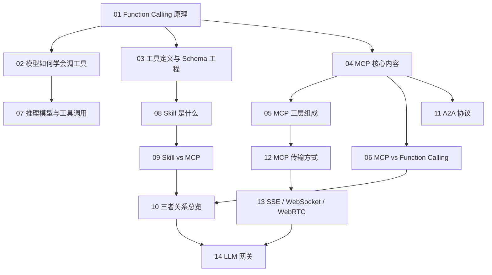

# Tools 相关知识点

本目录梳理大模型与外部世界之间的**协议与接口层**：模型怎么学会调工具、工具怎么被标准化描述、多个 Agent 之间怎么互相发现和通信、这些协议底下跑在什么传输通道上，以及生产环境怎么用网关把它们统一管起来。

这一层往下依赖 [LLM 相关知识点](../llm/README.md) 的模型能力，往上支撑 [Agent 相关知识点](../agent/README.md) 的应用架构。

## 目录

1. [Function Calling 是什么，原理是什么](01-function-calling.md)
2. [LLM 如何学会调用工具](02-tool-learning.md)
3. [工具定义与 Schema 工程](03-tool-schema-design.md)
4. [MCP 模型上下文协议的核心内容](04-what-is-mcp.md)
5. [MCP 的三层组成](05-mcp-components.md)
6. [MCP 与 Function Calling 的区别与选型](06-mcp-vs-function-calling.md)
7. [为什么有些推理模型不支持 MCP](07-reasoning-models-and-tools.md)
8. [Skill 是什么](08-what-is-skill.md)
9. [Skill 与 MCP 的区别](09-skill-vs-mcp.md)
10. [Function Calling、Skill、MCP 三者关系](10-fc-skill-mcp.md)
11. [A2A 协议与 Agent 间通信](11-a2a-protocol.md)
12. [MCP 的传输方式](12-mcp-transport.md)
13. [SSE、WebSocket 与 WebRTC](13-sse-websocket-webrtc.md)
14. [LLM 网关](14-llm-gateway.md)

## 这一层的知识结构

## 阅读建议

- **最小必读**：第 1、4、6、10 章，覆盖「工具调用是什么 + 协议标准化 + 三个概念怎么区分」；
- **协议深挖**：第 5、11、12 章，讲清楚 MCP 的架构、A2A 的定位、底下的传输通道；
- **网络基础补齐**：第 13 章，面向实时语音与流式场景；
- **生产落地**：第 3、14 章，工具描述怎么写、多模型怎么统一治理。

返回[文档主题索引](../README.md)。
