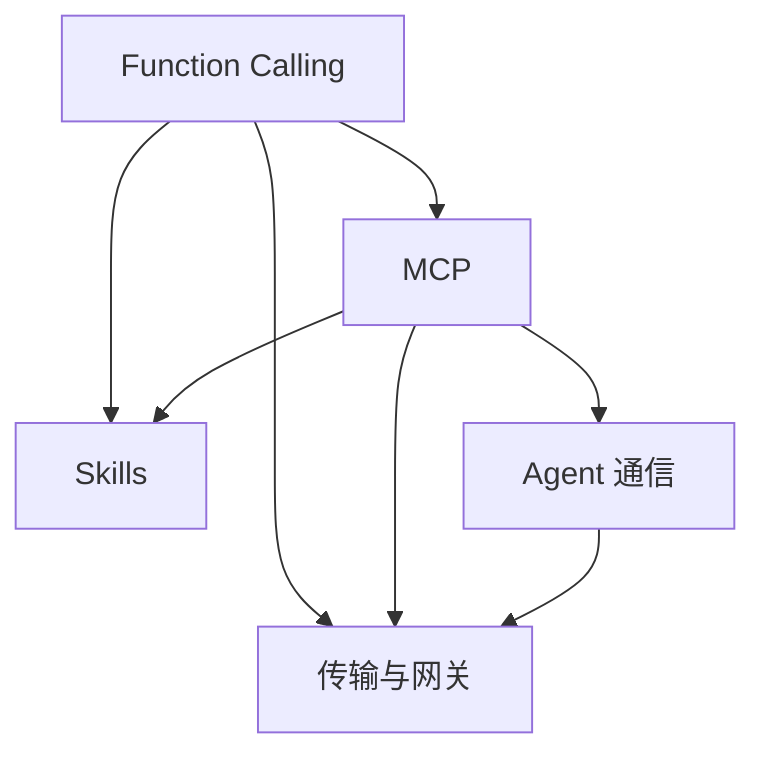

# Tools 相关知识点

本主题位于协议与接口层，解释模型如何调用工具、MCP 如何标准化能力接入、Skill 如何组织知识、Agent 如何跨系统通信，以及传输与网关如何落地。

## 子模块

1. [Function Calling（第 1–3、7 章）](01-function-calling/README.md)
2. [MCP（第 4–6、12、15 章）](02-mcp/README.md)
3. [Skills（第 8–10 章）](03-skills/README.md)
4. [Agent 通信（第 11 章）](04-agent-communication/README.md)
5. [传输与网关（第 13–14 章）](05-transport-gateway/README.md)

## 模块关系

## 阅读建议

- **工具调用入门**：Function Calling → MCP；
- **Agent 能力封装**：Function Calling → Skills → MCP；
- **跨系统协作**：MCP → Agent 通信；
- **生产治理**：MCP → 传输与网关。

## 常见问题

### MCP 会取代 Function Calling 吗？

不会。Function Calling 解决模型如何表达工具调用意图，MCP 解决应用如何发现并连接外部能力。一个应用可以用 Function Calling 接收模型决策，再通过 MCP Client 调用对应 Server。

### Skill、MCP 和 A2A 分别解决什么问题？

Skill 组织完成任务所需的知识和步骤，MCP 连接工具、资源与提示模板，A2A 用于不同 Agent 系统之间的任务协作。三者处于不同层次，可以组合使用。

返回[文档主题索引](../README.md)。
