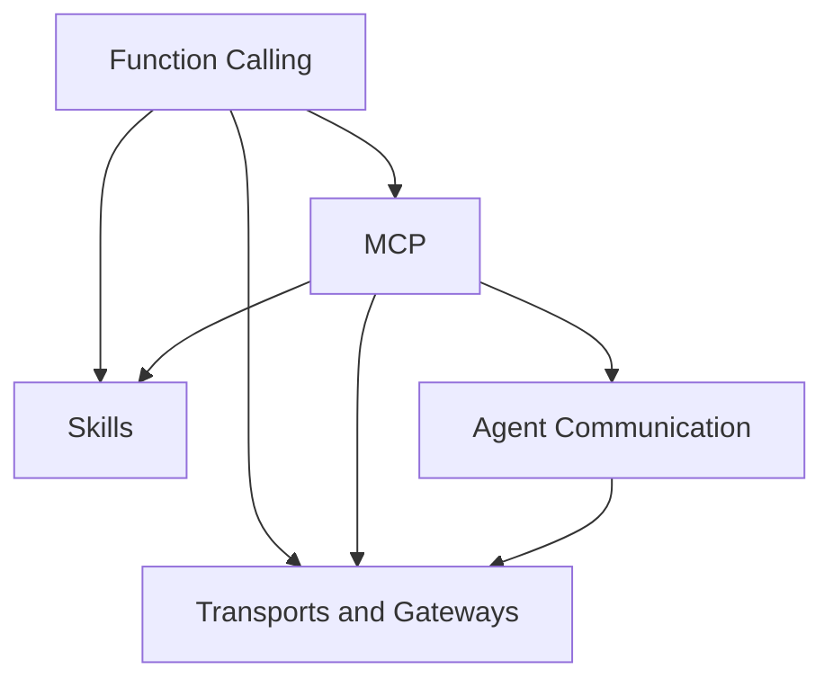

# Tools

This topic focuses on protocols and interfaces: how models call tools, how MCP standardizes access to capabilities, how Skills organize knowledge, how agents communicate across systems, and how transports and gateways support those connections.

> The running example is a demonstration application that gives a team access to query, analysis, and review capabilities. Its weather, order, sales, and research data—including order A1001 and figures such as 517 records—are fictional teaching examples, not the author's project experience. Protocol versions and cited research are documented separately in the references.

## Versions and Scope

This topic uses the **MCP 2026-07-28** and **A2A v1.0.1** release specifications. A2A's wire-level protocol identifier is `1.0`, without the patch number. Agent Skills is an actively maintained open file format; a content package's `metadata.version` is not the format specification version. Each chapter's references identify its sources and the limits of the review.

- [MCP version status](https://modelcontextprotocol.io/specification/versioning) and [2026-07-28 changes](https://modelcontextprotocol.io/specification/2026-07-28/changelog)
- [A2A v1.0.1 release](https://github.com/a2aproject/A2A/releases/tag/v1.0.1) and [pinned specification](https://github.com/a2aproject/A2A/blob/v1.0.1/docs/specification.md)
- [Agent Skills format specification](https://agentskills.io/specification) and [pinned historical commit](https://github.com/agentskills/agentskills/tree/69ef37e9424c0a7ea9dd2293b559e43ec8176379)

A protocol release, SDK support, and availability in a particular product are separate questions. Arrows in the diagram show ways to combine interfaces; they do not mean that MCP depends on function calling or that a Skill must execute through MCP. First identify the caller, the executor, and the authorization checks, then examine what happens on timeouts, retries, partial failures, and version mismatches.

## Modules

1. [Function Calling (Chapters 1–3 and 7)](01-function-calling/README.md)
2. [MCP (Chapters 4–6, 12, and 15)](02-mcp/README.md)
3. [Skills (Chapters 8–10)](03-skills/README.md)
4. [Agent Communication (Chapter 11)](04-agent-communication/README.md)
5. [Transports and Gateways (Chapters 13–14)](05-transport-gateway/README.md)

## How the Modules Connect

## Suggested Reading Paths

- **Getting started with tool calls:** Function Calling → MCP.
- **Packaging agent capabilities:** Function Calling → Skills → MCP.
- **Cross-system collaboration:** MCP → Agent Communication.
- **Production governance:** MCP → Transports and Gateways.

## Frequently Asked Questions

### Does MCP Replace Function Calling?

No. Function calling defines how a model expresses its intent to call a tool. MCP defines how an application discovers and connects to external capabilities. An application can receive a model's decision through function calling, then use an MCP client to call the corresponding server.

### What Problems Do Skills, MCP, and A2A Each Solve?

A Skill organizes the knowledge and steps needed to complete a task. MCP connects tools, resources, and prompt templates. A2A supports task collaboration between different agent systems. They operate at different layers and can be combined.

Return to the [documentation topic index](../README.md).
