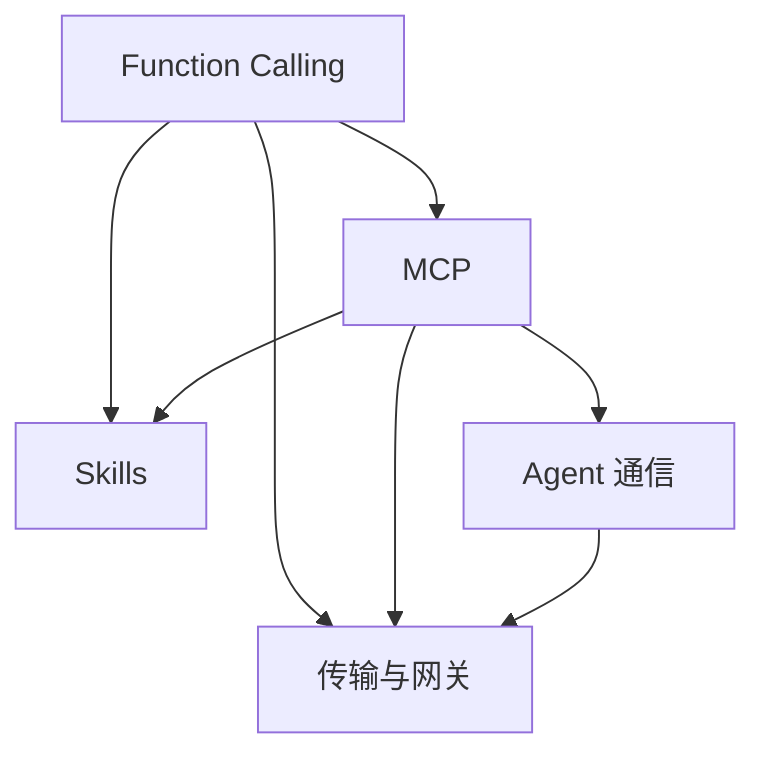

# Tools 相关知识点

本主题位于协议与接口层，解释模型如何调用工具、MCP 如何标准化能力接入、Skill 如何组织知识、Agent 如何跨系统通信，以及传输与网关如何落地。

> 贯穿示例设定为一个给团队接入查询、分析和审查能力的演示应用；天气、订单、销售和调研数据，以及订单 A1001、517 条记录等数值均为教学设定，不是作者项目经历。协议版本和引用研究另按文献说明。

## 版本与阅读边界

本主题固定采用 **MCP 2026-07-28** 和 **A2A v1.0.1** 发布规范；A2A 线上协议标识为 `1.0`，不含补丁号。Agent Skills 是持续维护的开放文件格式，内容包的 `metadata.version` 不等于格式规范版本。具体来源与核查边界放在对应章节的参考资料中。

- [MCP 版本状态](https://modelcontextprotocol.io/specification/versioning)与 [2026-07-28 变更](https://modelcontextprotocol.io/specification/2026-07-28/changelog)
- [A2A v1.0.1 发布](https://github.com/a2aproject/A2A/releases/tag/v1.0.1)与[固定版本规范](https://github.com/a2aproject/A2A/blob/v1.0.1/docs/specification.md)
- [Agent Skills 格式规范](https://agentskills.io/specification)与[固定历史提交](https://github.com/agentskills/agentskills/tree/69ef37e9424c0a7ea9dd2293b559e43ec8176379)

协议发布、SDK 支持和某个产品的启用范围是三件事。图中的箭头表示可组合的接入路径，不表示 MCP 依赖 Function Calling，或 Skill 必须通过 MCP 执行。学习时先画出调用者、执行者和授权检查点，再检查超时、重试、部分失败及版本不兼容时的行为。

## 子模块

1. [Function Calling（第 1–3、7 章）](01-function-calling/README.zh.md)
2. [MCP（第 4–6、12、15 章）](02-mcp/README.zh.md)
3. [Skills（第 8–10 章）](03-skills/README.zh.md)
4. [Agent 通信（第 11 章）](04-agent-communication/README.zh.md)
5. [传输与网关（第 13–14 章）](05-transport-gateway/README.zh.md)

## 模块关系

## 阅读建议

- **工具调用入门**：Function Calling → MCP；
- **Agent 能力封装**：Function Calling → Skills → MCP；
- **跨系统协作**：MCP → Agent 通信；
- **生产治理**：MCP → 传输与网关。

## 常见问题

### MCP 会取代 Function Calling 吗？

不会。Function Calling 解决模型如何表达工具调用意图，MCP 解决应用如何发现并连接外部能力。一个应用可以用 Function Calling 接收模型决策，再通过 MCP Client 调用对应 Server。

### Skill、MCP 和 A2A 分别解决什么问题？

Skill 组织完成任务所需的知识和步骤，MCP 连接工具、资源与提示模板，A2A 用于不同 Agent 系统之间的任务协作。三者处于不同层次，可以组合使用。

返回[文档主题索引](../README.zh.md)。
